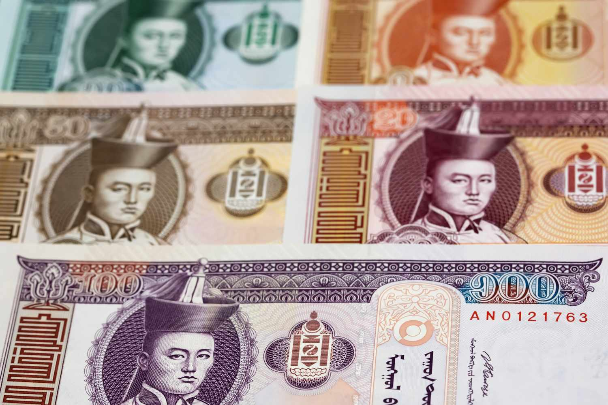

The Mongolian Tugrik, abbreviated as MNT, is the official currency of Mongolia, initially introduced to the nation in 1925. It symbolizes Mongolia's economic autonomy following its independence and monetary reform efforts in the early 20th century. The Tugrik comes in a range of denominations, with the banknotes extending from ₮1 to ₮20,000, facilitating everyday transactions and larger financial exchanges among the populace.

In recent years, the Tugrik has increasingly garnered attention from investors and traders worldwide due to its role in shaping Mongolia's economic landscape and its activity in foreign exchange markets. With the economy of Mongolia largely influenced by its commodity-driven exports, the Tugrik's value is subject to fluctuating global commodity prices, positioning it as a currency of interest for those involved in emerging market investments.



This article endeavors to explore the complexities associated with the Tugrik, paying special attention to its relevance in algorithmic trading—a method that employs algorithms and pre-set rules to execute trading decisions efficiently within financial markets. By understanding the factors influencing the Tugrik, its behavior in volatile market environments, and the technological advancements in trading practices, potential investors can better gauge the risks and rewards present in engaging with this unique currency. Through analyzing both historical context and current economic trends, the multifaceted nature of the Mongolian Tugrik as a prospective investment opportunity within the algorithmic trading sphere will be elucidated.

## Table of Contents

## Understanding the Mongolian Tugrik (MNT)

The Mongolian Tugrik, symbolized by ₮, serves as the official currency of Mongolia and plays a critical role in the nation's economy. It was introduced in 1925, replacing older currencies after Mongolia's independence and subsequent monetary reforms. This shift was pivotal in establishing a unified monetary system aligned with Mongolia’s new national identity and economic sovereignty.

Presently, the Tugrik is available in various denominations ranging from ₮1 to ₮20,000, facilitating a wide range of transactional needs within the country. These denominations reflect both the historical aspects and the evolving economic circumstances in Mongolia. The Tugrik's interaction with global currencies is most prominent with the US dollar, the currency with which it is most frequently exchanged. This relationship underscores the trading link between Mongolia and larger, dollar-based economies, highlighting the prominence of USD in international trade and finance.

The Tugrik's exchange rate is governed by market dynamics, as it operates as a free-floating currency. Unlike currencies pegged to others, the Tugrik's value is determined by supply and demand factors in the foreign exchange market. This lack of a fixed exchange rate offers both challenges and opportunities; it can lead to volatility but also allows traders to capitalize on short-term market movements. 

For those engaging in trading activities, the Tugrik's properties make it particularly appealing in emerging market scenarios. Its [volatility](/wiki/volatility-trading-strategies) can serve as a double-edged sword: while posing risks to inexperienced traders, it simultaneously presents opportunities for profit through strategies that leverage its price fluctuations. Such potential for gain is a focal point for traders looking to diversify their portfolios by including emerging market currencies like the MNT.

## The Role of Algorithmic Trading in MNT Currency

Algorithmic trading, which utilizes pre-set rules and algorithms to make trading decisions, plays a significant role in managing the Mongolian Tugrik (MNT) currency. The inherent volatility of the MNT makes it an attractive prospect for traders who seek to exploit fluctuations for [arbitrage](/wiki/arbitrage) opportunities and potential gains. 

Traders employ algorithmic systems to rapidly analyze market data and execute trades with precision. These systems can evaluate numerous variables—such as market trends, historical data, and geopolitical events—that can influence the Tugrik’s value. By automating these analyses, traders can react to market shifts with a speed and accuracy unattainable by manual processes.

The algorithmic approach involves several strategies, including [statistical arbitrage](/wiki/statistical-arbitrage), which identifies pricing inefficiencies between the MNT and other currencies. For example, if discrepancies are detected in the pricing of the Tugrik versus the US dollar across different exchange platforms, algorithms can execute trades to capitalize on these differences, thereby realizing a profit.

Python is a favored language for [algorithmic trading](/wiki/algorithmic-trading) due to its rich ecosystem of libraries and frameworks. Libraries like NumPy and Pandas facilitate data manipulation and analysis, while tools such as scikit-learn enable [machine learning](/wiki/machine-learning) applications in predicting currency movements. Below is a simple Python code snippet illustrating how one might use historical rate data to anticipate market trends:

```python
import pandas as pd
from sklearn.linear_model import LinearRegression

# Assume df is a pandas DataFrame with historical exchange rates
df = pd.read_csv("mnt_usd_exchange_rates.csv")
X = df['Date'].values.reshape(-1, 1)  # Dates as the feature
y = df['ExchangeRate'].values  # Exchange rates as the target

# Initialize and train a linear regression model
model = LinearRegression()
model.fit(X, y)

# Predict future exchange rates
future_dates = [[20230101], [20230102]]  # Example future dates
predictions = model.predict(future_dates)

print(predictions)
```

In addition to statistical arbitrage and predictive modeling, algorithms are deployed for high-frequency trading ([HFT](/wiki/high-frequency-trading-strategies)), a strategy that relies on executing numerous orders at incredibly fast speeds to capture minute price discrepancies. Although the MNT market may not be as liquid as major currencies, the volatility offers fertile ground for such techniques where rapid decision-making is crucial.

Despite its promise, algorithmic trading in MNT currency requires constant refinement and risk management, as Mongolia’s economic factors—such as its reliance on commodity exports and susceptibility to political instability—add layers of complexity. Therefore, traders must ensure their algorithms are adaptive and resilient, capable of interpreting a diverse array of market signals to optimize trading results.

## Current Exchange Rates and Economic Landscape

As of the latest reports, the exchange rate of the Mongolian Tugrik (MNT) against the US dollar (USD) is characterized by its frequent fluctuations, largely driven by Mongolia's economic structure and international market dynamics. The Mongolian economy is heavily reliant on commodity exports, chiefly minerals such as copper, coal, and gold, making the Tugrik particularly susceptible to changes in global commodity prices. For instance, when global demand for these commodities surges, the resulting increase in export revenues can bolster the Tugrik’s value. Conversely, a decline in commodity prices tends to exert downward pressure on the currency.

In recent years, Mongolia has made efforts to diversify its economic activities beyond mineral exports. The tourism sector has seen significant growth, leveraging Mongolia's cultural heritage and natural landscapes to attract visitors from around the world. Meanwhile, investments in agriculture have aimed at modernizing the sector to boost productivity and self-sufficiency. These economic expansions could potentially steady the Tugrik by providing additional revenue streams and reducing its dependency on volatile commodity markets.

Currency traders must remain vigilant of these economic developments, as the evolving landscape can influence the Tugrik's exchange rate. For algorithmic traders, the Tugrik’s volatility offers both challenges and opportunities. Successfully navigating these fluctuations involves accounting for both macroeconomic indicators and sector-specific trends to anticipate currency movements.

Furthermore, the Central Bank of Mongolia plays a crucial role in stabilizing the Tugrik through monetary policies and foreign exchange interventions. However, external factors such as foreign direct investment, geopolitical tensions, and trade policies also impact currency valuation, requiring traders to adopt a comprehensive analytical approach that considers a wide array of influences on the Tugrik's strength.

## Challenges and Opportunities in MNT Algo Trading

The Mongolian Tugrik (MNT) algorithmic trading market is characterized by both significant challenges and promising opportunities. Traders engaging with the MNT must navigate infrastructure limitations that could impede efficient trading operations. Mongolia's financial infrastructure is still developing, and this can lead to issues such as slower transaction processing times, limited access to advanced trading technologies, and lower [liquidity](/wiki/liquidity-risk-premium) compared to more established markets.

Moreover, political instability presents another layer of complexity. Mongolia's political landscape is subject to fluctuations which can directly affect economic policies and, consequently, the Tugrik's value. For example, shifts in government policies regarding foreign investment, taxation, and international trade agreements may lead to rapid changes in currency valuation, posing risks for traders. Political events and decisions can lead to sudden spikes in volatility, making it challenging to predict market movements accurately.

Despite these challenges, there are substantial opportunities for traders who can adeptly manage these factors. The volatility of the MNT presents arbitrage opportunities, where traders can profit from small price differentials exploited through fast and efficient trading strategies. Algorithmic trading systems, which use pre-set rules and algorithms to execute trades at high speeds, can be crucial in capturing these opportunities. 

Innovative trading systems equipped with machine learning and [artificial intelligence](/wiki/ai-artificial-intelligence) are becoming increasingly vital. These systems can process vast amounts of data to identify patterns and predict market movements, allowing traders to react swiftly to changes. For instance, an algorithm could be programmed to monitor specific economic indicators or news feeds relevant to Mongolia, adjusting trading strategies in real time to minimize losses or maximize gains.

Furthermore, traders who can develop robust risk management strategies stand to gain significantly. Effective risk management might involve diversifying trading strategies, using stop-loss mechanisms, or hedging positions to protect against adverse market movements. For those willing to invest in the development of advanced algorithmic systems that incorporate these strategies, the MNT market offers unique prospects for profit.

In conclusion, while the MNT algo trading market presents challenges related to infrastructure and political uncertainty, innovative and strategic use of algorithmic trading systems provides traders with the tools necessary to exploit the market's inherent volatility for substantial financial gain.

## Conclusion

Mongolian Tugrik, or MNT, presents a unique opportunity for international investors, particularly those involved in algorithmic trading. The volatility inherent in the Tugrik is both a challenge and an enticing prospect. For investors who can adeptly navigate its fluctuations, the potential for significant rewards is substantial. The lack of a currency peg allows for dynamic shifts in value, which can be advantageous for skilled traders capable of capitalizing on short-term market movements.

Understanding the historical context of the MNT is essential. Since its introduction in 1925, the Tugrik has evolved and adapted to various economic pressures, reflecting both Mongolia's economic growth and its vulnerabilities. Current global economic influences, such as Mongolia's dependence on commodities like copper and coal, also play a critical role. These factors introduce complexities that traders must account for, as shifts in global commodity markets can have profound impacts on the Tugrik's value.

Embracing modern trading technologies, particularly algorithmic methods, is crucial for success. The ability to use data-driven strategies to predict and respond to market changes allows investors to exploit the Tugrik's volatility effectively. By employing sophisticated algorithms, traders can minimize risks associated with rapid currency fluctuations, leading to more stable returns on their investments.

In conclusion, the Mongolian Tugrik represents both a risk and a reward scenario for investors willing to engage with its dynamic nature. Mastering the interplay between historical economic factors, current market conditions, and advanced trading technologies is key to unlocking the full potential of this intriguing currency. As such, investors who invest in developing their understanding and strategic capabilities stand to gain from the Tugrik's unique place in the global currency landscape.

## References & Further Reading

[1]: Bergstra, J., Bardenet, R., Bengio, Y., & Kégl, B. (2011). ["Algorithms for Hyper-Parameter Optimization."](https://dl.acm.org/doi/10.5555/2986459.2986743) Advances in Neural Information Processing Systems 24.

[2]: ["Advances in Financial Machine Learning"](https://www.amazon.com/Advances-Financial-Machine-Learning-Marcos/dp/1119482089) by Marcos Lopez de Prado

[3]: ["Evidence-Based Technical Analysis: Applying the Scientific Method and Statistical Inference to Trading Signals"](https://www.amazon.com/Evidence-Based-Technical-Analysis-Scientific-Statistical/dp/0470008741) by David Aronson

[4]: ["Machine Learning for Algorithmic Trading"](https://github.com/stefan-jansen/machine-learning-for-trading) by Stefan Jansen

[5]: ["Quantitative Trading: How to Build Your Own Algorithmic Trading Business"](https://www.amazon.com/Quantitative-Trading-Build-Algorithmic-Business/dp/1119800064) by Ernest P. Chan

[6]: ["Python for Finance: Analyze Big Financial Data"](https://books.google.com/books/about/Python_for_Finance.html?id=E93SBQAAQBAJ) by Yves Hilpisch

[7]: International Monetary Fund. (2019). ["Mongolia: 2019 Article IV Consultation—Press Release; Staff Report; and Statement by the Executive Director for Mongolia."](https://www.imf.org/en/Publications/CR/Issues/2019/09/17/Mongolia-2019-Article-IV-Consultation-Press-Release-Staff-Report-and-Statement-by-the-48680) International Monetary Fund.

[8]: World Bank. (2020). ["Mongolia Economic Update, January 2020: Navigating Through Demographic Change."](https://openknowledge.worldbank.org/entities/publication/48a14a80-0843-5ba8-b8b3-d149489674fd) World Bank Group.