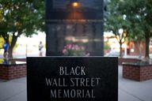

The 1921 Tulsa Black Wall Street, more widely recognized as the Tulsa Race Massacre, stands as a grim chapter in American history, marked by brutal racial violence and the annihilation of a flourishing African American community. This tragic event unfolded against a backdrop of racial tension and economic prosperity, highlighting the dichotomy between Greenwood's affluence and the societal inequities of the time. As we revisit this defining moment, we also encounter a contemporary development: algorithmic trading, or 'algo trading'. This modern phenomenon has captured attention due to its transformative impact on financial markets, offering both promise and controversy.

In considering these two seemingly unrelated events—the Tulsa Race Massacre and algo trading—we find shared themes of socio-economic dynamics and technological progress, prompting reflection on the lessons embedded within these narratives. The examination of the massacre reveals the fragile nature of racial progress and economic success, while algo trading introduces discussions around fairness and ethics in the age of technological advancement. This article seeks to provide an understanding of the Tulsa tragedy and consider how historical lessons might inform current debates about technology and equity in society.



## Table of Contents

## The Prosperity of Black Wall Street

Tulsa’s Greenwood district, famously known as Black Wall Street, stood as a beacon of African American prosperity and entrepreneurship in the early 20th century. This vibrant community was home to a myriad of successful Black-owned businesses, ranging from banks and hotels to grocery stores and theaters, which collectively contributed to a robust local economy. Notably, the district thrived during a period marked by intense racial segregation and discrimination across the United States. 

The economic landscape of Greenwood was characterized by thriving enterprises that fostered self-sufficiency within the Black community. Entrepreneurs in the district established over 600 businesses, creating flourishing sectors that included law offices, dental practices, pharmacies, and restaurants. The racial climate of the era typically restricted African Americans’ economic activities; however, the residents of Greenwood defied these odds, establishing a self-reliant ecosystem that preserved wealth within their community.

The district also emphasized the importance of education and religious institutions, which further bolstered the economic and social structures of the area. Schools and churches in Greenwood served not only as educational and spiritual centers but also as communal hubs where residents could gather and discuss strategies for economic empowerment and civil rights advocacy. This communal solidarity was vital in promoting resilience against the pervasive segregationist policies that defined the broader societal landscape.

Despite existing within a nation grappling with racial inequality, the prosperity of Black Wall Street offered a stark contrast to the societal norms of the time. The economic success witnessed in the Greenwood district highlighted the potential of African American entrepreneurship when provided the opportunity and freedom to flourish. This juxtaposition emphasized the inherent inequities in a society where such prosperity was the exception, showcasing the need for structural changes to achieve true equality across racial lines.

## The Tulsa Race Massacre: What Happened?

On May 31, 1921, the city of Tulsa, Oklahoma, became the epicenter of one of the most devastating episodes of racial violence in American history. The Greenwood District, known as "Black Wall Street" for its prosperity and thriving African American business community, was suddenly attacked by white mobs. The origin of the violence can be traced to an alleged incident involving a Black teenager, Dick Rowland, and a white elevator operator, Sarah Page. The details of this encounter remain unclear, but it was reported in inflammatory terms by local newspapers, exacerbating existing racial tensions.

As the situation escalated, a white lynch mob gathered at the Tulsa County Courthouse where Rowland was held. In response, a group of Black residents, some of them armed, went to the courthouse to offer protection to Rowland and ensure his safety. This confrontation soon spiraled into chaos, setting off a wave of violence that engulfed the Greenwood District.

Over the [course](/wiki/best-algorithmic-trading-courses) of June 1 and June 2, 1921, white rioters looted, burned, and destroyed the homes and businesses in Greenwood. Despite valiant efforts by Black residents to defend their community, the overwhelming numbers and firepower of the attackers led to catastrophic destruction. Eyewitness accounts and historical records indicate that as many as 300 Black residents were killed, and over 8,000 were left homeless as more than 1,000 homes and businesses were reduced to ashes.

The destruction was not solely the result of ground-level violence; aerial attacks from private planes dropping incendiary devices contributed to the devastation. This act of domestic terrorism went largely ignored in the immediate aftermath, with little intervention from local or state authorities to quell the violence. The suppression of the events in public discourse and historical records has only recently been addressed, as efforts continue to bring this tragic history to light and seek justice for those affected.

## The Aftermath of Destruction

The aftermath of the 1921 Tulsa Race Massacre left an indelible mark on the socio-economic landscape of Tulsa, particularly affecting the Black residents who called the Greenwood district their home. Following the violent two-day assault by white mobs, more than 1,000 homes and businesses owned by Black residents were reduced to ashes, forcing a significant portion of the community into homelessness and financial ruin. The destruction fundamentally altered the trajectory of Tulsa's development, as it erased one of the nation's most prosperous Black neighborhoods at that time.

Efforts to rebuild were systematically obstructed by enduring racial prejudices and institutional barriers. Black residents faced significant challenges in securing insurance claims due to clauses that excluded damage caused by riots, further exacerbating their financial woes. Legislative actions and city ordinances sought to impose new zoning laws that hindered reconstruction efforts, essentially trying to reshape the district's demographic and economic landscape. These obstacles starkly highlighted the systemic racism entrenched within legal and societal structures, making the recovery arduous and, in many cases, unattainable for the affected individuals.

Beyond the immediate physical and economic destruction, the massacre inflicted severe psychological trauma that reverberated across generations. Survivors and their descendants were left to grapple with the emotional scars and loss of intergenerational wealth. The community's displacement disrupted social networks and cultural ties, diminishing the social capital that had previously underpinned Greenwood's success. The subsequent economic loss was compounded by a pervasive sense of injustice and discrimination that continued to affect the lives and economic mobility of Black Tulsans.

This tragic event serves as a powerful reminder of the destructive capacity of racial violence and its long-lasting effects on communities. It underscores the importance of acknowledging historical injustices and working towards comprehensive solutions that address the legacy of such events. The enduring impact of the Tulsa Race Massacre illustrates the need for systemic reforms that ensure equitable opportunities for all, fostering a more just and inclusive society.

## Algorithmic Trading: A Brief Overview

Algorithmic trading, commonly known as algo trading, involves using pre-programmed instructions to execute trades with optimal speed, precision, and frequency, surpassing human capabilities. By implementing sophisticated computer algorithms, traders can analyze vast data sets, enabling them to execute trades based on predefined criteria such as timing, [volume](/wiki/volume-trading-strategy), and price thresholds. These algorithms monitor market conditions and execute orders automatically, reacting to even minute changes in market dynamics.

A core feature of [algorithmic trading](/wiki/algorithmic-trading) is its ability to boost market [liquidity](/wiki/liquidity-risk-premium) and maintain efficiency. By automating the trading process, algorithms can engage in rapid movements, adjusting positions in milliseconds, which reduces transaction costs and narrows bid-ask spreads. For example, high-frequency trading ([HFT](/wiki/high-frequency-trading-strategies)), a subset of algo trading, involves making quick, small profits on numerous trades. This practice enhances market efficiency by continuously providing liquidity and thus enabling smoother market operations.

However, the influx of algorithmic trading has also sparked ethical and regulatory debates. The 2010 Flash Crash exemplifies potential risks, where a large volume of automated trades contributed to a sudden 1,000-point drop in the Dow Jones Industrial Average, highlighting the vulnerabilities of heavily automated systems. This event led to increased scrutiny and the implementation of "circuit breakers" to curtail excessive [volatility](/wiki/volatility-trading-strategies).

Furthermore, algorithmic trading raises questions regarding fairness and market accessibility. Large financial institutions have the means to deploy sophisticated algorithms and gain a competitive edge, potentially marginalizing smaller investors who cannot afford such technology. Regulatory bodies, such as the Securities and Exchange Commission (SEC), continuously examine the impact of algorithmic trading, working to create a balanced environment that considers systemic stability and fairness.

Python, a favored language for developing trading algorithms, has facilitated the democratization of algo trading. Libraries such as "pandas" for data manipulation and "numpy" for numerical operations, combined with "scikit-learn" for [machine learning](/wiki/machine-learning), empower traders to build robust trading models. 

```python
import pandas as pd
import numpy as np
from sklearn.model_selection import train_test_split
from sklearn.ensemble import RandomForestClassifier

# Sample dataset representing market data with features and labels
data = pd.read_csv('market_data.csv')

# Preprocessing and feature selection
features = data[['price', 'volume', 'volatility']]
labels = data['trade_signal']

# Splitting the dataset into training and testing sets
X_train, X_test, y_train, y_test = train_test_split(features, labels, test_size=0.2, random_state=42)

# Implementing a Random Forest Algorithm for trade decision-making
model = RandomForestClassifier(n_estimators=100)
model.fit(X_train, y_train)

# Predicting market movements
predictions = model.predict(X_test)
```

This code demonstrates a simplified model where a Random Forest Classifier predicts trade signals based on market parameters like price, volume, and volatility. With technological advancements, algo trading continues to evolve, offering both opportunities and challenges in the fast-paced world of financial markets.

## Connecting Past and Present: Reflections and Implications

The connection between the Tulsa Race Massacre and algorithmic trading may not be immediately apparent, yet both phenomena provide profound insights into socio-economic dynamics and technological advancement. The Tulsa Race Massacre serves as a stark reminder of the consequences of racial inequity and the systemic barriers that can hinder economic prosperity for marginalized communities. In the early 20th century, Greenwood's Black Wall Street was a beacon of African American entrepreneurship, thriving in an era marked by racial segregation. Its destruction laid bare the fragility of socio-economic achievements when unsupported by social justice and equity.

In contrast, algorithmic trading is emblematic of modern technological progress. This advanced form of trading utilizes mathematical models and algorithms to execute transactions at speeds and scales human traders cannot match. Python code or similar programming languages are often employed to design algorithms that optimally trade financial assets, reflecting the shift towards technology-driven solutions in economic exchanges. For instance, a basic algorithmic trading strategy in Python might involve using libraries such as NumPy and pandas to analyze historical stock data and make predictions about future price movements.

```python
import numpy as np
import pandas as pd

# Example of a basic trading algorithm
def moving_average_strategy(data, short_window=40, long_window=100):
    signals = pd.DataFrame(index=data.index)
    signals['signal'] = 0.0

    # Calculate short and long moving averages
    signals['short_mavg'] = data['price'].rolling(window=short_window, min_periods=1, center=False).mean()
    signals['long_mavg'] = data['price'].rolling(window=long_window, min_periods=1, center=False).mean()

    # Create signals
    signals['signal'][short_window:] = np.where(signals['short_mavg'][short_window:] > signals['long_mavg'][short_window:], 1.0, 0.0)   
    signals['positions'] = signals['signal'].diff()

    return signals
```

While such technological innovations can enhance market efficiency, they also raise questions about equity and fairness. High-frequency trading, a subset of algorithmic trading, can create disparities in financial markets, benefiting those with access to cutting-edge technology at the expense of individual investors. This mirrors the broader socio-economic impact observed in the aftermath of the Tulsa Race Massacre, where lack of access and systemic barriers prevented the equitable distribution of economic resources.

The lessons from Tulsa remind us of the potential repercussions of prioritizing technological advancement without addressing underlying social justice issues. Socio-economic progress, as exemplified by the pre-massacre prosperity of Greenwood, requires more than technological innovation. It demands a commitment to dismantling obstacles that marginalize communities, ensuring that the march toward modernization includes equitable opportunities for all.

Algorithmic trading, while a testament to technological prowess, similarly necessitates a framework that accounts for its socio-economic implications. Today’s financial markets—and society at large—must remain vigilant, adapting regulations and ethical standards to ensure that technology serves as a tool for inclusive economic growth, rather than a vehicle for widening disparities. Reflecting on the past, as seen in Tulsa, emphasizes the importance of integrating equity into the blueprint of future advancements, fostering a world where prosperity is attainable for every segment of society.

## Conclusion

The Tulsa Race Massacre serves as a powerful reminder of the ongoing fight against racial and economic injustices that persist today. This tragic incident highlights how deeply ingrained systemic inequalities can lead to devastating consequences. It underscores the necessity for continuous efforts in addressing these disparities to prevent history from repeating itself. The pursuit of social justice, therefore, remains as relevant today as it was nearly a century ago.

Similarly, modern innovations such as algorithmic trading exemplify progress and technological advancement. Algo trading has transformed financial markets, bringing efficiencies and opportunities that might have seemed unimaginable in the past. However, it also demands constant ethical vigilance. The rapid evolution of technology presents new challenges, including concerns about fairness, transparency, and the potential for exacerbating existing inequalities if left unchecked.

As we examine these issues, both past and present, our collective responsibility is to ensure that the benefits of technology, innovation, and economic growth are equitably distributed. This requires a commitment to crafting policies and practices that prioritize inclusivity and fairness. By learning from historical injustices like the Tulsa Race Massacre and ensuring that modern advancements are ethically guided, we can strive towards a future where prosperity and technology enhance human well-being for everyone, without discrimination or disparity.

## References & Further Reading

[1]: Gates, J., & Variety, E. (2003). ["Riot and Remembrance: America's Worst Race Riot and Its Legacy."](https://books.google.com/books/about/Riot_and_Remembrance.html?id=os15AAAAMAAJ) Harper Perennial.

[2]: Hirsch, A. R. (2002). ["Tulsa: 1921 Race Riot."](https://archive.seattletimes.com/archive/20020217/riot17/a-tragedy-in-tulsa-a-1921-race-riot) University of Oklahoma Press.

[3]: Lopez de Prado, M. (2018). ["Advances in Financial Machine Learning."](https://www.amazon.com/Advances-Financial-Machine-Learning-Marcos/dp/1119482089) Wiley.

[4]: Jansen, S. (2020). ["Machine Learning for Algorithmic Trading - Second Edition: Predictive models to extract signals from market and alternative data for systematic trading strategies with Python."](https://www.oreilly.com/library/view/machine-learning-for/9781839217715/Text/Front_Matter.xhtml) Packt Publishing.

[5]: Pitt, K. (1998). ["The Burning: Massacre, Destruction, and the Tulsa Race Riot of 1921."](https://archive.org/details/burningmassacred0000madi) Amistad.