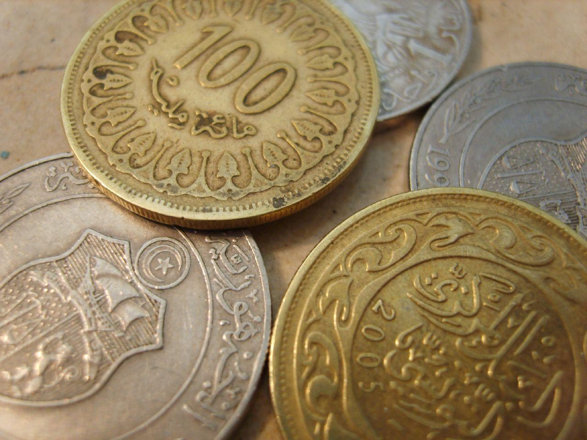

The Tunisian Dinar (TND) serves as the official currency of the Republic of Tunisia, a North African nation with a diverse economy. Abbreviated as TND and often represented by the symbol DT, the dinar plays a critical role in the economic framework of Tunisia. Its value and management are significant to both the financial stability and economic growth of the country, influencing sectors ranging from agriculture and petroleum to tourism and mining.

Introduced in 1960, replacing the French franc, the Tunisian Dinar has undergone numerous phases of transformation and adaptation, reflecting the broader economic and political shifts within the nation. Managed by Tunisia's Central Bank, or Banque Centrale de Tunisie, the TND is a closed currency, meaning it's illegal to import or export it without permission from the relevant authorities. This status underscores its importance in maintaining monetary policy and economic control.

Understanding the Tunisian Dinar is essential for many economic stakeholders. Its historical context, alongside its current application, reveals much about Tunisia's fiscal strategies and aspirations. As global trade and financial practices evolve, so too does the usage of the TND, expanding into sophisticated financial avenues such as algorithmic trading. 

Algorithmic trading, which utilizes automated software for executing trades of financial instruments, represents a new frontier of possibilities for engaging with the Tunisian Dinar. It offers potential advantages such as improved market liquidity and reduced transaction costs. However, this revolutionary approach is not without its challenges, particularly in a market constrained by regulatory and technological factors. In assessing the Tunisian Dinar, it is crucial to consider these opportunities and the hurdles they present, as they could significantly influence the future of financial operations within the country. 

Overall, the Tunisian Dinar is more than just a medium of exchange; it is a pivotal component of Tunisia's economic identity and development trajectory.

## Table of Contents

## Understanding the Tunisian Dinar

The Tunisian Dinar (TND) serves as the official monetary unit of the Republic of Tunisia, under the management of the Banque Centrale de Tunisie (Central Bank of Tunisia). The issuance, regulation, and overall stability of the TND fall within the bank's jurisdiction. The currency system is structured into both banknotes and coins. Banknotes are issued in denominations of 5, 10, 20, 30, and 50 dinars, providing a range of options suitable for various economic transactions. In terms of coins, the fractional currency, known as millimes, comes in denominations from 5 to 500 millimes, facilitating smaller transactions. This dual system of banknotes and coins ensures comprehensive coverage of the Tunisian market's needs, spanning from minor purchases to larger financial activities.

A distinctive feature of the Tunisian Dinar is its classification as a closed currency. This status implies strict regulations imposed by the Tunisian government concerning its export and import. The stringent controls underscore a primary economic strategy aimed at stabilizing the domestic economy and limiting capital flight. Consequently, it is illegal to take the dinar out of Tunisia or to bring it into the country without specific authorization. This regulation ensures that fluctuations in the currency's value are predominantly influenced by domestic economic factors rather than international pressures.

The closed currency system of the TND serves several purposes in the context of Tunisia's macroeconomic policies. By controlling the currency's exposure to international markets, the government aims to maintain economic stability and mitigate the risk of financial [volatility](/wiki/volatility-trading-strategies). However, this also poses limitations in terms of international investments and cross-border transactions, requiring businesses and tourists to engage in currency exchange operations upon entering or leaving the country.

## Historical Background of the TND

The Tunisian Dinar (TND) was officially introduced as the currency of Tunisia in 1960, marking a significant shift from the country's previous reliance on the French franc. This introduction was part of a broader effort to establish economic independence following Tunisia’s proclamation of independence from France in 1956. The decision to replace the French franc came amid a wave of post-colonial monetary reforms as newly independent nations sought to assert greater autonomy over their economic affairs.

Initially, the TND was introduced with banknotes in denominations such as DT½, DT1, and DT5. These earlier banknotes were later converted into coin denominations, reflecting the practical needs of the economy and the evolving monetary policies of the Tunisian government. The redesign and denomination changes were likely executed to enhance the currency's usability, facilitate transactions, and align with economic conditions.

In its early years, the Tunisian Dinar was pegged to the U.S. dollar, a common practice for many currencies seeking to establish credibility and stability in the international market. A stable peg to the dollar provided a reliable anchor, minimizing the risk of inflation and exchange rate volatility. Despite this initial stability, the TND did experience periods of devaluation. These devaluations were generally in response to external economic pressures, such as commodity price fluctuations and changing trade dynamics, which necessitated adjustments in the exchange rate to maintain economic stability.

The evolution of the TND reflects Tunisia's economic maturation and its efforts to align monetary policy with national and international economic realities. Such historical shifts are crucial for understanding the currency’s role and performance over time, as well as its impact on Tunisia's broader economic landscape.

## The Role of the TND in the Tunisian Economy

Tunisia's economy is supported by several key sectors, including agriculture, petroleum, tourism, and mining. The Tunisian Dinar (TND) plays an indispensable role in maintaining the country's economic equilibrium by aiding the support of the Gross Domestic Product (GDP) and controlling inflation.

Agriculture is a vital component of Tunisia’s economy, with olive oil being one of the primary exports, significantly impacting the income generated in this sector. The value of the TND is closely monitored to ensure competitiveness in international markets, which directly affects export revenues. Similarly, the petroleum industry contributes considerably to Tunisia's GDP. Fluctuations in the TND can impact this sector by influencing the cost of oil imports and the profitability of petroleum exports.

Tourism also benefits from the TND. A stable or weaker TND can make Tunisia a more attractive destination for international tourists, as it increases the purchasing power of foreign currencies. This influx of foreign capital supports economic growth and helps maintain the balance of payments.

In the mining sector, the TND's strength influences the cost of extracting and exporting raw materials. This sector relies on stable currency valuations to remain competitive internationally, ensuring that mineral resources can be effectively marketed and sold abroad.

The TND's role is further highlighted by its influence on GDP and inflation management. The Central Bank of Tunisia implements monetary policies to stabilize the TND, directly impacting inflation rates. By adjusting interest rates and controlling money supply, the Central Bank aims to maintain price stability and economic growth. Foreign exchange controls are another economic [factor](/wiki/factor-investing) showcasing the TND's influence, as they regulate the flow of TND across borders to stabilize the currency and protect the national economy from external shocks.

In summary, the TND is integral to supporting Tunisia’s GDP and managing inflation. Its stability and valuation are critical to the performance and competitiveness of agriculture, petroleum, tourism, and mining sectors, which constitute significant parts of the national economy.

## Algorithmic Trading in TND

Algorithmic trading refers to the use of computer algorithms to automate the buying and selling of financial instruments. Its application to the Tunisian Dinar (TND) market holds several promising opportunities, yet also presents a significant set of challenges.

Among the primary opportunities, [algorithmic trading](/wiki/algorithmic-trading) can enhance market [liquidity](/wiki/liquidity-risk-premium). By executing high-frequency trades, algorithms can increase the [volume](/wiki/volume-trading-strategy) of transactions, thereby ensuring more seamless market operations. This can be particularly beneficial for the TND, as greater liquidity typically leads to reduced bid-ask spreads, lowering the cost for market participants. Consequently, the TND market would become more attractive to both domestic and international investors.

Another significant opportunity lies in reducing transaction costs. Automated trading systems can minimize errors associated with manual trading and optimize trade execution. These systems can leverage complex mathematical models to determine the best times to trade, ultimately resulting in cost savings. Such efficiencies are crucial for traders focusing on the TND, where profit margins might be smaller compared to more volatile currencies.

Despite these benefits, the implementation of algorithmic trading using the TND is not without hurdles. The Tunisian financial market faces regulatory constraints that may limit the widespread adoption of such technologies. Regulations designed to protect market stability and prevent manipulation can restrict the speed and frequency of trades that are typically beneficial for algorithmic strategies.

Technological limitations also pose a challenge. The infrastructure required for high-frequency trading and sophisticated algorithmic models might be underdeveloped in Tunisia compared to major financial hubs. This includes the need for high-speed internet connections, advanced data analytics tools, and robust trading platforms that can handle large volumes of transactions with minimal latency.

In summary, while algorithmic trading offers promising enhancements in liquidity and reduction of transaction costs for the TND, it is imperative to address regulatory and technological barriers to fully harness its potential in the Tunisian financial market.

## Conclusion

The Tunisian Dinar (TND) has undergone significant transformation since its inception in 1960. As Tunisia's official currency, it has consistently served as a linchpin in the nation's economic framework, aiding in the management of monetary policies and bolstering key sectors such as agriculture, tourism, and industry.

With advancements in financial technology, algorithmic trading has emerged as a compelling avenue for engaging with the TND. This form of trading, which utilizes automated algorithms to execute trades, offers the potential to enhance market liquidity and minimize transaction costs. Nevertheless, successfully implementing algorithmic trading with the TND necessitates overcoming several hurdles, notably regulatory constraints and the current technological infrastructure in Tunisia. Regulatory bodies may need to craft policies that strike a balance between innovation and risk management to accommodate this progressive trading method.

Looking ahead, future policy shifts and technological advancements could further revolutionize trading practices involving the TND. Enhancing digital infrastructure, fostering an environment conducive to financial innovation, and ensuring robust cybersecurity frameworks will be critical in unlocking the full potential of algorithmic trading for the Tunisian Dinar. These developments could lead to a more dynamic and efficient market, benefiting both local and international stakeholders involved in Tunisian financial markets.

## References & Further Reading

[1]: ["Tunisia Overview."](https://www.britannica.com/place/Tunisia) The World Bank.

[2]: Ben Romdhane, M. (2009). ["Monetary Policy in Morocco and Tunisia: Goals, Instruments and Transmission Mechanisms."](https://erf.org.eg/app/uploads/2014/08/460.pdf) African Development Bank.

[3]: Bank for International Settlements. (2010). ["Algorithmic and High-Frequency Trading."](https://www.bis.org/publ/mktc07.pdf)

[4]: ["Machine Learning for Algorithmic Trading"](https://github.com/stefan-jansen/machine-learning-for-trading) by Stefan Jansen

[5]: ["Quantitative Trading: How to Build Your Own Algorithmic Trading Business"](https://www.amazon.com/Quantitative-Trading-Build-Algorithmic-Business/dp/1119800064) by Ernest P. Chan

[6]: ["Central Bank of Tunisia."](https://www.bct.gov.tn/bct/siteprod/index.jsp?la=AN) Banque Centrale de Tunisie.

[7]: Felipe Larraín, Rodrigo Vergara, & Andrés Zahler. (2000). ["The trade-off between real exchange rate stability and financial integration: A case study."](https://doi.org/10.1016/S0261-5606(00)00012-6) Journal of International Money and Finance, 19(4), 589-611.