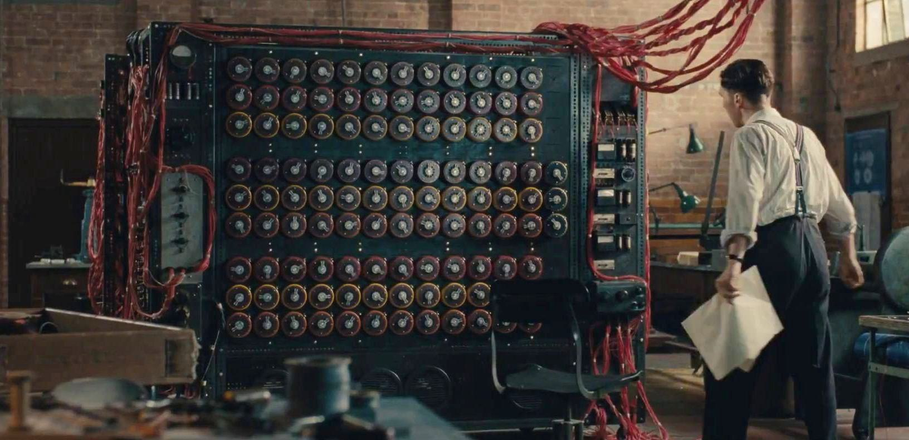

Algorithmic trading has seen a remarkable evolution with the integration of advanced computing technologies and machine learning techniques. At the core of these advancements lies the concept of the Turing machine, an essential model in computation theory, which draws direct parallels with algorithmic trading systems, particularly when machine learning is involved. Named after the pioneering mathematician and computer scientist Alan Turing, the Turing machine is a theoretical construct capable of simulating the logic of any computer algorithm. Its significance in the computational landscape provides critical insights into how modern trading algorithms are designed and optimized.

Algorithmic trading, or algo trading, involves the use of sophisticated algorithms to execute trades based on pre-defined criteria, often leveraging speed and data analysis beyond human capabilities. These algorithms have the potential to rapidly analyze vast data sets and execute trades in fractions of a second, offering a level of precision and efficiency that is highly prized in financial markets.



The fundamentals of Turing machines—finite sets of states, tape of infinite length, and a mechanism to read and write symbols—parallel the structures of trading algorithms. Just as a Turing machine operates on a sequence of predefined states and rules, trading algorithms process market data with a set of programmed strategies and conditions. This affinity suggests that the principles underpinning Turing machines can enhance the efficiency and adaptability of trading systems.

As we examine the intersection of Turing machines and trading, the application of computational theories and machine learning emerges as a pivotal factor in refining trading algorithms. Machine learning, functioning as a complex Turing machine, brings additional capabilities, allowing trading systems to learn from data patterns and adapt to dynamic market conditions. Thus, understanding the relationship between Turing machines and algorithmic trading not only informs the design of more effective trading strategies but also paves the way for continuous innovation in financial technology.

## Table of Contents

## Understanding Turing Machines

Turing machines are foundational constructs in the theory of computation, representing abstract computational models capable of simulating the logic underlying any given computer algorithm. Introduced by the British mathematician Alan Turing in 1936, these machines underpin much of modern computer science by offering a simple yet powerful model for understanding computation's fundamental limits and possibilities. 

At its core, a Turing machine operates on an infinite tape divided into discrete cells, each of which can hold a symbol from a finite alphabet. The machine comprises a finite set of states, a tape head that can read and write symbols on the tape, and a transition function guiding the machine's actions based on the current state and the symbol it reads. The transition function, typically expressed as a set of rules, determines how the machine moves from one state to another while possibly modifying the symbol under the tape head and shifting the tape head left or right.

Mathematically, a Turing machine can be defined as a 7-tuple $M = (Q, \Sigma, \Gamma, \delta, q_0, q_{accept}, q_{reject})$, where:
- $Q$ is a finite set of states.
- $\Sigma$ is the finite input alphabet not containing the blank symbol.
- $\Gamma$ is the tape alphabet, where $\Sigma \subseteq \Gamma$ and the blank symbol $\_$ is included in $\Gamma$.
- $\delta: Q \times \Gamma \rightarrow Q \times \Gamma \times \{L, R\}$ is the transition function.
- $q_0 \in Q$ is the initial state.
- $q_{accept} \in Q$ is the accepting state.
- $q_{reject} \in Q$ is the rejecting state, where $q_{reject} \neq q_{accept}$.

The operation of a Turing machine is determined by the transition function $\delta$, which, given the current state and the currently scanned tape symbol, dictates the next state, the symbol to write in the current cell, and the direction to move the tape head (left or right).

Turing machines are not designed with physical construction in mind but serve as an abstract representation to explore computability. They are pivotal in demonstrating which functions can be computed and which cannot, providing a framework for understanding concepts such as decidability and the limits of computation. One of the most famous contributions using Turing machines is the proof of the Halting Problem's unsolvability, which shows the existence of problems that no Turing machine can solve.

## Algorithmic Trading Overview

Algorithmic trading, often referred to as algo trading, utilizes computer algorithms to execute trades at speeds and efficiencies human traders cannot match. At its core, it involves deploying predefined rules and instructions to automatically place trading orders, ensuring optimal timing and conditions. These rules can involve various variables such as timing, price, and [volume](/wiki/volume-trading-strategy), which are programmed to execute trades upon meeting specific market conditions.

One of the principal advantages of [algorithmic trading](/wiki/algorithmic-trading) lies in its ability to rapidly analyze market data and execute orders across diverse trading venues. Given the [volatility](/wiki/volatility-trading-strategies) and pace of modern financial markets, this capability affords algorithmic systems a significant edge. Unlike human traders, who are limited by their ability to process information and respond quickly, algorithmic systems can instantly analyze vast datasets and make calculated decisions.

Recent advances in [machine learning](/wiki/machine-learning) have further augmented algo trading strategies. Machine learning models, with their capacity to discern complex patterns and adapt autonomously to evolving markets, enable trading systems to not only react to immediate market shifts but also predict future trends. This adaptability is crucial, as it allows trading models to optimize decision-making processes and enhance profitability over time. For instance, machine learning algorithms can model and predict price movements by analyzing historical data and other market signals.

Algorithmic trading is prominent across various asset classes, including stocks, foreign exchange ([forex](/wiki/forex-system)), and cryptocurrencies. Each asset class presents unique challenges and opportunities that algorithmic systems can exploit. For stocks, algorithms can manage high-frequency trading, capturing tiny price differentials via rapid trades. In forex, algorithms navigate currency movements, reacting to shifts in economic indicators or geopolitical events. Meanwhile, in the [cryptocurrency](/wiki/cryptocurrency) market, characterized by its 24/7 trading cycle and extreme volatility, algorithms are invaluable for managing trades around the clock while mitigating risks associated with dramatic price swings.

An example of a simple algorithmic trading strategy can be illustrated with a moving average crossover strategy in Python:

```python
import numpy as np
import pandas as pd

# Example data
data = pd.DataFrame({
    'Close': [100, 102, 104, 103, 105, 107, 106, 108, 110, 111] # Closing prices
})

# Calculating moving averages
data['Short_MA'] = data['Close'].rolling(window=3).mean()
data['Long_MA'] = data['Close'].rolling(window=5).mean()

# Generating signals
data['Signal'] = 0
data.loc[data['Short_MA'] > data['Long_MA'], 'Signal'] = 1
data.loc[data['Short_MA'] < data['Long_MA'], 'Signal'] = -1

# Strategy output
print(data[['Close', 'Short_MA', 'Long_MA', 'Signal']])
```

In this example, a simple strategy is defined where a buy signal is issued when the short-term moving average (Short_MA) crosses above the long-term moving average (Long_MA), and a sell signal is generated when the opposite occurs.

Overall, algorithmic trading represents a synthesis of technological advancements and financial strategies, reflecting the broader trend of digital transformation within the financial markets. As technology continues to evolve, so too will the capabilities and sophistication of algorithmic trading systems.

## Turing Machines in the Context of Trading

The concept of a Turing machine can be applied to trading algorithms to create more efficient and adaptable trading systems. A Turing machine operates on a predetermined set of rules to manipulate data. Similarly, trading algorithms use defined strategies to analyze and act on market data. This parallel facilitates the development of computationally rigorous and potentially efficient trading systems, mirroring the process a Turing machine employs to solve computational problems.

In algorithmic trading, the trading algorithm acts akin to the Turing machine's set of rules—processing information and making decisions based on potential inputs or market data. A Turing machine's finite state control can be likened to the algorithm's decision-making processes, where entry and [exit](/wiki/exit-strategy) positions are determined by carefully designed strategies that model market conditions. 

For instance, a simple trading algorithm could be represented as:
```python
def simple_moving_average_strategy(prices, window_size):
    moving_averages = []
    for i in range(len(prices) - window_size + 1):
        window = prices[i:i + window_size]
        moving_averages.append(sum(window) / window_size)
    return moving_averages

prices = [100, 105, 102, 108, 110]
window_size = 3
print(simple_moving_average_strategy(prices, window_size))
```

This code fragment defines a basic strategy where the decision (to trade or not) is governed by the moving average calculation—a simplistic rule set echoing the operations of a Turing machine. Such computational strategies highlight how a finite set of instructions or states can be applied to process market data, making trading algorithms more mathematically grounded and efficient.

Moreover, the parallel serves to refine algorithmic efficiency. Just as a Turing machine can be designed to operate using optimal state transitions, algorithmic trading strategies can be optimized to minimize latency, maximize execution accuracy, and reduce transaction costs, thus enhancing performance.

The conceptualization of trading algorithms as Turing machines also encourages developers to use advanced computational theories, such as complexity theory, to analyze the time and space complexity of trading strategies—further refining efficiency and performance. As such, aligning trading strategies with Turing machine principles supports the systemization of trading approaches, helping developers craft robust and adaptive algorithms with enhanced predictive capabilities and improved market responsiveness.

## Machine Learning and Turing Machines in Trading

Machine learning models can be conceptualized as complex Turing machines, enhanced by their ability to learn from data and improve their performance with experience. This capacity for learning builds upon the foundational aspects of Turing machines, where algorithms operate based on a finite set of instructions. Machine learning augments this framework by introducing adaptability and predictive capabilities, which are crucial in algorithmic trading environments.

In algorithmic trading, machine learning models provide significant advantages by predicting market trends and identifying opportunities for trades that may not be immediately apparent through traditional analysis. These models use historical data to build predictive models, employing techniques such as supervised learning, where the model is trained on labeled data, or unsupervised learning, which identifies patterns through unlabeled data. For instance, a common supervised learning application would involve using a dataset of historical stock prices, labeled with subsequent price movements, to train a model to predict future stock prices.

The efficacy of machine learning in trading systems is contingent on the robustness of both the data input and the computational frameworks. The Turing-based framework ensures that the algorithms have the necessary computational power to process and analyze vast amounts of market data. A precise understanding of the data's structure, quality, and relevance is vital for developing reliable models. Moreover, the underlying computational models must be capable of handling dynamic and real-time data inputs, adapting continuously to new market conditions.

To develop sophisticated trading algorithms, ongoing education and research are essential. This includes staying updated with advancements in machine learning algorithms, computational theories, and financial market dynamics. The intersection of these fields provides fertile ground for innovation, where improvements in computational theory directly enhance predictive models and trading strategies.

For example, consider the implementation of a [reinforcement learning](/wiki/reinforcement-learning) algorithm, a type of machine learning that mimics the learning process akin to a Turing machine improving with feedback. In the context of trading, a reinforcement learning model could interact with a simulated market environment, receiving rewards or penalties based on trading performance, thus iteratively refining its strategy.

```python
import numpy as np
import gym

# Simple reinforcement learning example using OpenAI Gym
env = gym.make('CartPole-v1')

for i_episode in range(20):
    observation = env.reset()
    for t in range(100):
        env.render()
        action = env.action_space.sample()  # Random action, to be replaced with a trained model's prediction
        observation, reward, done, info = env.step(action)
        if done:
            print("Episode finished after {} timesteps".format(t+1))
            break

env.close()
```

In conclusion, the synergy between machine learning and the computational principles of Turing machines underpins the development of advanced algorithmic trading systems. The continuous evolution in these areas promises to refine the precision and adaptability of trading algorithms, potentially transforming financial markets with innovative trading solutions.

## Conclusion

Turing machines serve as an essential framework for comprehending the computational dimensions of algorithmic trading. Their foundational principles offer a blueprint for designing trading algorithms that are both rigorous and efficient. This conceptual grounding is particularly potent when combined with machine learning techniques, which enhance trading models by enabling them to learn from vast datasets and adapt to evolving market conditions. The integration of Turing machine concepts with machine learning not only improves trading efficiency but also enhances predictive accuracy, offering traders a robust set of tools for decision-making.

The ongoing development in this field promises substantial advancements in trading systems. As financial markets grow more complex, the theoretical underpinnings provided by Turing machines will continue to be instrumental in creating innovative trading solutions. These solutions can process information at unprecedented speeds and handle intricate market dynamics, which are crucial for maintaining a competitive edge.

Future research holds significant potential for refining these systems further. By exploring the intersections of theoretical computation and practical algorithm deployment, new methodologies can be developed that improve algorithmic performance. Such advancements are likely to bring about considerable improvements in financial markets, optimizing trading processes and potentially leading to greater market efficiencies and stability. With continuous innovation, the principles of Turing machines will remain central to pioneering the next generation of trading frameworks.

## References & Further Reading

[1]: Turing, A. M. (1936). ["On Computable Numbers, with an Application to the Entscheidungsproblem."](https://www.cs.virginia.edu/~robins/Turing_Paper_1936.pdf) Proceedings of the London Mathematical Society, 2(42), 230-265.

[2]: Lopez de Prado, M. (2018). ["Advances in Financial Machine Learning."](https://www.amazon.com/Advances-Financial-Machine-Learning-Marcos/dp/1119482089) John Wiley & Sons.

[3]: Jansen, S. (2020). ["Machine Learning for Algorithmic Trading."](https://github.com/stefan-jansen/machine-learning-for-trading) Packt Publishing.

[4]: Chan, E. P. (2009). ["Quantitative Trading: How to Build Your Own Algorithmic Trading Business."](https://github.com/justinchou/books-quantitative-trading) John Wiley & Sons.

[5]: Sutton, R. S., & Barto, A. G. (2018). ["Reinforcement Learning: An Introduction"](https://ieeexplore.ieee.org/book/6267343) (2nd ed.). MIT Press.

[6]: Aronson, D. R. (2007). ["Evidence-Based Technical Analysis: Applying the Scientific Method and Statistical Inference to Trading Signals."](https://www.amazon.com/Evidence-Based-Technical-Analysis-Scientific-Statistical/dp/0470008741) John Wiley & Sons.