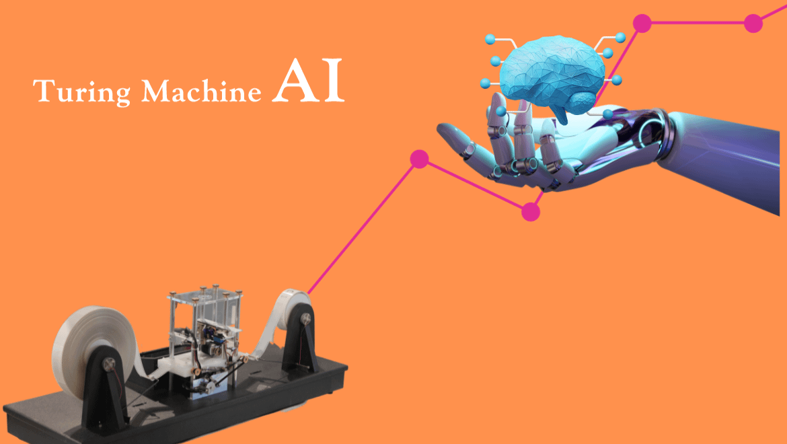

## Table of Contents

## What is a Turing Machine?

A Turing Machine is a simple device that helps us understand what computers can do. It was invented by a man named Alan Turing. Imagine a long tape that you can write on and erase from, kind of like a very long piece of paper. The machine has a head that can read and write symbols on this tape. It can move the tape left or right and follow a set of rules to decide what to do next. This simple idea can actually solve very complex problems.

Even though a Turing Machine is a basic concept, it is very powerful. It can do anything that a modern computer can do, given enough time and tape. This is why it's important in the study of computer science. It helps us figure out if a problem can be solved by a computer at all. If a problem can be solved by a Turing Machine, we say it is "computable." This idea has helped shape how we think about computers and what they are capable of doing.

## How does a Turing Machine work?

A Turing Machine works by using a long tape that acts like a piece of paper. The tape is divided into squares, and each square can have a symbol written on it or be left blank. The machine has a head that can read what's on the tape and write new symbols or erase them. The head can also move the tape left or right. The machine follows a set of rules, called a program, that tells it what to do based on what symbol it reads. For example, if it reads a "1," the rule might say to write a "0" and move the tape to the right.

The machine keeps working step by step, following the rules until it reaches a special state that tells it to stop. This state is like finishing a task. The final symbols left on the tape are the answer to the problem the machine was trying to solve. Even though it sounds simple, a Turing Machine can solve very hard problems if you give it the right rules and enough time. It's like a very basic computer that can do anything a modern computer can do, just much slower.

## What is the relevance of Turing Machines to modern computing?

Turing Machines are very important to modern computing because they help us understand what computers can do. Alan Turing invented the idea to show that a simple machine could solve any problem that can be solved by following rules. This idea is the foundation of computer science. It helps us know if a problem can be solved by a computer at all. If a problem can be solved by a Turing Machine, we say it is "computable." This means that even the most complex computer programs today are based on the same basic ideas that Turing came up with.

Even though real computers are much faster and more complex than Turing Machines, the basic idea is still the same. A computer's memory is like the tape of a Turing Machine, and the processor is like the head that reads and writes. The programs we write for computers are just sets of rules, like the ones a Turing Machine follows. So, when we learn about Turing Machines, we are learning about the heart of how computers work. This understanding helps us design better computers and write better programs.

## What are the basic components of a trading system?

A trading system is made up of a few key parts that work together to help people buy and sell things like stocks or other investments. The first part is the trading strategy. This is like a set of rules that tells the system when to buy or sell. It can be based on things like price changes, news, or other information. The second part is the data feed. This is where the system gets all the information it needs, like current prices and news, to make decisions.

The third part is the execution system. This is what actually buys or sells the investments when the trading strategy says to do it. It needs to be fast and reliable so that the system can act quickly. The last part is the risk management system. This helps keep the trading safe by setting limits on how much can be bought or sold and how much money can be lost. All these parts work together to make the trading system run smoothly and help people make smart choices about their investments.

## How can the concept of a Turing Machine be applied to trading algorithms?

A Turing Machine can help us understand how trading algorithms work. Just like a Turing Machine follows a set of rules to read and write on a tape, a trading algorithm follows rules to decide when to buy or sell. The tape in a Turing Machine is like the data feed in a trading system, which gives the algorithm all the information it needs, like current prices and news. The head of the Turing Machine, which reads and writes, is like the part of the trading algorithm that makes decisions based on the data.

Even though a real trading algorithm is much more complex and faster than a Turing Machine, the basic idea is the same. The trading algorithm uses its rules to look at the data and decide what to do, just like a Turing Machine follows its rules to move along the tape. This helps us see that even the most advanced trading systems are based on simple ideas, like the ones Alan Turing came up with. Understanding this can help us make better trading algorithms that work well and make smart choices about buying and selling.

## What are the limitations of using a Turing Machine model in trading?

Using a Turing Machine model in trading has some limitations. One big problem is that Turing Machines are very slow compared to modern computers. A trading system needs to make decisions quickly, often in milliseconds, to take advantage of market changes. A Turing Machine would take much longer to process the same information, which could lead to missed opportunities or losses. Also, Turing Machines have a simple structure with just one head and a tape, which makes them less flexible than the complex algorithms used in trading today. These algorithms can handle many different types of data and make decisions based on many factors at the same time.

Another limitation is that Turing Machines are theoretical and not practical for real-world trading. They are great for understanding the basics of computation, but they don't have the features needed for a trading system, like real-time data processing and risk management. A trading system needs to be able to handle large amounts of data quickly and make decisions based on that data in real time. Turing Machines can't do this efficiently. They are also not designed to work with the complex math and [statistics](/wiki/bayesian-statistics) that are often used in trading algorithms. So, while the idea of a Turing Machine can help us understand how trading algorithms work, it's not something we can actually use in a real trading system.

## How can a Turing Machine help in understanding algorithmic trading strategies?

A Turing Machine can help us understand how [algorithmic trading](/wiki/algorithmic-trading) strategies work by showing us the basic ideas behind them. Just like a Turing Machine follows a set of rules to read and write on a tape, an algorithmic trading strategy follows rules to decide when to buy or sell. The tape in a Turing Machine is like the data feed in a trading system, which gives the algorithm all the information it needs, like current prices and news. The head of the Turing Machine, which reads and writes, is like the part of the trading algorithm that makes decisions based on the data. By understanding how a Turing Machine works, we can see that even the most complex trading algorithms are based on simple ideas, like the ones Alan Turing came up with.

However, a Turing Machine also helps us see the limitations of algorithmic trading strategies. Turing Machines are very slow compared to modern computers, which means they can't make decisions quickly enough for real-time trading. Also, Turing Machines have a simple structure with just one head and a tape, which makes them less flexible than the complex algorithms used in trading today. These algorithms can handle many different types of data and make decisions based on many factors at the same time. So, while a Turing Machine can help us understand the basics of how trading algorithms work, it also shows us why we need more advanced tools for real trading.

## What are the differences between a Turing Machine and real-world trading systems?

A Turing Machine is a simple idea that helps us understand what computers can do. It has a long tape that it can read and write on, and it follows a set of rules to decide what to do next. A real-world trading system, on the other hand, is much more complex. It uses a lot of data, like current prices and news, to make quick decisions about buying and selling. Trading systems need to be fast and able to handle many different types of information at the same time, which a Turing Machine can't do well.

Another big difference is that Turing Machines are theoretical and not practical for real trading. They are slow and can only do one thing at a time, while trading systems need to work quickly and handle many tasks at once. Trading systems also use complex math and statistics to make decisions, which is something a Turing Machine isn't designed for. So, while a Turing Machine can help us understand the basic ideas behind trading algorithms, it's not something we can actually use in a real trading system.

## How can the halting problem relate to trading algorithms?

The halting problem is a famous idea in computer science that says there's no way to know for sure if a program will ever stop running. This can be important for trading algorithms because these programs need to make quick decisions about buying and selling. If a trading algorithm gets stuck and never stops, it could miss important chances to trade or even cause big problems. So, understanding the halting problem helps us see why it's important for trading algorithms to be designed carefully so they don't get stuck.

Even though trading algorithms are much more complex than the simple programs used to explain the halting problem, the basic idea still matters. A trading algorithm that keeps running without making a decision is like a program that never halts. This can be bad for trading because the market changes quickly, and the algorithm needs to react fast. By thinking about the halting problem, people who make trading algorithms can try to make sure their programs will always stop and make a decision, which helps them work better in the real world.

## What advanced techniques can be used to optimize trading algorithms based on Turing Machine principles?

One way to optimize trading algorithms using Turing Machine principles is to focus on making the decision-making process more efficient. Just like a Turing Machine follows a set of rules to read and write on a tape, a trading algorithm can be designed to follow rules that help it make quick and smart choices. By simplifying the rules and making them clearer, the algorithm can process data faster and make decisions more quickly. This is important in trading because the market changes fast, and being able to react quickly can make a big difference. So, by using the idea of a Turing Machine, we can try to make our trading algorithms simpler and faster.

Another technique is to use the concept of state transitions from Turing Machines to improve how trading algorithms handle different market conditions. A Turing Machine changes its state based on what it reads on the tape, and a trading algorithm can change its behavior based on what it sees in the market. By carefully designing these state transitions, the algorithm can adapt to different situations more effectively. For example, it can switch from a buying strategy to a selling strategy when certain conditions are met. This helps the algorithm stay flexible and respond to the market in a smart way, much like how a Turing Machine follows its rules to solve problems.

## How do Turing completeness and trading system flexibility correlate?

Turing completeness means a system can do anything that a Turing Machine can do. This is important because it shows that a system is very powerful and can solve any problem that can be solved by following rules. In trading, flexibility means a system can change and adapt to different situations in the market. A trading system that is Turing complete can be very flexible because it can handle any kind of rule or strategy that traders want to use. This means it can adapt to new market conditions or try out new trading ideas easily.

However, just because a trading system is Turing complete doesn't mean it will be flexible in a practical way. Real trading systems need to be fast and able to handle a lot of data at the same time. While a Turing complete system can do anything in theory, it might be too slow or too simple to be useful in the fast-changing world of trading. So, while Turing completeness gives a trading system the potential to be very flexible, the system also needs to be designed well to actually be useful in real trading situations.

## What are the future prospects of using Turing Machine concepts in the evolution of trading technologies?

The future of using Turing Machine concepts in trading technologies looks promising because these ideas help us understand the basics of how computers work. Even though real trading systems are much more complex and faster than Turing Machines, the simple rules and decision-making processes of a Turing Machine can guide us in making trading algorithms better. By focusing on making these algorithms simpler and more efficient, like a Turing Machine, we can help them make quick and smart choices in the fast-changing world of trading. This can lead to trading systems that are more reliable and can adapt to new market conditions easily.

However, there are challenges to using Turing Machine concepts in real trading. Turing Machines are slow and can only do one thing at a time, which doesn't work well in the fast-paced world of trading. So, while the basic ideas of Turing Machines can help us design better trading algorithms, we need to find ways to make these algorithms fast and able to handle a lot of data at the same time. By combining the simple, rule-based approach of Turing Machines with advanced technology, we can create trading systems that are both powerful and flexible, helping traders make better decisions in the future.

## References & Further Reading

[1]: Turing, A. M. (1936). ["On Computable Numbers, with an Application to the Entscheidungsproblem."](https://www.cs.virginia.edu/~robins/Turing_Paper_1936.pdf) Proceedings of the London Mathematical Society, 2(42), 230-265.

[2]: Lopez de Prado, M. (2018). ["Advances in Financial Machine Learning."](https://www.amazon.com/Advances-Financial-Machine-Learning-Marcos/dp/1119482089) John Wiley & Sons.

[3]: Jansen, S. (2020). ["Machine Learning for Algorithmic Trading."](https://github.com/stefan-jansen/machine-learning-for-trading) Packt Publishing.

[4]: Chan, E. P. (2009). ["Quantitative Trading: How to Build Your Own Algorithmic Trading Business."](https://github.com/justinchou/books-quantitative-trading) John Wiley & Sons.

[5]: Sutton, R. S., & Barto, A. G. (2018). ["Reinforcement Learning: An Introduction"](https://ieeexplore.ieee.org/book/6267343) (2nd ed.). MIT Press.

[6]: Aronson, D. R. (2007). ["Evidence-Based Technical Analysis: Applying the Scientific Method and Statistical Inference to Trading Signals."](https://www.amazon.com/Evidence-Based-Technical-Analysis-Scientific-Statistical/dp/0470008741) John Wiley & Sons.