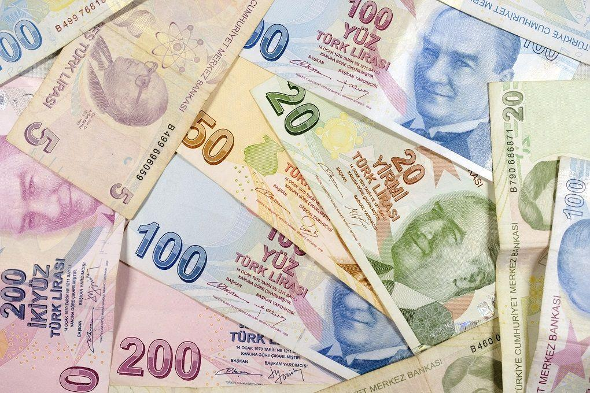

## Table of Contents

## What is the Turkish Lira?

The Turkish Lira is the official money used in Turkey. It is also used in the Turkish Republic of Northern Cyprus. People in these places use the Lira to buy things like food, clothes, and other stuff they need. The symbol for the Turkish Lira is ₺, and its code is TRY.

The Turkish Lira has been around for a long time. It started in 1844 when it replaced the old Ottoman Lira. Over the years, the Lira has changed a lot because of inflation and other money problems. Sometimes, the government has to change the value of the Lira to make sure it works well for everyone in the country.

## When was the Turkish Lira first introduced?

The Turkish Lira was first introduced in 1844. It replaced the old Ottoman Lira, which was the money used before. The Ottoman Empire wanted a new kind of money to make trading easier and to help the economy grow.

Since it started, the Turkish Lira has gone through many changes. Inflation, which is when prices go up a lot, has affected the Lira many times. The government has had to change the value of the Lira to keep up with these changes and to make sure it still works well for people in Turkey.

## What are the denominations of the Turkish Lira?

The Turkish Lira comes in different amounts of money, called denominations. For paper money, you can find Lira in 5, 10, 20, 50, 100, and 200 Lira notes. These are the big pieces of money that people use for bigger purchases. The 200 Lira note is the biggest one you can get.

For smaller amounts, there are coins. The coins come in 1, 5, 10, 25, and 50 Kurus, which is a smaller unit of the Lira. There are also 1 Lira coins. Kurus are used for things that cost less than a Lira. So, if you want to buy something cheap, you might use Kurus coins.

## How does the Turkish Lira function within Turkey's economy?

The Turkish Lira is the main money used in Turkey. It helps people buy things they need every day, like food, clothes, and other stuff. When people get paid for their jobs, they get Lira, and they use it to pay for things. Businesses also use Lira to buy things they need to make their products or offer their services. The Lira is important because it keeps the economy moving by letting people and businesses trade with each other easily.

The value of the Turkish Lira can change because of things like inflation, which is when prices go up a lot. If the Lira loses value, things can get more expensive for people in Turkey. The government and the central bank watch the Lira closely and sometimes make changes to help keep it stable. They might change interest rates or do other things to make sure the Lira works well for everyone in the country. This helps keep the economy strong and makes sure people can keep buying what they need.

## What is the exchange rate of the Turkish Lira to major currencies like the USD and EUR?

The exchange rate of the Turkish Lira (TRY) to the US Dollar (USD) and the Euro (EUR) changes every day. As of now, 1 USD is about 30 TRY, but this can go up or down. The exchange rate is important because it tells you how many Lira you need to get 1 US Dollar. If you want to travel to the USA or buy things from there, you need to know this rate.

The exchange rate for the Euro is also important. Right now, 1 EUR is around 33 TRY. This rate helps people in Turkey know how much they need to pay in Lira if they want to buy something from Europe or go on a trip there. Both rates change because of things like the economy in Turkey, what's happening in the world, and how much people want to buy or sell Lira.

These rates can affect everyday life in Turkey. If the Lira gets weaker, things from other countries can get more expensive. But if the Lira gets stronger, it can make those things cheaper. People and businesses watch these rates closely to plan their money and make good choices.

## What factors influence the value of the Turkish Lira?

The value of the Turkish Lira can change because of many things. One big thing is the economy in Turkey. If the economy is doing well, with people buying lots of things and businesses growing, the Lira might get stronger. But if the economy is not doing well, with fewer people buying things and businesses struggling, the Lira can get weaker. Inflation is another big thing. When prices go up a lot, it can make the Lira worth less. The government and the central bank try to control inflation to keep the Lira stable.

Another thing that affects the Lira is what's happening in the world. If other countries are doing well and want to buy things from Turkey, it can make the Lira stronger. But if other countries are not doing well and don't want to buy as much from Turkey, it can make the Lira weaker. Also, if people around the world think the Turkish economy is risky, they might not want to hold onto Lira, which can make its value go down. Interest rates set by the central bank can also influence the Lira's value. If interest rates go up, it can make the Lira more attractive to investors, making it stronger. If they go down, it might make the Lira less attractive, causing it to weaken.

Overall, the value of the Turkish Lira is always changing because of many different things happening inside Turkey and around the world. It's important for the government and the central bank to watch these things closely and make changes to keep the Lira stable. This helps make sure people in Turkey can keep buying what they need and businesses can keep growing.

## How has the Turkish Lira performed historically against inflation?

The Turkish Lira has had a tough time with inflation over the years. Inflation means that prices for things like food and clothes go up a lot. When inflation is high, the Lira loses value, which makes it harder for people to buy what they need. Turkey has had periods of very high inflation, especially in the 1990s and early 2000s. During these times, the government had to change the Lira a lot, even adding zeros to the currency to keep up with rising prices. This made it hard for people to understand how much things really cost and caused a lot of confusion.

In more recent years, the Turkish government and the central bank have tried to control inflation better. They've made changes to interest rates and other money policies to help keep the Lira stable. But it's still a challenge. Sometimes, the Lira gets weaker, and inflation goes up again. This can make life harder for people in Turkey because their money doesn't go as far. The government keeps working to find a balance, but it's not easy, and the Lira's value against inflation is always something to watch closely.

## What are the key monetary policies affecting the Turkish Lira?

The key monetary policies that affect the Turkish Lira are mainly set by the Central Bank of the Republic of Turkey. One big policy is changing the interest rates. When the central bank raises interest rates, it can make the Lira stronger because it becomes more attractive for people to save and invest in Turkey. But if they lower the interest rates, it might make the Lira weaker because people might not want to keep their money in Turkey as much. The central bank also uses other tools like controlling how much money is in the economy to try to keep inflation low and the Lira stable.

Another important policy is how the government manages the exchange rate of the Lira. Sometimes, the government might step in to stop the Lira from getting too weak or too strong. They do this by buying or selling Lira in the foreign exchange market. This can help keep the Lira's value more stable, which is good for people and businesses in Turkey. But it can be hard to do this all the time, and the government has to be careful not to cause other problems in the economy.

## How does the Central Bank of the Republic of Turkey manage the Lira?

The Central Bank of the Republic of Turkey manages the Lira by using different tools. One important tool is changing the interest rates. If the central bank raises the interest rates, it can make the Lira stronger because people and businesses might want to keep their money in Turkey to earn more from their savings. But if they lower the interest rates, it might make the Lira weaker because people might take their money out of Turkey to find better places to save or invest. The central bank also controls how much money is in the economy. If there's too much money, prices can go up a lot, which makes the Lira weaker. So, they try to keep the right amount of money to keep inflation low and the Lira stable.

Another way the central bank manages the Lira is by controlling its exchange rate. Sometimes, they step in to stop the Lira from getting too weak or too strong. They do this by buying or selling Lira in the foreign exchange market. If the Lira is getting too weak, the central bank might buy Lira to make it stronger. If it's getting too strong, they might sell Lira to make it weaker. This helps keep the Lira's value more stable, which is good for people and businesses in Turkey. But it's not easy to do this all the time, and the central bank has to be careful not to cause other problems in the economy.

## What are the recent economic reforms related to the Turkish Lira?

Recently, Turkey has made some changes to help the Turkish Lira and the economy. One big change is about the interest rates. The central bank has been raising them to make the Lira stronger. When interest rates go up, people might want to keep their money in Turkey to get more from their savings. This can make the Lira stronger and help control inflation, which is when prices go up a lot. The government also tries to control how much money is in the economy to keep things stable.

Another change is about the exchange rate of the Lira. The government sometimes steps in to stop the Lira from getting too weak or too strong. They do this by buying or selling Lira in the foreign exchange market. If the Lira is getting too weak, they might buy Lira to make it stronger. If it's getting too strong, they might sell Lira to make it weaker. This helps keep the Lira's value more stable, which is good for people and businesses in Turkey. But it's not easy to do this all the time, and the government has to be careful not to cause other problems in the economy.

## How does the Turkish Lira's value impact Turkey's international trade?

The value of the Turkish Lira affects how much Turkey can buy and sell with other countries. When the Lira is weak, it can make things Turkey sells, like cars or clothes, cheaper for people in other countries. This can be good because it might help Turkey sell more stuff. But it also means that things Turkey buys from other countries, like machines or food, can get more expensive. This can make it harder for businesses in Turkey to get what they need to make their products.

On the other hand, if the Lira gets stronger, things Turkey sells can become more expensive for people in other countries. This might make it harder to sell stuff abroad. But it also means that things Turkey buys from other countries can get cheaper. This can be good for businesses in Turkey because it might cost them less to get the things they need. So, the value of the Lira is really important for Turkey's international trade, affecting both what they can sell and what they can buy.

## What are the future predictions for the Turkish Lira based on current economic trends?

The future of the Turkish Lira depends a lot on what's happening in Turkey's economy and around the world. Right now, Turkey is trying to make its economy stronger by raising interest rates. This can help make the Lira stronger because people might want to keep their money in Turkey to earn more from their savings. But there are also risks. If inflation keeps going up or if other countries don't want to buy as much from Turkey, the Lira could get weaker again. The government and the central bank will need to keep working hard to control these things and keep the Lira stable.

Looking ahead, experts think the Lira might stay weak for a while because of these challenges. But if Turkey can keep inflation under control and make its economy more stable, the Lira could start to get stronger. It's hard to say for sure because so many things can change. But the key will be for the government to keep making good choices and for the world economy to stay strong. This way, Turkey can keep trading with other countries and help the Lira stay steady.

## What is the Role of the Central Bank of Turkey?

The Central Bank of the Republic of Turkey (CBRT) serves as a key architect in the country's economic policy framework, wielding significant influence through its monetary policy decisions. As Turkey grapples with substantial economic challenges, the CBRT confronts the dual mandate of controlling inflation while fostering economic growth—two often conflicting objectives. 

In recent years, the Turkish Lira has experienced intense [volatility](/wiki/volatility-trading-strategies), largely due to external economic pressures and internal fiscal policies. The CBRT's response has frequently involved adjusting interest rates to curb inflation, a persistent issue for Turkey. High inflation rates erode purchasing power, leading the CBRT to consider [interest rate](/wiki/interest-rate-trading-strategies) hikes as a mechanism to stabilize prices. However, these measures can also stifle economic growth by increasing borrowing costs, highlighting the delicate balancing act the CBRT must perform.

For example, if the inflation rate surpasses target levels—as it has done consistently—raising the nominal interest rate becomes one of the tools at the CBRT's disposal. The relationship between interest rates and inflation can be mathematically expressed through the Fisher equation:

$$
i = r + \pi^e
$$

where $i$ is the nominal interest rate, $r$ is the real interest rate, and $\pi^e$ is the expected inflation rate. By altering $i$, the CBRT aims to influence $\pi^e$ by adjusting investor expectations and consumer behavior accordingly.

Moreover, the CBRT's monetary policy is profoundly scrutinized by both local and foreign investors. Interest rate adjustments impact foreign exchange rates, affecting foreign investments. Higher interest rates might attract foreign capital, leading to an appreciation of the Turkish Lira, while lower rates might deter investment, risking capital flight and further depreciation of the currency.

To navigate these intricate dynamics, the CBRT periodically revises its policy mix, sometimes opting for unconventional measures like currency interventions to stabilize the lira against major currencies. These interventions and policy shifts are crucial in guiding market expectations and maintaining economic equilibrium.

Overall, the CBRT's role is indispensable in steering the Turkish economy through turbulent times. Its policy decisions have immediate and long-lasting effects on economic stability, influencing everything from inflation and employment levels to overall economic growth and investor confidence.

## References & Further Reading

[1]: Cevik, S., & Teksoz, K. (2012). ["Lost in Transmission? The Effectiveness of Inflation Targeting in Turkey."](https://papers.ssrn.com/sol3/papers.cfm?abstract_id=3063583) IMF Working Papers.

[2]: Alper, C. E., & Ardic, O. P. (2011). ["Turkey’s External Vulnerability and the Role of the Exchange Rate."](https://pmc.ncbi.nlm.nih.gov/articles/PMC6689741/) Eastern European Economics.

[3]: Yilmaz, K. (2006). ["The Structural Determinants of Vulnerability to Currency Crises in Turkey."](https://openknowledge.worldbank.org/bitstream/handle/10986/4462/wber_21_3_359.pdf?sequence=1) Journal of Applied Economics.

[4]: Lopez de Prado, M. (2018). ["Advances in Financial Machine Learning"](https://www.amazon.com/Advances-Financial-Machine-Learning-Marcos/dp/1119482089). Wiley.

[5]: Jansen, S. (2020). ["Machine Learning for Algorithmic Trading."](https://github.com/stefan-jansen/machine-learning-for-trading) Packt Publishing.

[6]: Alpert, L. (2010). ["Evidence-Based Technical Analysis: Applying the Scientific Method and Statistical Inference to Trading Signals."](https://www.semanticscholar.org/paper/Evidence-Based-Technical-Analysis%3A-Applying-the-and-Aronson/3b33df8737f1772e9e14d66a08c9696f140a2ee1) John Wiley & Sons.

[7]: Chan, E. P. (2009). ["Quantitative Trading: How to Build Your Own Algorithmic Trading Business."](https://github.com/ftvision/quant_trading_echan_book) John Wiley & Sons. 

[8]: Doko Tchatoka, F., Doan, L., & Gysembergh, L. (2019). ["Inflation Hedging and Exchange Rate Exposure: The Case of the Turkish Lira."](https://www.sciencedirect.com/science/article/pii/S026156061930131X) Research in International Business and Finance.