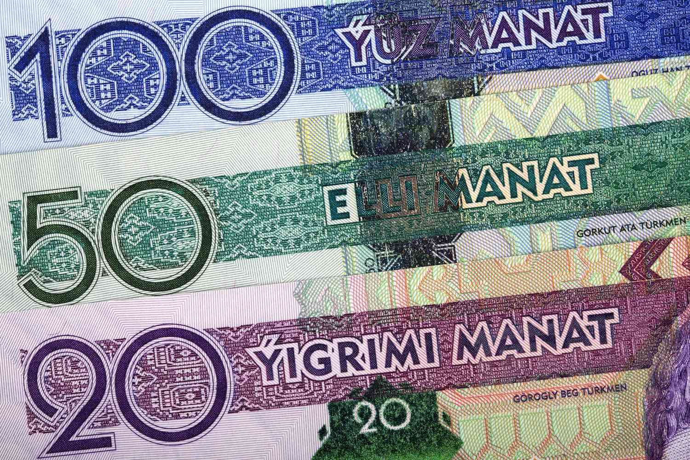

In recent years, the Turkmenistan Manat (TMT) has increasingly drawn attention in international financial circles. This heightened interest parallels a broader technological shift in currency trading brought about by algorithmic trading, commonly referred to as algo trading. This technological innovation has profoundly affected how currencies, including the TMT, are exchanged across global platforms.

Algorithmic trading utilizes complex algorithms to automate the buying and selling processes within financial markets. By leveraging sophisticated mathematical models and high-speed data processing, algo trading enhances market efficiency and reduces the latency inherent in human-driven trading. These computational techniques allow the detection and exploitation of market inefficiencies at speeds unattainable by traditional trading methods. As a result, they offer advantages such as precise timing, optimal pricing, and enhanced liquidity—factors particularly pertinent to emerging market currencies like the TMT.



TMT's engagement with digital trading platforms is gradually evolving, driven by innovations in algorithmic applications. Understanding this development is crucial for investors and traders looking to navigate the complex landscape of currency trading. With a fixed exchange rate system pegged to the US dollar, TMT presents a distinctive trading environment that benefits from the transparency and efficiency that algo trading can offer. However, the exchange rate dynamics often differ on unofficial markets, introducing complexities that require a deep understanding of market behavior.

As algorithmic trading methods continue to evolve, their influence on the TMT market becomes increasingly significant. These dynamics demand attention from market participants aiming to capitalize on the unique characteristics of the TMT while mitigating associated risks. By aligning trading strategies with algorithmic advancements, traders and investors are better positioned to grasp emerging opportunities within the TMT currency market amidst ongoing shifts in the global financial ecosystem.

## Table of Contents

## Understanding the Turkmenistan Manat (TMT)

The Turkmenistan Manat (TMT) serves as the official currency of Turkmenistan, having been introduced in 2009 during a significant transition from the previous iteration of the manat. This transition aimed to stabilize the national monetary system and align Turkmenistan’s currency practices more closely with global standards. The TMT is notably managed under a fixed exchange rate regime, tied to the US dollar. This peg is intended to provide a stable economic environment by reducing exchange rate volatility and facilitating international trade.

However, the official fixed exchange rate of the TMT does not fully reflect the complexities of Turkmenistan's economy. On the black market, the TMT often trades at rates that significantly differ from the official rate. This divergence is indicative of several economic pressures, encompassing factors such as inflationary trends and demand-supply imbalances within the domestic economy. Black market exchange rates serve as a barometer for economic conditions not completely captured by the official [statistics](/wiki/bayesian-statistics), highlighting potential imbalances in currency supply and demand.

The TMT circulates in various denominations, catering to diverse transactional needs within Turkmenistan and in its external trade engagements. Banknotes are issued in denominations ranging from 1 to 500 manat, while coins, called tennesi, come in denominations up to 50 tennesi. This structure supports functionality in everyday commerce as well as in bulk trading scenarios. As a result, the TMT plays an indispensable role in the domestic economy by facilitating trade, investment, and consumption activities.

Beyond its domestic utility, the TMT is instrumental in Turkmenistan’s international trade. Despite being a relatively less prominent currency on the global stage, it is crucial for transacting Turkmenistan’s sizable exports of natural gas and cotton, which are central to the nation’s economy. The ability of the TMT to maintain its stability amidst various economic pressures is indispensable for fostering international trade relationships and sustaining economic growth.

## The Rise of Algorithmic Trading

Algorithmic trading employs sophisticated algorithms to revolutionize the speed and efficiency of financial trading. By automating transactions, it removes the manual intervention typically required, driving market operations at impressively rapid speeds. This technology harnesses the computational power of computers to uncover and take advantage of market inefficiencies. These systems can analyze enormous datasets almost instantaneously, making decisions at speeds unachievable by human traders.

In currency trading, algorithmic methods have become especially significant. They have long been a staple in major currency markets due to their ability to handle large volumes and highly liquid assets. Algorithms are designed to perform tasks such as order execution, [arbitrage](/wiki/arbitrage), and strategy formulation based on statistical data, leading to precise and profitable transactions. They work under predefined conditions that guide asset buying and selling, thus enabling traders to execute strategies with high accuracy and reduced opportunity for emotional bias.

Recent trends highlight the adoption of [algorithmic trading](/wiki/algorithmic-trading) for exotic currencies, including the Turkmenistan Manat (TMT). Exotic currencies, often characterized by lower [liquidity](/wiki/liquidity-risk-premium) and more [volatility](/wiki/volatility-trading-strategies), can benefit significantly from these automated systems. Algorithmic trading brings much-needed efficiency and can improve liquidity by influencing tighter spreads in the market. The growing interest in applying algorithmic methods to currencies like TMT signifies a broader shift. Traders are increasingly recognizing the potential for algorithms to manage and exploit the unique challenges presented by these currencies, fostering a more robust trading environment. This shift brings an opportunity for enhanced market access and transparency even in regions previously thought to be too complex for traditional trading systems. 

As algorithmic trading continues to evolve, its expansion to emerging and exotic currencies like the TMT exemplifies its versatility and the ongoing adaptation within financial technologies, positioning it as an essential component of modern trading strategies.

## Impact of Algo Trading on TMT Currency Market

Algorithmic trading has a significant impact on the Turkmenistan Manat (TMT) currency market, primarily through enhancing market liquidity and tightening spreads. By employing sophisticated algorithms, traders can efficiently process and react to market data, allowing for more frequent and smaller trades, which collectively enhance liquidity. This increase in liquidity results in narrower bid-ask spreads, thereby improving the market's efficiency and reducing trading costs for participants.

Algorithms play a crucial role in achieving consistent and transparent pricing for TMT. This is particularly beneficial given Turkmenistan's regulated economic environment, where official rates often differ from black market rates. The precision of algorithmic systems ensures that the TMT's pricing better reflects actual market factors, enhancing transparency despite the country's complex economic factors.

Moreover, algorithmic trading can markedly affect volatility, especially during periods of economic or political uncertainty. Algorithms are designed to react swiftly to changes in market conditions, which can occasionally result in amplified short-term volatility. This is particularly pertinent in less liquid markets like TMT, where swift algorithmic responses to news can lead to sharp price fluctuations.

Despite these effects, the algorithms facilitate a deeper understanding of TMT's volatility patterns and help traders anticipate potential market movements. Using algorithmic models, traders can create simulations and forecasts that capture the potential impacts of political or economic events on the TMT market. These capabilities underscore the importance of algorithms in navigating the nuanced environment of TMT trading.

## Advantages of Algorithmic Trading in TMT

Algorithmic trading offers distinct advantages in the trading of the Turkmenistan Manat (TMT), primarily through enhanced discipline, precision, and efficiency. By nature, algorithmic trading systems are designed to execute trades based on predefined criteria without human intervention, thereby reducing the influence of emotions that often lead to suboptimal decision-making. This discipline ensures a consistent application of trading strategies, which is crucial in the volatile and relatively opaque TMT market.

Backtesting is a key feature of algorithmic trading that benefits TMT investors. By applying trading rules to historical TMT price data, traders can assess how their strategies would have performed in the past. This retrospective analysis helps identify potential strategies that are likely to succeed and those that may not, enabling traders to refine their approaches before committing actual capital.

Algorithmic systems can efficiently handle large order sizes, breaking them into smaller chunks to minimize market impact. This capability is particularly beneficial in the TMT market, where liquidity can be limited. By distributing orders over time or across different platforms, algorithms avoid significant price disruptions and can capitalize on small price movements. Given TMT's market dynamics, where sizeable price shifts may not be frequent, the capacity to exploit these minor fluctuations can be highly lucrative. 

In summary, algorithmic trading facilitates strategic precision, robust [backtesting](/wiki/backtesting), and effective trade execution, making it an advantageous tool for navigating the complexities of trading TMT.

## Challenges and Risks

Algorithmic trading, while transformative, also brings its own set of challenges and risks, particularly in the context of the Turkmenistan Manat (TMT) market. One of the primary concerns is the contribution to market volatility, a significant [factor](/wiki/factor-investing) in less liquid markets like TMT. Volatility can be exacerbated by large volumes of algorithmically executed trades, which may lead to rapid price fluctuations and potentially disrupt market stability. This characteristic poses a unique risk, as sudden market movements can lead to greater uncertainty and reduced investor confidence.

Technical glitches present another major risk associated with algorithmic trading. These can occur due to software errors, connectivity issues, or unexpected market conditions, leading to erroneous trades. In the context of TMT, where market conditions can be less predictable, the impact of such glitches might be amplified. This could result in substantial financial losses, as algorithms might execute trades based on faulty data or incorrect assumptions.

The risk of bad data further complicates algorithmic trading strategies. Algorithms rely on accurate and timely information to make trading decisions. If the data input is flawed, whether due to errors in data collection, reporting delays, or misinformation, algorithms could make suboptimal or erroneous trades. This is particularly concerning in the TMT market, where transparency may not be as high as in more developed markets, increasing the probability of discrepancies in market data.

Regulatory constraints are an additional challenge for algorithmic trading within Turkmenistan. The financial market regulations in the country might restrict the way algorithms are implemented and monitored. These regulations could impose limitations on data access, trading volumes, and cross-border transactions, thereby affecting the flexibility and efficiency of algorithmic strategies. Local investors using or considering algorithmic trading must navigate these regulatory landscapes carefully, balancing compliance with the pursuit of profits.

Considering these challenges, it becomes crucial for traders to implement robust risk management strategies. This might include diversifying algorithmic models, conducting regular audits of algorithmic performance, and establishing fail-safes such as circuit breakers to prevent catastrophic losses during abrupt market moves. Additionally, continuous monitoring and updating of algorithms can help in adapting to market changes and regulatory shifts, ultimately enhancing the resilience of trading strategies in the TMT market.

## The Future of TMT in Algorithmic Trading

Increased interest in emerging markets has positioned the Turkmenistan Manat (TMT) for greater integration with global trading systems through algorithmic mechanisms. As the demand for exotic currencies like TMT grows, the application of algorithms to facilitate such trades is expected to expand. Algorithmic trading strategies will further benefit from advancements in [artificial intelligence](/wiki/ai-artificial-intelligence) (AI) and [machine learning](/wiki/machine-learning), offering enhanced capabilities for analyzing complex data sets, identifying trading patterns, and executing trades with improved accuracy and speed.

AI-driven models can analyze historical price data, news sentiment, and macroeconomic indicators to forecast TMT price movements. Machine learning algorithms, particularly those employing [deep learning](/wiki/deep-learning) and natural language processing, enable the development of predictive models that adapt over time, as they learn from new data inputs. For instance, using Python's powerful machine learning libraries like TensorFlow or PyTorch, traders can build neural networks that model non-linear relationships in financial time series data:

```python
import numpy as np
import tensorflow as tf
from tensorflow.keras.models import Sequential
from tensorflow.keras.layers import Dense, LSTM

# Example model for time series prediction
def create_lstm_model(input_shape):
    model = Sequential()
    model.add(LSTM(50, activation='relu', input_shape=input_shape))
    model.add(Dense(1))
    model.compile(optimizer='adam', loss='mse')
    return model

# Assuming X_train is the input feature set and y_train is the target variable
model = create_lstm_model((X_train.shape[1], X_train.shape[2]))
model.fit(X_train, y_train, epochs=200, verbose=0)
```

Additionally, the future of TMT trading will likely witness the emergence of more sophisticated risk management tools tailored for the unique characteristics of the Turkmenistan market. These tools will integrate statistical models and real-time data analysis to mitigate risks more efficiently. For instance, algorithms can continuously monitor key economic indicators from Turkmenistan, such as GDP growth, inflation rates, and political developments, adjusting trading strategies dynamically to manage exposure proactively.

The potential for algorithmic trading to offer dynamic hedging strategies and automate risk controls ensures that investors can navigate the idiosyncrasies of the TMT market with greater confidence. As trading technology advances, more robust risk assessment tools and real-time data analytics will empower traders to make informed decisions, balancing potential returns against inherent market risks in this promising but complex currency market.

## Conclusion

Algorithmic trading presents both opportunities and challenges for the Turkmenistan Manat (TMT) currency market. As an increasingly significant player in currency trading powered by algorithms, understanding the intricacies of this digital approach allows traders to capitalize on opportunities while mitigating associated risks. Algorithmic strategies can enhance market efficiency, providing more consistent pricing and improving liquidity. Algorithm-driven systems excel in executing large orders with precision and speed, circumventing the emotional pitfalls often encountered in manual trading.

However, the volatile nature of TMT, particularly in the context of Turkmenistan’s complex economic and political environment, necessitates a robust risk management framework. While algorithms can increase market volatility, especially in less liquid markets, thoughtful design and deployment of these systems can help in managing these fluctuations. It is essential for traders to continuously refine their algorithms, incorporating real-time data and feedback to adapt to changing market conditions.

The future of TMT in the global algorithmic trading landscape looks promising, driven by ongoing advancements in technology. Innovations in artificial intelligence and machine learning are poised to develop more sophisticated trading models tailored for TMT. These technologies offer the potential for improved predictive analytics, risk assessment, and decision-making processes. As global trading systems evolve, the integration of TMT will likely benefit from enhanced trading platforms and tools, reshaping its role and performance in international markets. For traders, staying ahead in this dynamically changing environment will be integral to leveraging the full potential of algorithmic trading for TMT.

## References & Further Reading

[1]: Bergstra, J., Bardenet, R., Bengio, Y., & Kégl, B. (2011). ["Algorithms for Hyper-Parameter Optimization."](https://dl.acm.org/doi/10.5555/2986459.2986743) Advances in Neural Information Processing Systems 24.

[2]: ["Advances in Financial Machine Learning"](https://www.amazon.com/Advances-Financial-Machine-Learning-Marcos/dp/1119482089) by Marcos Lopez de Prado

[3]: ["Evidence-Based Technical Analysis: Applying the Scientific Method and Statistical Inference to Trading Signals"](https://www.amazon.com/Evidence-Based-Technical-Analysis-Scientific-Statistical/dp/0470008741) by David Aronson

[4]: ["Machine Learning for Algorithmic Trading"](https://github.com/stefan-jansen/machine-learning-for-trading) by Stefan Jansen

[5]: ["Quantitative Trading: How to Build Your Own Algorithmic Trading Business"](https://www.amazon.com/Quantitative-Trading-Build-Algorithmic-Business/dp/1119800064) by Ernest P. Chan