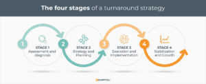

## Table of Contents

## What is a turnaround in business and finance?

A turnaround in business and finance is when a company that is not doing well tries to fix its problems and become successful again. This can happen when a company is losing money, has a lot of debt, or is not making as much profit as before. The goal of a turnaround is to make the company healthy and profitable again by changing how it operates, cutting costs, and finding new ways to make money.

To achieve a turnaround, a company might bring in new leaders who have experience in fixing struggling businesses. These leaders will look at every part of the company to see what is not working and make a plan to fix it. This can include selling off parts of the business that are not making money, closing down unprofitable stores, or renegotiating contracts to save money. The process can be difficult and take a long time, but if it works, the company can start making money again and avoid going out of business.

## Why is a turnaround necessary for a business?

A turnaround is necessary for a business when it is not doing well and needs to make big changes to survive. If a company is losing money, has too much debt, or is not making enough profit, it can't keep going the way it is. Without a turnaround, the business might go bankrupt or have to close down. A turnaround helps the company fix its problems and start making money again by changing how it operates and finding new ways to be successful.

During a turnaround, the company might need to make tough decisions like closing stores that are not making money or letting some employees go. It might also need to find new ways to make money or change what it sells. These changes can be hard, but they are important to make the business healthy again. If the turnaround works, the company can avoid going out of business and start growing and making profits again.

## What are the common signs that a business needs a turnaround?

A business might need a turnaround if it is losing money and can't pay its bills. This can happen if the company is spending more money than it is making. If the business has a lot of debt and can't pay it back, that's another sign. When a company's sales are going down and it's not making as much money as before, it might need to change how it does things to start making money again.

Another sign is if the business is not keeping up with its competitors. If other companies in the same industry are doing better and the business is falling behind, it might need a turnaround. Also, if the company's customers are not happy and are going to other businesses, that's a problem. When a business sees these signs, it needs to make big changes to fix its problems and start doing well again.

## What are the initial steps a company should take when starting a turnaround?

When a company decides it needs a turnaround, the first thing it should do is find out what is going wrong. This means looking at all parts of the business, like how much money it is making, how much it is spending, and what its customers think. The company might need to hire experts who know how to fix businesses that are not doing well. These experts can help figure out the biggest problems and make a plan to fix them.

Once the company knows what is wrong, it needs to make a plan to fix it. This plan might include cutting costs, like closing stores that are not making money or letting some employees go. The company might also need to find new ways to make money, like selling new products or finding new customers. It's important for the company to talk to everyone involved, like employees and investors, about the plan and what will happen next. By following these steps, the company can start to fix its problems and get back on track.

## How does a turnaround strategy differ from a restructuring plan?

A turnaround strategy and a restructuring plan both aim to fix a company's problems, but they focus on different things. A turnaround strategy is about making big changes to save a company that is losing money or not doing well. It looks at the whole business and tries to find new ways to make money, cut costs, and make the company healthy again. This might mean changing what the company sells, closing stores, or bringing in new leaders who know how to fix struggling businesses.

A restructuring plan, on the other hand, is more about fixing the company's money problems. It often involves changing how the company is set up, like selling off parts of the business that are not making money or changing how the company is owned. Restructuring can also mean working with banks to change the company's debt so it can pay its bills. While a turnaround strategy looks at the whole business and tries to make it successful again, a restructuring plan focuses more on fixing the company's financial problems so it can keep going.

## What are the key components of a successful turnaround plan?

A successful turnaround plan starts with understanding what is going wrong in the business. This means looking at everything, like how much money the company is making and spending, what customers think, and how the business is doing compared to others. Once the problems are clear, the company needs to make a plan to fix them. This plan should include ways to cut costs, like closing stores that are not making money or letting some employees go. It should also find new ways to make money, like selling new products or finding new customers. Talking to everyone involved, like employees and investors, about the plan is important so they know what will happen next.

The next part of a successful turnaround plan is putting the plan into action. This means making the changes that were decided on, like closing stores or selling new products. It's important to keep an eye on how things are going and be ready to make more changes if needed. The company might need to bring in new leaders who know how to fix struggling businesses. These leaders can help make sure the plan works and the company starts making money again. By following these steps, the company can fix its problems and become successful again.

## How can a company assess the financial health before implementing a turnaround?

Before a company starts a turnaround, it needs to look at its money situation carefully. This means checking how much money is coming in and going out, and seeing if the company is making a profit or losing money. The company should also look at its debts and see if it can pay them back. It's important to check the company's cash flow, which is the money that comes in and goes out every day. If the company is spending more money than it is making, or if it has a lot of debt it can't pay, it might need a turnaround to fix these problems.

Another way to assess the financial health is by looking at the company's balance sheet, which shows what the company owns and what it owes. The company should also look at its financial ratios, like the debt-to-equity ratio, which shows how much debt the company has compared to what it owns. If these numbers show that the company is not doing well, it's a sign that a turnaround might be needed. By looking at all these things, the company can see if it needs to make big changes to start making money again and avoid going out of business.

## What role does leadership play in a successful business turnaround?

Leadership is very important for a successful business turnaround. When a company is not doing well, it needs strong leaders who know how to fix problems and make the business healthy again. These leaders look at everything in the company to see what is going wrong and make a plan to fix it. They might need to make tough choices, like closing stores that are not making money or letting some employees go. Good leaders also talk to everyone involved, like employees and investors, about the plan and what will happen next. This helps everyone understand the changes and work together to make the company better.

Leaders also need to keep an eye on how the turnaround plan is working and be ready to make more changes if needed. They might bring in new people who have experience in fixing struggling businesses. These new leaders can help make sure the plan works and the company starts making money again. Without strong leadership, a turnaround can be hard to do. But with good leaders who know what they are doing, a company can fix its problems and become successful again.

## Can you explain the impact of turnaround strategies on stakeholders?

When a company starts a turnaround, it can affect many people who have a stake in the business. Employees might worry about losing their jobs if the company decides to cut costs by letting people go or closing stores. Investors might see the value of their shares go down at first, but if the turnaround works, their shares could become more valuable later. Customers might see changes in what the company sells or how it does business, which could be good or bad for them. Suppliers might have to deal with the company trying to pay less for what they buy, which can be hard for them.

The impact on stakeholders can be different depending on how well the turnaround goes. If the turnaround is successful, employees might keep their jobs and even get new opportunities as the company grows. Investors could see their shares go up in value, and customers might enjoy better products or services. But if the turnaround fails, employees could lose their jobs, investors might lose money, and customers might have to find new places to buy what they need. The company needs to think about how its turnaround plan will affect everyone involved and try to make the changes as fair as possible.

## What are some case studies of successful business turnarounds?

One famous turnaround story is about Apple. In the late 1990s, Apple was losing a lot of money and was close to going out of business. They brought back Steve Jobs as their leader. He made big changes, like making the iMac computer and later the iPod and iPhone. These new products helped Apple start making money again. By focusing on making great products and listening to what customers wanted, Apple turned around and became one of the biggest and most successful companies in the world.

Another example is Ford Motor Company. In the early 2000s, Ford was losing money and had a lot of debt. They brought in Alan Mulally as their new leader. He made a plan to sell off some of Ford's brands that were not making money and focused on making better cars. Ford also borrowed a lot of money to make sure it could keep going. By sticking to this plan, Ford was able to start making money again and avoid going bankrupt like some other car companies did during the 2008 financial crisis. Ford's turnaround showed how important it is to have a good plan and strong leadership to fix a struggling business.

## How do turnaround experts or consultants assist in the process?

Turnaround experts or consultants help companies that are not doing well by figuring out what is going wrong and making a plan to fix it. They look at everything in the business, like how much money it is making and spending, what customers think, and how it is doing compared to other companies. These experts use their experience to find the biggest problems and come up with ways to solve them. They might suggest cutting costs, like closing stores that are not making money or letting some employees go. They also help find new ways for the company to make money, like selling new products or finding new customers.

Once the plan is made, turnaround experts help the company put it into action. They work with the company's leaders to make sure everyone knows what to do and why it is important. They keep an eye on how things are going and are ready to make more changes if needed. Turnaround experts also help the company talk to everyone involved, like employees and investors, about the plan and what will happen next. By working with these experts, a company can fix its problems and start making money again.

## What are the long-term strategies to maintain stability post-turnaround?

After a business goes through a turnaround and starts doing better, it needs to keep an eye on things to stay stable. This means always checking how much money is coming in and going out, and making sure the company is still making a profit. The company should keep looking at what customers want and what other businesses in the same industry are doing. If the company sees any problems coming up, it should fix them right away before they get worse. By doing this, the business can keep making money and avoid getting into trouble again.

Another important thing is to keep the right people in charge. Good leaders who helped with the turnaround should stay to make sure the company keeps going in the right direction. They can help make new plans to grow the business and find new ways to make money. The company should also keep talking to everyone involved, like employees and investors, about what is happening and what will happen next. By doing these things, the business can stay strong and successful for a long time after the turnaround.

## References & Further Reading

[1]: Bergstra, J., Bardenet, R., Bengio, Y., & Kégl, B. (2011). ["Algorithms for Hyper-Parameter Optimization."](https://dl.acm.org/doi/10.5555/2986459.2986743) Advances in Neural Information Processing Systems 24.

[2]: Lopez de Prado, M. (2018). ["Advances in Financial Machine Learning."](https://www.amazon.com/Advances-Financial-Machine-Learning-Marcos/dp/1119482089) Wiley.

[3]: Aronson, D. R. (2006). ["Evidence-Based Technical Analysis: Applying the Scientific Method and Statistical Inference to Trading Signals."](https://www.amazon.com/Evidence-Based-Technical-Analysis-Scientific-Statistical/dp/0470008741) Wiley.

[4]: Jansen, S. (2020). ["Machine Learning for Algorithmic Trading."](https://github.com/stefan-jansen/machine-learning-for-trading) Packt Publishing.

[5]: Chan, E. P. (2008). ["Quantitative Trading: How to Build Your Own Algorithmic Trading Business."](https://github.com/ftvision/quant_trading_echan_book) Wiley.