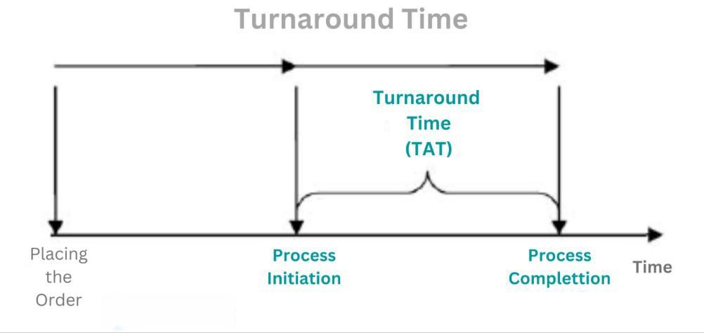

## Table of Contents

## What is Turnaround Tuesday?

Turnaround Tuesday is a phrase used in the stock market to describe a day when the market reverses its recent trend. If the market has been going down for a few days, Turnaround Tuesday might be the day it starts going up again. People watch this day closely because it can show if the market is changing direction.

This term became popular because many traders noticed that Tuesdays often showed big changes in the market. It's not a rule that the market will always turn around on a Tuesday, but it happens often enough that people pay attention to it. Watching Turnaround Tuesday can help traders decide when to buy or sell stocks.

## How did Turnaround Tuesday get its name?

Turnaround Tuesday got its name because traders noticed that the stock market often changed direction on Tuesdays. If the market had been going down, it might start going up again on a Tuesday. This pattern happened often enough that people started calling it Turnaround Tuesday.

The name became popular because it helped traders predict when the market might change. By watching what happened on Tuesdays, traders could make better decisions about buying or selling stocks. Even though it's not a rule that the market will always turn around on a Tuesday, the name stuck because it happens often enough to be useful.

## What are the typical market conditions leading up to Turnaround Tuesday?

The typical market conditions leading up to Turnaround Tuesday often involve a period of decline or uncertainty in the stock market. If the market has been going down for several days or even weeks, people start to look for signs that it might change direction. They pay close attention to economic news, company earnings reports, and other factors that could influence the market. When these conditions are in place, traders and investors become hopeful that a turnaround might happen soon.

On the days just before Turnaround Tuesday, the market might show signs of stabilizing or even slight improvement. This could be seen in small increases in stock prices or positive news that boosts investor confidence. These subtle changes can set the stage for a bigger shift on Tuesday. While it's not guaranteed that the market will turn around every Tuesday, these conditions make it more likely that traders will see a change in the market's direction.

## Can Turnaround Tuesday occur in any market, or is it specific to certain types?

Turnaround Tuesday can happen in any market where people trade things like stocks, bonds, or even cryptocurrencies. It's not just for one specific market. The idea is the same everywhere: if the market has been going down, people watch to see if it turns around on Tuesday.

This pattern can be seen in big stock markets like the New York Stock Exchange, but also in smaller markets or different types of markets. It all depends on people watching the market and seeing if Tuesday brings a change in the trend. So, whether it's stocks, bonds, or other financial products, Turnaround Tuesday can show up if the conditions are right.

## What are some historical examples of Turnaround Tuesday?

One famous example of Turnaround Tuesday happened on October 20, 1987. The stock market had been falling fast for a few days. People were worried and selling their stocks. But on that Tuesday, the market turned around and started to go up again. It was a big relief for many traders and investors. This day became known as a classic Turnaround Tuesday because it showed how the market could change direction quickly.

Another example was on August 24, 2015. The market had been dropping for days, and people were nervous. But on that Tuesday, the market started to recover. Prices began to go up, and it gave people hope that the worst was over. This Turnaround Tuesday helped calm the market and showed that even after big drops, the market could bounce back.

## How can investors identify a potential Turnaround Tuesday?

Investors can spot a potential Turnaround Tuesday by watching the market closely, especially if it has been going down for a few days. They should look for signs that the market might be stabilizing or starting to go up again. This could be small increases in stock prices or positive news that makes people feel more confident about investing. By paying attention to these little changes, investors can get a sense that a turnaround might be coming on Tuesday.

Another way to identify a potential Turnaround Tuesday is by keeping an eye on economic reports and news that come out around that time. If there's good news about the economy or if companies report better earnings than expected, it can boost the market. Investors who see these positive signs might start buying stocks again, which can help turn the market around. While it's not guaranteed that the market will always turn around on a Tuesday, these clues can help investors make smarter decisions.

## What are the key indicators to watch for on a Turnaround Tuesday?

To spot a Turnaround Tuesday, investors should watch for small signs that the market might be getting better. If the market has been going down for a few days, look for little increases in stock prices. These small gains can show that the market might be turning around. Also, pay attention to how people are feeling about the market. If more people start buying stocks again, it can help push the market up.

Another important thing to watch is the news and reports that come out around that time. If there's good news about the economy or if companies say they're doing better than expected, it can make people feel more confident. This positive news can help the market turn around. While it's not always certain that the market will change on a Tuesday, these signs can help investors decide if it's a good time to buy or sell stocks.

## How should traders adjust their strategies on Turnaround Tuesday?

On Turnaround Tuesday, traders should be ready to change their plans based on what they see happening in the market. If the market has been going down and starts to go up on Tuesday, traders might want to start buying stocks again. They should look for small signs that the market is getting better, like little increases in stock prices or more people buying stocks. It's important to watch the news and reports that come out around this time because good news can help the market turn around.

Traders should also be careful and not jump into buying too quickly. Even if the market looks like it's turning around, it's smart to wait and see if the trend keeps going up. They can start with small buys to test the market and then buy more if it keeps going up. By being patient and watching closely, traders can make better decisions on Turnaround Tuesday and maybe make some good trades.

## What are the risks associated with trading on Turnaround Tuesday?

Trading on Turnaround Tuesday can be risky because the market might not always turn around like people hope. If traders think the market will go up but it keeps going down, they can lose money. It's hard to predict exactly what will happen, so traders need to be careful and not bet too much on one day.

Another risk is that even if the market does start to go up on Tuesday, it might not keep going up. The market can change direction quickly, and what looks like a turnaround might just be a short break in a longer downward trend. Traders need to watch the market closely and be ready to change their plans if things don't go the way they expect.

## How does Turnaround Tuesday impact long-term investment strategies?

Turnaround Tuesday might make people think about changing their long-term investment plans, but it's not usually a big reason to do so. Long-term investors look at the big picture and don't worry too much about what happens on just one day. They want to grow their money over many years, so they stick to their plans even if the market goes up or down on a Tuesday. They know that trying to guess the market every week can lead to bad choices and might hurt their long-term goals.

Still, Turnaround Tuesday can be a good reminder for long-term investors to check their investments. If the market has been going down and starts to go up on a Tuesday, it might be a sign that things are getting better. Long-term investors can use this information to make sure their investments are still doing what they want them to do. But they shouldn't make big changes just because of one day. Instead, they should keep their eyes on their long-term goals and adjust their plans slowly if needed.

## Are there any predictive models or algorithms specifically designed for Turnaround Tuesday?

There aren't any special models or algorithms just for Turnaround Tuesday. But, people who study the stock market use lots of different tools to try and guess what will happen. They look at things like how the market has been doing, what the news says, and even what people are feeling about the market. These tools help them see if a turnaround might happen, but they don't work perfectly because the market can be hard to predict.

Some traders use computer programs to help them make decisions. These programs look at lots of information really fast and try to find patterns. They can help traders see if the market might turn around on a Tuesday, but they're not made just for that day. They're used all the time to help traders make smart choices. Even with these tools, it's still hard to know for sure what will happen on Turnaround Tuesday.

## How does global economic news influence the occurrence of Turnaround Tuesday?

Global economic news can have a big effect on whether a Turnaround Tuesday happens. If there's good news from around the world, like a big country's economy doing better than expected or a trade deal being made, it can make people feel more confident about investing. This good news can help push the market up on a Tuesday, turning it into a Turnaround Tuesday. On the other hand, if the news is bad, like a big company going bankrupt or a country's economy slowing down, it can make people worried and keep the market going down.

Even though global economic news can influence the market, it's not the only thing that matters. The market is affected by lots of different things, like what's happening in the U.S. economy, how companies are doing, and what people think will happen next. So, while good or bad news from around the world can help cause a Turnaround Tuesday, it's just one piece of the puzzle. Traders and investors need to look at everything together to understand what might happen on a Tuesday.

## What is Turnaround Tuesday in Algorithmic Trading?

Algorithmic trading, a cornerstone of modern finance, facilitates the precise execution of trading strategies like Turnaround Tuesday through automation. By predefining entry and [exit](/wiki/exit-strategy) conditions, traders can capitalize on observed market patterns with speed and accuracy that far exceed human capabilities. This automation ensures trades are executed at optimal prices, minimizing slippage—a common concern in manual trading.

A key advantage of [algorithmic trading](/wiki/algorithmic-trading) is the enhancement of [backtesting](/wiki/backtesting) processes. Through sophisticated algorithms, traders can scrutinize historical data to establish the consistent profitability—or lack thereof—of the Turnaround Tuesday strategy. This involves simulating trades on past data to evaluate how well the strategy would have performed. For instance, one can write a Python script utilizing libraries such as pandas and numpy to backtest the strategy on historical stock prices. Here's a basic framework to initiate a backtest:

```python
import pandas as pd
import numpy as np

# Load historical data
data = pd.read_csv('stock_data.csv', parse_dates=['Date'], index_col='Date')

# Calculate returns
data['Return'] = data['Close'].pct_change()

# Implement Turnaround Tuesday strategy
def turnaround_tuesday(data):
    signals = []
    for i in range(1, len(data)-1):
        # Check if Monday was down
        if data.index[i].weekday() == 0 and data['Return'].iloc[i] < 0:
            # Predict Tuesday reversal
            signals.append('Buy')
        else:
            signals.append('Hold')

    signals.append('Hold')  # No signal for the last day
    data['Signals'] = signals

    return data

strategy_results = turnaround_tuesday(data)
```

Successfully integrating algorithmic trading with Turnaround Tuesday also involves selecting appropriate indicators, such as Internal Bar Strength (IBS), which can offer insights into short-term market conditions. IBS is calculated as:

$$
\text{IBS} = \frac{\text{Close} - \text{Low}}{\text{High} - \text{Low}}
$$

This measurement helps in determining the relative position of the daily close within the day’s range, proving useful in identifying potential reversal points.

Algorithms are adept at optimizing trade execution timing, further enhancing strategy performance. By constantly analyzing historical data, algorithms can unearth deeper understanding of the conditions favoring Turnaround Tuesday's success. Quantitative analysis often reveals that market behaviors like [volatility](/wiki/volatility-trading-strategies) and [volume](/wiki/volume-trading-strategy) trends significantly influence the effectiveness of turnaround strategies.

In summary, the merger of algorithmic trading with the Turnaround Tuesday strategy provides traders with robust tools for executing trades with precision and informed decision-making. Leveraging these technological advances, traders can refine strategies to adapt to ever-changing financial markets, enhancing their potential for consistent gains.

## References & Further Reading

[1]: Bergstra, J., Bardenet, R., Bengio, Y., & Kégl, B. (2011). ["Algorithms for Hyper-Parameter Optimization."](https://dl.acm.org/doi/10.5555/2986459.2986743) Advances in Neural Information Processing Systems 24.

[2]: ["Advances in Financial Machine Learning"](https://www.amazon.com/Advances-Financial-Machine-Learning-Marcos/dp/1119482089) by Marcos Lopez de Prado

[3]: ["Evidence-Based Technical Analysis: Applying the Scientific Method and Statistical Inference to Trading Signals"](https://www.amazon.com/Evidence-Based-Technical-Analysis-Scientific-Statistical/dp/0470008741) by David Aronson

[4]: ["Machine Learning for Algorithmic Trading"](https://github.com/stefan-jansen/machine-learning-for-trading) by Stefan Jansen

[5]: ["Quantitative Trading: How to Build Your Own Algorithmic Trading Business"](https://books.google.com/books/about/Quantitative_Trading.html?id=j70yEAAAQBAJ) by Ernest P. Chan