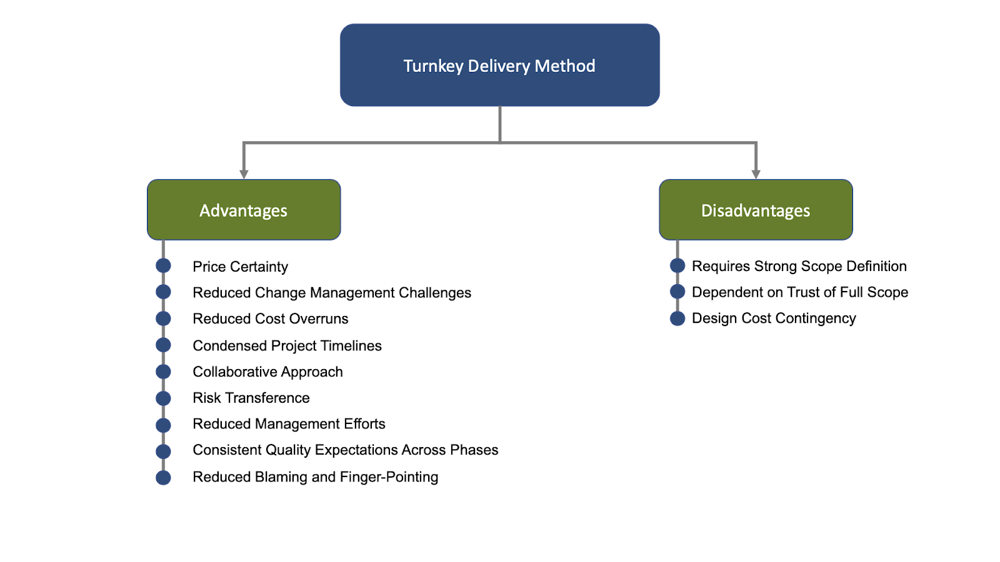

## Table of Contents

## What is the basic definition of turnkey cost?

Turnkey cost is the total amount of money needed to complete a project from start to finish. It includes all expenses such as planning, design, construction, and any other costs associated with making the project ready for use. When someone talks about a turnkey cost, they mean that once the project is paid for and finished, it is ready to be used immediately without any additional work needed.

For example, if a company wants to build a new factory, the turnkey cost would cover everything from buying the land, designing the building, constructing it, and installing all the necessary equipment. This way, the company knows the total cost upfront and can plan their budget accordingly. It's like buying a fully assembled piece of furniture; you just need to turn the key and start using it.

## How does turnkey cost differ from other types of project costs?

Turnkey cost is different from other types of project costs because it includes everything needed to finish a project and make it ready to use. Other types of project costs might only cover part of the work, like just the building or just the equipment. With turnkey cost, you pay one price and get a complete, ready-to-use project. This can be helpful because it's easier to plan your budget when you know the total cost upfront.

For example, if you are building a house, a turnkey cost would include the land, the building, the interior design, and all the appliances. In contrast, other costs might only cover the construction of the house, leaving you to pay extra for things like furniture and landscaping. Turnkey cost is like buying a fully assembled product; you don't need to do anything else after paying for it. This makes it different from other costs where you might need to keep spending money on different parts of the project.

## What are the key components included in a turnkey cost?

A turnkey cost includes everything needed to finish a project and make it ready to use. This means it covers the cost of planning, designing, and building the project. It also includes the cost of buying any land or equipment that is needed. For example, if you are building a new store, the turnkey cost would include the cost of the land, the building, the shelves, and the cash registers.

Another important part of the turnkey cost is making sure everything works properly before the project is finished. This includes the cost of testing and fixing any problems that come up. It also covers the cost of training people to use the new building or equipment. So, if you are opening a new restaurant, the turnkey cost would include the cost of training the chefs and servers, as well as making sure all the kitchen equipment is working correctly.

## Can you explain the functionality of turnkey costs in project management?

In project management, turnkey costs help by giving a clear total price for finishing a project. This means that when you start a project, you know exactly how much money you need to spend from the beginning to the end. This can make planning easier because you don't have to worry about unexpected costs showing up later. For example, if you are building a new school, the turnkey cost would include everything from buying the land, to building the school, to setting up the classrooms with desks and chairs.

Turnkey costs also make it easier to manage a project because they cover everything needed to get the project ready to use. This means that once the project is finished, you don't need to spend more money on things like furniture or equipment. It's like buying a fully assembled piece of furniture; you just need to turn the key and start using it. This can save time and make sure that the project is completed on schedule, which is important in project management.

## What are the advantages of using a turnkey cost approach?

Using a turnkey cost approach has many benefits. One big advantage is that it gives you a clear total price for the whole project from the start. This makes it easier to plan your budget because you know exactly how much money you need. You don't have to worry about unexpected costs showing up later, which can help you avoid surprises and keep your project on track.

Another advantage is that turnkey costs cover everything needed to finish the project and make it ready to use. This means that once the project is done, you don't have to spend more money on things like furniture or equipment. It's like buying a fully assembled piece of furniture; you just need to turn the key and start using it. This can save time and make sure that the project is completed on schedule, which is very important in project management.

## What are the potential disadvantages or risks associated with turnkey costs?

One potential disadvantage of using turnkey costs is that they can be more expensive upfront. Because the turnkey cost includes everything needed to finish the project, the total price can be higher than if you paid for each part separately. This might make it harder for some people or businesses to afford the project at the beginning, even though it could save money in the long run.

Another risk is that you have less control over the details of the project. When you agree to a turnkey cost, you are trusting the company to make all the decisions about how to finish the project. If you have specific ideas about how you want things done, you might not be able to make those changes once the turnkey cost is set. This can be frustrating if the final result is not exactly what you wanted.

## How is the turnkey cost calculated for a project?

The turnkey cost for a project is calculated by adding up all the costs needed to finish the project from start to finish. This includes the cost of planning, designing, and building the project, as well as buying any land or equipment that is needed. For example, if you are building a new store, you would add up the cost of the land, the building, the shelves, and the cash registers to get the turnkey cost. 

Another important part of calculating the turnkey cost is including the cost of making sure everything works properly before the project is finished. This includes the cost of testing and fixing any problems that come up, as well as the cost of training people to use the new building or equipment. So, if you are opening a new restaurant, the turnkey cost would include the cost of training the chefs and servers, as well as making sure all the kitchen equipment is working correctly. By adding up all these costs, you can find the total turnkey cost for the project.

## Can you provide examples of projects that typically use turnkey costs?

One example of a project that typically uses turnkey costs is building a new factory. When a company wants to build a factory, they might choose a turnkey cost to make sure everything is included in one price. This means the cost would cover buying the land, designing the factory, building it, and installing all the machines and equipment needed to start production. This way, the company knows exactly how much money they need to spend from the beginning to the end of the project.

Another example is setting up a new restaurant. A turnkey cost for a restaurant would include everything from finding the right location, to designing the interior, to installing the kitchen equipment and furniture. It would also cover the cost of training the staff and making sure everything is ready to open for business. By using a turnkey cost, the restaurant owner can focus on running the business instead of worrying about the details of the project.

## How does the turnkey cost model affect the project timeline and quality?

The turnkey cost model can help speed up the project timeline. Because everything is included in one price, the project can move forward quickly without waiting for different parts to be paid for separately. This means that the planning, designing, and building can happen one after the other without any delays. For example, if you are building a new store, the turnkey cost would cover everything from the land to the shelves, so you can finish the project faster and start using the store sooner.

The turnkey cost model can also help with the quality of the project. Since the company doing the work is responsible for everything, they have to make sure that all parts of the project are done well. This includes making sure the building is strong, the equipment works properly, and everything is ready to use. For instance, if you are opening a new restaurant, the turnkey cost would include training the staff and testing the kitchen equipment, which helps make sure the restaurant is of high quality when it opens.

## What are the best practices for managing turnkey cost projects?

Managing turnkey cost projects well starts with choosing a good company to work with. You should pick a company that knows how to do all parts of the project, from planning to finishing. It's important to talk clearly with them about what you want and need. Make sure you understand the turnkey cost and what it includes. This way, you can avoid surprises and make sure the project stays on track.

Once the project starts, it's helpful to keep a close eye on how things are going. Check in regularly with the company to see if everything is going as planned. If there are any problems, talk about them right away so they can be fixed quickly. Keeping good records of all the costs and what's being done can also help you make sure the project stays within the turnkey cost. This way, you can make sure the project is finished on time and is ready to use when it's done.

## How do turnkey costs impact the financial planning and budgeting of a project?

Turnkey costs help with financial planning and budgeting by giving a clear total price for the whole project. This means you know exactly how much money you need from the start to the finish. It's easier to plan your budget because there won't be any surprise costs later. For example, if you're building a new office, the turnkey cost would include everything from buying the land to setting up the desks and computers. Knowing the full cost upfront helps you make sure you have enough money to finish the project without running out of funds.

However, turnkey costs can also make budgeting a bit harder at the beginning. Because the turnkey cost covers everything, the total price might be higher than if you paid for each part separately. This means you might need more money at the start of the project, which can be tough if you're working with a tight budget. But, if you can afford the turnkey cost, it can save you money in the long run because you won't have to keep paying for different parts of the project as it goes along.

## What advanced strategies can be employed to optimize turnkey costs in large-scale projects?

To optimize turnkey costs in large-scale projects, it's important to start with a detailed plan. This means working closely with experts to figure out exactly what the project needs. By understanding all the parts of the project, you can find ways to save money. For example, you might choose materials that are less expensive but still good quality, or you might find ways to do some parts of the project more efficiently. It's also helpful to use technology like project management software to keep track of costs and make sure everything stays on budget.

Another strategy is to negotiate with suppliers and contractors. Since turnkey costs include everything, you can sometimes get better deals by buying things in bulk or by working with companies that can do more than one part of the project. It's also smart to keep an eye on the project as it goes along. If you see that costs are going up, you can make changes to keep the project within the turnkey cost. By being careful and planning well, you can make sure the project is finished on time and within the budget.

## What is the cost of a turnkey solution?

Turnkey cost represents a holistic approach to project costing where the entirety of projected expenses is predetermined prior to project initiation. This strategic method ensures that all facets of project expenditure are identified, quantified, and accounted for in advance, thus offering a clear financial picture upfront. The turnkey cost framework primarily encompasses two types of expenses: direct and indirect costs.

**Components of Turnkey Cost**

**Direct Costs**: These are expenses that can be directly traced to the project at hand. They typically include costs related to materials, labor, and equipment necessary to complete the project. For example, in a manufacturing setup, direct costs would involve raw materials, wages for labor directly involved in production, and machinery costs.

**Indirect Costs**: Unlike direct costs, indirect costs are not easily assignable to a single project. These may include overhead expenses such as administrative salaries, utility costs, and facility maintenance. Indirect costs are essential to the overall project but serve multiple functions or benefit the organization broadly.

To provide a formulaic approach, the total turnkey cost $C_t$ can be expressed as:

$$
C_t = C_d + C_i
$$

Where $C_d$ represents the direct costs and $C_i$ represents the indirect costs.

**Applications Across Industries**

Turnkey cost approaches are prominently utilized across different industries, each adapting the method to its specific needs and structures:

- **Manufacturing**: Here, turnkey costs facilitate streamlined operations by providing a complete cost estimate from production to delivery. This approach helps in minimizing unforeseen expenditures and aligns manufacturing processes with financial planning.

- **Real Estate**: In real estate development, turnkey projects often refer to properties ready for immediate occupation or sale upon project completion. The turnkey cost includes land acquisition, construction, legal fees, and often permits, ensuring the investor or buyer is aware of total financial commitments before project onset.

- **Franchising**: Franchise setups often employ turnkey models where the franchisor provides an estimate covering setup, inventory acquisition, initial marketing, and training. This model helps potential franchisees understand the financial requirements comprehensively before entering into contracts.

**Benefits and Potential Risks**

Adopting a turnkey cost approach presents several benefits:

- **Predictability**: By determining costs early, organizations can avoid budget overruns and ensure projects are financially feasible.
- **Efficiency**: It allows businesses to streamline operations by focusing resources on delivering fully functional projects without revisiting cost assessments frequently.
- **Comprehensive Planning**: Offers a complete view of all financial commitments involved, providing clarity and aiding robust project planning.

However, there are potential risks associated with the turnkey approach, including:

- **Inflexibility**: The predetermined nature of costs can lead to challenges if market conditions change or unexpected variables arise during project execution.
- **Hidden Costs**: There is a risk of overlooking potential expenses that may not have been included in the initial assessment, which can compromise the project's financial foundation if not meticulously planned.
- **Dependency on Accurate Estimation**: The success of a turnkey approach heavily relies on the accuracy of initial cost estimations. Any discrepancies can lead to significant financial implications.

Understanding the intricacies of turnkey cost allows businesses to make calculated decisions, ensuring projects are not only initiated with a clear financial path but are also completed within the set budgetary constraints.

## References & Further Reading

[1]: "Project Management: A Systems Approach to Planning, Scheduling, and Controlling" by Harold Kerzner

[2]: ["Algorithmic Trading and DMA: An introduction to direct access trading strategies"](https://www.amazon.com/Algorithmic-Trading-DMA-introduction-strategies/dp/0956399207) by Barry Johnson

[3]: Purnanandam, A. (2006). "Interest Rate Derivatives at Commercial Banks: An Empirical Investigation." Journal of Monetary Economics, 53(4), 1013-1040.

[4]: ["Cost Estimation: Methods and Tools"](https://onlinelibrary.wiley.com/doi/book/10.1002/9781118802342) by Gregory P. Tsinker

[5]: "Risk Management and Financial Institutions" by John C. Hull

[6]: Alexandrova-Kabadjova, B., Martinez-Jaramillo, S., Garcia-Almanza, A. L., & Tsang, E. (Eds.). (2012). "Simulation in Computational Finance and Economics: Tools and Emerging Applications."