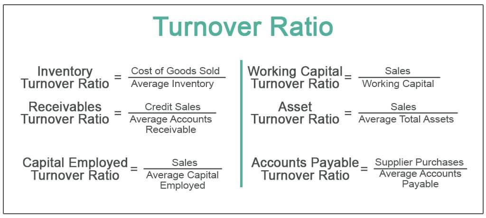

## Table of Contents

## What is turnover?

Turnover is a term used to describe the total amount of money a business makes from selling its products or services over a certain period, usually a year. It's like counting all the cash that comes into the business from sales before any costs or expenses are taken out. For example, if a shop sells 100 items at $10 each, its turnover would be $1,000.

Turnover is important because it shows how well a business is doing at selling its products or services. It helps business owners understand if they are making enough sales to keep the business running. If the turnover is high, it means the business is doing well in terms of sales. But, if the turnover is low, it might mean the business needs to find ways to sell more or improve its products.

## Why is understanding turnover costs important for businesses?

Understanding turnover costs is really important for businesses because it helps them know how much money they are spending when employees leave and new ones are hired. When an employee leaves, the business has to spend money on things like finding a new person, training them, and maybe even paying for the time the job is empty. If a lot of employees leave, these costs can add up and take away from the money the business could use for other important things.

Knowing these costs also helps businesses figure out if they are doing a good job at keeping their employees happy and wanting to stay. If turnover costs are high, it might mean that the business needs to look at why people are leaving and try to fix those problems. This could mean making the workplace better, paying people more fairly, or giving them better chances to grow in their jobs. By keeping turnover costs low, a business can save money and keep a strong team that helps the business do well.

## What are the direct costs associated with employee turnover?

Direct costs of employee turnover are the expenses a business has to pay when an employee leaves and a new one is hired. These costs include money spent on advertising the job opening to find new candidates. The business also has to spend time and money interviewing people to see who is the best fit for the job. Once a new employee is chosen, the company might need to do background checks and other tests, which also cost money.

After hiring, the new employee needs to be trained, which takes time and resources. The business might have to pay for training materials, and the time spent training means the new employee isn't yet doing the job they were hired for. If the job stays empty for a while, the business might need to pay other employees extra to cover the work, or even hire temporary workers, which adds to the costs.

All these direct costs add up and can be a big expense for the business. It's important for businesses to keep track of these costs so they can see how much money they are losing when employees leave. By understanding these costs, businesses can try to reduce turnover and save money.

## How do indirect costs impact a company due to employee turnover?

Indirect costs of employee turnover are the hidden expenses that a company faces when employees leave. These costs are not as easy to see as direct costs like hiring and training, but they can still hurt the company a lot. When an employee leaves, it can make the other workers feel stressed or worried. They might have to do extra work to cover the empty job, which can make them tired and less happy at work. If people are unhappy, they might not work as well, and this can slow down the whole company.

Also, when someone new starts, it takes time for them to learn how to do the job well. During this time, the company might not be as good at making its products or giving good service to customers. This can make customers unhappy and maybe even go to another company. Losing customers means less money coming in, which is another indirect cost. So, even though indirect costs are harder to see, they can really affect how well a company does and how much money it makes.

## What is the average cost of turnover for different industries?

The average cost of employee turnover can be different for each industry. For example, in the retail industry, the cost to replace an employee can be around $3,000 to $5,000. This is because retail jobs often have a lot of people leaving, and it costs money to find and train new workers. In the hospitality industry, like hotels and restaurants, the cost can be even higher, around $5,000 to $7,000 per employee. This is because these jobs can be hard and people leave a lot, so the cost to replace them goes up.

In industries like healthcare, the cost of turnover can be much higher, often between $20,000 to $50,000 per employee. This is because healthcare workers need a lot of training and it takes a long time to find the right person for the job. For tech companies, the cost can be even more, sometimes up to $100,000 or more per employee. This is because tech jobs need very specific skills, and it can be hard and expensive to find and train someone new. So, the cost of turnover can be very different depending on the industry, but it is always important for businesses to try to keep their employees happy and reduce these costs.

## How can a company calculate its turnover cost?

To calculate the cost of turnover, a company needs to add up all the money it spends when an employee leaves and a new one is hired. This includes the cost of advertising the job to find new people, the time and money spent on interviews, and any background checks or tests done on the new hire. The company also needs to think about the cost of training the new employee. This means paying for training materials and the time the new worker spends learning instead of doing the job. If the job stays empty for a while, the company might have to pay other workers extra or hire temporary help, which adds to the costs.

On top of these direct costs, the company should also try to figure out the indirect costs of turnover. These are harder to see but still important. For example, when an employee leaves, other workers might have to do extra work, which can make them tired and less happy. This can slow down the whole company and affect how well it does its job. Also, while the new employee is learning, the company might not be as good at making its products or serving its customers. This can make customers unhappy and maybe even go to another company, which means less money coming in. By adding up all these direct and indirect costs, the company can get a good idea of how much turnover is costing it.

## What are the hidden costs of turnover that companies often overlook?

When an employee leaves a company, there are some hidden costs that businesses often don't think about. These costs can be hard to see but they can really hurt the company. For example, when someone leaves, it can make the other workers feel stressed or worried. They might have to do extra work to cover the empty job, which can make them tired and less happy at work. If people are unhappy, they might not work as well, and this can slow down the whole company.

Another hidden cost is the time it takes for a new person to learn how to do the job well. While they are learning, the company might not be as good at making its products or giving good service to customers. This can make customers unhappy and maybe even go to another company. Losing customers means less money coming in, which is another hidden cost. So, even though these costs are harder to see, they can really affect how well a company does and how much money it makes.

## How does turnover affect team morale and productivity?

When an employee leaves a company, it can make the rest of the team feel stressed and worried. They might have to do more work to cover the job that's now empty, which can make them tired and unhappy. If people are unhappy, they might not work as well as they could. This can slow down the whole team and make it harder for everyone to get their work done on time. When team members see a lot of people leaving, it can also make them wonder if they should stay or look for a new job, which adds to the stress and can hurt team morale.

On top of that, when a new person joins the team, it takes time for them to learn how to do the job well. While they are learning, they might not be able to help the team as much as they should. This can make the team feel like they are carrying extra weight, which can lower their spirits. If the team is feeling down, they might not be as excited about their work, and this can lead to less productivity. So, high turnover can really affect how well a team works together and how much they get done.

## What strategies can be implemented to reduce turnover costs?

To reduce turnover costs, companies can focus on keeping their employees happy and wanting to stay. One way to do this is by offering good pay and benefits. When employees feel they are being paid fairly and have good health insurance or other perks, they are more likely to stay. Another way is by making sure employees feel valued and have chances to grow in their jobs. This can mean giving them training to learn new skills, or promoting them to better positions when they do well. When employees see a future at the company, they are less likely to leave.

Another strategy is to improve the work environment. This can mean making the workplace a friendly place where people want to come to work. Good communication from bosses and a positive company culture can help. Also, listening to what employees say and trying to fix problems they have can make a big difference. If people feel heard and their concerns are taken seriously, they are more likely to stay. By focusing on these things, companies can lower turnover and save money on the costs of hiring and training new people.

## How do turnover costs vary between high and low skill positions?

Turnover costs can be very different for high-skill and low-skill jobs. For low-skill jobs, like working in a fast-food restaurant or a store, the cost to replace an employee is usually less. It might cost a few thousand dollars to find and train a new person. These jobs often have a lot of people coming and going, so companies expect to spend some money on turnover. But, because the training is not as long and the skills needed are not as hard to learn, the costs stay lower.

For high-skill jobs, like doctors, engineers, or tech workers, the cost to replace an employee can be a lot higher. It might cost tens of thousands of dollars or even more. These jobs need special skills that take a long time to learn, so finding the right person can be hard and expensive. The company also has to spend a lot of time and money on training the new person to make sure they can do the job well. Because of all this, turnover costs for high-skill jobs are much higher than for low-skill jobs.

## What are the long-term financial implications of high turnover rates?

High turnover rates can hurt a company's money situation over a long time. When a lot of employees keep leaving, the company has to spend more money on hiring and training new people. This can add up to a lot of money, especially for jobs that need special skills. If the company is always spending money on turnover, it might not have enough left to invest in other important things, like new products or growing the business. This can make it hard for the company to stay strong and grow in the future.

Also, high turnover can make it hard for the company to keep its customers happy. When employees leave a lot, the new people might not know how to do the job as well, and this can make the company's work slower or not as good. If customers get unhappy and start going to other companies, the business can lose money. Over time, this can lead to less money coming in and make it harder for the company to do well. So, keeping turnover low can help the company save money and keep its customers happy, which is important for its long-term success.

## How can data analytics be used to predict and manage turnover costs?

Data analytics can help companies predict and manage turnover costs by looking at information about employees and their work. Companies can use data to see patterns, like which employees are more likely to leave and why. For example, they might find that people leave more often if they don't get raises or if they feel unhappy at work. By using data, companies can see these patterns early and try to fix the problems before they lose more employees. This can help them save money because they won't have to spend as much on hiring and training new people.

Also, data analytics can help companies make better plans to keep their employees happy and wanting to stay. They can use data to see what makes employees more likely to stay, like good pay, chances to grow in their jobs, or a friendly work environment. By focusing on these things, companies can make changes that help keep turnover low. Over time, this can save a lot of money and help the company do better. So, using data to understand and manage turnover can be a smart way to keep costs down and keep a strong team.

## What are the costs associated with employee turnover?

Turnover costs are a critical aspect of [algorithmic trading](/wiki/algorithmic-trading), closely associated with the frequency and [volume](/wiki/volume-trading-strategy) of trades. These costs are distinct from direct trading costs, such as commissions and fees, as they arise from the [liquidity](/wiki/liquidity-risk-premium) and market dynamics encountered when executing trades. Turnover costs are primarily comprised of two components: market impact and transaction costs.

Market impact refers to the adverse price movement caused by executing a trade, especially large orders, which affect the price level of the security being traded. Transaction costs, on the other hand, include brokerage fees, taxes, and other expenses directly associated with a trade. Together, these factors culminate in turnover costs, representing the total cost incurred through active trading.

To calculate turnover costs, the following general formula may be applied:

$$
\text{Turnover Cost} = \text{Market Impact} + \text{Transaction Costs}
$$

Market impact can be influenced by several factors, such as order size, market liquidity, and the [volatility](/wiki/volatility-trading-strategies) of the security traded. Large orders in less liquid markets tend to have higher market impacts due to the significant pressure they place on existing supply and demand.

Turnover costs are also impacted by the frequency of trades, commonly referred to as turnover rates. High turnover rates, typical in strategies such as high-frequency trading ([HFT](/wiki/high-frequency-trading-strategies)), can amplify turnover costs due to the constant execution and associated costs. Conversely, strategies with lower turnover rates, such as long-term buy-and-hold strategies, generally incur lower turnover costs, allowing for cost savings over time.

Assessing the impact of turnover rates on overall trading performance is crucial. High turnover rates can diminish profits and even lead to losses if turnover costs exceed anticipated returns. Therefore, understanding and effectively managing turnover costs through strategic planning and cost-efficient trading techniques is essential for achieving profitability in algorithmic trading.

In summary, turnover costs encompass the market impact and transactional fees associated with trading activities, which must be calculated and managed effectively to optimize trading performance. By evaluating factors such as order size, liquidity, and trading frequency, traders can mitigate these costs, enhancing their overall profitability.

## What is the impact of turnover costs on different trading strategies?

Algorithmic trading strategies vary significantly in their sensitivity to turnover costs, impacting overall profitability. High-frequency trading (HFT) and mid-frequency trading exemplify different approaches and sensitivities to these costs.

### High-Frequency Trading (HFT)

High-frequency trading relies on executing a large number of trades in fractions of seconds, seeking to capitalize on small price discrepancies. This strategy inherently results in high turnover, making turnover costs a critical concern. Each trade incurs costs, including bid-ask spreads and market impact, directly affecting profitability. HFT strategies are particularly sensitive to these costs due to their low-margin nature. A small increase in turnover costs can switch HFT operations from profitable to loss-making.

HFT firms employ advanced algorithms and low-latency trading systems to minimize the time and cost associated with trading. Strategies might include optimizing order execution to reduce market impact or employing rebate optimization techniques on certain exchanges, where they receive rebates for providing liquidity.

### Mid-Frequency Trading

Mid-frequency trading involves holding positions for longer than HFT, typically minutes to days. It incurs fewer trades and, consequently, lower turnover costs. However, this strategy must account for other costs, such as overnight risk or opportunity costs. While turnover costs are less critical than in HFT, they still impact net returns, particularly when leveraging large positions.

### Sensitivity Comparison

The sensitivity of a trading strategy to turnover costs is often represented by the trade-off between frequency and cost efficiency. High-frequency strategies are more turnover-sensitive because they compound across numerous trades, whereas mid-frequency strategies balance between lower sensitivity to turnover costs and higher exposure to market risk.

$$
\text{Sensitivity} = \frac{\text{Turnover Costs}}{\text{Total Expected Return}}
$$

For HFT, this ratio is typically higher, indicating greater sensitivity. Mid-frequency trading demonstrates a lower ratio, reflecting its reduced dependency on minimizing turnover costs.

### Case Examples

1. **HFT Firm:**
   An HFT firm specializing in index [arbitrage](/wiki/arbitrage) closely monitors its turnover cost to ensure it remains below a critical threshold. By utilizing co-located servers and optimizing [order book](/wiki/order-book-trading-strategies) strategies, they reduce market impact and slippage, enhancing profitability.

2. **Mid-Frequency Execution:**
   A mid-frequency strategy employed by a quantitative [hedge fund](/wiki/hedge-fund-trading-strategies) may involve executing a trend-following algorithm. The fund uses analytical tools to time trades effectively, thus reducing unnecessary turnover and associated costs. By placing larger trades less frequently, it minimizes the proportion of returns eaten by turnover.

In conclusion, while turnover costs impact all trading strategies, high-frequency trading strategies are most affected due to their dependence on high turnover rates. Strategies focused on reducing these costs and effectively managing trade execution can significantly enhance profitability.

## References & Further Reading

[1]: Kissell, R. (2013). ["The Science of Algorithmic Trading and Portfolio Management"](https://www.sciencedirect.com/book/9780124016897/the-science-of-algorithmic-trading-and-portfolio-management). Elsevier.

[2]: Hasbrouck, J. (2009). ["Trading Costs and Returns for US Equities: Estimating Effective Costs from Daily Data"](https://www.jstor.org/stable/20488006). The Review of Financial Studies, 22(3), 1261-1295.

[3]: Almgren, R. & Chriss, N. (2000). ["Optimal Execution of Portfolio Transactions"](https://smallake.kr/wp-content/uploads/2016/03/optliq.pdf). Journal of Risk, 3(2), 5-39.

[4]: Bank, M., & Baum, D. (2004). ["Trading Asynchronously"](https://psycnet.apa.org/record/2004-17371-002). Empirical Economics, 29(3), 591-655.

[5]: Wagner, W. H., & Edwards, M. R. (1993). ["Best Execution"](https://www.hillsdaleinv.com/uploads/Best_Execution,_Wayne_H._Wagner,_Mark_Edwards,_Financial_Analysts_Journal,_JanuaryFebruary_1993,_Pages_65-71.pdf). Financial Analysts Journal, 49(2), 65-69.