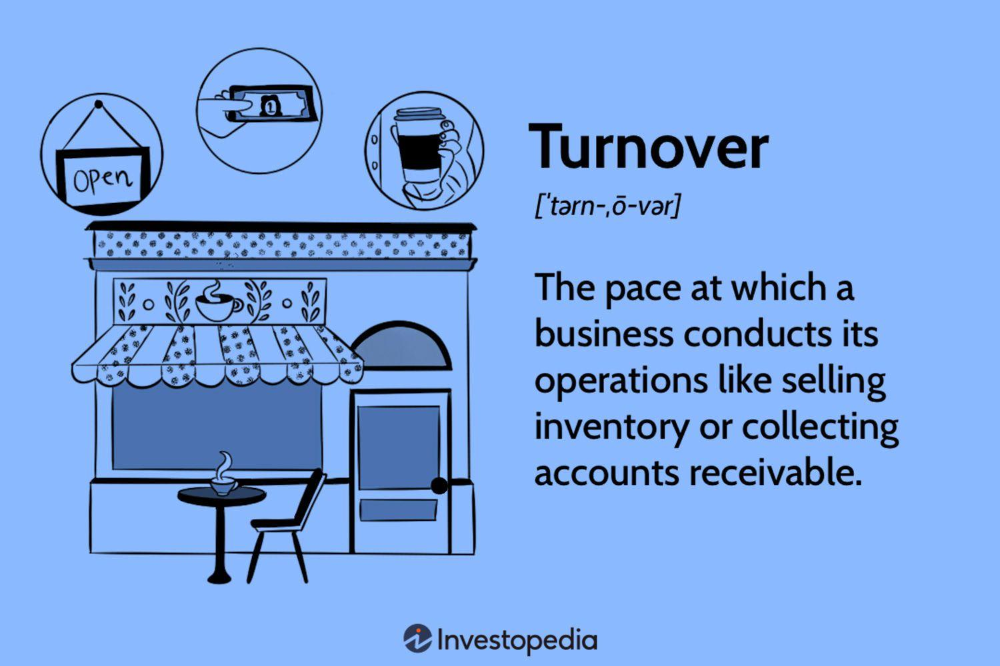

In today's fast-paced financial world, understanding key performance indicators is crucial for businesses looking to maintain a competitive edge. Business metrics, financial analysis, turnover ratios, and algorithmic trading are all integral components in the toolkit of modern financial analysts. These elements are essential for assessing a company's financial health and operational efficiency, providing a structured approach to navigating complex market environments.

Business metrics offer quantifiable measures to track and assess the status of various business processes, playing a vital role in identifying strengths and weaknesses. Financial analysis allows for evaluating businesses, projects, or budgets, ensuring informed economic decisions are made based on thorough examinations of financial statements and market trends.



Turnover ratios, as financial metrics, provide insights into how efficiently a company utilizes its assets, directly impacting the assessment of operational performance. High turnover ratios can signal effective management, while lower ratios may indicate the need for strategic adjustments.

Algorithmic trading represents the fusion of computer science and financial markets, employing automated trading strategies to optimize trade execution. Its integration into financial markets highlights the importance of speed, cost reduction, and precision in modern trading practices.

Exploring these concepts highlights their interconnectedness and collective impact on strategic decision-making. For seasoned financial analysts and business owners alike, mastering these components can lead to more informed and effective economic strategies, ultimately fostering sustainable business growth and competitiveness.

## Table of Contents

## Understanding Business Metrics

Business metrics are essential quantifiable measures that allow companies to track and assess the status of specific business processes. They are vital in understanding the health and performance of a company and provide a data-driven foundation for strategic decision-making. Key metrics in financial analysis typically include revenue growth, profit margins, and customer acquisition costs, among others. Each contributes unique insights into the operational efficiency and strategic direction of a business.

Revenue growth is a fundamental metric that indicates the increase or decrease in a company's sales over a period, often expressed as a percentage. It can be calculated using the formula:

$$
\text{Revenue Growth (\%)} = \left(\frac{\text{Revenue in current period} - \text{Revenue in previous period}}{\text{Revenue in previous period}}\right) \times 100
$$

This metric provides insights into how well a company is expanding its market presence and customer base. Sustained revenue growth is often a positive indicator of a company's competitive strength and product acceptance.

Profit margins, including gross, operating, and net profit margins, gauge a company's operational efficiency and profitability. These can be defined as follows:

- **Gross Profit Margin:** $\text{Gross Profit Margin (\%)} = \left(\frac{\text{Revenue} - \text{Cost of Goods Sold}}{\text{Revenue}}\right) \times 100$

- **Operating Profit Margin:** $\text{Operating Profit Margin (\%)} = \left(\frac{\text{Operating Income}}{\text{Revenue}}\right) \times 100$

- **Net Profit Margin:** $\text{Net Profit Margin (\%)} = \left(\frac{\text{Net Income}}{\text{Revenue}}\right) \times 100$

These metrics indicate how much of each dollar earned is translated into profits at various stages of the business process, thus revealing the efficiency of a company at managing its costs and expenses.

Customer acquisition cost (CAC) is another vital business metric, representing the cost involved in acquiring a new customer. Companies calculate this by dividing the total costs associated with acquiring customers by the number of customers acquired in the period:

$$
\text{CAC} = \frac{\text{Total Acquisition Costs}}{\text{Number of New Customers}}
$$

A lower CAC is preferred as it suggests that the company is efficiently attracting new customers. However, when analyzed alongside customer lifetime value (CLV), it provides deeper insights into the ROI of marketing efforts.

Business metrics not only give insights into current performance but also help identify areas of potential improvement. They serve as benchmarks for setting strategic objectives and evaluating the success of initiatives over time. Correctly measuring and analyzing these metrics enables data-driven decisions that ensure alignment with a company's long-term objectives, fostering growth and competitive advantage.

## Fundamentals of Financial Analysis

Financial analysis is a structured approach to evaluating businesses, projects, or budgets to gauge their performance and determine their economic soundness. This process encompasses the examination of financial statements, cash flows, and capital structures, all aimed at facilitating better economic decisions.

Analyzing financial statements constitutes the foundation of financial analysis. Financial statements, namely the balance sheet, income statement, and cash flow statement, provide essential data about a company's financial status and operational outcomes. The balance sheet offers a snapshot of the company's assets, liabilities, and equity at a particular point in time, while the income statement outlines the company's revenues, expenses, and profit over a period. The cash flow statement details the inflows and outflows of cash, highlighting how a company manages its cash position.

Key aspects of financial analysis are centered on several ratios that offer insights into a company’s performance: 

1. **Profitability Ratios**: These ratios, such as the Net Profit Margin $(\frac{\text{Net Income}}{\text{Revenue}})$, assess a company's ability to generate earnings relative to its revenue, operating costs, or balance sheet assets. A higher profitability ratio often indicates better financial health.

2. **Liquidity Ratios**: These measures, like the Current Ratio $(\frac{\text{Current Assets}}{\text{Current Liabilities}})$, evaluate a company's capability to cover its short-term debts with its short-term assets. High liquidity implies the company can easily meet its short-term obligations, crucial for ongoing operational stability.

3. **Solvency Ratios**: These ratios, such as the Debt to Equity Ratio $(\frac{\text{Total Liabilities}}{\text{Shareholders' Equity}})$, consider a company's ability to meet its long-term obligations. Solvency ratios provide insights into the financial leverage and risk level of a company, important for assessing long-term viability.

Through rigorous financial analysis, companies can assess risks, value assets, and tailor optimal financial strategies suitable to changing market conditions. Several standard methodologies are employed in financial analysis:

- **Trend Analysis**: This involves examining financial data over multiple periods to identify patterns or trends that might indicate strengths or weaknesses.
- **Comparative Financial Analysis**: This method involves comparing a company’s financial metrics with industry benchmarks or competitors to evaluate relative performance.
- **Ratio Analysis**: As outlined, this involves using specific ratios to succinctly gauge different aspects of financial performance.

Conducting thorough financial analysis offers a basis for understanding complex financial data, thereby enabling organizations to make informed economic decisions. It supports strategic planning, investment decisions, and risk management, which are essential for maintaining competitiveness in the financial landscape.

## The Role of Turnover Ratios

Turnover ratios are essential indicators in financial management, providing insights into how effectively a company utilizes its assets to generate revenue. These metrics are particularly valuable for assessing the speed and efficiency with which a company converts its resources, such as inventory and receivables, into cash or sales. The primary turnover ratios include inventory turnover, receivables turnover, and asset turnover.

**Inventory Turnover Ratio**

The inventory turnover ratio measures how often a company's inventory is sold and replaced over a specific period. It is calculated as:

$$
\text{Inventory Turnover Ratio} = \frac{\text{Cost of Goods Sold (COGS)}}{\text{Average Inventory}}
$$

A high inventory turnover ratio typically means that a company effectively manages its stock, selling items quickly and replenishing inventory in a timely manner. Conversely, a low inventory turnover ratio might indicate overstocking or obsolescence, suggesting inefficiencies in managing inventory that could tie up capital unnecessarily.

**Receivables Turnover Ratio**

The receivables turnover ratio evaluates how efficiently a company collects on its accounts receivable. It is given by:

$$
\text{Receivables Turnover Ratio} = \frac{\text{Net Credit Sales}}{\text{Average Accounts Receivable}}
$$

A higher receivables turnover ratio suggests that a company promptly collects its outstanding credit, improving cash flow and reducing the risk of bad debts. A lower ratio may highlight issues in the credit policy or collection processes, hinting at potential [liquidity](/wiki/liquidity-risk-premium) problems.

**Asset Turnover Ratio**

The asset turnover ratio measures the efficiency of a company's use of its assets to generate sales and is calculated as:

$$
\text{Asset Turnover Ratio} = \frac{\text{Net Sales}}{\text{Average Total Assets}}
$$

This ratio demonstrates how well a company is using its assets to produce revenue. A higher asset turnover ratio indicates robust asset management and effective utilization of resources to generate additional income. A lower ratio could signal inefficient use of assets or an overinvestment in fixed assets.

By understanding and analyzing these turnover ratios, companies can streamline their operations and enhance profitability. High turnover ratios generally reflect operational efficiency and contribute to a firm’s overall financial health. Conversely, lower turnover ratios can indicate areas where management should focus to improve asset utilization. Monitoring these metrics regularly ensures that firms maintain strong operational strategies, adapting as necessary to optimize performance and maintain a competitive edge in the market.

## Algorithmic Trading in Financial Markets

Algorithmic trading employs automated, pre-programmed trading instructions to execute trades at high speeds and frequencies, a method that has revolutionized the financial markets. The intersection of computer science and finance allows for leveraging mathematical models in order to enhance trading efficiency and precision. These models are often based on complex algorithms designed to analyze vast amounts of market data, identify trends, and make trading decisions faster than human capability. The core objective of [algorithmic trading](/wiki/algorithmic-trading) is to reduce transaction costs, optimize execution speed, and minimize human error, thereby increasing profitability and mitigating risks.

### Background and Mechanics

Algorithmic trading, also known as algo trading or black-box trading, utilizes advanced algorithms to determine the timing, price, and quantity of buy/sell orders. It eliminates the emotional element of trading, ensuring that decisions are based on data-driven insights. These algorithms can be configured to consider various factors, including historical price data, market [volatility](/wiki/volatility-trading-strategies), and news events, to generate trading signals.

Python is often used in algorithmic trading for its simplicity and versatility in handling data manipulation and analysis. A basic example of a trading algorithm might involve the use of a moving average crossover strategy, where buy or sell signals are generated based on the crossing of short-term and long-term moving averages. A simple implementation in Python might involve libraries like NumPy and Pandas for data calculation and handling.

```python
import pandas as pd
import numpy as np

# Load historical market data
data = pd.read_csv('market_data.csv')  # Assume 'market_data.csv' contains date and price columns

# Calculate moving averages
data['Short_MA'] = data['Price'].rolling(window=40).mean()
data['Long_MA'] = data['Price'].rolling(window=100).mean()

# Determine buy/sell signals
data['Signal'] = 0
data['Signal'][40:] = np.where(data['Short_MA'][40:] > data['Long_MA'][40:], 1.0, 0.0) 
data['Position'] = data['Signal'].diff()

# Sample output
print(data[['Date', 'Price', 'Short_MA', 'Long_MA', 'Position']].tail())
```

### Impact on Financial Markets

The widespread adoption of algorithmic trading has significantly influenced asset prices and market dynamics. Algorithms can account for a substantial percentage of trading [volume](/wiki/volume-trading-strategy) in major stock exchanges, leading to increased market liquidity and reduced spreads. However, their rapid execution capability can also lead to market anomalies such as flash crashes, where algorithmic trades trigger cascading sell-offs.

### Business Implications

For businesses, especially those involved in financial markets, understanding algorithmic trading is crucial. Firms that successfully implement and manage algorithmic trading strategies often benefit from enhanced operational efficiencies and competitive advantage. By automating trading processes, companies can focus more on strategic decision-making and less on day-to-day market fluctuations.

In conclusion, as algorithmic trading continues to evolve, it is reshaping the landscape of financial trading. Those in the finance industry must remain abreast of advancements in this technology to leverage it for strategic and operational success. The integration of algorithmic trading with other business and financial concepts is key to understanding and navigating modern financial markets effectively.

## Interconnection of These Concepts

Business metrics, financial analysis, turnover ratios, and algorithmic trading interact in multifaceted ways to offer a cohesive picture of a business's financial and operational health. Each component contributes unique insights that, when combined, enable a nuanced approach to optimizing company performance and strategic growth.

Business metrics provide the fundamental quantitative data required to gauge a company's performance. Metrics such as revenue growth or customer acquisition costs are crucial for setting benchmarks and tracking progress. Financial analysis takes these metrics further by evaluating various financial statements, cash flow, and capital structures. This evaluation offers an understanding of profitability, liquidity, and solvency, empowering businesses to make informed asset valuation and risk management decisions.

Turnover ratios are specific financial metrics (including inventory turnover, receivables turnover, and asset turnover) that measure how efficiently a company converts assets into revenue. These ratios are integral to operational performance evaluations, helping identify potential inefficiencies or areas of strength.

Algorithmic trading, on the other hand, showcases the application of technology in financial markets. It uses predefined algorithms to execute trades at speeds and frequencies beyond human capability, optimizing transaction costs and execution precision.

When these elements are integrated, they form a synergistic framework that enhances a business's ability to adapt to dynamic market environments. For instance, understanding business metrics and turnover ratios aids in refining operational tactics, which can be further optimized through algorithmic trading strategies. Financial analysis supports these efforts by providing the analytical foundation required to make precise adjustments.

In Python, for example, one might automate the calculation of turnover ratios to provide real-time data for algorithmic trading strategies:

```python
def calculate_turnover_ratio(sales, inventory):
    return sales / inventory

# Sample data
sales = 100000
inventory = 20000

inventory_turnover_ratio = calculate_turnover_ratio(sales, inventory)
print(f"Inventory Turnover Ratio: {inventory_turnover_ratio}")
```

By acknowledging the interconnectedness of these concepts, businesses can create strategies that not only optimize performance but also provide a sustained competitive advantage. This synthesis fosters an efficient, data-driven culture adept at managing risks and capitalizing on growth opportunities, ensuring long-term success in a competitive landscape. Recognizing and leveraging these interconnections is not just beneficial but essential for businesses aspiring to achieve strategic objectives and maximize potential.

## Conclusion

In summary, leveraging business metrics, financial analysis, turnover ratios, and algorithmic trading is crucial for modern financial management. These tools provide comprehensive insights into market dynamics and operational efficiency, which are essential for making informed decisions. Employing a meticulous analysis of business metrics enables the identification of areas for improvement and strategic goal setting. Financial analysis further supports this by evaluating profitability, liquidity, and solvency, allowing for optimal financial decision-making.

The incorporation of turnover ratios aids in assessing asset utilization efficiency, helping businesses streamline operations and boost profitability. Meanwhile, algorithmic trading offers enhanced trading efficiency, reducing transaction costs and minimizing errors through automated systems. Together, these methodologies enable businesses to anticipate market changes and enhance fiscal performance.

Organizations that adeptly integrate these concepts position themselves competitively, adapting swiftly to dynamic market environments. This article underscores the significance of remaining updated and embracing these methodologies, as continued learning and adaptation are vital in evolving financial markets. By doing so, businesses can set themselves apart, achieving sustained growth and a competitive edge.

## References & Further Reading

[1]: Bergstra, J., Bardenet, R., Bengio, Y., & Kégl, B. (2011). ["Algorithms for Hyper-Parameter Optimization."](https://proceedings.neurips.cc/paper/2011/file/86e8f7ab32cfd12577bc2619bc635690-Paper.pdf) Advances in Neural Information Processing Systems 24.

[2]: ["Advances in Financial Machine Learning"](https://www.amazon.com/Advances-Financial-Machine-Learning-Marcos/dp/1119482089) by Marcos Lopez de Prado

[3]: ["Evidence-Based Technical Analysis: Applying the Scientific Method and Statistical Inference to Trading Signals"](https://www.amazon.com/Evidence-Based-Technical-Analysis-Scientific-Statistical/dp/0470008741) by David Aronson

[4]: ["Machine Learning for Algorithmic Trading"](https://github.com/stefan-jansen/machine-learning-for-trading) by Stefan Jansen

[5]: ["Quantitative Trading: How to Build Your Own Algorithmic Trading Business"](https://www.amazon.com/Quantitative-Trading-Build-Algorithmic-Business/dp/1119800064) by Ernest P. Chan