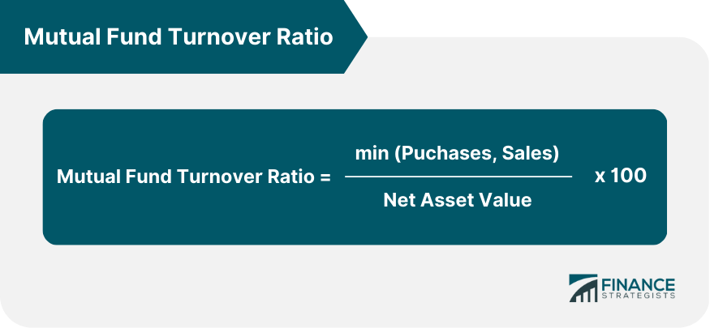

## Table of Contents

## What is the turnover ratio in mutual funds?

The turnover ratio in mutual funds is a measure that shows how often the fund's holdings are bought and sold within a year. It is calculated by taking the lesser of the total value of new securities purchased or the total value of securities sold during a year, and then dividing that by the average monthly net assets of the fund. A high turnover ratio means the fund manager is actively trading the portfolio, while a low turnover ratio indicates a more passive approach with less trading activity.

Understanding the turnover ratio can help investors gauge the fund's trading strategy and potential costs. Funds with high turnover ratios might incur higher transaction costs, like brokerage fees, which can reduce the overall return for investors. Additionally, frequent trading can lead to higher capital gains taxes for investors in taxable accounts. On the other hand, a lower turnover ratio might suggest a strategy focused on long-term holding, potentially leading to lower costs and tax implications.

## Why is the turnover ratio important for investors?

The turnover ratio is important for investors because it shows how often a mutual fund's manager buys and sells the investments inside the fund. If the turnover ratio is high, it means the manager is trading a lot. This can be good if the manager is making smart trades that make more money for the fund. But it can also mean higher costs for the fund, like paying for each trade, which can lower the money investors make.

A low turnover ratio means the fund manager is not trading as much. This can be good because it usually means lower costs for the fund. When there are fewer trades, the fund doesn't have to pay as much in fees, and this can help investors keep more of their money. Also, if investors have to pay taxes on the money they make from the fund, a low turnover ratio might mean they pay less in taxes because there are fewer times when the fund is selling investments and making profits that need to be taxed.

## How is the turnover ratio calculated?

The turnover ratio is figured out by looking at how much the fund buys or sells in a year. You take the smaller number between the total value of new securities bought and the total value of securities sold during that year. Then, you divide that number by the average monthly net assets of the fund. This gives you a percentage that shows how much of the fund's holdings were changed in that year.

For example, if a fund bought securities worth $100 million and sold securities worth $80 million in a year, and the average monthly net assets of the fund were $500 million, you would use the $80 million (the smaller number) for the calculation. So, the turnover ratio would be ($80 million / $500 million) * 100, which equals 16%. This means 16% of the fund's holdings were turned over during the year.

## What does a high turnover ratio indicate about a mutual fund?

A high turnover ratio in a mutual fund means that the fund manager is buying and selling the investments a lot. It shows that the manager is actively trading and changing what's in the fund. This can be good if the manager is making smart choices and [picking](/wiki/asset-class-picking) investments that do well. But it can also mean the fund is taking more risks because the manager is moving money around a lot.

When a fund has a high turnover ratio, it usually means higher costs for the fund. Every time the manager buys or sells something, the fund has to pay fees for those trades. These costs can add up and take away from the money the fund makes. Also, if you have to pay taxes on the money you make from the fund, a high turnover ratio might mean you pay more in taxes because the fund is selling investments and making profits more often.

## What does a low turnover ratio suggest about a mutual fund's strategy?

A low turnover ratio suggests that the mutual fund's manager is not trading the investments in the fund very often. This means the manager is holding onto the investments for a longer time. It shows that the fund is following a strategy that focuses on keeping the investments for the long term instead of trying to buy and sell a lot to make quick profits.

This kind of strategy with a low turnover ratio usually means lower costs for the fund. When the manager doesn't trade as much, the fund doesn't have to pay as many fees for buying and selling investments. This can help the fund save money and give more of the profits back to the investors. Also, if you have to pay taxes on the money you make from the fund, a low turnover ratio might mean you pay less in taxes because the fund is not selling investments and making profits as often.

## How does the turnover ratio affect a mutual fund's performance?

The turnover ratio can affect a mutual fund's performance in a few ways. If a fund has a high turnover ratio, it means the manager is buying and selling the investments a lot. This can be good if the manager is making smart choices and picking investments that do well. But it can also mean higher costs for the fund. Every time the manager buys or sells something, the fund has to pay fees for those trades. These costs can add up and take away from the money the fund makes. Also, if you have to pay taxes on the money you make from the fund, a high turnover ratio might mean you pay more in taxes because the fund is selling investments and making profits more often.

On the other hand, a low turnover ratio means the fund manager is not trading as much. This can be good because it usually means lower costs for the fund. When there are fewer trades, the fund doesn't have to pay as much in fees, and this can help investors keep more of their money. Also, if investors have to pay taxes on the money they make from the fund, a low turnover ratio might mean they pay less in taxes because there are fewer times when the fund is selling investments and making profits that need to be taxed. So, a low turnover ratio can help the fund's performance by keeping costs and taxes down.

## What are the tax implications of a high turnover ratio?

A high turnover ratio means the fund manager is buying and selling investments a lot. This can lead to more taxes for investors. When the fund sells investments for a profit, it has to pay capital gains taxes. If the fund is doing this a lot, it means more profits and more taxes. These taxes are passed on to the investors, which means they get less money from the fund. So, a high turnover ratio can mean you pay more in taxes each year.

On the other hand, if you're investing in a tax-advantaged account like an IRA or 401(k), the high turnover ratio won't affect your taxes right away. In these accounts, you don't have to pay taxes on the money you make until you take it out. But when you do take the money out, you might have to pay more taxes because of the high turnover ratio over the years. So, even in tax-advantaged accounts, a high turnover ratio can affect your taxes eventually.

## How does the turnover ratio impact transaction costs?

A high turnover ratio means the fund manager is trading a lot. Every time the manager buys or sells something, the fund has to pay fees for those trades. These fees are called transaction costs. When the turnover ratio is high, these costs add up quickly. This can eat into the money the fund makes, so investors end up with less profit. It's like if you had to pay a fee every time you bought or sold something in your piggy bank, and the more you traded, the less money you'd have left.

On the other hand, a low turnover ratio means the fund manager is not trading as much. This means fewer transaction costs for the fund. When the manager holds onto investments for a longer time, the fund doesn't have to pay as many fees for buying and selling. This can help the fund save money and give more of the profits back to the investors. It's like if you only traded a few times from your piggy bank, you'd keep more of your money because you wouldn't have to pay as many fees.

## Can the turnover ratio influence a fund's risk profile?

Yes, the turnover ratio can affect how risky a mutual fund is. When a fund has a high turnover ratio, it means the manager is buying and selling investments a lot. This can make the fund riskier because the manager is trying to make quick profits by trading often. If the manager makes bad choices, the fund could lose money. Also, the more the manager trades, the more the fund has to pay in fees, which can make the fund's performance go down.

On the other hand, a low turnover ratio means the fund manager is not trading as much. This usually makes the fund less risky because the manager is holding onto investments for a longer time. When the fund doesn't trade as often, it doesn't have to pay as many fees, and it might not lose as much money from bad trades. So, a low turnover ratio can help make the fund more stable and less risky for investors.

## How do different types of mutual funds typically compare in terms of turnover ratio?

Different types of mutual funds can have very different turnover ratios. For example, actively managed funds usually have higher turnover ratios. This is because the managers of these funds are always trying to find the best investments and make quick profits by buying and selling a lot. On the other hand, index funds, which try to match the performance of a certain market index, usually have lower turnover ratios. These funds don't trade as much because they just want to hold the same investments as the index they are tracking.

Another type of fund, like a sector fund, might have a high turnover ratio if it's trying to take advantage of trends in a specific industry. These funds might buy and sell more often to stay on top of changes in the sector. Meanwhile, bond funds can have different turnover ratios depending on the strategy. Some bond funds might trade a lot if they're trying to take advantage of changes in interest rates, while others might hold onto their bonds for a long time, leading to a lower turnover ratio.

## What are some strategies fund managers use to manage turnover ratios?

Fund managers use different strategies to manage turnover ratios. One common strategy is to focus on long-term investments. Instead of buying and selling a lot, they hold onto good investments for a long time. This helps keep the turnover ratio low and saves money on trading fees. Another strategy is to use a buy-and-hold approach, which means they only trade when it's really necessary. This helps keep costs down and makes the fund more stable.

Another strategy is to use tax-efficient trading. Fund managers might try to sell investments that have lost value to offset gains from other investments. This can help lower the taxes investors have to pay. Some managers also use a strategy called "window dressing," where they sell off bad investments at the end of the year and buy good ones to make the fund look better. This can increase the turnover ratio, but it's done to make the fund's performance look better to investors.

## How can investors use the turnover ratio to make informed investment decisions?

Investors can use the turnover ratio to understand how often a fund manager is buying and selling the investments in the fund. A high turnover ratio means the manager is trading a lot. This can be good if the manager is making smart trades that make more money for the fund. But it can also mean higher costs for the fund because every trade costs money. These costs can eat into the profits, leaving less money for investors. Also, if you have to pay taxes on the money you make from the fund, a high turnover ratio might mean you pay more in taxes because the fund is selling investments and making profits more often.

On the other hand, a low turnover ratio means the fund manager is not trading as much. This can be good because it usually means lower costs for the fund. When there are fewer trades, the fund doesn't have to pay as much in fees, and this can help investors keep more of their money. Also, if investors have to pay taxes on the money they make from the fund, a low turnover ratio might mean they pay less in taxes because there are fewer times when the fund is selling investments and making profits that need to be taxed. By looking at the turnover ratio, investors can choose funds that match their goals for costs, taxes, and how much risk they want to take.

## What is the Turnover Ratio in Mutual Funds?

The turnover ratio is a critical metric used to assess the activity level within a mutual fund. It is calculated by taking the lesser of purchases or sales of securities within the fund over a specific period and dividing it by the average net assets of the fund during the same period. Mathematically, it can be expressed as:

$$
\text{Turnover Ratio} = \frac{\min(\text{Purchases}, \text{Sales})}{\text{Average Net Assets}}
$$

This metric signifies how frequently the assets within a fund are being traded. A high turnover ratio indicates a more active trading strategy, while a low turnover ratio suggests a more passive, buy-and-hold approach.

The significance of the turnover ratio lies in its ability to provide insights into the fund's efficiency and cost-effectiveness. High turnover often leads to increased transaction costs, which can eat into the fund's returns due to higher brokerage fees and potential market impact costs. Additionally, frequent trading may result in higher short-term capital gains, which are typically taxed at a higher rate than long-term gains, potentially affecting after-tax returns.

For investors, understanding the implications of high versus low turnover ratios is essential. High turnover funds might be suitable for those seeking aggressive growth and who are unconcerned about transaction costs. Conversely, a low turnover ratio can be appealing to investors who prefer a more stable approach with minimal trading, thereby potentially reducing costs and tax liabilities.

Consider a mutual fund with a turnover ratio of 150% compared to another with a turnover of 20%. The high turnover fund might be actively seeking opportunities for short-term gains, resulting in potentially higher returns but increased costs and tax implications. Meanwhile, the low turnover fund might focus on long-term growth with fewer transactions, thereby minimizing costs and taxes, but possibly providing lower short-term gains.

Investors can use the turnover ratio as a tool to align their investment strategies with their financial goals. Funds with high turnover may suit those looking for opportunistic gains and who can tolerate higher costs and [volatility](/wiki/volatility-trading-strategies). Conversely, lower turnover ratios might appeal to those seeking steady, long-term returns with a focus on minimizing expenses and taxes.

In summary, the turnover ratio is a useful indicator of a mutual fund's trading activity and efficiency. By understanding this metric, investors can better evaluate the cost-effectiveness and potential tax implications of their mutual fund investments, enabling them to make more informed decisions that align with their investment objectives.

## References & Further Reading

[1]: Brogaard, J., Hendershott, T., & Riordan, R. (2014). ["High Frequency Trading and Price Discovery."](https://www.jstor.org/stable/24465658) Review of Financial Studies, 27(8), 2267-2306.

[2]: Lopez de Prado, M. (2018). ["Advances in Financial Machine Learning."](https://books.google.com/books/about/Advances_in_Financial_Machine_Learning.html?id=oU9KDwAAQBAJ) Wiley.

[3]: Jansen, S. (2020). ["Machine Learning for Algorithmic Trading: Predictive Models to Extract Signals from Market and Alternative Data for Systematic Trading Strategies."](https://www.amazon.com/Machine-Learning-Algorithmic-Trading-alternative/dp/1839217715) Packt Publishing.

[4]: Chan, E. P. (2009). ["Quantitative Trading: How to Build Your Own Algorithmic Trading Business."](https://github.com/ftvision/quant_trading_echan_book) Wiley.

[5]: Benos, E., Brugler, J., Hjalmarsson, E., & Zikes, F. (2018). ["Interconnectedness of Algorithmic Trading Activity in FX Markets: Evidence from the EBS Data."](https://www.jstor.org/stable/26590446) Bank of England Working Paper No. 694.