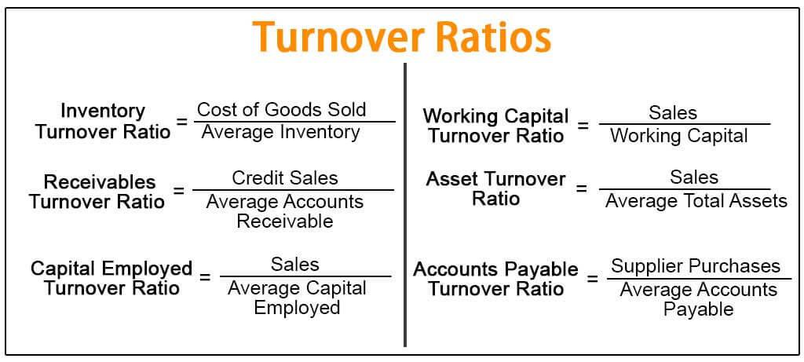

In recent years, there has been a significant surge in interest regarding mutual funds and algorithmic trading, driven largely by advancements in technology and an increasing need for diversified investment strategies. Investment mutual funds are pooled financial vehicles that collect capital from multiple investors to invest in a diversified asset portfolio. They provide individuals with access to professionally managed investment opportunities without requiring extensive market knowledge or significant capital.

A key metric for assessing the efficiency of mutual funds is the turnover ratio. The turnover ratio is a measure of how frequently assets within a mutual fund are bought and sold over a given period, typically expressed as a percentage of the fund's total assets. A higher turnover ratio indicates frequent trading activities, which may result in increased transaction costs, while a lower turnover ratio suggests a more stable investment approach.

Algorithmic trading, on the other hand, refers to the use of computer algorithms to automate decision-making processes in financial markets. These algorithms execute trades at speeds and frequencies that are impossible for human traders. The integration of algorithmic trading into mutual funds has brought about a transformative impact on the turnover ratios, as algorithms can quickly adapt to market conditions and execute trades based on predefined criteria.

Understanding these concepts is crucial for investors, especially in the digital age. The interaction between mutual funds, turnover ratios, and algorithmic trading has significant implications on investment efficiency and cost-effectiveness. A mutual fund's turnover ratio can be directly influenced by algorithmic trading strategies, ultimately affecting an investor’s returns.

This article aims to provide insights into the turnover ratio within mutual funds and its impact through the adoption of algorithmic trading. By examining these elements, investors can enhance their understanding of modern financial markets and make informed decisions that align with their investment goals in an increasingly data-driven environment.

## Table of Contents

## Understanding Investment Mutual Funds

Investment mutual funds are pivotal components of the financial ecosystem, providing individuals with collective investment opportunities managed by financial professionals. Essentially, mutual funds pool capital from multiple investors to purchase a diversified portfolio of securities. This vehicle enables investors to participate in a broad range of assets without directly owning the underlying securities, offering an effective way to manage and grow wealth.

### Types of Mutual Funds

Mutual funds are categorized based on their investment strategies and asset allocations, with the primary types being equity, debt, and hybrid funds:

1. **Equity Funds**: These funds predominantly invest in stocks, aiming for capital growth. They are categorized by investment style (growth or value), market capitalization, or sector-specific focus, such as technology or healthcare. Equity funds tend to be riskier due to stock market volatility but often offer higher potential returns over the long term.

2. **Debt Funds**: Focused on fixed-income securities, such as bonds or treasury bills, debt funds are designed to provide steady income with lower risk compared to equity funds. They are categorized based on the types of bonds held, such as government, corporate, or municipal bonds, and characteristics like duration or credit quality.

3. **Hybrid Funds**: These funds combine equities and fixed-income instruments in varying proportions, offering a balanced approach to investment. They aim to provide both income and capital appreciation, appealing to investors seeking moderate risk exposure with potential growth.

### Role of Fund Managers

Fund managers are professionals tasked with maintaining and optimizing the fund's portfolio in alignment with its investment objectives. They execute strategic decisions such as asset allocation, security selection, and risk management to enhance returns while mitigating risks. Fund managers rely on a mixture of quantitative analysis, economic indicators, and market trends to make informed decisions. Their expertise and active management play a crucial role in the fund's performance, justifying management fees associated with mutual fund investments.

### Benefits of Investing in Mutual Funds

Investing in mutual funds offers several advantages:

- **Diversification**: By pooling resources, mutual funds expose investors to a broader range of securities than they might individually afford, spreading risk and reducing the impact of any single asset's poor performance.

- **Professional Management**: Investors benefit from the expertise and insights of professional fund managers who actively monitor market conditions and adjust portfolios accordingly.

- **Liquidity**: Mutual funds provide investors with the flexibility to buy and sell shares on any business day, offering liquidity and ease of transaction.

### Potential Risks and Considerations

Investment in mutual funds is not without risks and considerations:

- **Market Risk**: The value of mutual funds fluctuates with the performance of their underlying assets, exposing investors to market volatility.

- **Affiliated Costs**: Mutual funds incur management fees and operating expenses, which can affect overall returns. It’s essential for investors to understand and evaluate these costs.

- **Managerial Risk**: The performance is highly dependent on the fund manager's expertise and decision-making strategies, introducing the risk of human error.

Investors must consider these aspects when selecting mutual funds to align with their financial goals and risk tolerance. Conducting comprehensive research and understanding the characteristics and fees associated with each fund type are vital to making informed investment decisions.

## Turnover Ratio in Mutual Funds

The turnover ratio is a critical metric used to assess the activity level within a mutual fund. It is calculated by taking the lesser of purchases or sales of securities within the fund over a specific period and dividing it by the average net assets of the fund during the same period. Mathematically, it can be expressed as:

$$
\text{Turnover Ratio} = \frac{\min(\text{Purchases}, \text{Sales})}{\text{Average Net Assets}}
$$

This metric signifies how frequently the assets within a fund are being traded. A high turnover ratio indicates a more active trading strategy, while a low turnover ratio suggests a more passive, buy-and-hold approach.

The significance of the turnover ratio lies in its ability to provide insights into the fund's efficiency and cost-effectiveness. High turnover often leads to increased transaction costs, which can eat into the fund's returns due to higher brokerage fees and potential market impact costs. Additionally, frequent trading may result in higher short-term capital gains, which are typically taxed at a higher rate than long-term gains, potentially affecting after-tax returns.

For investors, understanding the implications of high versus low turnover ratios is essential. High turnover funds might be suitable for those seeking aggressive growth and who are unconcerned about transaction costs. Conversely, a low turnover ratio can be appealing to investors who prefer a more stable approach with minimal trading, thereby potentially reducing costs and tax liabilities.

Consider a mutual fund with a turnover ratio of 150% compared to another with a turnover of 20%. The high turnover fund might be actively seeking opportunities for short-term gains, resulting in potentially higher returns but increased costs and tax implications. Meanwhile, the low turnover fund might focus on long-term growth with fewer transactions, thereby minimizing costs and taxes, but possibly providing lower short-term gains.

Investors can use the turnover ratio as a tool to align their investment strategies with their financial goals. Funds with high turnover may suit those looking for opportunistic gains and who can tolerate higher costs and [volatility](/wiki/volatility-trading-strategies). Conversely, lower turnover ratios might appeal to those seeking steady, long-term returns with a focus on minimizing expenses and taxes.

In summary, the turnover ratio is a useful indicator of a mutual fund's trading activity and efficiency. By understanding this metric, investors can better evaluate the cost-effectiveness and potential tax implications of their mutual fund investments, enabling them to make more informed decisions that align with their investment objectives.

## The Role of Algorithmic Trading

Algorithmic trading has become a significant force in modern financial markets, characterized by its use of complex algorithms and automated systems to execute trades. This technology-driven approach to trading has grown exponentially, facilitated by advances in computing power, data analytics, and market accessibility. Algorithmic trading employs a variety of systematic strategies to conduct trades at speeds and frequencies that would be impossible for human traders.

At its core, [algorithmic trading](/wiki/algorithmic-trading) leverages algorithms—defined as sets of strict rules or processes—to make trading decisions, strategies based on time, pricing, quantity, and other market dynamics. These algorithms exploit the ability to process vast amounts of data rapidly, enabling traders to execute orders within milliseconds. This speed advantage is particularly beneficial in high-frequency trading ([HFT](/wiki/high-frequency-trading-strategies)), a subset of algorithmic trading focused on executing a large number of orders at incredibly high speeds to capitalize on small price movements.

One of the primary advantages of algorithmic trading is its precision. Algorithms follow predefined criteria without deviation, which minimizes the risks associated with human errors such as emotional bias or oversight. Additionally, algorithmic trading allows for increased market [liquidity](/wiki/liquidity-risk-premium) and tighter spreads, often resulting in cost savings for both market participants and individual investors.

Despite these advantages, algorithmic trading presents several challenges and criticisms. It has been associated with market volatility, as rapid execution of trades can lead to significant price swings. This volatility is sometimes exacerbated during periods of market stress. Ethical concerns also arise, particularly about market fairness and equal access; sophisticated algorithms and infrastructure can create barriers to entry, privileging larger, well-capitalized firms. Moreover, algorithmic trading is subject to regulatory scrutiny, as its complexity and speed can complicate efforts to ensure market integrity and protect investors.

Current trends in algorithmic trading indicate an ongoing evolution toward [artificial intelligence](/wiki/ai-artificial-intelligence) (AI) and [machine learning](/wiki/machine-learning) (ML) integration. These technologies promise even greater data processing capabilities and adaptability, enabling algorithms to learn from dynamic market conditions and refine their strategies over time. Furthermore, the expansion of algorithmic trading beyond traditional markets into new asset classes and global exchanges exemplifies its broadening scope and influence.

Looking to the future, algorithmic trading will likely continue to shape the investment landscape, offering both opportunities and challenges. Investors and market participants must remain vigilant, balancing the benefits of innovation with the need for robust oversight and ethical considerations.

## Interplay Between Turnover Ratio and Algorithmic Trading

Algorithmic trading fundamentally reshapes the turnover ratio in mutual funds by altering the frequency and manner in which trades are executed. The turnover ratio, which measures how frequently assets within a fund are bought and sold over a given period, is significantly influenced by the application of algorithmic strategies that prioritize speed and efficiency in transactions.

### Influence of Algorithmic Trading on Turnover Ratio

Algorithmic trading employs automated systems and sophisticated algorithms to make decisions with minimal human intervention. These systems can analyze vast datasets rapidly, allowing for trades to be executed based on programmed strategies at a frequency that would be impractical for human traders. As a result, mutual funds incorporating algorithmic trading often experience higher turnover ratios. The shift towards algorithmically-driven strategies is particularly pronounced in ETFs and index funds, where rapid adjustments to asset holdings are essential to maintain benchmark performance.

### Case Studies of Mutual Funds with Algorithmic Strategies

For illustrative purposes, consider Fund X, an equity mutual fund that utilizes algorithmic trading to optimize returns. This fund reports a turnover ratio significantly higher than its peers who rely on traditional trading methods. Despite the high turnover, Fund X managed to outperform its benchmark over the past year, suggesting a strategic use of algorithms to capitalize on short-term market inefficiencies.

In contrast, Fund Y, which also applies algorithmic trading but with a more conservative approach, maintains a moderate turnover ratio. While Fund Y does not match the high-frequency trading of Fund X, its algorithmic strategies focus on minimizing transaction costs and taking advantage of medium-term trends, leading to stable yet competitive performance metrics.

### Impact on Costs and Efficiency

The primary advantage of algorithmic trading is its potential to enhance the efficiency of trading operations. By executing trades at high speeds and taking advantage of minute price discrepancies, mutual funds can optimize their trading costs, although this often comes at the expense of higher turnover ratios. Increased turnover ratio typically translates to higher transaction costs due to frequent buying and selling. However, algorithmic trading's precision can reduce bid-ask spreads and slippage, mitigating some of these expenses.

Moreover, algorithmically driven funds might face varied management fees. While the operational costs associated with sophisticated algorithms might be high, the potential for better performance can justify these fees, provided the fund effectively passes on its gains to investors.

### Considerations for Investors

Investors considering mutual funds utilizing algorithmic trading must evaluate several factors. High turnover ratios generally point to active trading, which may result in higher costs due to fees and taxes. Therefore, investors should assess whether the observed returns justify the embedded costs. Moreover, understanding the specific algorithmic strategy employed is crucial, as some might favor short-term gains, while others may focus on risk management or [trend following](/wiki/trend-following).

### Expert Opinions on Managing Turnover Ratio

Financial experts suggest a balanced approach when managing turnover ratios through algorithmic trading. According to Dr. Jane Williams, a renowned financial strategist, maintaining an optimal turnover is key to leveraging algorithmic trading benefits without incurring excessive costs. By fine-tuning algorithms to balance trade frequency with cost management, fund managers can strategically utilize algorithmic trading to enhance returns while keeping turnover ratios within acceptable limits.

In conclusion, the interplay between algorithmic trading and turnover ratios in mutual funds is intricate, affecting performance, costs, and investment risks. A careful evaluation and strategic application of algorithmic strategies can provide significant advantages, albeit with considerations necessary to mitigate potential downsides.

## Making Informed Investment Decisions

### Making Informed Investment Decisions

Investors need a nuanced approach when evaluating mutual funds, particularly regarding turnover ratios and algorithmic trading. Understanding these elements is pivotal in making informed investment decisions.

#### Key Takeaways for Investors

1. **Understanding Turnover Ratios**: The turnover ratio, a measure of how frequently assets within a fund are bought and sold, is a critical indicator of fund activity levels. A high turnover ratio may suggest active trading, potentially leading to higher transaction costs. Conversely, a low turnover ratio may indicate a buy-and-hold strategy, potentially resulting in lower tax liabilities.

2. **Evaluating Algorithmic Trading**: Algorithmic trading uses sophisticated algorithms to execute trades at high speeds, offering advantages such as precision and efficiency. However, investors must consider the potential for increased market volatility and costs associated with this trading style.

#### Practical Tips for Evaluating Mutual Funds

- **Analyze Turnover Ratios**: Evaluate how the turnover ratio aligns with the fund's investment strategy. A high turnover ratio in an actively managed fund might be appropriate but could indicate inefficiency in a passively managed fund.

- **Assess the Algorithmic Profile**: Investigate whether the fund employs algorithmic trading and, if so, analyze its impact on fund performance, cost, and risk. Consistency in performance metrics across various market conditions can signify effectiveness.

#### Resources and Tools for Analysis

Investors can leverage several resources to analyze mutual funds more effectively:

- **Morningstar and Yahoo Finance**: These platforms offer comprehensive data on mutual funds, including turnover ratios and performance metrics.

- **Bloomberg Terminals**: Provide advanced screening tools for evaluating the impact of algorithmic trading within mutual funds.

- **Online Investment Platforms**: Many offer tools to simulate how changes in turnover ratios and trading strategies can affect long-term returns.

#### Importance of Staying Informed

Market dynamics and technological advancements are continually reshaping the investment landscape. Keeping abreast of these changes through financial news, reports, and expert analyses ensures that investment strategies remain relevant and effective.

#### Long-term Investment Strategy Considerations

Balancing risk, return, and innovation is essential for crafting a long-term investment strategy. While algorithmic trading can introduce efficiencies, it is crucial to evaluate whether these strategies align with the investor's risk tolerance and investment goals. Likewise, understanding how turnover ratios affect fund costs and after-tax returns can help optimize portfolio performance.

By focusing on these key aspects, investors can make informed decisions that align with their financial goals and risk preferences, ultimately leading to more robust and resilient investment portfolios.

## Conclusion

In conclusion, the interplay between mutual funds, turnover ratio, and algorithmic trading constitutes a pivotal area of modern investment strategies. Mutual funds serve as an accessible investment vehicle, offering benefits such as diversification, liquidity, and professional management. The turnover ratio is a critical metric for assessing the efficiency and cost-effectiveness of these funds. It provides investors with significant insights into the fund's trading activity and the potential impact on returns. 

Algorithmic trading, on the other hand, has revolutionized the financial markets with its ability to execute trades with precision and speed, thereby influencing turnover ratios. Its role in influencing mutual fund strategies cannot be overstated, as it offers the potential for optimizing returns while introducing considerations regarding market volatility and regulatory compliance.

For investors, understanding these concepts is essential for making informed decisions. Evaluating mutual funds through the lens of turnover ratios and algorithmic trading practices can aid in formulating robust investment strategies. As the landscape of investing continues to evolve, staying informed about advancements in financial technology and market dynamics is crucial. 

Investors are encouraged to leverage these insights to refine their investment choices and consult further resources or seek expert advice to navigate the complexities of modern financial markets. This strategic approach will enable them to balance risk, return, and innovation effectively, ensuring their investment portfolios remain resilient and profitable in the face of changing market conditions.

## References & Further Reading

[1]: Brogaard, J., Hendershott, T., & Riordan, R. (2014). ["High Frequency Trading and Price Discovery."](https://www.jstor.org/stable/24465658) Review of Financial Studies, 27(8), 2267-2306.

[2]: Lopez de Prado, M. (2018). ["Advances in Financial Machine Learning."](https://books.google.com/books/about/Advances_in_Financial_Machine_Learning.html?id=oU9KDwAAQBAJ) Wiley.

[3]: Jansen, S. (2020). ["Machine Learning for Algorithmic Trading: Predictive Models to Extract Signals from Market and Alternative Data for Systematic Trading Strategies."](https://www.amazon.com/Machine-Learning-Algorithmic-Trading-alternative/dp/1839217715) Packt Publishing.

[4]: Chan, E. P. (2009). ["Quantitative Trading: How to Build Your Own Algorithmic Trading Business."](https://github.com/ftvision/quant_trading_echan_book) Wiley.

[5]: Benos, E., Brugler, J., Hjalmarsson, E., & Zikes, F. (2018). ["Interconnectedness of Algorithmic Trading Activity in FX Markets: Evidence from the EBS Data."](https://www.jstor.org/stable/26590446) Bank of England Working Paper No. 694.