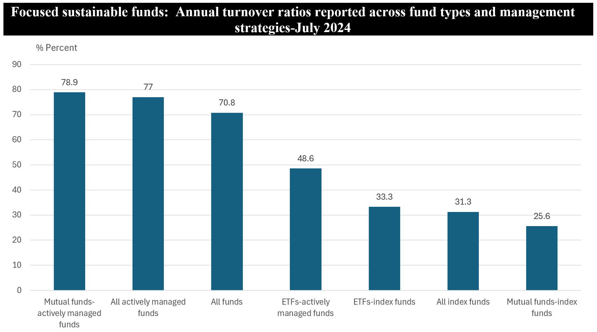

## Table of Contents

## What is a turnover ratio in the context of investment funds?

A turnover ratio in the context of investment funds shows how often the fund's investments are bought and sold in a year. It is calculated by taking the total value of the assets bought or sold, whichever is less, and dividing it by the average value of the fund's assets. A high turnover ratio means the fund manager is actively trading, while a low turnover ratio means the manager is holding onto the investments longer.

This ratio is important for investors because it can affect the fund's performance and costs. A high turnover ratio can lead to higher transaction costs and taxes, which can reduce the fund's returns. On the other hand, a low turnover ratio might mean lower costs but could also mean the fund is not taking advantage of new investment opportunities. Understanding the turnover ratio helps investors choose a fund that matches their investment goals and risk tolerance.

## How is the turnover ratio calculated for an investment fund?

The turnover ratio for an investment fund is calculated by looking at the total value of the assets the fund bought or sold during a year. You take the smaller number between the total value of assets bought and the total value of assets sold. Then, you divide this number by the average value of the fund's assets during that year. The result is the turnover ratio, which is usually shown as a percentage.

For example, if a fund bought assets worth $100 million and sold assets worth $80 million in a year, and the average value of the fund's assets was $500 million, the turnover ratio would be calculated like this: you use the smaller number, which is $80 million, and divide it by $500 million. This gives you a turnover ratio of 16%. This means that 16% of the fund's assets were replaced over the year.

## Why is the turnover ratio important for investors to consider?

The turnover ratio is important for investors because it tells them how often the fund manager is buying and selling assets. A high turnover ratio means the manager is trading a lot, which can lead to higher costs like transaction fees and taxes. These extra costs can eat into the fund's returns, leaving less money for the investors. On the other hand, a low turnover ratio means the manager is not trading as much, which can keep costs down and might be better for long-term investors who want to keep their money growing without too much fuss.

Another reason the turnover ratio matters is that it can show how the fund manager is trying to make money. A high turnover might mean the manager is trying to take advantage of short-term market changes, which can be riskier. A low turnover might mean the manager is more focused on long-term growth and stability. By understanding the turnover ratio, investors can pick a fund that matches their own goals and how much risk they are willing to take.

## What does a high turnover ratio indicate about an investment fund?

A high turnover ratio in an investment fund means that the fund manager is buying and selling the fund's assets a lot during the year. This can show that the manager is trying to take advantage of short-term changes in the market, hoping to make quick profits. When the turnover ratio is high, it suggests that the fund is actively managed, meaning the manager is always on the lookout for new investment opportunities.

However, a high turnover ratio can also mean higher costs for the fund. Every time the fund buys or sells an asset, there are transaction fees and possibly taxes that need to be paid. These extra costs can reduce the overall returns of the fund, which means less money for the investors at the end of the day. So, while a high turnover might aim for better performance, it can also lead to higher expenses that eat into the fund's profits.

## What does a low turnover ratio suggest about an investment fund's strategy?

A low turnover ratio means that the fund manager does not buy and sell the fund's assets very often. This suggests that the fund is using a strategy focused on long-term investing. The manager probably believes in holding onto the investments for a longer time, waiting for them to grow in value over years rather than trying to make quick profits from short-term market changes.

This approach can be good for keeping costs down because there are fewer transaction fees and less chance of having to pay taxes on gains. Investors who choose a fund with a low turnover ratio might be looking for steady growth and stability, rather than the ups and downs that come with more active trading. It shows that the fund is more about patience and long-term planning than trying to chase quick wins in the market.

## How can turnover ratios impact the performance of an investment fund?

Turnover ratios can affect how well an investment fund does. If the turnover ratio is high, it means the fund manager is buying and selling a lot. This can lead to higher costs because every time they trade, they have to pay fees and maybe taxes. These extra costs can take away from the money the fund makes, so the investors might end up with less profit. On the other hand, if the fund manager is good at [picking](/wiki/asset-class-picking) the right times to trade, a high turnover might help the fund make more money by taking advantage of short-term market changes.

If the turnover ratio is low, it means the fund manager is not trading much and is probably holding onto the investments for a longer time. This can keep costs down since there are fewer fees and taxes to pay. A low turnover ratio can be good for the fund's performance because it helps keep more of the money the fund makes. Investors who like this kind of fund are usually looking for steady growth over a long time, rather than trying to make quick profits. So, the turnover ratio can really make a difference in how much money the fund makes and how it grows over time.

## What are the tax implications of high turnover ratios in investment funds?

High turnover ratios in investment funds can lead to more taxes for investors. When a fund buys and sells assets a lot, it can create what are called capital gains. These gains are the profits made from selling investments for more than what was paid for them. If these gains are short-term, meaning the assets were held for a year or less, they are taxed at a higher rate than long-term gains. So, a fund with a high turnover ratio might end up with more short-term gains, which means more taxes for the investors.

This can eat into the returns that investors get from the fund. Even if the fund does well and makes a lot of money, a big chunk of that money might go to taxes instead of staying in the investors' pockets. That's why it's important for investors to look at the turnover ratio when choosing a fund, especially if they want to keep their tax bill as low as possible. A fund with a lower turnover ratio might help investors save on taxes and keep more of their investment returns.

## How do turnover ratios vary across different types of investment funds, such as equity, bond, and index funds?

Turnover ratios can be different for different types of investment funds. Equity funds, which invest in stocks, often have higher turnover ratios. This is because stock prices can change a lot, and fund managers might buy and sell more often to try to make money from these changes. Bond funds, which invest in bonds, usually have lower turnover ratios. Bonds don't change in price as much as stocks, so managers don't need to trade them as often. They might hold onto bonds until they mature, which can take years.

Index funds, which try to copy the performance of a market index like the S&P 500, usually have very low turnover ratios. These funds don't try to beat the market; they just try to match it. So, they only buy and sell when the index changes, which doesn't happen very often. This means lower costs for the fund and less trading, which can be good for investors who want to keep their money growing without too much fuss.

## Can turnover ratios be used to compare the quality of different investment funds?

Turnover ratios can give you some clues about how good different investment funds are, but they don't tell the whole story. A high turnover ratio might mean the fund manager is trying hard to make money by trading a lot. But it can also mean higher costs because of all the buying and selling, which can eat into the fund's profits. So, a high turnover ratio doesn't always mean a fund is better or worse; it just means it's more active.

On the other hand, a low turnover ratio might suggest the fund is more focused on long-term growth and keeping costs down. This can be good for investors who want steady, slow growth. But it doesn't mean the fund is better or worse than one with a high turnover ratio. To really know if a fund is good, you need to look at other things too, like how well it's done over time, how much it costs to invest in it, and what kind of investments it holds. So, turnover ratios are just one piece of the puzzle when comparing the quality of investment funds.

## What are the limitations of using turnover ratios as a sole measure of investment fund quality?

Turnover ratios can tell you how often a fund's manager is buying and selling, but they don't show the whole picture of how good a fund is. A high turnover ratio might mean the manager is trying to make quick profits, but it also means more costs like fees and taxes. These costs can take away from the money the fund makes, so a high turnover ratio doesn't always mean the fund is better. On the other hand, a low turnover ratio might mean the fund is focused on long-term growth and keeping costs down, but it doesn't mean the fund is better than one with a high turnover ratio.

To really know if a fund is good, you need to look at more than just the turnover ratio. You should check how well the fund has done over time, how much it costs to invest in it, and what kinds of investments it holds. Turnover ratios are just one piece of information that can help you understand a fund, but they shouldn't be the only thing you use to decide if a fund is good or not.

## How do fund managers justify high turnover ratios, and what are the counterarguments?

Fund managers often say that high turnover ratios are needed to make the most money for investors. They think that by trading a lot, they can take advantage of quick changes in the market and buy and sell at the right times. They believe this can lead to better returns than just holding onto investments for a long time. Some managers also say that they need to trade a lot to keep up with new information and changes in the economy, so they can adjust the fund's investments to do better.

But, there are good reasons to be careful about high turnover ratios. When a fund trades a lot, it has to pay more in fees and taxes, which can eat into the money the fund makes. This means less profit for investors. Also, trying to make money by trading quickly can be risky because the market can be hard to predict. Sometimes, a simpler strategy of holding onto good investments for a long time can work better and be less costly. So, while high turnover might sound good, it's important to think about the costs and risks too.

## What advanced metrics, in addition to turnover ratios, should be considered when evaluating the quality of an investment fund?

When you want to know how good an investment fund is, you should look at more than just the turnover ratio. One important thing to check is the fund's performance over time. This means looking at how well the fund has done compared to other funds or to a market index like the S&P 500. You can see if the fund has been able to make more money than others, even after taking out fees and costs. Another thing to consider is the fund's expense ratio, which tells you how much it costs to run the fund. A lower expense ratio means more of the money you make stays in your pocket.

You should also look at the fund's risk-adjusted returns, which show how much risk the fund is taking to get its returns. A good way to measure this is by looking at the Sharpe ratio, which compares the fund's returns to how much it moves up and down. A higher Sharpe ratio means the fund is doing a good job of making money without taking too much risk. Finally, it's helpful to see what the fund is investing in, called its portfolio composition. Knowing if the fund is putting money into stocks, bonds, or other things can help you decide if it fits with what you want to do with your money.

## What are Turnover Ratios and How Can We Understand Them?

Turnover ratios are crucial metrics in the evaluation of investment portfolios, providing a quantitative measure of trading activity within a fund over a specified time frame, often one year. This metric is depicted as a percentage, offering a clear view of how frequently assets within the fund are bought and sold. A turnover ratio is calculated by dividing the lesser of the total purchases or sales by the average net assets of the fund:

$$

\text{Turnover Ratio} = \left( \frac{\min(\text{Total Purchases}, \text{Total Sales})}{\text{Average Net Assets}} \right) \times 100\%
$$

Turnover ratios serve as indicators of the degree of active management in an investment fund. High turnover ratios suggest that the fund engages in frequent trading activities, which is typically characteristic of active trading strategies. These strategies attempt to capitalize on short-term market movements with the hope of [earning](/wiki/earning-announcement) significant returns. However, such frequent trading can also lead to increased transaction costs and potential tax liabilities, which investors must consider.

Conversely, lower turnover ratios indicate a more passive management style. Funds adopting this approach might emphasize a buy-and-hold strategy, maintaining stable holdings over time and making fewer trades. This strategy often results in lower transaction costs and may provide better tax efficiency, as fewer trades can translate into fewer taxable events.

Understanding turnover ratios is essential for investors as it provides insights into the fund's management style and potential impact on net returns. By analyzing turnover ratios, investors can better align their investment choices with their individual financial goals and tolerance for risk.

## What are the turnover ratios in different types of funds?

Index funds are a popular choice for investors due to their typically lower turnover ratios, which arise from a buy-and-hold strategy designed to track specific market indices. This strategic approach minimizes the frequency of buying and selling securities, thereby reducing transaction costs and enhancing tax efficiency. The essence of an index fund is to mirror the performance of benchmarks like the S&P 500 or MSCI World Index, which naturally gravitates towards a stable portfolio with infrequent trading.

Conversely, growth funds often exhibit higher turnover ratios. These funds aim to capitalize on new and emerging market opportunities by frequently adjusting their holdings to include companies with strong potential for above-average profit growth. This proactive trading approach aligns with a growth-centric strategy but can lead to increased transaction costs and potential tax implications due to the realization of capital gains.

Evaluating the turnover ratios across different fund types is essential for aligning investment strategies with individual goals. For instance, an investor seeking long-term stability and cost-efficiency might prefer index funds with their inherent low turnover. In contrast, an investor prioritizing capital appreciation through aggressive strategies may opt for growth funds, accepting the higher turnover and associated costs.

To quantify turnover, the turnover ratio is calculated as:

$$
\text{Turnover Ratio} = \frac{\text{Total Sales or Purchases (whichever is lower)}}{\text{Average Fund Size}} \times 100
$$

This formula provides a clear metric to compare trading activity across various funds, allowing investors to tailor their portfolios according to their risk tolerance, cost concerns, and financial objectives. Understanding these dynamics aids investors in creating a well-rounded investment approach that is attuned to their specific aspirations and market outlooks.

## What is the Role of Turnover Ratios in Investment Decision Making?

In investment decision making, turnover ratios serve as valuable indicators of a fund's trading activity level. However, they should not be viewed in isolation. Instead, investors should incorporate turnover ratios with other critical metrics like expense ratios, management tenure, and historical performance to present a comprehensive picture of a fund's characteristics and potential returns.

High turnover ratios often signal frequent trading, which can result in elevated transaction costs and tax burdens. For instance, if a mutual fund has a turnover ratio of 100%, it implies that the entire portfolio has been replaced throughout the year. This scenario can lead to considerable costs in the form of brokerage fees and taxes, which, if unmonitored, can erode the fund's net returns. Calculating the effective cost of a high turnover ratio involves estimating transaction fees and taxes, an assessment that can be augmented with the turnover cost formula:

$$
\text{Total Cost} = (\text{Turnover Ratio}) \times (\text{Transaction Costs per Trade})
$$

where transaction costs per trade encompass both explicit costs (like brokerage fees) and implicit costs (like market impact).

Analyzing turnover ratios assists investors in understanding the fund's management style and risk profile. Active management often correlates with higher turnover ratios as fund managers buy and sell assets to exploit short-term market inefficiencies. Conversely, lower turnover ratios might suggest a passive management strategy, aiming for long-term stability and reduced transaction-related expenses. Aligning these insights with personal risk tolerance and performance objectives is crucial. An investor seeking stable, long-term growth might prefer funds with lower turnover ratios that imply buy-and-hold strategies, minimizing frequent trading-induced costs.

Ultimately, the evaluation of turnover ratios, alongside other indicators, equips investors with a nuanced understanding of how a fund might meet their investment goals, allowing for informed and strategic decision-making tailored to individual risk appetites and return expectations.

## References & Further Reading

[1]: ["Advances in Financial Machine Learning"](https://www.amazon.com/Advances-Financial-Machine-Learning-Marcos/dp/1119482089) by Marcos Lopez de Prado

[2]: ["Evidence-Based Technical Analysis: Applying the Scientific Method and Statistical Inference to Trading Signals"](https://www.amazon.com/Evidence-Based-Technical-Analysis-Scientific-Statistical/dp/0470008741) by David Aronson

[3]: ["Machine Learning for Algorithmic Trading"](https://github.com/stefan-jansen/machine-learning-for-trading) by Stefan Jansen

[4]: ["Quantitative Trading: How to Build Your Own Algorithmic Trading Business"](https://www.amazon.com/Quantitative-Trading-Build-Algorithmic-Business/dp/1119800064) by Ernest P. Chan

[5]: ["Common Risk Factors in the Returns on Stocks and Bonds"](https://www.bauer.uh.edu/rsusmel/phd/Fama-French_JFE93.pdf) by Eugene F. Fama and Kenneth R. French, Journal of Financial Economics.