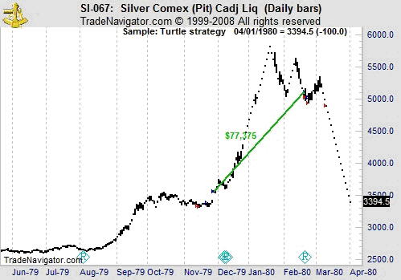

In the world of financial markets, traders are constantly seeking methods to gain an edge over the competition. Over the years, various trading strategies have emerged, each promising significant returns and offering unique perspectives on market dynamics. The fields of algorithmic trading and systematic strategies, in particular, have gained prominence due to their precision and efficiency in executing trades. These approaches minimize emotional decision-making, leveraging technology and data-driven decisions to achieve consistent outcomes.

Among the many trading strategies, the 'Turtle Trading' experiment remains one of the most legendary and frequently discussed. Initiated in the 1980s, this experiment was designed to test whether successful trading could be taught or if it was an innate skill. It emphasized a systematic approach, focusing on specific principles and methodologies to identify profitable trades.



This article will explore the origins, principles, and impact of Turtle Trading, examining how this experiment has influenced trading strategies and its relevance within today's algorithmic trading landscape. In doing so, we will uncover how foundational principles from past experiments continue to shape modern trading practices, providing opportunities for traders to achieve success in evolving markets.

## Table of Contents

## The Origins of Turtle Trading

Turtle Trading emerged from an intriguing experiment conducted in the 1980s by two influential figures in the trading world, Richard Dennis and William Eckhardt. Their collaboration aimed to resolve a longstanding debate regarding the development of successful traders: are they inherently talented, or can their skills be cultivated through training?

Richard Dennis, known for his success in trading, was a fervent proponent of the idea that trading expertise could be taught. He believed that with the right principles and discipline, anyone could become a competent trader. Contrastingly, his partner, William Eckhardt, held a more skeptical view, arguing that there were innate qualities essential to trading success which could not be easily imparted.

In order to test these opposing viewpoints, Dennis and Eckhardt devised a radical experiment. They placed advertisements in financial publications, inviting individuals from diverse backgrounds with little to no trading experience to apply. From the large pool of applicants, they selected a small group, later famously known as the "Turtles," to be trained in their systematic trading methodology.

The training provided to the Turtles involved a clear, rule-based system that emphasized trend-following strategies and risk management. The Turtles learned to identify trends through systematic observations of market behaviors and execute trades based on predetermined criteria. Over time, they refined these techniques and reported consistent profits, validating Dennis's theory that successful trading could indeed be taught.

The experiment's outcome was a remarkable success, not only enriching the Turtles but also substantiating the premise that trading skills could be developed through structured training programs. This landmark experiment underscored the potential for systematic approaches in trading, laying the foundational principles for many traders to follow. The legacy of Turtle Trading continues to inspire the development of robust, disciplined trading systems in today's financial markets.

## Key Principles of Turtle Trading

The Turtle Trading strategy, developed in the 1980s by Richard Dennis and William Eckhardt, emphasized a systematic approach to trading, primarily grounded in trend-following principles. A key feature of this strategy was its reliance on [breakout](/wiki/breakout-trading) techniques to identify and capitalize on prevailing market trends. Breakout strategies involve entering a trade when the price moves beyond a predefined level of support or resistance. This was aimed at capturing significant price movements while they were forming.

Risk management was another cornerstone of Turtle Trading. The Turtles utilized a position sizing method influenced by market [volatility](/wiki/volatility-trading-strategies), ensuring that risk exposure remained consistent across varying market conditions. The standard measure employed was the Average True Range (ATR), which quantified market volatility. The Turtles adjusted their position sizes accordingly, adhering to the formula:

$$
\text{Position Size} = \frac{\text{Equity} \times \text{Risk Percentage}}{\text{ATR}}\]

This approach maintained risk at a manageable level across different trades, allowing for consistency in trading performance.

Discipline and strict adherence to predefined rules were crucial elements of the Turtle Trading strategy. Emotional biases were minimized through rigorous commitment to trading plans, reducing the influence of psychological factors that often lead to poor decision-making. This enforceable discipline helped in maintaining a consistent trading edge over time.

Moreover, the strategy promoted transparency and consistency in managing both risks and rewards. By maintaining systematic approaches to trade entrance and [exit](/wiki/exit-strategy), traders could objectively evaluate performance, facilitating improvements and adjustments to the strategy as necessary.

The Turtle Trading methodology underscored the importance of a structured trading system, advocating for a disciplined approach that effectively managed market dynamics through clear, rule-based criteria. This blend of systematic positions, strategic risk management, and rigorous discipline enabled traders to navigate complex market environments with greater precision.

## Turtle Trading's Legacy and Influence

The success of the Turtle Trading experiment is well-documented in trading history. It showcased the potential power of systematic trading strategies, establishing a comprehensive methodology—one that could be taught, learned, and replicated. At its core, Turtle Trading provided a robust blueprint for subsequent generations of traders, emphasizing the importance of using rules and frameworks to guide trading decisions.

Turtle Trading's blueprint revolves around exploiting trends consistently through a disciplined, rule-based approach. By systematically following a predefined set of rules, traders can minimize emotional biases, a crucial element often highlighted in the psychological aspects of trading. This approach has since been integrated into various modern trading systems, with many borrowing from the principles pioneered by the Turtles. For instance, the trend-following aspects of the strategy can be seen in modern moving-average crossovers and other technical indicators that traders use to identify market trends.

Furthermore, Turtle Trading laid the groundwork for evidence-based trading by encouraging the use of data to drive decision-making processes. This concept has evolved into what traders now refer to as [quantitative trading](/wiki/quantitative-trading), where decisions are made based on mathematical models and historical data. Systematic rule formulation, one of the key aspects of the Turtles' approach, remains a critical component in developing trading algorithms used today.

The influence of Turtle Trading extends beyond just strategies. It also sparked the formation of structured training programs for aspiring traders. The legacy of training novice traders into market-savvy professionals underscored the belief that trading success could be methodically cultivated. Programs focusing on teaching disciplined trading methods and risk management solutions have likely taken inspiration from the Turtle Trading framework. 

In conclusion, Turtle Trading's enduring impact is reflected in the widespread adoption of systematic strategies. It marked a pivotal shift in how traders approached the market, favoring logic and structure over impulsive maneuvers. As a result, the principles laid down by Turtle Trading continue to resonate with and inform contemporary trading philosophies.

## Understanding Algo Trading

Algorithmic trading, commonly known as algo trading, utilizes computer algorithms to automate trading decisions based on predefined criteria. This approach minimizes human intervention, thereby reducing the influence of emotions on trading decisions and enhancing the consistency of trading strategies. The algorithms can quickly analyze vast datasets to identify trading opportunities, execute orders at precise times, and manage risks more effectively than human traders.

At its core, algo trading is designed to capitalize on mathematical and statistical models to predict market movements and make trades accordingly. For example, algorithms can be programmed to trigger trades when certain technical indicators are met, such as moving average crossovers or relative strength index (RSI) thresholds. By leveraging historical data, [machine learning](/wiki/machine-learning) techniques, and real-time analytics, algo trading systems can optimize execution strategies, achieve better pricing, and reduce transaction costs.

The Turtle Trading experiment, which emphasized systematic rule-based trading based on trend-following principles, can be seen as a precursor to [algorithmic trading](/wiki/algorithmic-trading). Although Turtle Trading was manually executed, its reliance on set rules and quantitative analysis paved the way for modern automated systems. The principles of discipline, risk management, and systematic analysis that the Turtles adopted continue to be fundamental in the design of today's algo trading strategies.

In the contemporary financial landscape, many institutions and individual traders employ algorithmic trading to enhance efficiency and precision. High-frequency trading ([HFT](/wiki/high-frequency-trading-strategies)) firms, hedge funds, and proprietary trading desks use complex algorithms to exploit market inefficiencies in milliseconds. The speed and accuracy of these systems allow market participants to thrive in highly competitive environments.

Python, a popular programming language, is often utilized for developing algo trading systems due to its robust libraries for data analysis, such as Pandas and NumPy, and machine learning frameworks like TensorFlow and Scikit-learn. A simple example of a Python script for executing a moving average crossover strategy might look like this:

```python
import pandas as pd

# Load historical market data
data = pd.read_csv('market_data.csv')
data['SMA_50'] = data['Close'].rolling(window=50).mean() # 50-day simple moving average
data['SMA_200'] = data['Close'].rolling(window=200).mean() # 200-day simple moving average

# Define signals based on SMA crossover
data['Signal'] = 0
data.loc[data['SMA_50'] > data['SMA_200'], 'Signal'] = 1  # Buy signal
data.loc[data['SMA_50'] < data['SMA_200'], 'Signal'] = -1  # Sell signal
```

This straightforward implementation showcases how algo trading can be systematically approached using programming. As technology and financial markets continue to evolve, the principles underlying early systematic strategies like Turtle Trading remain relevant, reinforcing the necessity of disciplined, rules-based approaches in both manual and automated trading systems.

## Comparing Turtle Trading and Algo Trading

Despite differences in execution, both Turtle Trading and algorithmic trading prioritize systematic approaches that minimize emotional bias and enhance consistency. Turtle Trading, a trend-following system developed by Richard Dennis and William Eckhardt, was primarily manual, requiring traders to execute trades based on predetermined rules and market trends observed over time. This manual intervention, while systematic, relied heavily on the trader's discipline to adhere strictly to the rules.

On the other hand, algorithmic trading, or algo trading, automates the trading process using predefined instructions coded into computer programs. This automation allows for the swift execution of trades, harnessing computational power to process multiple data inputs and execute strategies without human intervention. As a result, whereas the Turtles focused on trends, identifying and acting upon them manually, algo trading can simultaneously employ multiple strategies across different markets and data points, thanks to its capacity to handle vast quantities of information efficiently.

Technological advancements have been pivotal, enabling traders to scale strategies more effectively. While Turtle Trading was confined to individual analysis and execution, algo trading leverages sophisticated software, high-speed internet, and cutting-edge hardware, expanding the scope and speed with which trading strategies can be deployed. This scalability allows modern traders to operate at a scale previously unimaginable during the era of Turtle Trading.

Nonetheless, the core tenets of having a well-defined strategy are fundamental to both methodologies. Whether manually executed or automated with algorithms, the success of a trading system is deeply rooted in the clarity and robustness of the underlying strategy. The structured approach advocated by Turtle Trading serves as a foundational element that resonates with the algorithm-driven logic of modern trading systems, cementing the importance of strategic clarity and precision in both landscapes.

## The Relevance of Turtle Trading in Modern Markets

Even with the rapid evolution of technology in financial markets, the principles established by the Turtle Trading experiment continue to hold significant relevance. The simplicity and reliability of the Turtle Trading system are particularly attractive to modern traders. The core strategy focused on clear and unequivocal rules such as trend-following and risk management, which remain vital in today's complex markets.

Modern trading strategies often embed these principles within their frameworks, ensuring that they are versatile and robust across various market conditions. The basic tenet of trend-following, where the strategy seeks to capitalize on market [momentum](/wiki/momentum), is evident in many contemporary trading systems. Implementing such systems involves identifying significant price breakouts and committing trades in the direction of these trends, a methodology established by the Turtles that continues to yield results.

Risk management, another cornerstone of Turtle Trading, is more critical than ever, especially with the increased volatility and uncertainty in the global markets. The Turtles' approach to defining position sizes based on market volatility is mirrored in modern strategies that use similar techniques, such as the ATR (Average True Range) indicator, to gauge volatility and adjust exposure accordingly. This helps in minimizing potential losses while allowing profitable trends to flourish.

The rise of hybrid trading systems marks a significant advancement, blending human insight with algorithmic precision. These systems leverage the strengths of both traditional and modern practices, wherein human traders define guidelines while algorithms handle execution. This hybrid approach not only increases efficiency but also mitigates emotional biases that can affect trading decisions. By integrating Turtle Trading principles with state-of-the-art technology, traders can optimize execution speed and accuracy while maintaining adherence to tested trading doctrines.

Therefore, despite the evolved trading landscape, foundational principles laid down by the Turtles endure. The integration of these principles with modern technology underscores the turtles' lasting impact, ensuring that traders who acknowledge and incorporate these time-tested strategies can identify and exploit opportunities in today's dynamic financial markets.

## Conclusion

The Turtle Trading experiment remains a profound endorsement of the efficacy of systematic trading strategies. By affirming that disciplined adherence to a rules-based framework can yield consistent results, it has inspired generations of traders to lean towards algorithmic and systematic approaches in their trading pursuits. This paradigm shift emphasizes the importance of structure and discipline in trading, moving away from emotion-driven decision-making.

In the ever-evolving landscape of financial markets, there is a growing necessity to integrate traditional methodologies with modern technological advancements. Algorithms and automated trading systems have revolutionized how market participants operate, offering speed, precision, and the ability to process vast datasets far exceeding human capabilities. Yet, the foundational principles of risk management and trend-following, as exemplified by the Turtle Trading experiment, remain relevant and invaluable.

The evolution from Turtle Trading to complex algorithmic systems highlights the adaptability and innovation inherent in market strategies. As technology continues to advance, traders who can adeptly blend the tried-and-true methods of the past with cutting-edge tools stand to uncover significant opportunities for success. By understanding and applying the core principles of systematic trading, these traders are well-positioned to navigate the complexities of modern markets, ensuring their strategies remain robust and effective in the face of change.

## References & Further Reading

[1]: Faith, C. (2003). ["Way of the Turtle: The Secret Methods that Turned Ordinary People into Legendary Traders"](https://www.amazon.com/Way-Turtle-Methods-Ordinary-Legendary/dp/007148664X) by Curtis Faith.

[2]: Covel, M. (2009). ["The Complete TurtleTrader: How 23 Novice Investors Became Overnight Millionaires"](https://www.amazon.com/Complete-TurtleTrader-Investors-Overnight-Millionaires/dp/0061241717) by Michael W. Covel.

[3]: ["Market Wizards: Interviews with Top Traders"](https://www.amazon.com/Market-Wizards-Updated-Interviews-Traders/dp/1118273052) by Jack D. Schwager.

[4]: Hsieh, D. A. (1997). ["Empirical Characteristics of Dynamic Trading Strategies: The Case of Hedge Funds"](https://people.duke.edu/~dah7/rfs1997.pdf) Review of Financial Studies.

[5]: ["Trading Systems and Methods"](https://onlinelibrary.wiley.com/doi/book/10.1002/9781119202561) by Perry J. Kaufman.