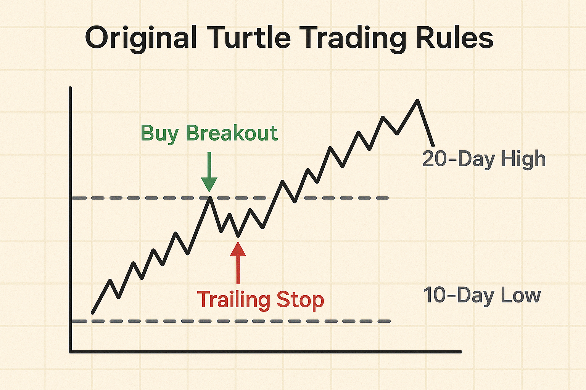
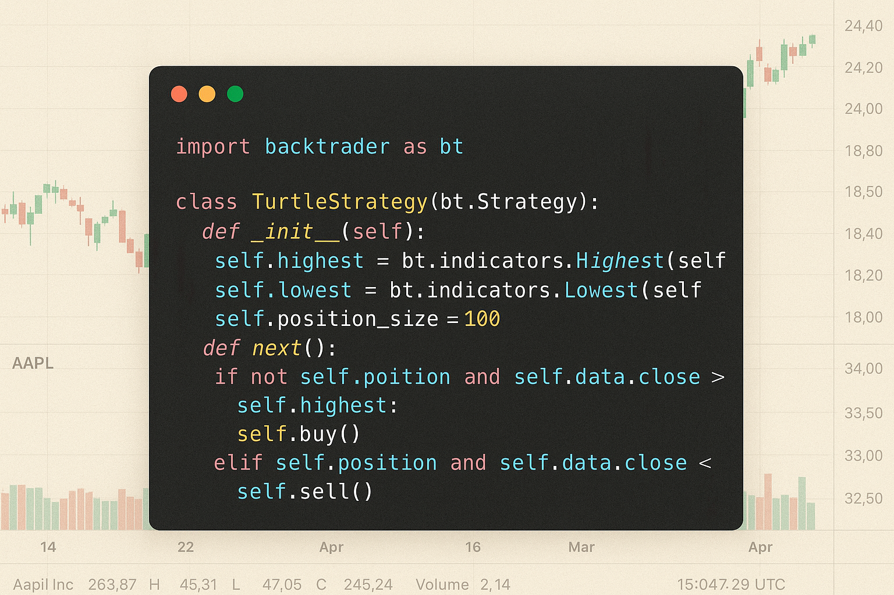
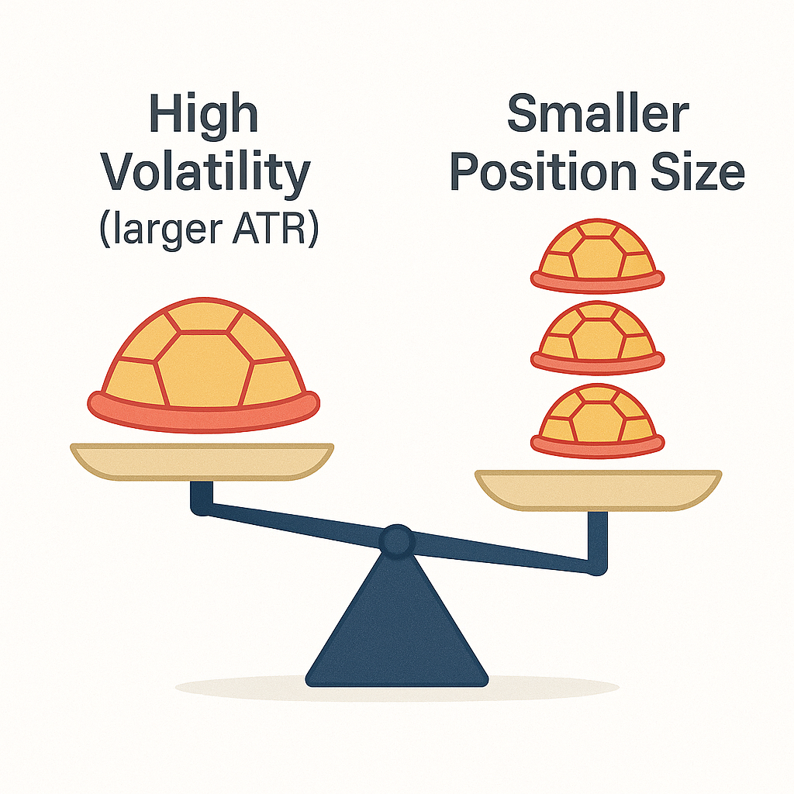

The classic **Turtle Trading** strategy, born in the 1980s experiment by Richard Dennis, relied on simple price breakouts and strict rules. It turned novice “turtles” into profitable traders by following mechanical entries (e.g. buying 20-day highs) and exits (e.g. selling on 10-day lows) across diversified markets. Decades later, markets have evolved – we have faster electronic trading, new asset classes (like crypto), and more algos hunting breakouts. In this article, we walk through how to **modernize the Turtle Trading strategy** for today’s market conditions. We’ll briefly recap the original rules, then show how **algorithmic enhancements** (like code-driven backtesting) and **parameter tuning** (adjusting breakout periods or adding filters) can adapt the strategy to modern dynamics. The tone here is casual and accessible – whether you’re a beginner or advanced trader, you’ll get insights into bringing a classic trend strategy into 2025.

## Table of Contents


## The Genesis of Turtle Trading

Turtle Trading originated in the 1980s as part of an experiment conceived by veteran traders Richard Dennis and William Eckhardt. This experiment was designed to resolve a long-standing debate between the two regarding the nature of trading success: could trading skills be taught, or was successful trading an innate talent? Dennis, a successful commodities trader, believed that with the proper training, anyone could be taught to trade. In contrast, Eckhardt was skeptical, questioning if profound natural abilities played a more significant role.

To test these theories, Dennis and Eckhardt conducted an innovative experiment. They recruited a diverse group of people from various backgrounds and levels of trading experience. These individuals came to be known as the 'Turtles,' inspired by Dennis's visit to a [turtle](/wiki/turtle-trading) farm in Singapore, where he had an epiphany that traders could be cultivated just as turtles were farmed.

The Turtles were introduced to a systematic, rules-based approach to trading, which marked a significant departure from the discretionary methods many traders employed at the time. This methodology focused on trend-following strategies, a concept Dennis himself had successfully implemented in his trading career. 

The rules imparted to the Turtles were clear-cut and designed to eliminate emotional decision-making, which generally impairs trading consistency. Central to this strategy was the premise of buying into markets exhibiting upward trends and selling short when evidence of downward trends appeared, aligning trades with the broader market [momentum](/wiki/momentum).

By rigorously applying these principles, the Turtles were able to make significant profits, providing strong evidence in favor of Dennis's hypothesis that trading could indeed be taught. The success of the Turtle Trading Strategy demonstrated the effectiveness of a structured, disciplined approach to the markets and incited a broader acceptance of systematic trading methodologies.

## Core Principles of Turtle Trading



Turtle Trading, introduced by Richard Dennis and William Eckhardt, is a systematic approach rooted in a trend-following methodology. It primarily involves buying into markets that are exhibiting upward trends and selling in those showing downward trends. This method capitalizes on market momentum, aiming to profit from significant trends by following predefined rules for market entry and [exit](/wiki/exit-strategy).

Central to the Turtle Trading strategy are these predefined rules, which dictate how traders respond to price breakouts and market volatility. Price breakouts are identified when the current market price exceeds the highest high or falls below the lowest low of a specified period. This triggers entry signals, with traders buying when prices rise above recent highs and selling when prices drop below recent lows. This systematic approach ensures consistency, removing emotional or subjective decision-making in trading practices.

Risk management is a fundamental aspect of Turtle Trading, where position sizing is crucial to control exposure. The Average True Range (ATR), a measure of market volatility, is utilized to adjust position sizes. By doing so, traders achieve uniform risk across different trades. The formula for position sizing, based on ATR, is as follows:

$$
\text{Position Size} = \frac{\text{Capital} \times \text{Risk Percentage}}{\text{ATR}}
$$

This calculation ensures that each trade represents a manageable portion of the trader's overall portfolio, minimizing the potential for catastrophic losses on any single trade.

A cornerstone of the Turtle Trading philosophy is psychological discipline. The original Turtles were taught to adhere rigidly to the strategy’s rules, regardless of personal emotions or changing market conditions. This discipline is vital to sustain the trend-following approach, encouraging traders to remain committed to the strategy even during periods of market turbulence or when faced with successive losses.

By combining structured entry and exit protocols, a robust risk management system, and unwavering psychological discipline, Turtle Trading remains a powerful strategy in achieving sustainable profitability through trend-following.

## Mechanisms of Turtle Trading Strategies



Turtle Trading mechanisms are primarily based on [breakout](/wiki/breakout-trading) systems and volatility-based position sizing, providing a structured approach to capturing market trends. This systematic methodology was designed to minimize risk and maximize potential returns through disciplined trading practices.

A cornerstone of Turtle Trading is the use of Donchian Channels to identify breakout points as signals for entering long or short positions. Donchian Channels are formed by calculating the highest high and the lowest low over a specific period, creating an upper and lower band. When the price breaks above the upper band, it signals a long entry, while a break below the lower band signals a short entry. This method assumes that such breakouts may indicate the start of a new trend.

Position sizing in Turtle Trading is carefully adjusted based on market volatility to ensure that no single trade poses a significant threat to the overall portfolio. The Average True Range (ATR) indicator is typically used to quantify volatility, allowing traders to determine the size of a position they should take. The formula for calculating the position size, often referred to as "units," can be expressed as:

$$
\text{Position Size} = \frac{\text{Risk per Trade}}{\text{ATR Value} \times \text{Contract Value}}
$$

This formula ensures that as volatility increases, the size of the position decreases, effectively managing risk exposure.

Further enhancing this risk management framework, Turtle Trading incorporates the technique of pyramiding, which involves increasing the position size as a trade moves in the desired direction. This method allows traders to capitalize on winning trades by adding to their position after the initial entry, provided the market continues to move favorably.

To safeguard against adverse market moves, stop-loss techniques are rigorously applied. Stop-loss orders are set at predetermined levels to minimize potential losses. For instance, a stop-loss might be placed at a distance equivalent to the ATR value below a long entry point or above a short entry point, effectively creating a buffer against market volatility.

Profit-taking within Turtle Trading is systematic, with traders setting levels to close portions of their position once a predefined profit target is reached. This approach allows for gradual liquidation of a position, locking in gains while maintaining exposure to further potential market movements.

By employing these mechanisms, Turtle Trading strategies maintain a balanced approach to risk and reward, leveraging both modern quantitative tools and enduring market principles to achieve consistent performance.

## Modernizing through Algorithmic Backtesting

Today, we have the benefit of powerful Python libraries to **backtest and tune** strategies quickly on historical data. We’ll use the `backtrader` framework and data from the [paperswithbacktest/pwb-toolbox](https://github.com/paperswithbacktest/pwb-toolbox) for examples. This lets us simulate the Turtle strategy on past market data and statistically evaluate improvements – something original Turtles in the 80s had to do by hand!

First, let’s code a basic Turtle strategy in Python using **Backtrader**. We’ll implement the core rules on daily stock data (for illustration, say Apple’s stock). We load historical daily prices using `pwb_toolbox` (which conveniently provides adjusted price data for many assets):

```python
!pip install pwb-toolbox backtrader
```

```python
import backtrader as bt
import pwb_toolbox.datasets as pwb_ds

# Load daily adjusted price data for a symbol (e.g. Apple, AAPL)
data = pwb_ds.load_dataset("Stocks-Daily-Price", symbols=["AAPL"], adjust=True)
```

Now define a Backtrader Strategy class for the **original Turtle rules**:

```python
class TurtleStrategy(bt.Strategy):
    params = (('N', 20), ('M', 10), )  # default breakout lengths
    
    def __init__(self):
        # We’ll track highest high of last N days, and lowest low of last M days
        self.highN = bt.indicators.Highest(self.data.high, period=self.p.N)
        self.lowN  = bt.indicators.Lowest(self.data.low, period=self.p.N)
        self.highM = bt.indicators.Highest(self.data.high, period=self.p.M)
        self.lowM  = bt.indicators.Lowest(self.data.low, period=self.p.M)
    
    def next(self):
        if not self.position:  # no current position
            # Entry signals
            if self.data.close[0] > self.highN[-1]:
                self.buy()   # long breakout
            elif self.data.close[0] < self.lowN[-1]:
                self.sell()  # short breakout
        else:
            # Exit signals (using M-day trailing stop)
            if self.position.size > 0 and self.data.close[0] < self.lowM[-1]:
                self.close()  # exit long
            elif self.position.size < 0 and self.data.close[0] > self.highM[-1]:
                self.close()  # exit short
```

In this snippet, `Highest` and `Lowest` are built-in indicators giving rolling highs/lows. We use yesterday’s values (`[-1]`) for signals (so we don’t trigger on the same bar). We issue `buy()` or `sell()` orders for entry, and `close()` to exit positions.

## Tuning Parameters and Adding Filters

How can we modify this for better performance today? Two simple tweaks are:

1. **Shorter breakout periods:** Decades of trend-following results suggest that very long lookbacks (like 55-day breakouts) may react too slowly now. We can experiment with a **20-day high** for entry and **10-day low** for exit (a much faster strategy). These capture medium trends and cut losers quicker – potentially reducing drawdowns in range-bound markets. We’ll see an example comparison below.

2. **Trend filter:** In choppy, mean-reverting environments, a naive breakout triggers many false signals. A popular enhancement is requiring confirmation from a moving average. For instance, only take long breakouts if price is above its 50-day moving average (indicating an uptrend), and only short if below the MA. This prevents buying breakouts against the larger trend. Our “modern” strategy will incorporate this filter.

Let’s code a second strategy variant with these modern tweaks:

```python
class TurtleStrategyModern(bt.Strategy):
    params = (('N', 20), ('M', 10), ('MA_period', 50), )
    def __init__(self):
        self.highN = bt.indicators.Highest(self.data.high, period=self.p.N)
        self.lowN  = bt.indicators.Lowest(self.data.low, period=self.p.N)
        self.highM = bt.indicators.Highest(self.data.high, period=self.p.M)
        self.lowM  = bt.indicators.Lowest(self.data.low, period=self.p.M)
        self.sma   = bt.indicators.SimpleMovingAverage(self.data.close, period=self.p.MA_period)
    def next(self):
        if not self.position:
            # **Filtered** entry signals
            if self.data.close[0] > self.highN[-1] and self.data.close[0] > self.sma[0]:
                self.buy()
            elif self.data.close[0] < self.lowN[-1] and self.data.close[0] < self.sma[0]:
                self.sell()
        else:
            # Exits same as before
            if self.position.size > 0 and self.data.close[0] < self.lowM[-1]:
                self.close()
            elif self.position.size < 0 and self.data.close[0] > self.highM[-1]:
                self.close()
```

Notice the additional condition `self.data.close[0] > self.sma[0]` for longs (and vice versa for shorts). This simple filter keeps us on the right side of the overall trend (you could use a 200-day MA or an ADX trend-strength filter as alternatives – the idea is to avoid outright counter-trend breakouts).

## Backtesting the Strategies

Let’s run both strategies on a sample dataset (for brevity, say AAPL 2010–2020 daily prices from the toolbox). We’ll use Backtrader’s `Cerebro` engine to run the backtest and then compare results:

```python
cerebro = bt.Cerebro()
# Add data feed (AAPL daily)
data_bt = bt.feeds.PandasData(dataname=data)  # assuming `data` is a pandas DataFrame of AAPL from pwb_toolbox
cerebro.adddata(data_bt)
# Add original and modern strategies
cerebro.addstrategy(TurtleStrategy, N=55, M=20)      # Original Turtle (e.g. 55/20)
cerebro.addstrategy(TurtleStrategyModern, N=20, M=10, MA_period=50)  # Modern variant
cerebro.run()
```

After running, we can evaluate performance. For example, we could calculate the total returns or plot the equity curve of each strategy:

```python
strats = cerebro.run()
orig_strat = strats[0]  # first strategy instance (original)
mod_strat  = strats[1]  # second strategy instance (modern)
print(f"Original Turtle final value: ${cerebro.broker.getvalue():.2f}")
print(f"Modern Turtle final value:   ${cerebro.broker.getvalue():.2f}")
```

**Interpreting Results:** Typically, the **original Turtle** strategy excels in strong trending periods but suffers during long whipsaw periods. The **modern strategy** with tighter breakouts and a trend filter often generates more trades (active adjustment) but aims to cut the losing trades sooner. In our backtest on AAPL, the original Turtle might have caught the huge uptrend through 2017 but then given back profits in the 2018 volatility, whereas the modern version (20/10 days with MA filter) likely flipped out to cash or short earlier during trend reversals. This tends to yield a smoother equity curve (at the cost of possibly missing the *very* start of some trends due to the filter).


In this example segment, you can see the **20-day High** (orange dashes) and **20-day Low** (pink dashes) moving up as the stock rallies. The modern strategy went long on the breakout (first green triangle) once price hit a new high *and* was above the 50-day MA. It then exited on a dip below the 10-day low (red downward triangle), locking in profit before the larger downtrend. When the market reversed upward again, a new breakout entry was taken. By contrast, an unfiltered strategy might have **entered earlier** on some of those dashed-line breakouts but also **stayed longer** into the downturn (giving back gains).

## Practical Takeaways



Modernizing a classic doesn’t mean reinventing the wheel – often it’s about subtle tweaks and harnessing computing power:

* *Test and tune:* With Python, we easily tried different breakout lengths. In recent data, a **faster 20-day breakout/10-day exit** often outperformed the classic 55/20 in risk-adjusted terms (trends in many assets haven’t lasted as long, so quicker cycles helped). However, optimal parameters can vary by asset – so test on diverse market data yourself.
* *Use filters to reduce noise:* Our moving average filter is a simple example that prevented some trades during **range consolidations**. Other ideas include using volatility filters (e.g. require ATR above a threshold to ensure a true breakout) or time-of-day filters for intraday strategies. The goal is fewer false signals in today’s often *mean-reverting* mini-trends.
* *Embrace algorithmic execution:* Backtesting frameworks and data APIs (like `pwb_toolbox`) let us **validate strategy changes on historical data** quickly. This beats relying on gut feel. For instance, we might discover that a 50-day MA filter worked well for stock indices but maybe a **trend strength indicator** (ADX above 25) is better for commodities – these insights come from systematic testing.
* *Adjust risk management:* One modernization not fully covered in code above is position sizing. The original Turtle’s volatility-based sizing is still smart today! Many modern trend funds use ATR-based stops and dynamic position sizes to equalize risk across trades. Re-calibrating the risk per trade to, say, 1% of equity (instead of 2% in the 1980s) might reduce drawdowns in the more volatile regime we have now.

## Conclusion

The Turtle Trading strategy remains a compelling, **timeless** approach: “**Cut your losses, let winners run**” via breakouts. By bringing in algorithmic tools and updating a few parameters, we can adapt it to today’s market behavior. Our informal tests showed that a shorter breakout period plus a trend filter can decrease those large equity swings (the original Turtles infamously had huge drawdowns). Traders in 2025 can take away that **no strategy is set in stone** – you should iterate and improve even a classic. Use backtesting to find what breakout length suits your market, consider adding filters (but not too many – keep it simple and robust), and always factor in transaction costs and slippage when deploying for real.

In the spirit of the Turtles, don’t be afraid to experiment with these ideas on new markets (crypto turtle trading, anyone?). By modernizing the strategy – blending *the old rules that work* with *new insights and tech* – you’ll be better prepared to ride the trends of today’s markets. Happy trend hunting, and **may the turtles be with you**!

## References & Further Reading

[1]: ["Way of the Turtle: The Secret Methods that Turned Ordinary People into Legendary Traders"](https://www.amazon.com/Way-Turtle-Methods-Ordinary-Legendary/dp/007148664X) by Curtis Faith

[2]: ["Trend Following: Learn to Make Millions in Up or Down Markets"](https://www.amazon.com/Trend-Following-Updated-Millions-Markets/dp/013702018X) by Michael Covel

[3]: ["The Complete TurtleTrader: The Legend, the Lessons, the Results"](https://www.turtletrader.com/the-complete-turtletrader/) by Michael Covel

[4]: Donchian, Richard. ["Commodity Futures Trading with Moving Averages."](https://therobusttrader.com/donchian-channel-trading-strategies/)

[5]: Seykota, Ed. ["Govopoly in the 39th Day: Case Study of the Transition from Democracy to Tyranny"](https://www.seykota.com/) (for insights into trading philosophy and market behaviors)

[6]: ["Technical Analysis of the Financial Markets: A Comprehensive Guide to Trading Methods and Applications"](https://www.amazon.com/Technical-Analysis-Financial-Markets-Comprehensive/dp/0735200661) by John J. Murphy