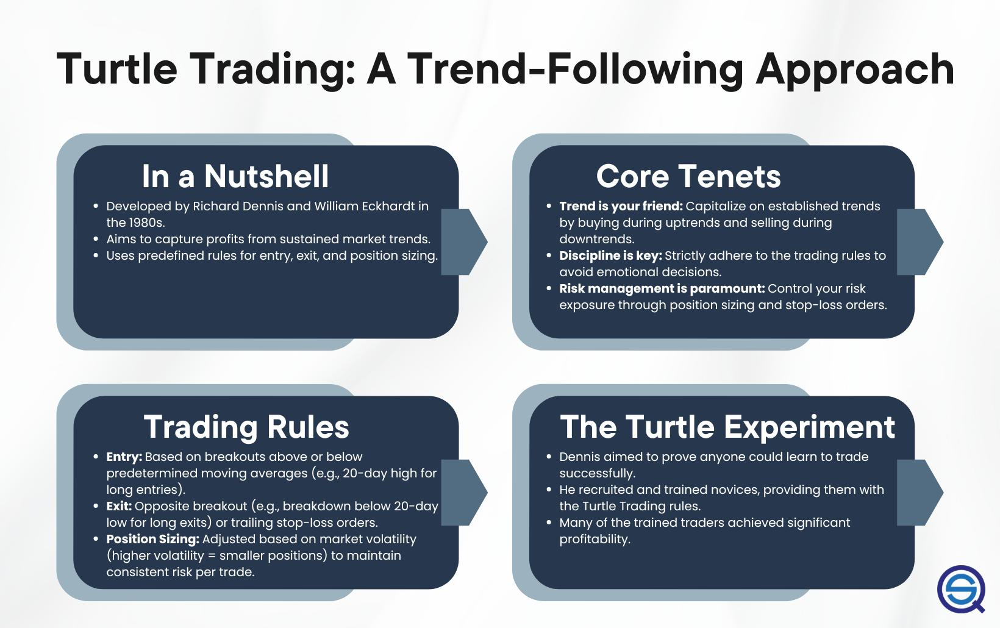

The financial markets are continually evolving with a plethora of trading strategies designed to maximize gains and minimize risks for investors. Among these strategies, Turtle Trading stands out due to its historical significance and continued relevance. Originating in the 1980s, Turtle Trading was the result of an intriguing experiment by Richard Dennis and William Eckhardt. Their aim was to establish whether successful trading was an innate ability or could be taught through systematic methods.

The strategy heralded a breakthrough in trend-following methodologies and captured the attention of traders worldwide due to its simple yet effective rule-based approach. Over the years, Turtle Trading has demonstrated robustness, navigating various market cycles and proving that disciplined trading strategies can yield substantial profits.



As financial markets undergo technological advancements, with algorithmic and automated trading systems dominating the landscape, Turtle Trading offers valuable insights. Its principles, based on clarity and discipline, provide a robust foundation that aligns well with modern algorithmic trading techniques. This article will explore the origins, core principles of Turtle Trading, and its relevance in today's dynamic and technology-driven trading environments.

## Table of Contents

## The History of Turtle Trading

Turtle Trading emerged as the result of a groundbreaking experiment designed to explore whether trading success depended solely on innate talent or if it could be taught systematically. This experiment was spearheaded in 1983 by Richard Dennis and William Eckhardt, two prominent figures in the world of commodities trading. 

Richard Dennis, renowned for amassing enormous wealth through trading at a young age, held the belief that anyone could be taught to trade successfully. Conversely, his partner, William Eckhardt, was skeptical and argued that there existed an intrinsic skill set that successful traders naturally possessed. In order to resolve this debate, the two devised an experiment where they would teach a group of individuals a defined set of trading rules and evaluate their performance in markets. These participants, known as the "Turtles", were selected from a variety of backgrounds, many of whom had no prior trading experience.

The Turtles were introduced to a trend-following strategy that emphasized simplicity and consistency. This strategy was based on several core instructions, such as determining market entry and exit points by analyzing historical price movements. They utilized specific indicators, most notably moving averages, to identify trends and predict future price movements. By adhering to these systematic rules, the Turtles were able to make informed decisions devoid of emotional influence, which is often cited as a common pitfall in trading.

Remarkably, the experiment yielded stunning results, with the Turtles generating substantial profits over a short period. This success underscored the potential of systematic trading and validated Dennis's hypothesis that trading proficiency could indeed be taught. The lessons gained from the Turtle experiment have since influenced trading strategies extensively, forming a foundation for numerous systematic approaches in both traditional and [algorithmic trading](/wiki/algorithmic-trading) environments. 

Ultimately, the Turtles' success demonstrated the effectiveness of a disciplined, rules-based strategy in capturing market trends, proving that with the right framework and adherence to strategic principles, individuals could achieve remarkable success in the financial markets.

## Fundamental Principles of Turtle Trading

Turtle Trading operates on a well-defined set of rules designed to capitalize on market trends through systematic entry and [exit](/wiki/exit-strategy) strategies. The core principle is to identify and follow significant price movements over a specified period. The system primarily employs a trend-following approach, which involves initiating long or short positions based on the breach of predetermined price levels.

A critical component of Turtle Trading is position sizing, which is meticulously calculated based on market [volatility](/wiki/volatility-trading-strategies). This strategy employs the Average True Range (ATR) as a key indicator to determine the volatility and adjust the size of the trading position accordingly. The ATR is computed using the formula:

$$
\text{ATR} = \frac{1}{n} \sum_{t=1}^{n} TR_t
$$

where $TR$ (True Range) is the maximum of:
- The current high minus the current low
- The absolute value of the current high minus the previous close
- The absolute value of the current low minus the previous close

This calculation helps traders assess the market's volatility, enabling them to adjust their position size to maintain a consistent level of risk across trades. For instance, in more volatile markets, a trader might reduce their position size to limit exposure, while in less volatile markets, they might increase it to take advantage of the stability.

Discipline forms the bedrock of Turtle Trading, crucial to the strategy’s success. Traders must adhere strictly to the predefined set of rules, avoiding deviations that could lead to emotionally-driven decisions. This includes waiting for the system’s signals before entering or exiting trades and maintaining a consistent approach regardless of market fluctuations. By removing emotional biases, traders align their actions with the systematic nature of the strategy, which is designed to exploit inefficiencies and trends in financial markets.

Overall, the fundamental principles of Turtle Trading emphasize structured decision-making, rigorous risk management through volatility-based position sizing, and unwavering discipline, ensuring a methodical approach to trading that can be replicated across different market conditions.

## Turtle Trading in Modern Financial Markets

Turtle Trading has demonstrated enduring adaptability within modern financial markets, particularly with its integration into algorithmic trading systems. Initially crafted as a manual strategy, its rules-based foundation is well-suited to automation, allowing traders to exploit computational power for rapid data processing and decision-making. Key to this integration is the employment of algorithms that can execute trades based on pre-defined criteria, such as breakouts and [trend following](/wiki/trend-following), without human intervention.

Algorithmic trading platforms benefit from the systematic nature of Turtle Trading, providing a structured framework for developing trading algorithms. This compatibility allows for the implementation of strategies that can identify potential market trends and execute trades at speeds unattainable by manual trading. High-frequency trading ([HFT](/wiki/high-frequency-trading-strategies)) is one such area where the principles of Turtle Trading have been effectively applied, as it requires detecting and responding to market shifts in fractions of a second.

Modern trading platforms often incorporate advanced analytical tools and [machine learning](/wiki/machine-learning) algorithms to enhance the traditional Turtle strategy. These platforms can process vast amounts of market data, applying statistical analyses and pattern recognition to refine entry and exit signals. This integration helps traders adapt to the increasingly complex and dynamic nature of financial markets, allowing them to adjust their strategies in response to shorter trend durations and more volatile conditions.

An example of such an implementation could involve a Python script using libraries like Pandas for data handling and NumPy for numerical computations. For instance:

```python
import pandas as pd
import numpy as np

# Load market data
data = pd.read_csv('market_data.csv')

# Calculate the 20-day high and low
data['20d_high'] = data['Close'].rolling(window=20).max()
data['20d_low'] = data['Close'].rolling(window=20).min()

# Generate signals for breakout
data['Signal'] = np.where(data['Close'] > data['20d_high'], 1, 
                          np.where(data['Close'] < data['20d_low'], -1, 0))

# Backtest signals
data['Position'] = data['Signal'].shift()
data['Returns'] = data['Close'].pct_change()
data['Strategy_Returns'] = data['Returns'] * data['Position']
cumulative_returns = (1 + data['Strategy_Returns']).cumprod()

print(cumulative_returns)
```

This script calculates [breakout](/wiki/breakout-trading) signals based on historical price data, allowing trades to be conducted when the market exceeds recent highs or lows, a fundamental concept in Turtle Trading. By automating these processes, traders can efficiently capture market opportunities while minimizing emotional biases.

In conclusion, by embracing technological advancements, Turtle Trading continues to offer valuable insights and methodologies for engaging with contemporary financial markets.

## Advantages and Challenges

Turtle Trading offers distinct advantages, particularly the clarity and predictability intrinsic to its rules-based approach. This systematic nature reduces the emotional risks often associated with discretionary trading. By adhering to predetermined entry and exit points, traders can maintain objectivity and consistency, which are crucial in volatile market conditions. The reliance on quantifiable data allows traders to focus on executing trades rather than second-guessing decisions based on market rumors or personal biases. The original strategy didn't rely extensively on complex indicators or subjective judgment, making it accessible and easier to implement and backtest.

However, Turtle Trading faces several challenges in contemporary financial markets. One of the primary issues is the decreased duration of market trends. The original strategy thrived on sustained trends, but today’s markets are often characterized by rapid reversals and shorter trend cycles. This change requires traders to adapt the original Turtle rules to suit the fast-paced nature of modern trading environments. Modifications such as adjusting the length of moving averages or recalibrating breakout thresholds are necessary to align with the current market volatility and trend dynamics.

Moreover, the successful application of the Turtle Trading strategy now requires integrating traditional principles with contemporary technologies. Modern algorithmic trading platforms provide enhanced tools for implementing Turtle Trading mechanisms. These tools include high-frequency trading systems that can execute trades in milliseconds, as well as advanced data analytics for more accurate trend detection and risk management. Traders can leverage these technologies to refine their strategies, utilizing historical data analysis and real-time market data feeds to adapt swiftly to changing market conditions.

In conclusion, while Turtle Trading remains a powerful strategy thanks to its disciplined approach, its successful implementation in today’s market requires thoughtful adaptation. Balancing its original rules with technological advancements enables traders to harness its strengths while mitigating the challenges posed by modern market complexities.

## Conclusion

Turtle Trading remains a testament to the power of systematic trading strategies. By adhering to a set of rules that prioritize trend-following and disciplined decision-making, Turtle Trading has demonstrated its resilience and effectiveness over the decades. One of the core strengths of Turtle Trading lies in its potential for integration with modern algorithmic trading frameworks. These systems leverage computational power to automate decision-making processes, which enhances precision and speed while reducing the emotional biases often encountered in manual trading.

Incorporating Turtle Trading principles into algorithmic strategies provides a robust toolset for navigating the complexities of contemporary financial markets. Traders can utilize algorithms to implement strategies with efficiency, enabling high-frequency trading and more accurate trend detection. This technological synergy allows for better handling of large datasets, [backtesting](/wiki/backtesting) strategies, and optimizing positions, all of which are central to maintaining a systematic approach.

Despite substantial evolutions in market dynamics, the core idea underpinning Turtle Trading—following market trends with discipline—continues to offer timeless value. As trading environments become increasingly sophisticated, the necessity for a disciplined, rule-based approach gains prominence. This underscores the lasting impact and adaptability of Turtle Trading principles, confirming their relevance and utility in facilitating strategic decision-making in today's fast-paced trading landscape. The strategy serves as a foundational component for traders aiming to capitalize on market trends sustainably and efficiently.

## References & Further Reading

[1]: ["Way of the Turtle: The Secret Methods that Turned Ordinary People into Legendary Traders"](https://www.amazon.com/Way-Turtle-Methods-Ordinary-Legendary/dp/007148664X) by Curtis Faith

[2]: Covel, M. (2009). ["Trend Following: Learn to Make Millions in Up or Down Markets"](https://www.amazon.com/Trend-Following-Updated-Millions-Markets/dp/013702018X)

[3]: ["The Complete TurtleTrader: The Legend, the Lessons, the Results"](https://www.amazon.com/Complete-TurtleTrader-Legend-Lessons-Results/dp/0061241709) by Michael Covel

[4]: ["High-Frequency Trading: A Practical Guide to Algorithmic Strategies and Trading Systems"](https://www.ahmetbeyefendi.com/wp-content/uploads/2020/07/High-Frequency-Trading-Irene-Aldridge.pdf) by Irene Aldridge

[5]: Rishi K. Narang. ["Inside the Black Box: The Simple Truth About Quantitative Trading"](https://www.amazon.com/Inside-Black-Box-Quantitative-Trading/dp/0470432063)

[6]: ["Trading and Exchanges: Market Microstructure for Practitioners"](https://archive.org/details/tradingexchanges0000harr) by Larry Harris