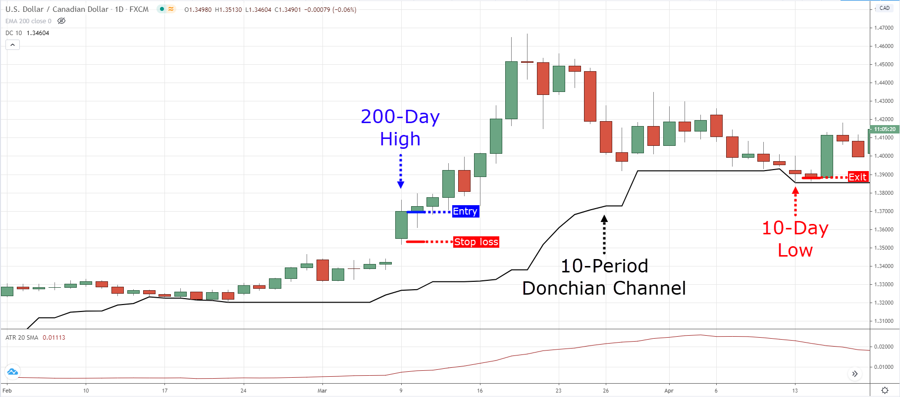
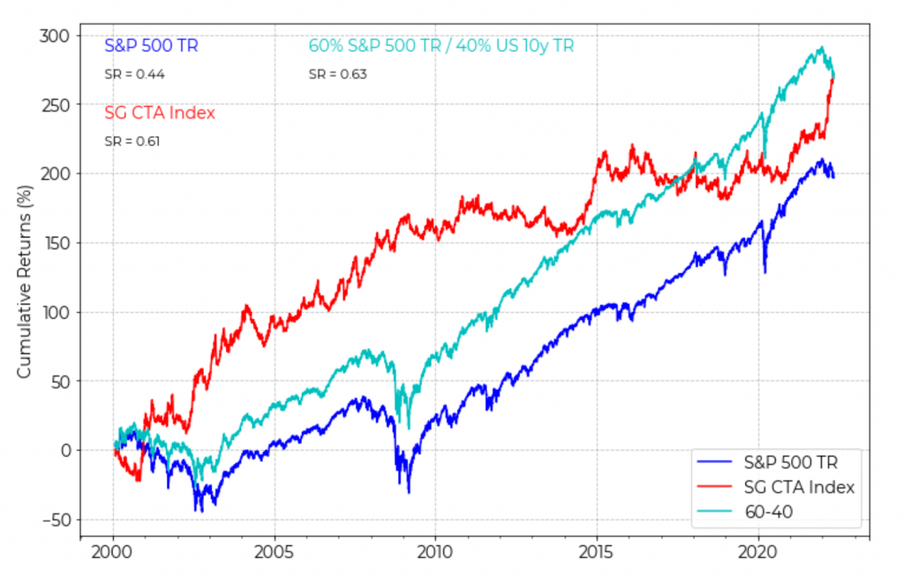
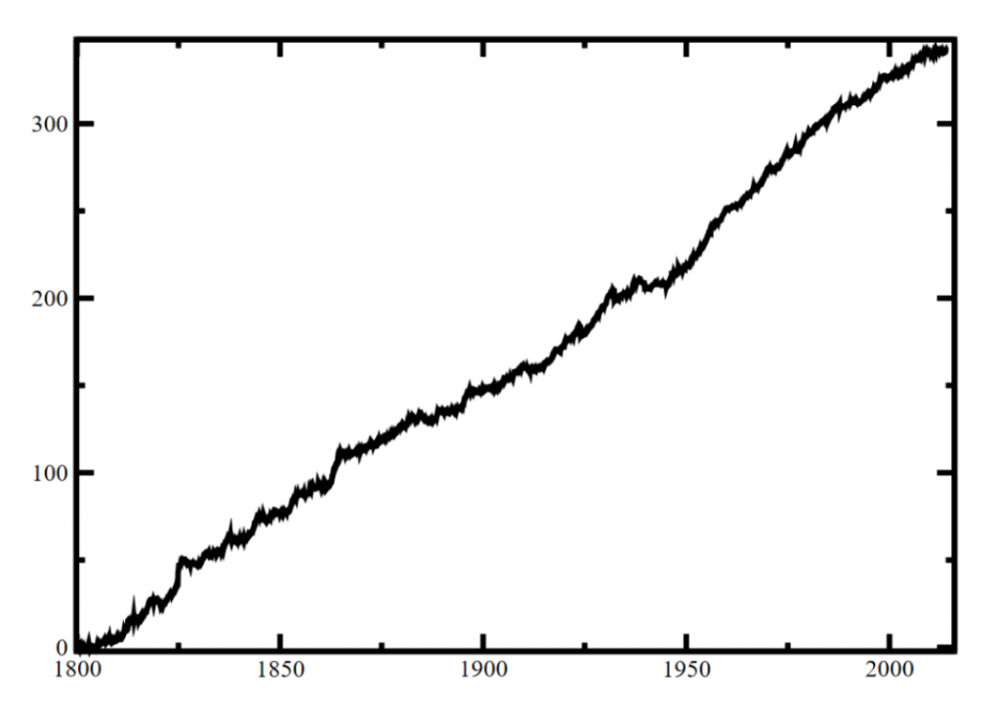

In the early 1980s, the world of commodity trading would witness a fascinating experiment that would eventually become legendary in the annals of trading history. Richard Dennis, a renowned commodities speculator known for his acute market insights, embarked on an intellectual venture that challenged the notion of whether trading prowess was an innate gift or a skill that could be taught. The genesis of what is now known as Turtle Trading began with a bet between Dennis and his long-time friend William Eckhardt.

Dennis, having turned a modest loan of $1,600 into over $200 million through his savvy trades, firmly believed that anyone could be taught to trade effectively. Eckhardt, on the other hand, was skeptical, positing that Dennis's success was more attributable to his natural intuition than to a replicable methodology. To settle the debate, they initiated the Turtle Trading experiment in 1983.

The historical context here is critical: this was a time preceding the internet boom, when trading was more esoteric, and the secrets of the trading floor were closely guarded. Dennis and Eckhardt's experiment offered a rare peek into these secretive methods. They placed advertisements in The Wall Street Journal and The New York Times seeking trading apprentices. From over a thousand applicants, they selected 23 individuals from diverse backgrounds, famously referred to as the "Turtles," a nod to Dennis’s trip to a turtle farm in Singapore, where he mused that traders could be "grown" as quickly and efficiently as farm-bred turtles.

The primary components of the strategy they were taught hinged on systematic rules-based trend following. The turtles were schooled in identifying sustained movements in futures markets, entering positions during breakouts, and cutting losses or securing profits at predetermined points. Position sizing was calculated using the market's volatility to manage risk effectively. What made this system particularly revolutionary was its simplicity and quantifiable nature. It used specific criteria to generate entry and exit signals, thereby reducing the influence of emotion—a critical factor in the often turbulent trading environment.

The significance of Turtle Trading lies in its enduring legacy. Despite the substantial evolution of markets, the core tenet of trend following has remained a staple among trading strategies. This is evidenced by the fact that during a tumultuous period for hedge funds, the original turtle traders, who continued to apply the principles taught by Dennis, reportedly earned an average return of 80% per annum [1].

Thus, Turtle Trading is more than just a historical anecdote; it is a testament to the power of disciplined, systematic trading, and its principles are just as relevant—and perhaps even more crucial—in today's algorithm-driven market landscape.

## Table of Contents

## The Genesis of Turtle Trading

Richard Dennis, a commodities speculator with a track record for incredible profits, was a man on a mission to prove a point. His proposition was deceptively simple: Trading could be taught to anyone with the right instruction and rule set, regardless of previous financial knowledge. This bold assertion was the cornerstone of what would come to be known as Turtle Trading.

In 1983, Dennis, together with his business partner William Eckhardt, began the Turtle Trading experiment. It was an educational and financial venture to see if novices could become successful traders using a specific set of rules. To find their candidates, they posted advertisements seeking individuals interested in learning his trading methods. From numerous applicants, they selected 23 individuals, referred to as "Turtles," a term Dennis coined after a visit to a turtle-breeding farm in Asia, inspired by the notion of "growing traders" as farmers grow turtles.

The original group of Turtles came from a wide array of backgrounds, ranging from professional card players to game designers and finance professionals. Among them were notable traders such as Jerry Parker, the most successful Turtle who went on to found Chesapeake Capital, and Liz Cheval, who was the first woman invited to join the program and later became a successful commodities trader.

The philosophy behind the experiment rested on the bedrock principle of trend following - the strategy of choosing market direction and sticking with that direction like glue until the trend proved to be over. Dennis believed that by following trends, utilizing strict money management rules, and having the discipline to follow a specific set of rules, success in the markets could be achieved regardless of market conditions. This philosophy was contrary to the prevailing belief of the time that market success was a result of intuition or an innate talent.

Dennis' rules for the Turtles were precise. They involved buying a market when it reached a 20-day high and selling when it fell to a 20-day low, managing the size of trade positions according to market volatility, and risking only 2% of their capital on any single trade. These rules were meant to ensure that the Turtles only bet small amounts of their bankroll and reduced their positions when the market volatility increased, preventing catastrophic losses.

The philosophy also extended to risk control and the psychological endurance required to allow profits to run and cut losses promptly. Dennis taught the Turtles to be risk-averse, to think about what could go wrong before considering the potential for profit. The wisdom here was to prepare the Turtles to survive the financial uncertainty they would inevitably face and equip them with the emotional fortitude required to adhere to a long-term plan.

The experiment was a financial and educational success, showing that with a firm grounding in the principles of risk management and a strict adherence to rules, anyone could become a successful trader. The legacy of the Turtle Trading experiment is the enduring idea that discipline, coupled with a scientifically tested methodology, is the foundation upon which successful trading careers are built. The Turtles themselves became proof of this, many going on to lead prolific trading careers, underscoring the impact and potential of the principles they were taught.

## Core Principles of Turtle Trading

The core principles of Turtle Trading form a methodology that’s both strict and systematic, aimed at capturing trends based on predefined signals while managing risk meticulously. Richard Dennis, the architect of the Turtle Trading strategy, built it around a framework of rules that were simple to follow but disciplined in nature.



**Original Rules Breakdown**

The original Turtle Trading rules revolve around a concept called 'breakout trading', which signifies entering the market when prices move beyond a certain threshold. The Turtles would enter a long position (buy) when the price exceeded the high of the previous 20 days or take a short position (sell) when it dropped below the low of the last 20 days. Mathematically, this can be represented as:

- Entry Long: If Price today > High of the Last 20 Days, then Buy.
- Entry Short: If Price today < Low of the Last 20 Days, then Sell.

These simple price channels, known as Donchian Channels, are pivotal to the Turtle methodology and can be expressed using the formula:

$\text{Donchian Channel} = \text{Max/Min}(\text{High/Low over last N periods})$

**Position Sizing and Risk Management**

Central to the Turtles' success was rigorous risk management, particularly their rule on position sizing. The Turtles used the Average True Range (ATR), a measure of market volatility, to determine the size of their trading units. A single unit would be the amount they could trade based on a 1% ATR of the market price. For a given market with price $P$ and ATR $A$, a unit size $U$ could be calculated as:

$U = \frac{Account Equity \times Risk Percentage}{A \times Dollar Volatility}$

Where $DollarVolatility = P \times A$, and Risk Percentage typically 1% or 2% of account equity.

**Entry and Exit Strategies**

After entering a position, the Turtles implemented a pyramiding strategy, adding to the trade in increments of 1/2 N as the price moved in their favor, not to exceed four units total to prevent overexposure.

For exit strategies, the Turtles set stop losses at 2 N below the entry for long positions and above the entry for short positions. They would also exit positions when the price broke a 10-day high or low, depending on whether they were short or long, in essence reversing their breakout entry signal.

**Trend Following Methodologies**

The crux of the Turtle system was a trend-following strategy that capitalizes on large and sustained price movements. The idea was not to predict or anticipate trends but to respond to them with the assurance that many small losses could be outweighed by large and infrequent gains on major trends.

**Psychological Discipline**

An often-underestimated aspect of the Turtle Trading system is the psychological discipline required to follow the rules without deviation. Dennis stressed the importance of following the system with an almost stoic calm, ignoring the emotional swings that financial markets can induce.

Psychological resilience was quantified in terms of sticking to the defined risk parameters and not deviating from the system due to market noise or personal beliefs about where the market is heading. This can be summarized by the Turtles' mantra:

> "Follow the rules, follow the system. Success is a function of your discipline."
> 

## Mechanisms of Turtle Trading Strategies

The mechanisms of Turtle Trading strategies hinge on robust systems designed to capitalize on market trends through breakout signals, strategic position sizing, and calculated entry/exit approaches. Understanding these components is critical for any trader aiming to implement the Turtle Trading methods.

**Breakout Systems**

Turtle Traders predominantly used a breakout system for signal generation. This system relied on the price of an asset breaking above or below the 20-day or 55-day Donchian Channel to initiate a buy or sell trade, respectively. The system is formulaic:

- Long Entry = Price breaks above the 20-day high.
- Short Entry = Price breaks below the 20-day low.

For a more conservative approach, the 55-day parameter could be applied.

**Volatility-Based Position Sizing**

Position sizing was central to the Turtles' risk management strategy, determined by market volatility. Using the Average True Range (ATR), a metric that captures the degree of price volatility, the Turtles would adjust the size of their trade. The idea was to normalize the volatility of different markets, allowing for consistent risk management across trades. The position size $P$ was defined as:

$P = \frac{N \times Account Equity}{ATR}$

Here, $N$ is the risk factor decided by the trader, often 1% of the account equity, ensuring no single trade could incur a loss greater than the predetermined risk threshold.

**Pyramiding Strategies**

The Turtles employed a pyramiding strategy, adding to their positions as the market moved in their favor, but only up to a maximum of four units to avoid overexposure. Each additional unit could be added for every $\frac{1}{2} ATR$ price move in the profitable direction, creating an opportunity for compounded growth while maintaining risk control.

**Stop-Loss Techniques**

Stop-loss orders were integral to the Turtle strategy, placed at 2 ATRs away from the entry price. This allowed the Turtles to limit their losses on any given trade while providing enough market "breathing room." The calculation for a stop-loss level $S$ on a long position entered at price \( E \) is:

$S = E - (2 \times ATR)$

This strategy aimed to prevent the emotion-driven decisions that often lead to larger losses or the cutting of profitable trades too early.

**Profit-Taking Methods and Exit Rules**

Profit-taking for the Turtles was as systematic as their entry strategy. They would exit trades when the price action moved against the trend by a certain amount, typically the 10 or 20-day low for long positions and the 10 or 20-day high for short positions, effectively reversing their breakout strategy for exits.

**Math Formulas**

The systematic nature of the Turtle Trading strategy is encapsulated in its use of clear-cut mathematical formulas for its decision-making process. The reliance on these formulas ensures a discipline in trading that minimizes emotional decisions and maintains consistency in approach, key aspects that contributed to the enduring success of the original Turtle Traders[2][3].

## The Turtle Trading Tools

The Turtle Trading system is grounded in the utilization of specific tools and indicators that guide traders in identifying trends, signals, and setting risk parameters. At the heart of these tools is the Donchian Channel, which was developed by futures trader Richard Donchian. It is essentially a moving average indicator that plots the highest high and the lowest low over a set number of days, typically 20 days for the Turtles. Traders would consider a breakout above the upper band as a buy signal and a breakdown below the lower band as a sell signal[4].

Beyond the Donchian Channel, Turtles employed other technical indicators to confirm signals and refine their strategies. The Moving Average Convergence Divergence (MACD) is one such tool, used to gauge momentum and potentially confirm the presence of a trend. Similarly, the Relative Strength Index (RSI) serves to measure the speed and change of price movements, offering insight into overbought or oversold conditions. Bollinger Bands provide additional layers of trend analysis, with price movements towards the bands' edges signaling potential breakout or breakdown scenarios.

The precision of the Turtle Trading strategy relies heavily on historical price data, making backtesting a critical component of the system. Backtesting software allows traders to simulate a trading strategy against real historical prices to gauge its efficacy. Databases for historical price data are crucial in this aspect, feeding the backtesting software with quality data that spans significant timeframes and various market conditions[5].

In today's trading landscape, the core philosophy of the Turtle Trading system remains intact, but the tools have evolved. Modern traders have access to advanced software platforms that emulate the Turtle strategy, integrating the traditional indicators with real-time analytics, machine learning algorithms for pattern recognition, and sophisticated risk management modules.

Platforms such as TradeStation, MetaTrader, and Python-based backtesting frameworks like backtrader and QuantConnect, provide environments where traders can build, test, and execute Turtle-like strategies with precision. These platforms often come equipped with their own databases, or they can integrate with external data sources like Quandl or Bloomberg, to provide robust datasets for analysis.

## Evolution of Turtle Trading in Modern Markets

Turtle Trading has proven adaptable to the evolving landscape of financial markets. The original Turtle rules, designed primarily for commodity futures markets in the 1980s, have since been tweaked to cater to the complexities of today's highly volatile and technology-driven markets. Modern Turtle Traders often modify the length of the breakout signals, use more sophisticated risk management algorithms, and incorporate new asset classes, such as exchange-traded funds (ETFs), into their portfolios.

One significant adaptation has been the application of Turtle Trading principles to the cryptocurrency market. Cryptocurrencies, known for their extreme volatility and 24/7 trading, present a fertile ground for trend-following strategies. Turtles’ methods of cutting losses short and letting profits run align well with the swift and sizable moves observed in crypto markets. However, given the increased volatility, modern Turtles may adjust position sizes accordingly to manage risk more effectively.

Further adaptations include adjusting the entry and exit thresholds to accommodate the higher noise-to-signal ratio in today's markets, employing more granular time frames for analysis, and adapting to the decentralized nature of assets like cryptocurrencies. Turtle Traders now might also incorporate social media sentiment analysis, blockchain transaction data, and liquidity considerations into their decision-making process, a pivot from the relatively straightforward technical analysis of the past.

Interviews with contemporary traders who implement Turtle strategies reflect a consensus that the core philosophy of trend following remains robust. For instance, Jerry Parker, one of the original Turtles and now a successful fund manager, has spoken in interviews about the continued relevance of the Turtle Trading system and how it can be applied in today’s market conditions. He emphasizes the importance of not overfitting the strategy to past data and remaining adaptive to market changes.

According to Michael Covel, author of "The Complete TurtleTrader," the story of the Turtles is not just about a set of rules but about the concept of teaching discipline and systematic thinking, which are still applicable today. He has collected a wealth of conversations and data showing the strategy's applicability across various asset classes and time frames.


Adaptations also factor in the influence of algorithmic and high-frequency trading (HFT) practices. Turtle Trading in its traditional form might not compete on the speed level with HFT, but the principles of riding long-term trends can still be applied successfully, particularly as a counterbalance to the market noise generated by short-term trading algorithms.

The survival and evolution of Turtle Trading in modern markets is a testament to the system's solid foundations. These foundational principles, alongside continuous refinement in response to new market dynamics, have allowed Turtle Trading to remain a valuable strategy for traders in the contemporary era.

## Comparative Analysis

Turtle Trading's performance, when juxtaposed with modern trading strategies, illuminates the enduring nature of trend-following despite the advent of complex algorithms and high-frequency trading (HFT). A study by the Social Science Research Network (SSRN) scrutinizes the profitability of technical trading rules against buy-and-hold strategies, confirming that trend-following systems, akin to Turtle Trading, still capture significant profits from major asset markets.

Analyzing the statistical significance of Turtle Trading results involves looking at long-term performance data. The CTA Index, which represents commodity trading advisors and can serve as a proxy for trend-following strategies, often shows a low correlation to traditional asset classes and can outperform during market crises. This was evident during the financial crisis of 2008, where trend-following strategies generally performed well while traditional assets suffered.

However, it is crucial to highlight that Turtle Trading, which emphasizes longer-term position holding, is conceptually at odds with the ultra-short-term outlook of HFT. Turtle Trading strategies traditionally benefit from sustained trends, whereas HFT profits from arbitrage opportunities that exist for milliseconds. Despite this, the viability of Turtle Trading in the context of HFT can be considered from the angle of liquidity provision. While HFT may create noise, Turtles could potentially leverage the volatility and market inefficiencies this noise creates to enter and exit positions profitably.

The research by Lintner (1983) and later Fung and Hsieh (2001) adds to the empirical evidence supporting the performance of trend-following strategies. They documented that managed futures, which include a significant trend-following component, have provided substantial risk-adjusted returns that are relatively uncorrelated with the returns of other asset classes.

In an environment dominated by computerized trading, the simplicity of the Turtle Trading system can seem antiquated, yet it remains effective. The strategy’s reliance on breakouts beyond a certain range, as originally established by the Donchian Channel, means that Turtle Trading strategies can still identify and exploit long-term trends regardless of market conditions.

Moreover, quantifying the risk and return of Turtle Trading systems compared to modern trading strategies through Sharpe ratios and maximum drawdowns can show competitive performance. The Sharpe ratio of Turtle Trading strategies, which measure the excess return per unit of risk, has often been comparable to, if not better than, many active and passive investment strategies over longer periods.




## Psychological and Behavioral Considerations

The mental fortitude required for long-term trend following, as exemplified by Turtle Trading, is significant. Traders must cultivate a mindset that allows them to withstand the inevitable drawdowns and periods of underperformance that are inherent in a trend-following approach. This psychological resilience is rooted in a deep trust in the statistical edge that the system provides over a large number of trades. The original Turtle Traders were trained to follow the rules mechanically, reinforcing the discipline needed to execute trades without succumbing to emotional biases.

Traders are often their own worst enemies, and the psychological aspect of trading can be the hardest to master. Turtle Trading, with its long-term outlook, requires an adherence to the system even when it goes against the grain of prevailing market sentiment or personal intuition. The Turtles were taught to ignore market noise and to focus on the bigger picture, which often meant taking contrarian positions. It's a mental game of probability, not certainty, and the Turtles' success was as much about their psychological makeup as it was about their strategy.

The stories of original Turtle Traders, such as Jerry Parker of Chesapeake Capital and Liz Cheval of EMC Capital, illustrate the emotional rollercoaster that traders can experience. They've spoken about the difficulty of staying the course during losing streaks and the importance of not becoming overconfident during winning streaks. They had to learn to detach from the outcome of individual trades and focus on the performance of their trading system over time.

Anecdotes from the Turtles emphasize the importance of expecting the unexpected and being prepared to handle it without emotion. Curtis Faith, one of the most successful Turtles, highlighted the necessity of what he called 'positive surrender' to the system, an acceptance that while the outcome of individual trades can't be known, the edge lies in the consistent application of the rules.

For modern traders looking to emulate the Turtles, the challenge remains to maintain this discipline in the face of a 24/7 news cycle and the instant gratification ethos of contemporary culture. Developing the right trading psychology is often about creating a structured environment that fosters discipline. This includes setting strict risk management rules, having a clear trading plan, and conducting regular reviews of one's trading records to learn from past behavior.

## Turtle Trading Myths vs. Reality

Turtle Trading has its share of myths, perhaps due to its near-legendary status in the trading world. One prevalent misconception is that Turtle Trading is an "easy" strategy that simply requires following a set of rules to be profitable. The reality is far more complex. The system does involve a set of rules, but the execution and consistent application of these rules in the face of market volatility and personal emotions are anything but easy.

Another myth is that Turtle Trading can only work in futures markets. While it’s true that the original Turtle experiment was conducted in futures markets, the strategy's core principles—systematic trend following combined with rigorous risk management—are not limited to any single market. They have been applied successfully by traders in equity, forex, and even cryptocurrency markets.

Critics of Turtle Trading often point to the strategy's reliance on long-term trends and how modern markets, being more efficient, may have eroded the effectiveness of this approach. However, defenders argue that markets are made up of participants who are not always rational; thus, trends can and do develop across various time frames and asset classes. This view is supported by research, such as the paper "Two Centuries of Trend Following" by AQR Capital Management, which found that trend-following strategies have been profitable over an extensive historical period.

A common critique is that Turtle Trading does not account for the fundamentals of the underlying assets. However, the Turtles were trained to focus on price action rather than fundamental analysis, operating on the premise that price action reflects all available information and that trends manifest where there is persistent buying or selling pressure. This principle is supported by academic works like "Following the Trend" by Andreas F. Clenow, which validate the efficacy of price action over fundamentals in trend-following contexts.

Moreover, it's often said that Turtle Trading strategies have not kept pace with the advancements in technology and market analysis tools. Yet, contemporary traders who build on the Turtle principles utilize sophisticated backtesting platforms, machine learning techniques, and employ quantitative analysis, thus modernizing and potentially enhancing the original Turtle strategies.

Finally, there's a narrative that Turtle Trading, due to its simplicity, is no match for the complex quantitative and algorithmic trading strategies that dominate the markets today. While it's true that market dynamics have evolved, the simplicity of Turtle Trading is not necessarily a disadvantage. In fact, the 2013 study by J. E. Harvey and R. D. Maringer demonstrated that simple technical trading rules can still be as effective as complex ones.

## Advanced Turtle Trading Concepts

In the realm of Turtle Trading, leveraging is a technique employed to amplify potential returns from the markets. Leveraging involves borrowing capital to invest, which can significantly increase the size of the position compared to the trader's own invested capital. The original Turtle rules advised against excessive risk, recommending a conservative use of leverage, typically not exceeding 2% of the total account equity on any single trade. This cautious approach is backed by studies such as those by the CFTC, which underscore the importance of leverage control in trading strategies to manage risk effectively.

Advanced risk management in Turtle Trading transcends the basic 2% rule, venturing into sophisticated methods such as Value at Risk (VaR) and Conditional Value at Risk (CVaR). These are statistical techniques that provide traders with a probabilistic estimate of potential losses over a specified time frame. For instance, CVaR provides an estimate of the expected loss assuming that a VaR threshold is exceeded, which can be particularly useful in gauging the tail risks inherent in leveraged trading positions.

The adaptability of Turtle Trading is also evident in its application to alternative asset classes. While equities, commodities, and currencies have been traditional markets for Turtle strategies, modern Turtles have ventured into trading instruments like REITs, emerging market bonds, and even exotic derivatives. The key lies in identifying liquid assets that exhibit long-term trends, regardless of the asset class.

Quantitative turtle trading strategies introduce a new dimension to the classic Turtle Trading system, incorporating data analysis and computational algorithms to identify trends and generate signals. These strategies use historical data and statistical methods to optimize the trading rules and parameters, such as entry/exit points and position sizing. The quantitative approach can also integrate machine learning models to adapt to changing market conditions, attempting to improve upon the profitability and robustness of the traditional trend-following systems.

Research in quantitative finance, such as papers published in the "Journal of Portfolio Management," suggests that applying machine learning techniques can enhance the performance of trend-following strategies. Quantitative models can digest a vast array of market data at high speed, enabling traders to capture trends that may not be immediately apparent to the human eye.



Moreover, advancements in computing power and the proliferation of open-source programming languages, like Python, have democratized the implementation of quantitative strategies. Tools such as pandas for data analysis, NumPy for numerical computation, and scikit-learn for machine learning have become staples in the quant trader's toolkit. These technologies facilitate the development of complex trading models that can process large datasets to identify potentially profitable trends and patterns in market prices.

## Implementation Guide

Setting up a Turtle Trading strategy in Python requires a systematic approach to coding the rules laid out by Richard Dennis and William Eckhardt. Here's a streamlined guide to help you begin coding your Turtle Trading strategy:

1. **Install Python:** Ensure you have Python installed on your machine. If not, download and install it from the official Python website.
2. **Set Up Your Development Environment:** You can use an IDE like PyCharm or a more interactive environment like Jupyter Notebook, which is great for data analysis.
3. **Import Necessary Libraries:** You’ll need pandas for data manipulation, NumPy for numerical calculations, and matplotlib for plotting graphs. You can import these libraries using the following code:
    
    ```python
    import pandas as pd
    import numpy as np
    import matplotlib.pyplot as plt
    ```
    
4. **Get Historical Data:** Fetch historical price data for the asset you wish to trade. You can use libraries like `yfinance` to download data directly into Python:
    
    ```python
    import yfinance as yf
    data = yf.download('AAPL', start='2010-01-01', end='2023-01-01')
    ```
    
5. **Implement the Donchian Channel:** This is used to determine buy and sell signals. Calculate the upper and lower bounds with a 20-day window for entry signals and a 10-day window for exit signals:
    
    ```python
    data['20_day_high'] = data['Close'].rolling(window=20).max()
    data['10_day_low'] = data['Close'].rolling(window=10).min()
    ```
    
6. **Position Sizing:** According to Turtle rules, position sizing is based on the market's volatility. Calculate the Average True Range (ATR) to assess volatility:
    
    ```python
    data['ATR'] = data['Close'].rolling(window=20).apply(lambda x: np.max(x) - np.min(x))
    ```
    
7. **Entry Signals:** Generate entry signals based on a breakout from the Donchian Channel. If today's price is greater than the 20-day high, it's a buy signal:
    
    ```python
    data['Buy_Signal'] = np.where(data['Close'] > data['20_day_high'].shift(1), 1, 0)
    ```
    
8. **Exit Signals:** Similarly, generate exit signals. If today's price is lower than the 10-day low, it's a sell signal:
    
    ```python
    data['Sell_Signal'] = np.where(data['Close'] < data['10_day_low'].shift(1), -1, 0)
    ```
    
9. **Risk Management:** Implement a stop-loss as a risk management tool. This could be a fixed percentage from the entry price or a multiple of ATR:
    
    ```python
    data['Stop_Loss'] = data['Buy_Signal'] * (data['Close'] - 2 * data['ATR'])
    ```
    
10. **Backtesting:** Simulate the trading strategy on historical data to see how it would have performed. Track the equity curve, drawdowns, and other performance metrics.
11. **Optimize:** Fine-tune the parameters, such as the look-back periods for the Donchian Channel or the risk per trade, based on the backtesting results.
12. **Plot Results:** Use matplotlib to visualize entry and exit points, alongside your asset’s price action over time.
13. **Live Testing:** Consider running your algorithm in a paper trading environment before going live to ensure it behaves as expected.

<aside>
👉 Tips on maintaining discipline and consistency:

- **Automate as Much as Possible:** The fewer manual steps, the less room there is for emotional decision-making.
- **Keep a Trading Journal:** Document all trades, including the reason for entry and exit and the emotional state at the time.
- **Regular Review:** Set aside time weekly or monthly to review the performance and adherence to the strategy.
- **Adherence to Risk Management Rules:** Never compromise on risk management rules. They are the lifeline of your trading career.
- **Continuous Learning:** Stay up to date with market conditions as they can affect the performance of your turtle trading strategy.
</aside>

Remember, while backtesting can provide insights into how a strategy might perform, it is not a guarantee of future results. Markets evolve, and strategies need to be adaptable. Always ensure that any trading strategy is well-tested and that you're prepared for the possibility of loss as well as gain.

## Conclusion

The legacy of Turtle Trading continues to resonate through the financial world. This strategy, birthed from a simple wager, has evolved into a comprehensive system embodying risk management, discipline, and systematic profitability. Its endurance is a testament to the foundational principles of trend following and the potential of rule-based trading systems. Turtle Trading has transcended its era, influencing traders and markets globally, proving that a well-devised strategy can thrive despite changing market conditions.

Turtle Trading's story serves not just as a historical anecdote but as an inspirational blueprint for traders. It reinforces the belief that successful trading can be learned and executed by individuals with no prior experience, given the right mentorship and tools. The strategy's reliance on objective rules rather than subjective judgments has also laid the groundwork for the algorithmic trading systems that dominate today's financial markets.

To those inspired by the Turtles' journey, the path is clear. Embrace the core tenets of their philosophy: learn the rules, apply disciplined risk management, and follow the trends.

## References & Further Reading

[1]: Covel, Michael W. ["The Complete TurtleTrader: How 23 Novice Investors Became Overnight Millionaires."](https://en.wikipedia.org/wiki/The_Complete_TurtleTrader) HarperCollins, 2009

[2]: Russell Sands' ["The Original Turtle Trading Rules"](https://www.amazon.com/Original-Turtle-Trading-Rules/dp/1592803466)

[3]: Michael Covel's ["Trend Following"](https://www.trendfollowing.com/)

[4]: ["Following the Trend"](https://www.followingthetrend.com/) by Andreas Clenow

[5]: ["Way of the Turtle"](https://www.goodreads.com/book/show/503534.Way_of_the_Turtle) by Curtis Faith