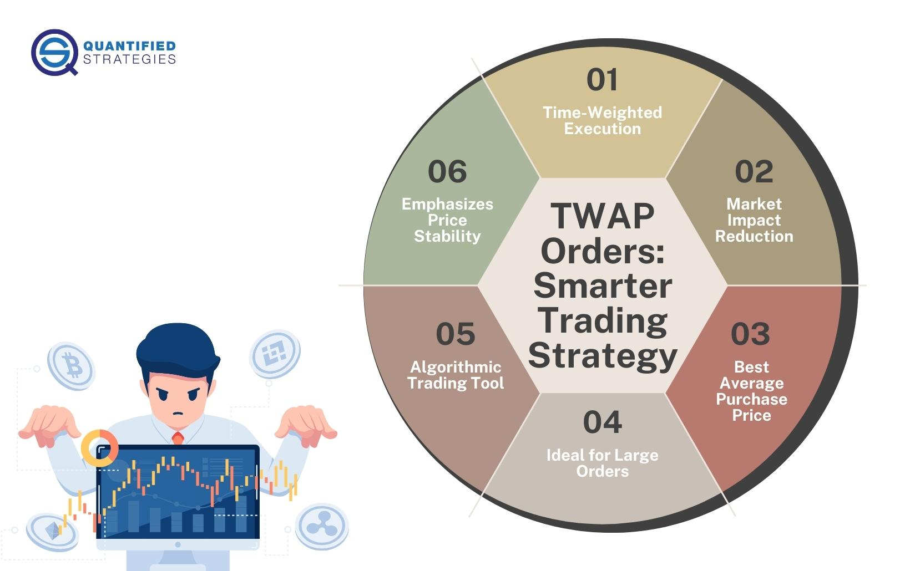

In algorithmic trading, executing large orders efficiently without affecting market prices is a challenge every trader faces. The Time-Weighted Average Price (TWAP) is a popular trading algorithm designed to address this challenge. It is an execution strategy that aims to break down large orders into smaller, equally-sized trades over a specified time period, reducing the market impact. TWAP is fundamentally a strategy focused on achieving an average execution price over that time frame.

By dividing the order into smaller parts and executing those at regular intervals, TWAP helps maintain market equilibrium and avoids sudden price movements caused by large trades. Unlike other strategies such as VWAP (Volume Weighted Average Price), which incorporates both price and volume into its formula, TWAP is solely concerned with the time dimension, which can offer certain advantages in particular trading scenarios.



This article will explore the definition of TWAP, its calculation, advantages, disadvantages, and its comparison with other pricing strategies like VWAP. Whether you are a trader looking to refine your strategy or simply curious about algorithmic trading, this guide will provide valuable insights into efficiently executing large trades using the TWAP algorithm.

## Table of Contents

## What is TWAP?

Time-Weighted Average Price (TWAP) is a strategic trading algorithm used predominantly in financial markets to fulfill large orders while reducing the likelihood of adversely affecting market prices. It operates by fragmenting a sizeable order into smaller, equally-sized trades distributed over a pre-specified time frame. The intention is to achieve a consistent execution price, effectively mitigating the impact on the market and providing the trader with a more controlled execution strategy.

TWAP focuses solely on the temporal element of trading, disregarding the volume traded at each price point. This is in contrast to the Volume-Weighted Average Price (VWAP) algorithm, which incorporates both price and volume data to determine the average execution price.

The methodology of TWAP can be understood through a simplified example. Consider a scenario where an investor aims to purchase 10,000 shares of a particular stock. Instead of executing a single, large order, which may lead to a sudden shift in market price, the investor might choose to purchase 500 shares every 15 minutes over a span of 5 hours. This systematic approach leverages the time component to spread the trades, thus ensuring that the market impact is minimized and the order is filled at an average price that is more reflective of the time span.

In terms of calculation, TWAP involves averaging the high, low, open, and close prices over a designated trading period. Mathematically, if $P_t$ represents the price at time $t$, the TWAP over $n$ time intervals can be expressed as:

$$
\text{TWAP} = \frac{\sum_{t=1}^{n} P_t}{n}
$$

This formula simplifies the determination of an average price over the given intervals, highlighting the method’s reliance on time rather than the [volume](/wiki/volume-trading-strategy) traded.

The simplicity of TWAP makes it an accessible tool for both novice and experienced traders in [algorithmic trading](/wiki/algorithmic-trading), providing a straightforward mechanism to manage order execution with reduced market impact.

## Example and Calculation of TWAP

A trader aiming to execute a substantial order can utilize the Time-Weighted Average Price (TWAP) algorithm to minimize market disruption. For instance, suppose a trader needs to purchase 10,000 shares throughout a trading session. By executing smaller trades, such as buying 500 shares every 15 minutes over five hours, TWAP assists in distributing these purchases evenly across time intervals, thereby achieving an average execution price that reduces the likelihood of significant price shifts.

### Calculation of TWAP

The calculation of TWAP involves a straightforward process. It calculates the average price of a security over a specified time frame by taking into account the opening, closing, high, and low prices during the period. The formula for TWAP can be stated as:

$$
\text{TWAP} = \frac{\sum_{i=1}^{n} (P_{\text{open}, i} + P_{\text{close}, i} + P_{\text{high}, i} + P_{\text{low}, i})/4}{n}
$$

Where:
- $P_{\text{open}, i}$ is the opening price for period $i$
- $P_{\text{close}, i}$ is the closing price for period $i$
- $P_{\text{high}, i}$ is the highest price for period $i$
- $P_{\text{low}, i}$ is the lowest price for period $i$
- $n$ is the total number of periods

### Implementation in Python

To automate the calculation of TWAP, tools like Excel or Python are invaluable as they allow for the efficient handling of large datasets. Below is a Python example utilizing the pandas library to compute TWAP:

```python
import pandas as pd

# Example data
data = {
    'Open': [101, 102, 103, 104],
    'Close': [102, 104, 103, 105],
    'High': [104, 105, 106, 108],
    'Low': [100, 101, 102, 103]
}

# Creating a DataFrame
df = pd.DataFrame(data)

# Calculating TWAP
df['Average Price'] = (df['Open'] + df['Close'] + df['High'] + df['Low']) / 4
twap = df['Average Price'].mean()

print("TWAP:", twap)
```

In this implementation, the dataframe represents prices over four periods, and TWAP is computed by averaging the calculated average prices for these periods. This method allows traders to systematically approach order execution, enhancing strategy precision through automation.

## Why Choose TWAP?

TWAP can significantly mitigate the market impact associated with executing large orders by dispersing them across a defined time frame. This method reduces the likelihood of market disruption and price drift, ensuring that orders are executed at prices that reflect the market's natural [liquidity](/wiki/liquidity-risk-premium). By adopting a TWAP strategy, traders effectively diminish their footprint on the market, avoiding sudden spikes or drops in price that large trades might typically induce.

The appeal of TWAP is particularly pronounced for high-frequency and quantitative traders. These traders operate in environments where speed and precision are paramount, and TWAP's systematic approach allows for consistent order execution. For instance, the algorithm's ability to divide a large trade into smaller, manageable portions and execute them sequentially ensures that the trader can maintain a low profile, executing the order without alerting competitors or other market participants to their actions.

In addition to avoiding market impact, TWAP also enables smoother order execution over a set duration, reducing the inherent risks tied to large-volume trades. By employing TWAP, the execution of such trades becomes less susceptible to short-term volatilities and inconsistencies in market behavior. This is particularly useful for minimizing slippage, the difference between the expected price of a trade and the actual price at which it is executed. Since TWAP does not chase price but rather follows a pre-defined schedule, it aligns with the natural ebb and flow of the market.

Moreover, for traders incorporating automated systems, crafting a TWAP execution strategy can be straightforward. A basic implementation in Python might look like the following:

```python
def calculate_twap(asset_prices, order_quantity, time_periods):
    total_price = sum(asset_prices)
    average_price = total_price / len(asset_prices)
    trade_size = order_quantity / time_periods
    trades = [trade_size] * time_periods

    twap_result = average_price, trades
    return twap_result

# Example usage
asset_prices = [100, 102, 101.5, 103, 105]
order_quantity = 1000
time_periods = 5

twap_price, trade_execution = calculate_twap(asset_prices, order_quantity, time_periods)
print(f"TWAP Price: {twap_price}")
print(f"Trades Executed: {trade_execution}")
```

In this example, the function calculates the time-weighted average price by computing the average of the given asset prices and divides the order quantity into equal parts to be executed over the specified time periods. Consequently, TWAP ensures that large orders are methodically executed, allowing for risk mitigation and preserving market integrity.

## TWAP vs VWAP

VWAP, or Volume-Weighted Average Price, and TWAP, Time-Weighted Average Price, are two distinct strategies utilized in algorithmic trading, each catering to different trading needs. While both aim to minimize the adverse impact of large trades on market prices, they take different approaches.

VWAP takes into consideration the volume of trades along with the price, which adds a layer of complexity to its calculation. It provides a weighted average price by summarizing the total trading volume. The VWAP calculation over a trading period is expressed mathematically as:

$$

VWAP = \frac{\sum_{i=1}^{N} (P_i \times Q_i)}{\sum_{i=1}^{N} Q_i} 
$$

where $P_i$ is the price of the trade, $Q_i$ is the quantity of the trade, and $N$ is the number of trades.

On the other hand, TWAP is simpler, focusing solely on the time element. Trades are averaged over specified time intervals without taking volume into account. This straightforward calculation involves dividing the sum of prices over all the time intervals by the number of intervals:

$$

TWAP = \frac{\sum_{i=1}^{N} P_i}{N} 
$$

Here, $P_i$ represents the price at each interval and $N$ is the total number of intervals.

The choice between VWAP and TWAP depends significantly on the trader's objectives and the market context. VWAP is ideal for large transactions where volume data is crucial for achieving a price closer to the market's average trading price throughout the day. This is particularly optimal in environments where the trade size is large relative to the market liquidity, ensuring the impact on the price is spread in line with market activity.

TWAP, by contrast, offers simplicity and is often more effective for smaller or more evenly distributed transactions over time. Its straightforward nature benefits high-frequency traders who prioritize time over volume. Additionally, TWAP is advantageous in markets where liquidity is stable throughout the trading session, allowing traders to avoid the complexities of volume analysis.

Ultimately, selecting between TWAP and VWAP hinges on specific trading goals, the size of the order, market liquidity, and trade execution preferences. Understanding these factors can significantly influence the success of implementing either strategy in trading operations.

## Pros and Cons of TWAP

Time-Weighted Average Price (TWAP) offers several advantages as well as some notable disadvantages in the context of executing large orders in financial markets. 

**Pros of TWAP**

1. **Simplicity of Calculation**: One of the main advantages of TWAP is its straightforward calculation. Since TWAP is based purely on time intervals, it eliminates the need to account for trade volumes, simplifying implementation and reducing computational resources. This simplicity can be particularly advantageous for traders who need a reliable and easy-to-understand execution strategy.

2. **Minimization of Market Impact**: By distributing trades evenly over a predefined timeframe, TWAP helps minimize the impact on the market price. Spreading out orders helps in maintaining market equilibrium and prevents abrupt price movements that could result from executing a large order all at once.

3. **Suitability for Large Order Execution**: TWAP is highly effective for large order execution by dividing the trades into smaller parts. This makes it an apt choice for institutional investors and traders dealing with substantial volumes. It provides a mechanism to execute trades quietly over time, thereby reducing visibility to other market participants.

**Cons of TWAP**

1. **Predictability**: Due to TWAP's reliance on fixed time intervals, its predictability can be a disadvantage. Market participants might anticipate the execution pattern, creating an opportunity for adverse price movements against the trader's interest. This exploitability necessitates strategies to enhance order execution concealment.

2. **Potential Inefficiency in Volatile Markets**: TWAP does not account for market conditions such as price volatility or liquidity changes over the execution period. In highly volatile or thinly traded markets, TWAP's uniform trading schedule might not yield optimal results. Other strategies like VWAP, which incorporate volume data, might better adapt to such scenarios.

In conclusion, while TWAP provides a robust foundation for reducing market impact and managing large trades, traders need to consider its limitations, especially its predictability and static nature during volatile market conditions. Enhanced execution strategies could involve combining TWAP with other algorithms or techniques to mitigate its drawbacks.

## Conclusion

Time-Weighted Average Price (TWAP) serves as a fundamental tool for algorithmic traders, particularly for executing large trades without significantly impacting market prices. Its methodology, centered around distributing trades evenly over a set time frame, allows for smoother and more discreet order execution. Despite its simplicity, mastering TWAP can greatly enhance a trader's strategy by providing a reliable mechanism for minimizing the market impact of substantial orders.

Understanding TWAP's practical applications and limitations is key for traders looking to optimize their trading activities. Its straightforward approach makes it accessible to those new to [quantitative trading](/wiki/quantitative-trading), offering an excellent starting point for managing order execution effectively. However, it is crucial to acknowledge that while TWAP can be predictable and potentially exploited in some market conditions, tailoring its implementation to specific trading scenarios can mitigate these risks.

For traders venturing into the algorithmic trading arena, TWAP can form the cornerstone of a robust trading strategy. As traders gain experience and market understanding, they may explore more complex algorithms, yet the foundational knowledge of TWAP remains invaluable. By leveraging TWAP, traders can strategically execute large trades with enhanced control and reduced market footprints, contributing to a successful trading experience.

## References & Further Reading

[1]: Kissell, R. (2013). ["The Science of Algorithmic Trading and Portfolio Management."](https://www.sciencedirect.com/book/9780124016897/the-science-of-algorithmic-trading-and-portfolio-management) Academic Press.

[2]: Aldridge, I. (2010). ["High-Frequency Trading: A Practical Guide to Algorithmic Strategies and Trading Systems."](https://www.wiley.com/en-us/High+Frequency+Trading%3A+A+Practical+Guide+to+Algorithmic+Strategies+and+Trading+Systems-p-9780470579770) Wiley.

[3]: Hendershott, T., Jones, C. M., & Menkveld, A. J. (2011). ["Does Algorithmic Trading Improve Liquidity?"](https://onlinelibrary.wiley.com/doi/full/10.1111/j.1540-6261.2010.01624.x) The Review of Financial Studies, 24(5), 1465-1489.

[4]: Hasbrouck, J., & Saar, G. (2013). ["Low-Latency Trading."](https://www.sciencedirect.com/science/article/abs/pii/S1386418113000165) The Review of Financial Studies, 26(9), 2095-2136.

[5]: ["Algorithmic Trading and DMA: An Introduction to Direct Access Trading Strategies"](https://www.amazon.com/Algorithmic-Trading-DMA-introduction-strategies/dp/0956399207) by Barry Johnson