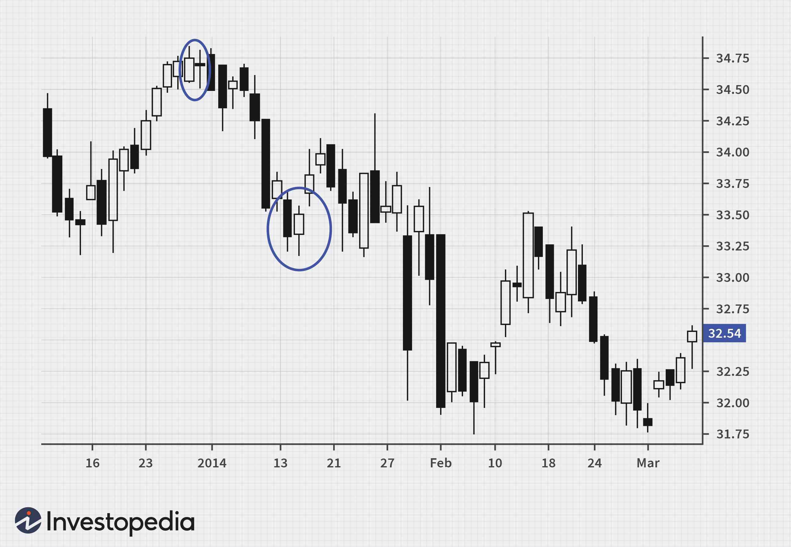

In the world of technical analysis, candlestick patterns are fundamental tools that traders use to predict market movements. These patterns offer visual cues about the psychological dynamics between buyers and sellers and are integral to identifying potential market reversals and continuations. Among the various candlestick formations, the tweezer pattern holds a prominent position due to its predictive power and distinctive appearance.

The tweezer pattern serves as a reliable indicator of market reversals. It is characterized by two successive candlesticks—either at the market's peak or trough—exhibiting equal highs or lows, respectively. This formation highlights a battleground where neither the bulls nor bears can decisively push the price further in their preferred direction, hinting at an imminent shift in market sentiment. This unique ability to signal a pause and potential turnaround makes the tweezer pattern especially valuable for traders aiming to make informed decisions.



This article aims to explore tweezer patterns in detail, scrutinizing their characteristics and significance within trading scenarios. Beyond mere recognition, understanding the nuanced nature of these patterns can bolster their utility in algorithmic trading strategies. The integration of tweezer patterns within algo trading systems can streamline decision-making processes, offering automated solutions that capture market reversals with precision.

Moreover, this analysis positions tweezer patterns within the broader framework of technical analysis. Recognizing their relevance to algorithmic trading, traders can harness tweezer formations to enhance their strategic toolkit, facilitating a seamless blend of intuitive pattern recognition and systematic trading execution. Through this exploration, traders can gain insights into the application of tweezer patterns in crafting effective and efficient trading strategies.

## Table of Contents

## Understanding Tweezer Patterns

The tweezer pattern is a notable component of candlestick chart analysis, offering insights into market reversals. This pattern typically features two consecutive candlesticks that align closely at their highs or lows, indicating potential turning points in market momentum. Such formations are essential for traders aiming to identify reversals in market trends.

There are primarily two types of tweezer patterns. The first is the tweezer top, which emerges during an uptrend and signifies a potential bearish reversal. It comprises two candlesticks exhibiting similar highs, suggesting that buyers are losing strength, and sellers might soon dominate. Conversely, the tweezer bottom appears in a downtrend, indicating a possible bullish reversal. This pattern consists of two candlesticks with matching lows, implying that sellers are weakening, paving the way for buyers to take control.

A thorough grasp of the psychological prowess of tweezer patterns is crucial for anticipating changes in market sentiment. The tweezer top reflects the struggle where buyers have initially pushed the price upwards, only for sellers to step in and reinforce resistance at the same level. This repeated failure to break higher signifies weakening buyer [momentum](/wiki/momentum), potentially attractive for traders looking to capitalize on a downward movement.

On the other hand, the tweezer bottom signals the opposite psychological dynamic, where sellers initially drive the price down, but buyers subsequently intervene to establish support at approximately the same level. Recurrent inability to push prices lower suggests diminishing seller momentum and introduces the probability of a price reversal upwards.

Understanding these psychological underpinnings allows traders to better interpret market signals, thereby refining their decision-making processes regarding market entry and [exit](/wiki/exit-strategy) points. As a predictive tool, tweezer patterns help traders gauge not just existing price movements but also anticipate forthcoming shifts in market sentiment.

## Identifying Tweezer Patterns

To identify a tweezer top, one should look for two consecutive candlesticks appearing at the top of an uptrend, both showcasing similar high prices. This pattern is indicative of potential bearish sentiment, suggesting a reversal or at the very least, a hesitation in the bullish trend. The first candlestick typically represents the final push of an uptrend, where buyers have driven prices higher. However, the second candlestick reveals bulls failing to push the price beyond the previous high, indicating a shift in market momentum. This can often be a sign for traders to anticipate a downturn, although further confirmation is advisable before taking action.

On the contrary, identifying a tweezer bottom involves locating two consecutive candlesticks at the bottom of a downtrend, both sharing similar low prices. This pattern suggests that the bearish trend might be losing steam, potentially paving the way for a bullish reversal. The initial candlestick usually signifies the continued pressure of a downtrend, but the subsequent candlestick's inability to fall below the past low hints at a possible exhaustion of selling momentum. This gives traders a cue to watch for further signs of a reversal, which can often be confirmed by subsequent price action or the presence of other supportive technical indicators.

In both scenarios, the tweezer patterns signal a halt or a reversal in market momentum. This underlines the importance of seeking additional confirmation through further candlesticks or complementary indicators such as moving averages, [volume](/wiki/volume-trading-strategy) analysis, or momentum oscillators like the Relative Strength Index (RSI) or the Moving Average Convergence Divergence (MACD) before making trading decisions. This cautious approach helps improve the reliability and success rate of employing tweezer patterns in trading strategies.

## Strategies for Trading Tweezer Patterns

Trading tweezer patterns effectively requires the development of a comprehensive strategy that encompasses entry, stop-loss, and take-profit levels. Implementing these strategies helps traders capitalize on potential market reversals indicated by tweezer patterns.

For a tweezer top, traders should consider entering a short position after the emergence of the second candlestick, which signals a potential hesitation in upward momentum. The formation of the tweezer top, characterized by two consecutive candlesticks with similar highs at the peak of an uptrend, suggests that the market may be ready for a bearish reversal. To enhance precision, traders can wait for additional signs of weakness or bearish confirmation through subsequent candlestick patterns, such as a bearish engulfing pattern or a shooting star, before executing the trade.

Conversely, a tweezer bottom provides an opportunity for initiating a long position. Recognized by two consecutive candlesticks with similar lows at the termination of a downtrend, the tweezer bottom indicates a potential shift towards bullish sentiment. Traders may consider entering a trade after the formation of the second candlestick suggests diminishing downward momentum. Again, additional confirmation via candlestick patterns or supportive signals from other indicators, such as a bullish engulfing pattern or a hammer, can enhance decision-making.

The effectiveness of trading tweezer patterns is further increased by incorporating confirmation candlesticks and employing additional technical indicators. Confirmation candlesticks provide an additional layer of evidence to validate the anticipated reversal, reducing the likelihood of acting on false signals. Indicators such as the Relative Strength Index (RSI) or the Moving Average Convergence Divergence (MACD) can offer valuable insights into market momentum and trend strength. For instance, an overbought RSI signal combined with a tweezer top may offer a stronger case for a bearish reversal, while an oversold RSI paired with a tweezer bottom could strengthen the bullish reversal argument.

The integration of these strategies into a trading plan requires attention to trade management principles, such as setting appropriate stop-loss and take-profit levels. Stop-loss orders should be placed strategically beyond the high of the tweezer top or below the low of the tweezer bottom to protect against adverse movements. Likewise, take-profit levels must consider key support and resistance zones to optimize risk-reward ratios.

Python's flexibility allows for the automation of these strategies. By using libraries like pandas and TA-Lib, traders can design algorithms to automatically detect tweezer patterns and execute trades based on predefined criteria. This approach not only streamlines the trading process but also minimizes emotional involvement, enhancing overall strategy reliability. Here is a sample Python snippet for identifying tweezer patterns:

```python
import pandas as pd
import talib

# Load price data
data = pd.read_csv('price_data.csv')

# Identify tweezer patterns using candlestick functions from TA-Lib
tweezer_top = talib.CDLDOJI(data['Open'], data['High'], data['Low'], data['Close']) & \
               (data['High'].shift(1) == data['High'])

tweezer_bottom = talib.CDLDOJI(data['Open'], data['High'], data['Low'], data['Close']) & \
                 (data['Low'].shift(1) == data['Low'])

# Trading logic: determine signals
signals = {'Tweezer Top Signal': tweezer_top, 'Tweezer Bottom Signal': tweezer_bottom}
```

By systematically deploying these strategies and leveraging automation, traders can enhance their ability to effectively capture market reversals indicated by tweezer patterns.

## Tweezer Patterns in Algo Trading

With the rise of [algorithmic trading](/wiki/algorithmic-trading), tweezer patterns have been integrated into automated strategies to efficiently capture market reversals. Algorithmic trading, characterized by high-speed data processing and execution, allows traders to utilize predefined criteria for recognizing and responding to various candlestick patterns, including tweezers.

An algorithmic trading system can systematically identify tweezer patterns by analyzing price data to match specific criteria indicative of these formations. This involves detecting two consecutive candlesticks with either identical highs, suggesting a tweezer top (bearish reversal), or identical lows, indicating a tweezer bottom (bullish reversal). The challenge lies in programming these systems to accurately discern the patterns amidst continuous market fluctuations.

Incorporating tweezer detection into an algorithm involves defining clear parameters and thresholds. For instance, Python can be utilized to implement such a system with libraries like Pandas and NumPy for data manipulation, and TA-Lib for technical analysis indicators. A basic example code snippet for identifying a tweezer top pattern might look as follows:

```python
import pandas as pd

def is_tweezer_top(df):
    # Check the last two candlesticks
    last_two = df.iloc[-2:]
    # Determine if highs are approximately equal
    return abs(last_two.iloc[0]['High'] - last_two.iloc[1]['High']) < 0.01

# Example DataFrame structure
data = {
    'Open': [1.1, 1.2],
    'High': [1.5, 1.5],
    'Low': [1.0, 1.1],
    'Close': [1.4, 1.3]
}
df = pd.DataFrame(data)

print(is_tweezer_top(df))  # Outputs: True or False
```

Automated systems reduce human emotion and error, resulting in more consistent and reliable decision-making. By executing trades based on quantitative data rather than subjective judgment, algorithmic trading enhances the efficiency and speed of market entries and exits. This reliance on objective criteria allows traders to exploit short-lived opportunities that might be missed manually.

Furthermore, the deployment of algorithmic strategies utilizing tweezer patterns can be fine-tuned by integrating additional technical indicators such as Moving Averages or Relative Strength Indexes (RSI). By doing so, traders can enhance the robustness of their algorithms, increasing the likelihood of accurate predictions and successful trades.

In conclusion, the precision of automated frameworks to detect and respond to tweezer patterns fortifies their place within algorithmic trading systems, offering traders a method to navigate complex markets swiftly and effectively.

## Limitations and Considerations

While tweezer patterns are a valuable tool in technical analysis, they possess certain limitations and considerations that traders must be aware of. Tweezer patterns can occasionally produce false signals, especially in highly volatile markets. This is primarily because their reliance on matching highs or lows over two consecutive periods may not hold up in rapidly changing environments, leading to premature or inaccurate predictions of market reversals.

To improve the reliability of trading signals derived from tweezer patterns, it is advisable to combine them with other technical indicators. Indicators such as the Relative Strength Index (RSI) or the Moving Average Convergence Divergence (MACD) can help provide the necessary confirmation of a potential market reversal, thereby reducing the likelihood of executing a trade based on a false signal. For example, a tweezer top pattern supported by an overbought RSI increases the probability of a bearish reversal.

Traders should also take market context into account when analyzing tweezer patterns. Ensuring that these patterns are not used in isolation is crucial for a comprehensive analysis. Market context involves examining broader market trends, economic indicators, and other patterns to validate the signals provided by the tweezer formations. This holistic approach can be instrumental in identifying genuine trend reversals and avoiding spurious market noise.

By recognizing these limitations and implementing a strategic approach that integrates additional technical indicators and market context, traders can enhance the effectiveness of tweezer patterns in their trading strategies. This multifaceted analysis is key to mitigating the risks associated with volatile and unpredictable markets.

## Conclusion

Tweezer patterns are highly valued in the domain of technical analysis, particularly for their ability to signal market reversals, making them a powerful addition to trading strategies. When combined with algorithmic trading, the effectiveness of tweezer patterns is significantly enhanced. Algorithmic systems can quickly process large volumes of market data to identify tweezer formations, enabling traders to execute market entries and exits with greater precision and without the influence of human emotions. This integration leads to more consistent trading outcomes, as algorithms can adhere to predefined criteria and swiftly react to market signals.

However, the financial markets are dynamic, with ever-evolving patterns and behaviors. As such, ongoing education and adaptation are crucial for traders who rely on tweezer patterns. Continual refinement of trading strategies, incorporating the latest market insights and technological advancements, will ensure that traders remain competitive and successful. By embracing both the predictive power of tweezer patterns and the speed and accuracy of algorithmic trading, traders can effectively navigate the complexities of the market and optimize their trading performance over time.

## References & Further Reading

[1]: Nison, S. (1991). ["Japanese Candlestick Charting Techniques: A Contemporary Guide to the Ancient Investment Techniques of the Far East."](https://archive.org/details/japanesecandlest0000niso) Prentice Hall Press.

[2]: Bulkowski, T. N. (2008). ["Encyclopedia of Candlestick Charts."](https://onlinelibrary.wiley.com/doi/book/10.1002/9781119202288) Wiley Trading.

[3]: Murphy, J. J. (1999). ["Technical Analysis of the Financial Markets: A Comprehensive Guide to Trading Methods and Applications."](https://archive.org/details/technicalanalysi0000murp) New York Institute of Finance.

[4]: Prado, M. L. (2018). ["Advances in Financial Machine Learning."](https://www.amazon.com/Advances-Financial-Machine-Learning-Marcos/dp/1119482089) Wiley.

[5]: Chan, E. P. (2009). ["Quantitative Trading: How to Build Your Own Algorithmic Trading Business."](https://github.com/ftvision/quant_trading_echan_book) John Wiley & Sons.