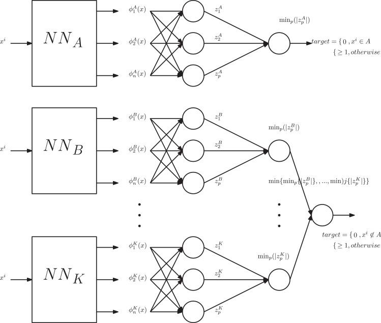

## Table of Contents

## What are Twin Networks in the context of machine learning?

Twin Networks, also known as Siamese Networks, are a type of neural network architecture used in machine learning for tasks that involve comparing two inputs. The core idea behind Twin Networks is to use two identical sub-networks that share the same weights and architecture. These sub-networks process two different inputs separately but in the same way. The outputs from these sub-networks are then combined to make a decision, such as determining if the inputs are similar or different. This architecture is particularly useful for tasks like face recognition, signature verification, and other similarity-based problems.

The way Twin Networks work is by taking two inputs, let's call them Input A and Input B, and feeding them through the shared sub-networks. Each sub-network transforms its input into a feature vector. These feature vectors are then compared using a similarity metric, such as Euclidean distance or cosine similarity. For example, if the task is to verify if two images are of the same person, the network would output a smaller distance if the images are similar and a larger distance if they are different. This approach allows the network to learn and recognize patterns that are invariant to certain transformations, making it robust for various applications.

## How do Twin Networks differ from traditional neural networks?

Twin Networks are different from traditional neural networks because they use two identical sub-networks that share the same weights and architecture. In a traditional neural network, you usually have one input going through several layers to produce an output. But in Twin Networks, you have two inputs, and each goes through the same sub-network at the same time. This setup helps the network compare the two inputs directly. For example, if you want to check if two pictures are of the same person, Twin Networks can do this by looking at both pictures side by side.

The main goal of Twin Networks is to measure how similar or different the two inputs are. After the two inputs go through the sub-networks, the network calculates a similarity score, often using a simple formula like the Euclidean distance between the two resulting feature vectors. Traditional neural networks, on the other hand, usually focus on classifying or predicting something from a single input. So, while a traditional network might tell you what's in a picture, a Twin Network can tell you if two pictures are of the same thing. This makes Twin Networks really useful for tasks like face recognition or signature verification.

## What is the basic architecture of a Twin Network?

The basic architecture of a Twin Network, also known as a Siamese Network, involves two identical sub-networks that share the same weights and structure. These sub-networks take in two different inputs and process them in the same way. Each sub-network transforms its input into a feature vector, which is a way of representing the input data in a more manageable form. After processing, the feature vectors from both sub-networks are compared to determine how similar or different the inputs are. This comparison is typically done using a similarity metric, such as the Euclidean distance $$d(\mathbf{x}_1, \mathbf{x}_2) = \sqrt{\sum_{i=1}^n (x_{1i} - x_{2i})^2}$$ or cosine similarity.

The key part of a Twin Network is that the two sub-networks are identical and share weights. This means that any changes made to improve the network's performance during training are applied to both sub-networks at the same time. This setup allows the network to learn how to compare inputs effectively, even if they are slightly different due to factors like different angles or lighting conditions in images. The output of the network is a measure of how similar the two inputs are, which can be used for tasks like verifying if two images are of the same person or if two signatures are from the same person.

## What types of problems are Twin Networks particularly good at solving?

Twin Networks are really good at solving problems where you need to compare two things and see how similar they are. They are especially useful for tasks like face recognition, where you want to check if two pictures are of the same person. For example, if you have two photos and you want to know if they show the same face, a Twin Network can look at both photos and tell you how similar they are. It does this by turning each photo into a set of numbers called a feature vector, and then comparing these vectors using a simple formula like the Euclidean distance $$d(\mathbf{x}_1, \mathbf{x}_2) = \sqrt{\sum_{i=1}^n (x_{1i} - x_{2i})^2}$$.

Another type of problem Twin Networks are good at is signature verification. Imagine you have two signatures, and you want to know if they were written by the same person. A Twin Network can compare these signatures and give you a score on how likely it is that they match. This is helpful for banks or other places that need to check if a signature is real. Twin Networks are also used in other areas where you need to compare things, like checking if two pieces of text are similar or if two audio recordings are from the same voice. They work well because they can learn to see past small differences and focus on what really makes two things similar or different.

## Can you explain the concept of contrastive loss used in Twin Networks?

Contrastive loss is a way to train Twin Networks so they can tell how similar or different two things are. In Twin Networks, we have two inputs that go through the same sub-networks, and we want the network to learn how to compare these inputs. The idea of contrastive loss is to make the network push similar inputs closer together and pull different inputs further apart. If the two inputs are supposed to be similar, like two pictures of the same person, the network should make their feature vectors close to each other. If the inputs are different, like pictures of different people, the network should make their feature vectors far apart.

The formula for contrastive loss is often written as $$L = (1 - y) \cdot d^2 + y \cdot \max(0, m - d)^2$$, where $$y$$ is a label that tells us if the inputs are similar ($$y = 0$$) or different ($$y = 1$$), $$d$$ is the distance between the feature vectors, and $$m$$ is a margin that decides how far apart different inputs should be. When the inputs are similar, the loss function tries to make $$d$$ as small as possible. When the inputs are different, the loss function tries to make $$d$$ bigger than the margin $$m$$. By using this loss function, the network learns to recognize and compare patterns effectively, making it good at tasks like face recognition or signature verification.

## How does one train a Twin Network effectively?

Training a Twin Network effectively involves using a special kind of loss function called contrastive loss. This loss function helps the network learn to push similar inputs closer together and pull different inputs further apart. When you train the network, you give it pairs of inputs, and you tell it if they should be considered similar or different. If the inputs are similar, like two pictures of the same person, the network should make their feature vectors close to each other. If the inputs are different, like pictures of different people, the network should make their feature vectors far apart. The formula for contrastive loss is $$L = (1 - y) \cdot d^2 + y \cdot \max(0, m - d)^2$$, where $$y$$ is a label that tells us if the inputs are similar ($$y = 0$$) or different ($$y = 1$$), $$d$$ is the distance between the feature vectors, and $$m$$ is a margin that decides how far apart different inputs should be.

To train the network, you need a good set of data with many pairs of inputs labeled as similar or different. You also need to choose the right value for the margin $$m$$ in the contrastive loss function. If $$m$$ is too small, the network might not separate different inputs well enough. If $$m$$ is too big, it might push similar inputs too far apart. You can use a method called gradient descent to adjust the weights of the network so that it gets better at comparing inputs over time. It's also important to keep checking the network's performance on a separate set of data, called a validation set, to make sure it's learning correctly and not just memorizing the training data. By carefully setting up the training process and using the right loss function, you can train a Twin Network to be very good at tasks like face recognition or signature verification.

## What are some common applications of Twin Networks?

Twin Networks are really useful in tasks where you need to compare two things and see how similar they are. One of the most common applications is face recognition. Imagine you have two photos, and you want to know if they are of the same person. A Twin Network can take these photos, turn them into numbers called feature vectors, and then use a formula like the Euclidean distance $$d(\mathbf{x}_1, \mathbf{x}_2) = \sqrt{\sum_{i=1}^n (x_{1i} - x_{2i})^2}$$ to see how close the vectors are. If the distance is small, the photos are probably of the same person. This is helpful for things like unlocking your phone with your face or finding people in a crowd.

Another common use of Twin Networks is in signature verification. Banks and other places often need to check if a signature is real. A Twin Network can compare two signatures and tell you how likely it is that they were written by the same person. It does this by turning each signature into a feature vector and then measuring how similar these vectors are. If the vectors are close, it's more likely that the signatures match. This helps make sure that documents are signed by the right people. Twin Networks can also be used in other areas where you need to compare things, like checking if two pieces of text are similar or if two audio recordings are from the same voice.

## How can Twin Networks be used for one-shot learning?

Twin Networks are great for one-shot learning, which is when you want to learn something new from just one example. Imagine you want to teach a computer to recognize a new person's face after seeing just one picture of them. With a Twin Network, you can compare this new picture to a database of known faces. The network turns each face into a set of numbers called a feature vector. By measuring the distance between these vectors, like using the Euclidean distance $$d(\mathbf{x}_1, \mathbf{x}_2) = \sqrt{\sum_{i=1}^n (x_{1i} - x_{2i})^2}$$, the network can tell if the new face is similar to any of the known faces. This way, the computer can learn to recognize the new person's face from just one picture.

This method is really useful because it doesn't need a lot of examples to learn something new. For example, if you have a new employee at your company and you want to set up face recognition for them, you can just take one photo and use a Twin Network to compare it to other employees' photos. If the network finds a match, it means the new employee's face is now recognized. This makes Twin Networks a powerful tool for quickly learning new things from just one example, which is what one-shot learning is all about.

## What are the challenges in implementing Twin Networks?

One of the challenges in implementing Twin Networks is finding the right data to train them. You need a lot of pairs of examples, some that are similar and some that are different. For example, if you're using Twin Networks for face recognition, you need many pictures of the same person taken from different angles and in different lighting, as well as pictures of different people. Getting this data can be hard and time-consuming. Also, the data needs to be labeled correctly, which means someone has to go through all the pairs and say if they are similar or different. This can be a lot of work.

Another challenge is choosing the right settings for the network. You have to decide on the margin $$m$$ in the contrastive loss function $$L = (1 - y) \cdot d^2 + y \cdot \max(0, m - d)^2$$. If $$m$$ is too small, the network might not be able to tell different things apart well enough. If $$m$$ is too big, it might push similar things too far away from each other. It's also important to pick the right similarity metric, like the Euclidean distance $$d(\mathbf{x}_1, \mathbf{x}_2) = \sqrt{\sum_{i=1}^n (x_{1i} - x_{2i})^2}$$, to compare the feature vectors. All these choices can affect how well the network works, so it takes some trial and error to get them right.

## How do you evaluate the performance of a Twin Network?

To evaluate the performance of a Twin Network, you need to test it on a set of data that it hasn't seen before. This is called a test set. You compare the network's predictions to the true labels of the data to see how well it does. For example, if you're using the network for face recognition, you would give it pairs of pictures and see if it correctly says if they are of the same person or not. You can use measures like accuracy, which is the percentage of correct predictions, or the area under the ROC curve (AUC), which shows how well the network can tell similar and different pairs apart.

One common way to measure performance is by using the Euclidean distance $$d(\mathbf{x}_1, \mathbf{x}_2) = \sqrt{\sum_{i=1}^n (x_{1i} - x_{2i})^2}$$ between the feature vectors the network produces. If the distance between the vectors of two similar inputs is small, and the distance between the vectors of two different inputs is large, the network is doing a good job. You can also look at the loss function used during training, like the contrastive loss $$L = (1 - y) \cdot d^2 + y \cdot \max(0, m - d)^2$$, to see how well the network is learning to separate similar and different inputs. By carefully analyzing these metrics, you can understand how well your Twin Network is performing and where it might need improvement.

## Can you discuss any advanced techniques or modifications to the standard Twin Network architecture?

One advanced technique for Twin Networks is using triplet loss instead of contrastive loss. In triplet loss, you use three inputs: an anchor, a positive example that is similar to the anchor, and a negative example that is different from the anchor. The goal is to make the distance between the anchor and the positive example smaller than the distance between the anchor and the negative example. The formula for triplet loss is $$L = \max(d(\text{anchor}, \text{positive}) - d(\text{anchor}, \text{negative}) + \alpha, 0)$$, where $$d$$ is the distance function, like the Euclidean distance $$d(\mathbf{x}_1, \mathbf{x}_2) = \sqrt{\sum_{i=1}^n (x_{1i} - x_{2i})^2}$$, and $$\alpha$$ is a margin that controls how much closer the positive example should be compared to the negative example. This method helps the network learn more precise differences between similar and different inputs, which can improve its performance on tasks like face recognition.

Another modification is the use of attention mechanisms within the Twin Network architecture. Attention mechanisms help the network focus on the most important parts of the input when comparing two things. For example, in face recognition, the network might pay more attention to the eyes and nose rather than the background of the image. This can be done by adding an attention layer to the sub-networks, which learns to weigh different parts of the input differently. By doing this, the network can better understand and compare the key features of the inputs, leading to more accurate results. These advanced techniques and modifications can make Twin Networks more effective and versatile for a wide range of applications.

## What are the future research directions for Twin Networks?

Future research in Twin Networks could focus on improving their ability to handle more complex data. For example, researchers might look into ways to make Twin Networks better at understanding and comparing things like videos or 3D models. This could involve new ways of turning these inputs into feature vectors that the network can compare. Another area of research could be on making Twin Networks more efficient, so they can work faster and use less computing power. This might mean finding better ways to train them, like using new kinds of loss functions or different ways of setting up the network.

Another direction for research could be in making Twin Networks more adaptable to new tasks with less data. Right now, Twin Networks need a lot of examples to learn well. But if researchers can find ways to make them learn from fewer examples, like using techniques from few-shot learning or transfer learning, it would make them much more useful in real-world situations. This could involve tweaking the contrastive loss $$L = (1 - y) \cdot d^2 + y \cdot \max(0, m - d)^2$$ or the triplet loss $$L = \max(d(\text{anchor}, \text{positive}) - d(\text{anchor}, \text{negative}) + \alpha, 0)$$ to work better with less data. By focusing on these areas, researchers can make Twin Networks even more powerful and versatile for a wide range of applications.

## References & Further Reading

[1]: Bromley, J., Guyon, I., LeCun, Y., Sackinger, E., & Shah, R. (1994). ["Signature Verification Using a Siamese Time Delay Neural Network."](https://dl.acm.org/doi/10.5555/2987189.2987282) International Journal of Pattern Recognition and Artificial Intelligence.

[2]: Koch, G., Zemel, R., & Salakhutdinov, R. (2015). ["Siamese Neural Networks for One-shot Image Recognition."](https://www.cs.cmu.edu/~rsalakhu/papers/oneshot1.pdf) In ICML Deep Learning Workshop.

[3]: Hadsell, R., Chopra, S., & LeCun, Y. (2006). ["Dimensionality Reduction by Learning an Invariant Mapping."](https://ieeexplore.ieee.org/abstract/document/1640964) In Proceedings of the IEEE Computer Society Conference on Computer Vision and Pattern Recognition (CVPR).

[4]: Baldi, P., & Chauvin, Y. (1993). ["Neural Networks for Fingerprint Recognition."](https://direct.mit.edu/neco/article/5/3/402/5704/Neural-Networks-for-Fingerprint-Recognition) In Neural Networks: Tricks of the Trade.

[5]: LeCun, Y., & Bengio, Y. (1995). ["Convolutional Networks for Images, Speech, and Time-Series."](https://www.researchgate.net/publication/216792820_Convolutional_Networks_for_Images_Speech_and_Time-Series) In The Handbook of Brain Theory and Neural Networks.