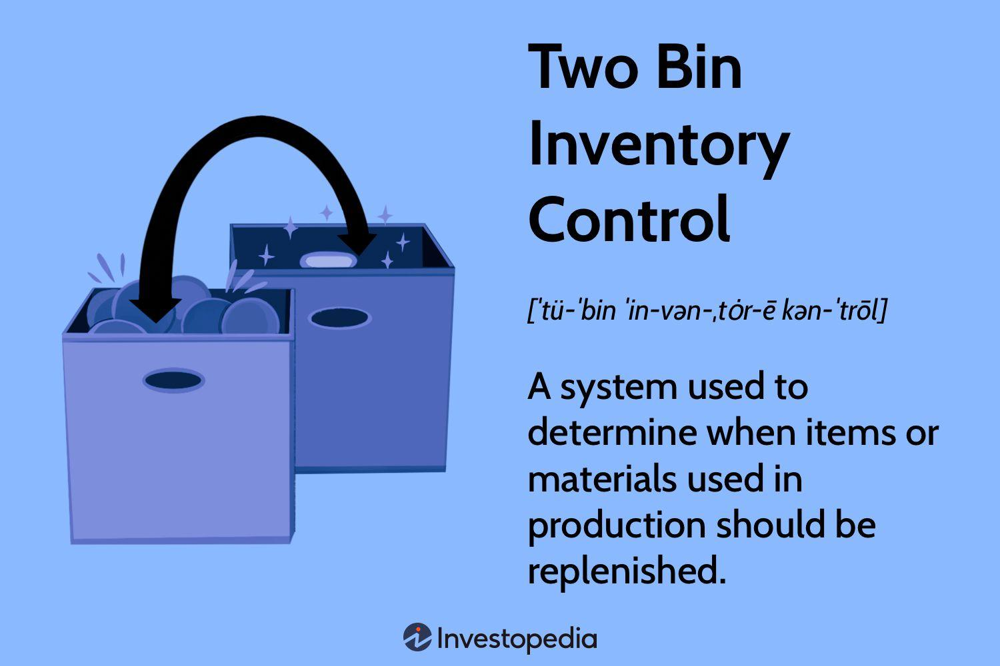

## Table of Contents

## What is a Two-Bin Inventory Control System?

A Two-Bin Inventory Control System is a simple way to manage stock levels in a business. In this system, you have two containers or bins for each item you keep in stock. When the first bin runs out of items, you start using the second bin. At the same time, you reorder more items to refill the first bin. This method helps make sure you always have some stock available, and it's easy to know when to reorder.

This system is useful because it doesn't need a lot of paperwork or tracking. You can see at a glance when you need to reorder because one bin is empty. It's especially good for small businesses or for items that you use regularly. By keeping a second bin ready, you avoid running out of stock and can keep your business running smoothly.

## How does a Two-Bin Inventory Control System work?

In a Two-Bin Inventory Control System, you have two bins or containers for each item you keep in stock. You use the items from the first bin until it's empty. When the first bin runs out, you switch to using the items in the second bin. At the same time, you place an order to refill the first bin. This way, you always have some stock available to use while you wait for the new order to arrive.

The system is easy to manage because you don't need to keep track of numbers or do a lot of paperwork. You can see right away when you need to reorder because one bin is empty. This method is great for small businesses or for items that you use regularly. By always having a second bin ready, you avoid running out of stock and can keep your business running smoothly without interruptions.

## What are the benefits of using a Two-Bin Inventory Control System?

One of the main benefits of using a Two-Bin Inventory Control System is its simplicity. You don't need to keep detailed records or do a lot of math to know when to reorder. When the first bin runs out, you start using the second bin and reorder to fill the first one. This makes it easy to manage, especially for small businesses or for people who don't have a lot of time to spend on inventory management.

Another benefit is that it helps prevent running out of stock. Because you always have a second bin ready to use, you can keep working or selling without interruption while you wait for the new order to arrive. This is really helpful for businesses that need to have certain items available all the time. It gives peace of mind knowing that you won't run out of important stock.

Overall, the Two-Bin Inventory Control System is a practical way to manage inventory without needing a lot of resources. It's easy to understand and use, which makes it a good choice for many businesses. By keeping the process simple and effective, it helps ensure that you always have the stock you need.

## What are the potential drawbacks of a Two-Bin Inventory Control System?

One potential drawback of a Two-Bin Inventory Control System is that it might not work well for businesses that have a lot of different items or need to keep very accurate stock levels. If you have many types of products, keeping two bins for each one can take up a lot of space. Also, if you need to know exactly how much stock you have at any time, this system might not be detailed enough because it doesn't track numbers closely.

Another issue is that the system can be wasteful if you don't order the right amount to refill the bins. If you order too much, you might end up with extra stock that takes up space and costs money. If you order too little, you might run out of the second bin before the new order comes in, which can cause problems. So, you need to be careful about how much you order each time to make sure the system works well.

## In what types of businesses is a Two-Bin Inventory Control System most effective?

A Two-Bin Inventory Control System works best for small businesses that don't have a lot of different items to keep track of. For example, a small restaurant or a local hardware store might find it useful. These businesses often have regular items that they use or sell every day, like kitchen supplies or common tools. The system is simple and doesn't need a lot of paperwork, which makes it easy for small business owners to manage their stock without spending too much time on it.

The system is also good for businesses that need to make sure they always have certain items available. For instance, a medical clinic might use it to keep essential supplies on hand. When one bin runs out, they can switch to the second bin and reorder right away. This helps them avoid running out of important stock, which is crucial for their operations. Overall, the Two-Bin Inventory Control System is most effective in settings where simplicity and reliability are key.

## How do you set up a Two-Bin Inventory Control System?

To set up a Two-Bin Inventory Control System, you first need to figure out how much of each item you use regularly. Look at how quickly you go through your stock and decide on a good amount to keep in each bin. Once you know that, get two bins or containers for each item. Fill the first bin with the amount you use before you need to reorder, and fill the second bin with the same amount. Place the bins where they are easy to see and reach.

When you start using the items, take them from the first bin until it's empty. As soon as the first bin runs out, start using the items in the second bin. At the same time, place an order to refill the first bin with the same amount you had before. This way, you always have some stock available while you wait for the new order to come in. Keep doing this process, switching between bins and reordering when needed, to keep your stock levels steady and avoid running out.

## What are the key components needed for a Two-Bin Inventory Control System?

The key components for a Two-Bin Inventory Control System are the bins themselves and a clear understanding of how much stock you use. You need two bins or containers for each item you want to keep track of. These bins should be easy to see and reach so you know when one is empty. You also need to know how much of each item you use regularly. This helps you decide how much to put in each bin and when to reorder.

Another important component is a reliable way to reorder stock. When the first bin runs out, you switch to the second bin and place an order to refill the first one. You need to make sure you order the right amount so that you don't run out of stock before the new order arrives. Keeping the process simple and making sure you always have a backup bin helps keep your business running smoothly.

## How do you determine the quantity to be stored in each bin?

To determine the quantity to be stored in each bin, you need to look at how much of the item you use over a certain time. This could be how much you use in a week or a month, depending on your business. Once you know this, you can figure out how much to put in each bin. The amount in each bin should be enough to last you until your new order arrives after the first bin runs out.

For example, if you use 10 items a week and it takes two weeks for a new order to arrive, you would put 10 items in each bin. That way, when the first bin runs out after one week, you can start using the second bin while you wait for the new order. This keeps you from running out of stock. By figuring out the right amount for each bin, you can make sure your Two-Bin Inventory Control System works well for your business.

## What are the maintenance and monitoring requirements for a Two-Bin Inventory Control System?

Keeping a Two-Bin Inventory Control System working well is easy but needs some regular checks. You should look at your bins often to see when one runs out. When the first bin is empty, you need to start using the second bin and order more stock right away. It's important to keep an eye on how long it takes for the new order to come in. If it takes longer than you thought, you might need to put more items in each bin next time.

Also, you should check if the amount you put in each bin is right for your business. If you run out of the second bin before the new order arrives, you need to add more items to each bin. On the other hand, if you have too much left over when the new order comes, you can put less in each bin next time. By keeping an eye on these things, you can make sure your Two-Bin Inventory Control System keeps working well and you never run out of stock.

## How can a Two-Bin Inventory Control System be integrated with other inventory management systems?

A Two-Bin Inventory Control System can be easily combined with other inventory management systems. For example, you can use it alongside a computer-based inventory system. When the first bin runs out, you can switch to the second bin and at the same time, enter the reorder into the computer system. This helps keep track of your orders and makes sure you know when they will arrive. It also helps with keeping records of how much stock you use and when you need to reorder.

Another way to integrate it is by using it with a Just-In-Time (JIT) system. In a JIT system, you get stock just when you need it, not too early or too late. You can use the Two-Bin system to signal when to order new stock, and the JIT system will make sure the stock arrives just in time. This way, you keep the simplicity of the Two-Bin system but also benefit from the efficiency of the JIT system. By combining these systems, you can have a more complete and effective way to manage your inventory.

## What advanced strategies can enhance the efficiency of a Two-Bin Inventory Control System?

To make a Two-Bin Inventory Control System work even better, you can use data to help you decide how much to put in each bin. By looking at how much stock you use over time, you can change the amount in each bin to make sure you never run out. You can also use a computer to keep track of when you need to order more stock. This way, you can set reminders to reorder at the right time, which helps keep your business running smoothly without any gaps in stock.

Another way to improve the system is by working closely with your suppliers. If you tell them when you usually need to reorder, they can make sure your new stock arrives faster. This can help you keep less stock in each bin, which saves space and money. By talking to your suppliers and using data to plan your orders, you can make your Two-Bin Inventory Control System more efficient and reliable.

## How do you measure the success and ROI of implementing a Two-Bin Inventory Control System?

To measure the success of a Two-Bin Inventory Control System, you need to look at how well it keeps you from running out of stock. If you never run out of important items, that's a good sign the system is working. You can also see if it saves you time. If you don't have to spend a lot of time keeping track of your stock, that's another way to know it's successful. Finally, check if it helps you use your space better. If you can keep your stock organized and don't need a lot of extra space, that's another measure of success.

To figure out the return on investment (ROI) of the Two-Bin system, you need to compare the costs and benefits. The costs are things like the bins themselves and the time you spend setting up the system. The benefits are things like not running out of stock, which can help you keep your business running smoothly and make more money. If the benefits are more than the costs, then the ROI is good. By looking at these things, you can see if the Two-Bin Inventory Control System is worth it for your business.

## How does Two-Bin Inventory Control work?

The two-bin inventory control system operates through a straightforward process that ensures a continuous flow of inventory with minimal disruption. This method is distinguished by its reliance on a sequential use of two bins and the utilization of visual cues to manage reordering, along with effective communication channels for refilling inventory in a timely manner.

Initially, items are withdrawn from the first bin, known as the working stock bin, until its contents are exhausted. At this juncture, a visual cue, often as simple as a marker or an empty bin, signals the need for a reorder. The system's simplicity lies in this visual system, eschewing complex tracking systems in favor of immediate, easily recognizable alerts. The second bin, which serves as the reserve stock, is then tapped to ensure that operations continue without interruption during the lead time required to replenish the first bin.

The reorder point mechanism is a critical component of this system. It is determined by considering both lead times, which is the time it takes to receive a new order after a reorder has been triggered, and safety stock, which is additional stock maintained to prevent stockouts during unforeseen delays or demand spikes. The formula for calculating the reorder point is:

$$
\text{Reorder Point} = (\text{Average Daily Usage} \times \text{Lead Time}) + \text{Safety Stock}
$$

Implementing this approach ensures a continuous inventory replenishment cycle. When the working stock bin is refilled, the reserve stock remains unused, effectively ready for the next cycle when the working stock bin is again emptied. Each replenishment cycle involves a series of steps involving careful monitoring and communication, typically automated or streamlined in modern inventory systems, to prevent either overstock or stockouts.

In sum, the two-bin system facilitates a smooth and predictable inventory management process by leveraging simplicity in signaling (via visual cues), strategic planning (via reorder point mechanisms), and efficient communication (for timely stock refills). These elements work in concert to maintain consistent inventory levels, thereby optimizing efficiency and reducing the risks associated with inventory disruptions.

## References & Further Reading

[1]: Nahmias, S., & Cheng, Y. (2009). ["Production and Operations Analysis,"](https://books.google.com/books/about/Production_and_Operations_Analysis.html?id=SIsoBgAAQBAJ) McGraw-Hill/Irwin.

[2]: Waters, D. (2009). ["Inventory Control and Management."](https://books.google.com/books/about/Inventory_Control_And_Management_2Nd_Ed.html?id=sBZgyHpcQbcC) Wiley.

[3]: Lopez de Prado, M. (2018). ["Advances in Financial Machine Learning."](https://www.amazon.com/Advances-Financial-Machine-Learning-Marcos/dp/1119482089) Wiley.

[4]: Silver, E. A., Pyke, D. F., & Peterson, R. (1998). ["Inventory Management and Production Planning and Scheduling."](https://www.researchgate.net/publication/229124356_Inventory_Management_and_Production_Scheduling) Wiley.

[5]: Zipkin, P. H. (2000). ["Foundations of Inventory Management."](https://books.google.com/books/about/Foundations_of_Inventory_Management.html?id=rjzbkQEACAAJ) McGraw-Hill.