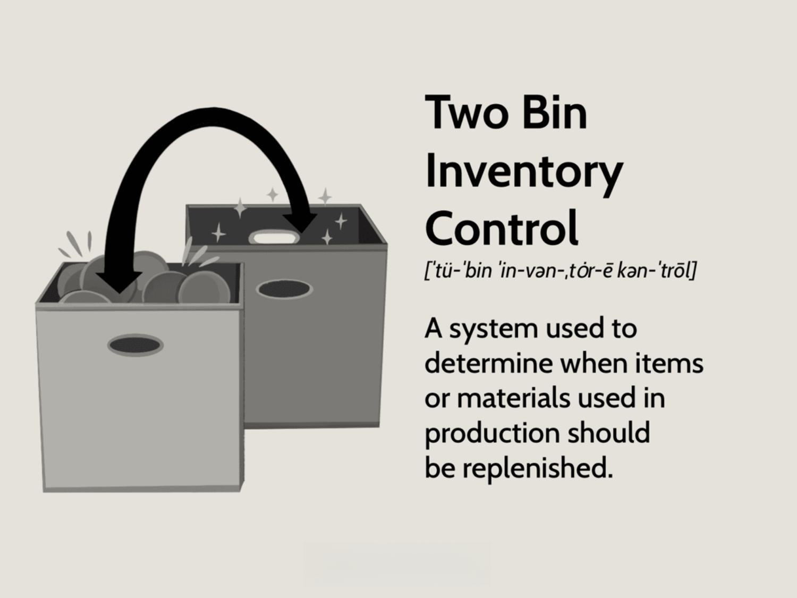

Inventory management plays a pivotal role in ensuring the smooth functioning of supply chains across numerous industries. Effective management of inventory directly influences the ability of a business to meet customer demands while optimizing operational costs. Among the various inventory control methods, the two-bin system stands out as a streamlined approach designed to mitigate the risks associated with stockouts and overstocks. By maintaining a simple yet effective mechanism, the two-bin system divides inventory into two distinct bins: one for active use and another for reserve stock. This arrangement allows for the seamless transition of inventory use from the working bin to the reserve bin upon depletion, thereby triggering a timely reorder to replenish stock levels.

The simplicity of the two-bin system greatly aligns it with the Just-in-Time (JIT) inventory approach, which emphasizes reducing waste by receiving goods only as they are needed in the production process, thus minimizing inventory costs. This method is especially effective for managing small, low-value items, where excessive monitoring and complex tracking systems might not be justifiable.



Beyond traditional inventory management, this article explores the intriguing prospect of integrating the two-bin system's principles with algorithmic trading strategies. Algorithmic trading utilizes predefined rules and complex models to automate trading decisions in financial markets, seeking to capitalize on market movements with speed and precision. By drawing parallels between the replenishment signals of the two-bin system and algorithmic trade triggers, businesses could potentially develop enhanced strategies for asset allocation and market responsiveness. This cross-disciplinary integration represents a novel intersection between physical inventory management and advanced financial market operations, offering businesses innovative pathways to optimize efficiency and build resilience in an ever-evolving economic landscape.

## Table of Contents

## Understanding the Two-Bin System

The two-bin system is a straightforward inventory control method designed to streamline the management of stock levels. This system organizes inventory into two distinct bins: one for active use or immediate needs, and a second to serve as a reserve or backup. The primary function of the two-bin system is to ensure that there is a continuous supply of items, particularly for small and low-value items, by providing clear indicators for when to reorder.

In practice, items are withdrawn from the first bin until it is entirely depleted. The depletion of the first bin acts as a signal to trigger a reorder. Meanwhile, the second bin provides the necessary stock to fulfill demand during the period it takes for the new inventory to arrive. This simple method allows for the mitigation of stockouts and the maintenance of consistent inventory flow.

The two-bin system is highly compatible with the Just-in-Time (JIT) inventory approach, emphasizing the minimization of waste by receiving goods only as they are needed in the production process. By aligning with JIT principles, the two-bin system helps reduce excess inventory, lower carrying costs, and minimize waste due to obsolescence. This makes it well-suited for environments where inventory turnover is frequent and lead times are short.

Overall, the two-bin system provides a balance between simplicity and efficiency, eliminating the need for complex tracking systems and reducing the likelihood of human error. It enhances the managerial oversight and operational control needed for effective inventory management, particularly in environments with repetitive and predictable purchasing patterns.

## Benefits of Two-Bin Inventory Control

The two-bin inventory control system provides several benefits, especially in terms of minimizing storage costs and managing stock levels efficiently. By maintaining optimal inventory through dividing stock into two distinct bins—one for immediate use and the other as reserve—a business can precisely control how much stock is kept on hand. This configuration helps minimize storage costs and the risk of inventory obsolescence since only the necessary quantities are held at any given time.

Effective inventory management often hinges on timely replenishment and avoiding stockouts, areas where the two-bin system excels. When the first bin is depleted, it acts as a straightforward indicator to reorder stock, ensuring that the reserve bin supplies ongoing demand until new inventory arrives. This results in enhanced operational efficiency as businesses can preempt stock shortages and maintain consistent supply levels.

Furthermore, the two-bin inventory system simplifies management by offering clear visual cues rather than relying on complex software tracking systems. This simplicity enables quicker decision-making as inventory managers can physically observe when stock needs replenishing. Consequently, it reduces the need for intricate inventory tracking and computerized management systems, making it particularly suitable for environments where technological integration might be limited or unnecessary.

## How Two-Bin Inventory Control Works

The two-bin inventory control system operates through a straightforward process that ensures a continuous flow of inventory with minimal disruption. This method is distinguished by its reliance on a sequential use of two bins and the utilization of visual cues to manage reordering, along with effective communication channels for refilling inventory in a timely manner.

Initially, items are withdrawn from the first bin, known as the working stock bin, until its contents are exhausted. At this juncture, a visual cue, often as simple as a marker or an empty bin, signals the need for a reorder. The system's simplicity lies in this visual system, eschewing complex tracking systems in favor of immediate, easily recognizable alerts. The second bin, which serves as the reserve stock, is then tapped to ensure that operations continue without interruption during the lead time required to replenish the first bin.

The reorder point mechanism is a critical component of this system. It is determined by considering both lead times, which is the time it takes to receive a new order after a reorder has been triggered, and safety stock, which is additional stock maintained to prevent stockouts during unforeseen delays or demand spikes. The formula for calculating the reorder point is:

$$
\text{Reorder Point} = (\text{Average Daily Usage} \times \text{Lead Time}) + \text{Safety Stock}
$$

Implementing this approach ensures a continuous inventory replenishment cycle. When the working stock bin is refilled, the reserve stock remains unused, effectively ready for the next cycle when the working stock bin is again emptied. Each replenishment cycle involves a series of steps involving careful monitoring and communication, typically automated or streamlined in modern inventory systems, to prevent either overstock or stockouts.

In sum, the two-bin system facilitates a smooth and predictable inventory management process by leveraging simplicity in signaling (via visual cues), strategic planning (via reorder point mechanisms), and efficient communication (for timely stock refills). These elements work in concert to maintain consistent inventory levels, thereby optimizing efficiency and reducing the risks associated with inventory disruptions.

## Integration of Two-Bin System with Algorithmic Trading

Algorithmic trading involves executing trades through algorithmic software that follows specific sets of instructions, leveraging speed and efficiency unattainable through manual trading. While the two-bin inventory system is traditionally used for managing physical stock levels, its principles can be adapted to refine [algorithmic trading](/wiki/algorithmic-trading) strategies.

The foundation of the two-bin system lies in managing availability through precise reorder actions, thereby minimizing the risk of shortages or overages. Similarly, algorithmic trading aims to maintain optimal asset allocation and timing in financial markets. By adopting the twin-bin methodology, traders can enhance the precision of asset reallocation and balance reordering timing according to market conditions.

The integration starts with considering the programming logic behind the two-bin system, which divides inventory into two sets: working and reserve. Similarly, in algorithmic trading, capital can be allocated into a primary set that actively participates in the market and a secondary reserve that provides [liquidity](/wiki/liquidity-risk-premium) when the primary set is depleted. When market conditions trigger an execution signal similar to a bin depletion, the 'reordering' process—here, reallocating reserve assets—activates only if specific criteria, such as risk limits and market [volatility](/wiki/volatility-trading-strategies), are met.

Enhancing these strategies with prediction algorithms can further optimize trading operations. These algorithms function like replenishment signals in a two-bin system, analyzing historical data to forecast when trades should be triggered. One could employ [machine learning](/wiki/machine-learning) models for predictive analytics by defining features such as moving averages or [momentum](/wiki/momentum) indicators to act as signals for 'bin' replenishment. For example, a machine learning model using indicators like Exponential Moving Averages (EMA) may resemble:

```python
import numpy as np
import pandas as pd
import talib

# Simulated historical price data
data = {'close_price': [100, 102, 105, 103, 107, 110]}
df = pd.DataFrame(data)

# Calculate EMA with time frame 3
df['ema'] = talib.EMA(df['close_price'], timeperiod=3)

# Define buy/sell signals analogous to replenishment signals
df['signal'] = np.where(df['close_price'] > df['ema'], 'buy', 'sell')
```

In this context, the 'buy' signal can be seen as initiating a 'reserve' asset trade, while the 'sell' signal indicates a need to revert to 'working' capital trades, thereby maintaining a balanced and efficient strategy akin to maintaining stock levels through the two-bin approach. This synergy between a traditional inventory management system and contemporary algorithm trading can potentially increase return on investment by ensuring both physical inventory and financial assets are optimally managed and utilized.

## Case Studies and Examples

The two-bin system has been successfully implemented across various industries, each benefiting from its straightforward approach to inventory control. In the manufacturing sector, companies often deal with numerous small parts essential to production processes. By adopting the two-bin system, manufacturers can ensure a smooth supply of components without the risk of production halts due to stockouts. For example, automotive manufacturers use the two-bin system to manage low-cost, high-[volume](/wiki/volume-trading-strategy) items such as screws and bolts. This method allows them to maintain minimal inventory levels while ensuring that production lines are continuously supplied, significantly reducing storage costs and maximizing space utility.

In retail distribution, where the diversity and volume of products can be overwhelming, the two-bin system offers a viable solution for managing stock efficiently. Retailers such as supermarkets often use it for non-perishable goods, enabling them to promptly reorder items as they get depleted. This practice not only minimizes excess stock, which can lead to obsolescence, but also enhances customer satisfaction through the consistent availability of products. For example, a retail chain managing stationery items like pens and notebooks benefits from this approach by maintaining optimal stock levels, ensuring that the shelves are always stocked with necessary items without overburdening storage facilities.

Healthcare supplies represent another area where the two-bin system excels, especially when it involves consumable items such as syringes, gloves, and gauze. Hospitals and clinics face significant challenges in ensuring the timely availability of these critical supplies. The implementation of a two-bin system leads to increased operational efficiency by facilitating automatic reorder processes as the first bin is depleted. This method enhances patient care as medical staff can rely on a steady supply of essentials without interruption, thereby improving overall healthcare service quality.

These examples underline the cross-industry applicability of the two-bin system and its positive impact on operational flow. By streamlining inventory management processes, businesses can achieve reduced inventory levels, elevated efficiency, and improved customer satisfaction. The simplicity of the system, combined with its practical benefits, demonstrates its versatility and effectiveness across multiple commercial environments.

## Conclusion

The two-bin system provides a simplified yet effective solution for inventory management, enabling businesses to significantly reduce costs and enhance operational efficiency. By maintaining optimal stock levels, this system minimizes storage expenses and mitigates the risk of obsolescence. The process relies on straightforward visual cues for replenishment, eliminating the need for complex tracking systems and thus streamlining inventory oversight.

Beyond conventional inventory management, the integration of the two-bin system with algorithmic trading strategies represents an innovative convergence of physical and financial resource management. In algorithmic trading, predefined rules and models assist in the timely trading of assets, benefiting from precise decision-making. Applying two-bin concepts to financial markets can enhance asset allocation, optimize rebalance timing, and improve market response strategies. This integration can be visualized by drawing parallels between the system's replenishment signals and algorithmic predictive capabilities.

Overall, businesses can capitalize on the two-bin system and its algorithmic trading integration to drive more efficient and resilient operations. This blended approach offers the potential to transform both inventory control and financial strategies, providing a comprehensive framework for achieving sustained operational success across industries.

## References & Further Reading

[1]: Nahmias, S., & Cheng, Y. (2009). ["Production and Operations Analysis,"](https://books.google.com/books/about/Production_and_Operations_Analysis.html?id=SIsoBgAAQBAJ) McGraw-Hill/Irwin.

[2]: Waters, D. (2009). ["Inventory Control and Management."](https://books.google.com/books/about/Inventory_Control_And_Management_2Nd_Ed.html?id=sBZgyHpcQbcC) Wiley.

[3]: Lopez de Prado, M. (2018). ["Advances in Financial Machine Learning."](https://www.amazon.com/Advances-Financial-Machine-Learning-Marcos/dp/1119482089) Wiley.

[4]: Silver, E. A., Pyke, D. F., & Peterson, R. (1998). ["Inventory Management and Production Planning and Scheduling."](https://www.researchgate.net/publication/229124356_Inventory_Management_and_Production_Scheduling) Wiley.

[5]: Zipkin, P. H. (2000). ["Foundations of Inventory Management."](https://books.google.com/books/about/Foundations_of_Inventory_Management.html?id=rjzbkQEACAAJ) McGraw-Hill.