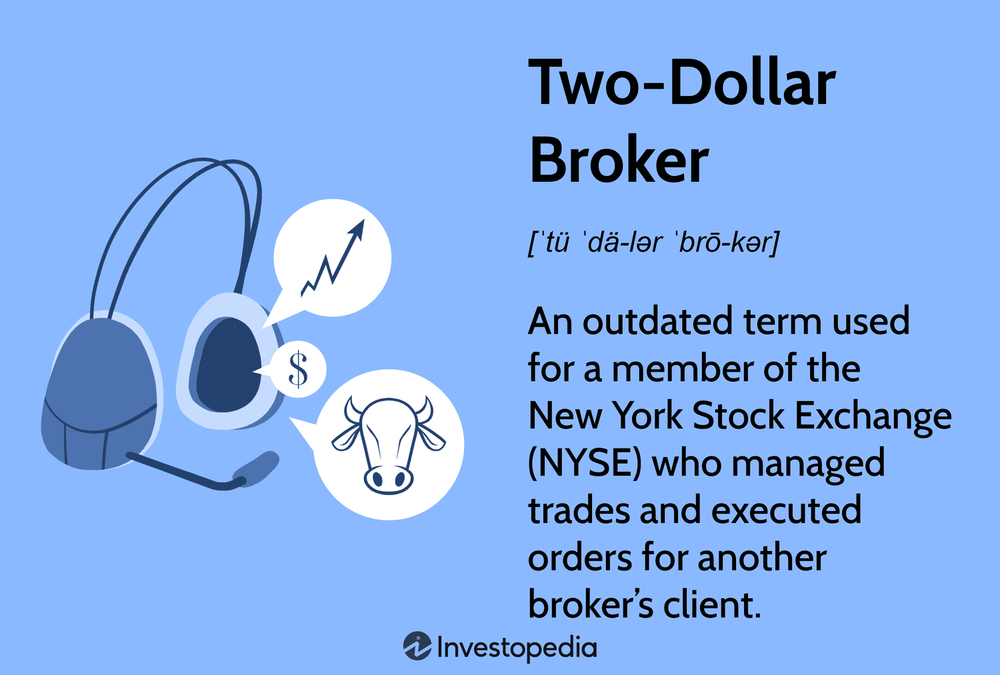

The world of trading has experienced a remarkable transformation with technological advancements, introducing innovative methods such as algorithmic trading and online brokerage services. These developments have revolutionized how individuals and institutions engage with financial markets, providing faster and more efficient trading processes. Amidst these changes, the historical concept of the two-dollar broker stands as a testament to the traditional practices once prevalent in trading environments.

The term "two-dollar broker" has its origins in the early days of the New York Stock Exchange (NYSE), where floor brokers could execute trades on behalf of other brokers for a standardized fee. This practice highlights a time when physical presence on the trading floor was essential for executing trades, contrasting sharply with today's digital trading platforms that enable trading activities to occur from virtually anywhere.

This article explores the dynamic relationship between modern algorithmic trading and the roles traditionally held by brokers, offering a contextual understanding of how advancements in technology have made certain brokerage practices obsolete. With the rise of electronic trading, many aspects of traditional brokerage, including the necessity for intermediaries like two-dollar brokers, have diminished. However, the historical context of these brokers provides a deeper appreciation for the evolution of brokerage services.

In addition to examining these historical and modern aspects, the article will offer insights into choosing trading platforms and software tailored to varying levels of expertise, from novice traders to seasoned professionals. The aim is to equip readers with the knowledge to navigate their trading journey effectively, whether their primary interest lies in automated trading systems or in reducing brokerage costs. By understanding these key elements, traders can enhance their market engagement and optimize their trading strategies to align with today's advanced technological landscape.

## Table of Contents

## Understanding Two-Dollar Brokers

The term "two-dollar broker" traces its origins to the historical practices of the New York Stock Exchange (NYSE). These brokers played a vital role on the trading floor by managing trades on behalf of another broker's clients, especially in situations where the primary brokers were either overwhelmed by trade volume or lacked official exchange membership. This setup allowed for a more streamlined trading process, ensuring that orders were executed even when the direct broker was unavailable.

Two-dollar brokers typically operated on a straightforward flat-rate fee structure, earning $2.00 for managing a round lot trade, which consisted of 100 shares. This fee was established to provide a clear and standardized compensation method for the auxiliary services they provided. The simplicity and fixed nature of their fee structure made it easier for brokers to account for the costs associated with these additional services.

However, with the advent of modern technology and the rise of electronic trading platforms, the necessity for such middlemen has significantly diminished. The emergence of online brokerages offering zero-commission trading further eroded the traditional roles of brokers, including that of the two-dollar broker. Electronic systems are capable of handling large volumes of trades efficiently and without the delays or human errors sometimes associated with manual input.

Despite their obsolescence, the concept of the two-dollar broker holds value in understanding the historical evolution of brokerage services. It illustrates how the brokerage industry has adapted to technological advancements over time, transitioning from a manual, human-mediated process to a predominantly automated, technology-driven ecosystem. This transformation highlights the ongoing trend toward increased efficiency and reduced costs in financial trading.

## Rise of Algorithmic Trading

Algorithmic trading, commonly referred to as algo trading, involves the use of computer programs to conduct trades at lightning-fast speeds based on pre-set conditions. This technological advancement in the trading arena offers numerous advantages that have reshaped trading strategies across various markets.

One of the primary benefits of [algorithmic trading](/wiki/algorithmic-trading) is its efficiency. Algorithms can analyze vast amounts of market data and execute trades faster than any human trader, significantly reducing the time between identifying a market opportunity and acting on it. This speed is crucial in highly volatile markets where timely execution of trades can greatly influence profitability.

Another advantage is the precision with which these trades are executed. By adhering strictly to predefined criteria, algorithmic systems ensure a level of consistency and accuracy that manual trading might lack. This precision helps reduce human error, which can occur due to fatigue or emotional stress, ensuring that the trades are executed exactly as intended.

Moreover, the automation offered by algo trading enables round-the-clock market involvement. Traders can define specific parameters for entry and [exit](/wiki/exit-strategy) points, stop-loss orders, and more, leaving the software to manage the execution. This capability ensures that trading strategies can be applied consistently without human intervention, thereby minimizing the impact of emotional decision-making often seen in traditional trading methods.

Algorithmic trading has also been instrumental in democratizing access to advanced trading strategies. Once the domain of institutional investors with deep pockets and specialized resources, these strategies are now accessible to retail traders. Such traders can leverage sophisticated technology to implement complex strategies that previously required significant financial resources and expertise.

Overall, the rise of algorithmic trading has brought transformative changes to trading practices, enhancing efficiency, precision, and accessibility. As technology continually evolves, it remains a pivotal component in the development of innovative trading solutions.

## Choosing the Right Broker for Algo Trading

Selecting the right broker for algorithmic trading plays a pivotal role in achieving seamless and profitable trading experiences. Understanding the key factors that contribute to an optimal choice can significantly impact the success of trading strategies.

**Regulation and Security:** Regulation is a primary consideration when choosing a broker for algorithmic trading. Regulated brokers adhere to strict industry standards and practices, ensuring a secure trading environment. This protection is crucial to safeguard investments against fraud and malpractice. Brokers regulated by reputable bodies, such as the Securities and Exchange Commission (SEC) in the United States or the Financial Conduct Authority (FCA) in the United Kingdom, provide an added layer of security for traders.

**Customer Service:** Reliable customer support is essential to address any issues that may arise during trading. A broker with responsive customer service can be a valuable partner, providing timely assistance to resolve technical glitches or inquiries related to trading platforms. Evaluating a broker's reputation for customer service through reviews and testimonials can help in making an informed decision.

**Trading Software Capabilities:** The capabilities of trading software offered by brokers are critical, especially for algorithmic trading that relies heavily on automation. The trading platform should support programming languages and offer APIs that allow traders to develop and implement sophisticated trading algorithms. Look for platforms with minimal latency, real-time data processing, and robust back-testing features to ensure trades are executed swiftly and efficiently.

**Fee Structures:** Analysis of fee structures is another vital aspect of selecting a broker. Transparent and competitive fees can significantly enhance profitability by reducing overhead costs associated with trading. Zero-commission trading has become prevalent, but traders should be vigilant for any hidden fees that might apply, such as charges for data feeds, platform usage, or inactivity.

**Recommended Brokers:** Several brokers are renowned for supporting algorithmic trading with comprehensive offerings. TradeStation is noted for its powerful trading platform and extensive market data, making it suitable for both novice and experienced traders. Interactive Brokers offers a diverse range of APIs and robust analytical tools, catering to sophisticated trading needs. TD Ameritrade provides an advanced thinkorswim platform with extensive resources for developing and testing trading algorithms.

Selecting a broker that aligns with these factors can provide a seamless trading experience, allowing traders to focus on strategy execution without being hindered by technological or operational limitations. This careful selection process is integral to maximizing the benefits of algorithmic trading.

## Market Trends and Future Prospects

The financial industry is undergoing a revolution, driven by the integration of technology into traditional brokerage services. This transformation is significantly affected by the rise of algorithmic trading, which is increasingly accessible, allowing a broad spectrum of traders to engage with strategies that were once exclusive to large financial institutions. Algorithmic trading is expected to continue expanding its share in trading strategies across various financial markets due to its efficiency and accuracy.

One of the primary forces propelling algorithmic trading is the advancement in [artificial intelligence](/wiki/ai-artificial-intelligence) (AI) and [machine learning](/wiki/machine-learning) technologies. These tools enhance the capabilities of trading systems by enabling them to process large datasets, identify complex patterns, and make data-driven decisions with minimal human intervention. AI-driven analytics offer traders the ability to optimize their strategies dynamically, respond to market changes in real time, and predict future trends with greater precision.

The trend towards zero-commission trading has forced brokers to rethink their business models. The traditional reliance on transaction fees has given way to a focus on delivering value through advanced platform features and ancillary services. Traders now prioritize platforms that offer superior data analytics, research tools, and integration with algorithmic trading software. This shift has intensified the competition among brokers, pushing them to innovate continuously and offer more comprehensive solutions.

For traders, staying informed and adaptable has never been more crucial. The rapid evolution of trading platforms and strategies means that those who leverage the latest technological advancements stand to gain a significant edge. Continuous learning and adaptability are essential to navigate the complexities of contemporary markets effectively.

As technology continues to reshape the landscape of trading, the convergence of human ingenuity and computational power is setting the stage for unprecedented opportunities and challenges. Traders and brokers alike need to embrace these changes to thrive in an increasingly competitive and technology-driven marketplace.

## Conclusion

The evolving dynamics within financial markets are exemplified by the shift from traditional brokerage models to the rise of algorithmic trading. This transformation underscores the importance of understanding historical contexts, such as the concept of two-dollar brokers, to fully appreciate contemporary technological advancements. Two-dollar brokers served a pivotal role in facilitating trades when primary brokers faced constraints, [earning](/wiki/earning-announcement) a fixed commission. This practice highlights how brokerage services have adapted over time, paving the way for today's innovations.

Selecting the right broker and trading platform is crucial in maximizing strategic advantages and achieving financial success. Modern traders benefit from platforms that offer robust algorithmic capabilities, real-time data processing, and low latency. By leveraging these technologies, traders can execute strategies with greater precision and efficiency, minimizing emotional biases and errors. This aligns with the broader industry trend towards zero-commission trading, which has prompted brokers to enhance platform functionalities and service offerings. Brokers such as TradeStation, [Interactive Brokers](/wiki/interactive-brokers-api), and TD Ameritrade have emerged as leaders in providing sophisticated platforms for algorithmic trading.

As technology continues to shape the trading environment, staying informed and proactive is vital for traders aiming to secure a competitive edge. Innovations in artificial intelligence and machine learning hold significant promise for further augmenting algo trading systems, offering unprecedented opportunities for strategy optimization. Consequently, embracing advancements in trading technology, while maintaining a keen awareness of market and technological trends, positions traders for growth within the financial markets. Whether prioritizing cost-efficiency or strategic leverage, the effective integration of modern tools is key to sustainable success.

## References & Further Reading

[1]: Bergstra, J., Bardenet, R., Bengio, Y., & Kégl, B. (2011). ["Algorithms for Hyper-Parameter Optimization."](https://papers.nips.cc/paper/4443-algorithms-for-hyper-parameter-optimization) Advances in Neural Information Processing Systems 24.

[2]: ["Advances in Financial Machine Learning"](https://www.amazon.com/Advances-Financial-Machine-Learning-Marcos/dp/1119482089) by Marcos Lopez de Prado

[3]: ["Evidence-Based Technical Analysis: Applying the Scientific Method and Statistical Inference to Trading Signals"](https://www.amazon.com/Evidence-Based-Technical-Analysis-Scientific-Statistical/dp/0470008741) by David Aronson

[4]: ["Machine Learning for Algorithmic Trading"](https://github.com/stefan-jansen/machine-learning-for-trading) by Stefan Jansen

[5]: ["Quantitative Trading: How to Build Your Own Algorithmic Trading Business"](https://www.amazon.com/Quantitative-Trading-Build-Algorithmic-Business/dp/1119800064) by Ernest P. Chan