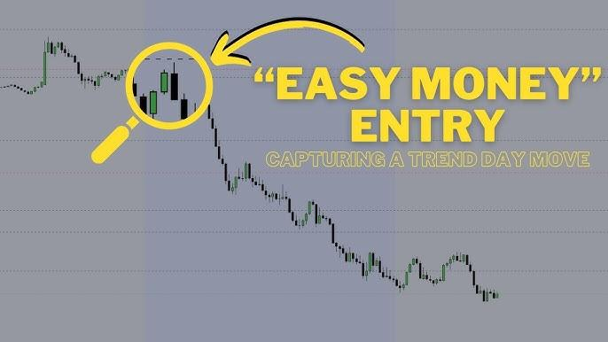

## Table of Contents

## What is a two-hour daily trading strategy?

A two-hour daily trading strategy is a plan that traders use to buy and sell stocks or other financial products within a short time frame each day. The idea is to focus on trading for just two hours, usually at the start of the trading day, to take advantage of the market's opening movements. Traders who use this strategy believe that the first few hours of trading can offer the best opportunities for making profits because there is often more activity and price changes during this time.

To follow this strategy, a trader might start by looking at the market news and any big events that could affect prices. They then choose which stocks or products to trade based on this information. During the two hours, the trader watches the market closely, making quick decisions to buy or sell. The goal is to make small profits from these trades, which can add up over time. After the two hours are up, the trader stops trading for the day, which helps them avoid the stress and risk of trading all day long.

## Why might someone choose a two-hour daily trading strategy over other trading methods?

Someone might choose a two-hour daily trading strategy because it fits well with their daily life. Not everyone can spend all day watching the stock market. With this strategy, a person can trade for just a short time each day and then go back to their other responsibilities. It's a good choice for people who have jobs or family duties but still want to try trading. Also, focusing on just two hours can help a trader stay fresh and make better decisions without getting too tired or stressed.

Another reason to pick this strategy is that the first few hours of the trading day can be the best time to make money. When the market opens, there's a lot of activity and prices can move a lot. Traders who use the two-hour strategy try to take advantage of these big moves. They look at the news and events that might affect the market and make quick trades to earn small profits. By stopping after two hours, they avoid the risk of the market changing too much later in the day.

## What are the best times of day to implement a two-hour daily trading strategy?

The best time to start a two-hour daily trading strategy is usually right when the market opens. In the United States, this is around 9:30 AM Eastern Time. This is when the stock market is most active because many people are buying and selling at the same time. The prices can change a lot during this time, which gives traders a chance to make money from these big moves. By starting at the opening, traders can take advantage of the news and events that happened overnight or early in the morning.

Another good time to start a two-hour trading session is around 1:00 PM Eastern Time. This is when the market can get busy again as traders in different time zones start their day. It's also a time when some big news might come out, like economic reports, which can move the market. Trading during this time can still be profitable because there's enough activity to make trades, but it's less hectic than the opening hours. Choosing the right time depends on when a trader can focus on trading and when they think the market will be most active.

## Which markets are most suitable for a two-hour daily trading strategy?

The stock market is a good place for a two-hour daily trading strategy. It opens at 9:30 AM Eastern Time in the United States, and this is when a lot of people start trading. The prices can change a lot in the first two hours, so traders can make quick trades to earn money. The stock market is easy to get into because there are many apps and websites where people can buy and sell stocks.

Another good market for this strategy is the foreign exchange (Forex) market. It is open 24 hours a day, but the best time to trade is when big markets like London and New York are open. This usually happens from around 8:00 AM to 12:00 PM Eastern Time. During these hours, there is a lot of trading going on, which can make prices move a lot. Traders can use this to their advantage and make quick trades within a two-hour window.

## What tools and resources are essential for executing a two-hour daily trading strategy?

To execute a two-hour daily trading strategy, you need a good trading platform. This is a website or app where you can buy and sell stocks or other things. The platform should be easy to use and let you make trades quickly. You also need to have a fast internet connection so you can see the latest prices and make trades without waiting. Another important tool is a charting software. This helps you see how prices have moved in the past and can help you decide when to buy or sell.

Besides these tools, you need good information to make smart trades. You should read the news every day to know what's happening in the world that might affect the market. Websites like Bloomberg or Reuters can help you stay updated. You might also want to use a market scanner, which is a tool that looks at lots of stocks and tells you which ones are moving a lot. This can help you find good trading opportunities. Finally, having a trading journal is useful. This is where you write down what trades you made and why, so you can learn from your mistakes and get better over time.

## How can beginners start with a two-hour daily trading strategy?

Beginners can start with a two-hour daily trading strategy by first learning the basics of trading. They should read [books](/wiki/algo-trading-books) or watch videos about how the stock market works and what affects prices. It's important to understand terms like stocks, shares, and trading platforms. Once they have a good grasp of these basics, they can open an account with a trading platform. Many platforms offer demo accounts where beginners can practice trading without using real money. This is a great way to get comfortable with the platform and try out different strategies.

After getting some practice, beginners should start trading with a small amount of money. They should focus on trading for just two hours each day, usually right when the market opens at 9:30 AM Eastern Time. During these two hours, they should keep an eye on the news and use a market scanner to find stocks that are moving a lot. They can make quick trades to try to earn small profits. It's important for beginners to keep a trading journal where they write down what trades they made and why. This helps them learn from their mistakes and improve over time.

## What are the key indicators to watch during the two-hour trading window?

During the two-hour trading window, one of the key indicators to watch is the [volume](/wiki/volume-trading-strategy) of trades. Volume shows how many people are buying and selling a stock. If the volume is high, it means a lot of people are interested in the stock, and the price might move a lot. Beginners should look for stocks with high volume because they are easier to trade and can offer good opportunities for making money.

Another important indicator is the price movement. Traders should watch for big changes in the price of a stock, especially right after the market opens. If a stock's price goes up or down a lot in a short time, it might be a good time to make a trade. Using a charting software can help beginners see these price movements and decide when to buy or sell.

Lastly, beginners should pay attention to the news. News about a company or the economy can affect stock prices. If there's big news, like a company announcing good earnings or a new product, the stock price might go up. On the other hand, bad news can make the price go down. By keeping an eye on the news, traders can make smarter decisions during their two-hour trading window.

## How does one manage risk effectively within a two-hour daily trading strategy?

Managing risk in a two-hour daily trading strategy is important to avoid losing too much money. One way to do this is by setting a stop-loss order. This is a rule you set on your trading platform that automatically sells a stock if its price drops to a certain level. This helps you limit how much money you can lose on one trade. Another way to manage risk is by not putting all your money into one stock. Instead, spread your money across different stocks. This way, if one stock goes down, you won't lose all your money.

Another important part of managing risk is to only trade with money you can afford to lose. This means not using money that you need for bills or other important things. It's also a good idea to set a daily loss limit. This means deciding ahead of time how much money you are willing to lose in one day, and if you reach that limit, you stop trading for the day. By following these simple rules, you can keep your trading safe and avoid big losses.

## What are common mistakes to avoid when using a two-hour daily trading strategy?

One common mistake when using a two-hour daily trading strategy is trading too much. Beginners might think they need to make a lot of trades to make money, but this can lead to big losses. It's better to wait for good opportunities and make fewer, smarter trades. Another mistake is not using stop-loss orders. Without these, a trader can lose a lot of money if the price of a stock goes down suddenly. Setting a stop-loss order helps limit how much you can lose on one trade.

Another mistake is not doing enough research. Traders need to know what's happening in the news and how it might affect the stocks they are trading. Without this information, they might make bad decisions. Also, beginners often forget to keep a trading journal. Writing down what trades you made and why helps you learn from your mistakes and get better over time. By avoiding these common mistakes, traders can have a better chance of making money with a two-hour daily trading strategy.

## How can one optimize and refine a two-hour daily trading strategy over time?

To optimize and refine a two-hour daily trading strategy over time, it's important to keep learning and adjusting your approach. Start by reviewing your trading journal regularly. Look at the trades you made and see what worked and what didn't. This can help you find patterns and make better decisions in the future. You might notice that certain stocks or times of day are more profitable for you, so you can focus on those. Also, keep up with the news and learn more about the market. The more you know, the better you can predict how prices might move.

Another way to refine your strategy is by testing different approaches. You can use a demo account to try out new ideas without risking real money. For example, you might try trading different stocks or using different indicators to see if they help you make better trades. It's also helpful to talk to other traders and learn from their experiences. They might have tips or strategies that you can use to improve your own trading. By constantly learning and adjusting, you can make your two-hour daily trading strategy more effective over time.

## What advanced techniques can be applied to enhance the performance of a two-hour daily trading strategy?

One advanced technique to enhance the performance of a two-hour daily trading strategy is using technical analysis. This means looking at charts and using tools like moving averages, Relative Strength Index (RSI), and Bollinger Bands to predict how prices might move. By understanding these indicators, traders can make better decisions about when to buy or sell. For example, if the RSI shows a stock is overbought, it might be a good time to sell. Using these tools can help traders spot trends and patterns that they might miss just by looking at the prices.

Another technique is to use [algorithmic trading](/wiki/algorithmic-trading). This means writing computer programs that can make trades automatically based on certain rules. These programs can look at a lot of data very quickly and make trades faster than a person could. For example, a program might be set to buy a stock if its price goes above a certain level and sell it if the price drops below another level. This can help traders take advantage of small price movements that happen during the two-hour window. By using these advanced techniques, traders can make their strategy more effective and potentially earn more money.

## Can you provide case studies or examples of successful two-hour daily trading strategies?

One example of a successful two-hour daily trading strategy comes from a trader named Sarah. Sarah started trading for two hours each morning right when the market opened at 9:30 AM Eastern Time. She focused on stocks with high trading volume and used a market scanner to find the best opportunities. Sarah also kept a trading journal where she wrote down her trades and learned from her mistakes. Over time, she noticed that certain stocks performed well during the first hour of trading, so she focused on those. By using a stop-loss order to manage risk and only trading with money she could afford to lose, Sarah was able to make consistent profits from her two-hour strategy.

Another example is John, who used a two-hour daily trading strategy in the Forex market. He traded from 8:00 AM to 10:00 AM Eastern Time, when both the London and New York markets were open. John used technical analysis tools like moving averages and RSI to predict price movements. He also set up an algorithmic trading program to make quick trades based on these indicators. By focusing on currency pairs with high [liquidity](/wiki/liquidity-risk-premium) and staying updated with economic news, John was able to take advantage of the market's [volatility](/wiki/volatility-trading-strategies) during his two-hour window. His disciplined approach and use of advanced techniques helped him achieve success with his trading strategy.

## References & Further Reading

[1]: Bergstra, J., Bardenet, R., Bengio, Y., & Kégl, B. (2011). ["Algorithms for Hyper-Parameter Optimization."](https://dl.acm.org/doi/10.5555/2986459.2986743) Advances in Neural Information Processing Systems 24.

[2]: ["Advances in Financial Machine Learning"](https://www.amazon.com/Advances-Financial-Machine-Learning-Marcos/dp/1119482089) by Marcos Lopez de Prado

[3]: ["Evidence-Based Technical Analysis: Applying the Scientific Method and Statistical Inference to Trading Signals"](https://www.amazon.com/Evidence-Based-Technical-Analysis-Scientific-Statistical/dp/0470008741) by David Aronson

[4]: ["Machine Learning for Algorithmic Trading"](https://github.com/stefan-jansen/machine-learning-for-trading) by Stefan Jansen

[5]: ["Quantitative Trading: How to Build Your Own Algorithmic Trading Business"](https://www.amazon.com/Quantitative-Trading-Build-Algorithmic-Business/dp/1119800064) by Ernest P. Chan