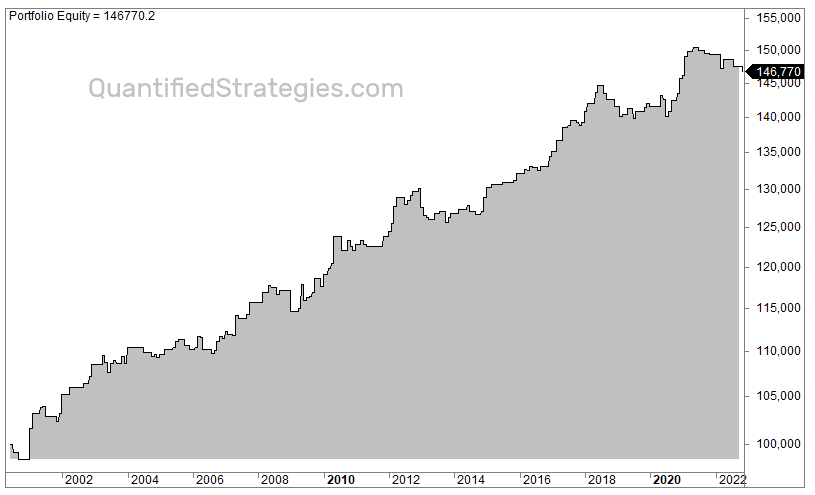

In today's fast-paced financial markets, traders are continuously seeking ways to maximize their returns efficiently. One approach that has gained significant traction is algorithmic trading, commonly referred to as algo trading. This method leverages computer programs and algorithms to execute trades at speeds and efficiencies that surpass those possible by human traders. Algorithmic trading removes the emotional and psychological barriers often associated with manual trading, enabling rules-based trading strategies that can be rigorously tested and refined.

Algo trading offers potential profitability through a variety of strategies tailored to exploit market inefficiencies and small price movements. These strategies range from trend-following and arbitrage to more complex techniques like machine learning-driven predictive analytics. By executing trades based on pre-set criteria and market conditions, traders can capitalize on intraday price fluctuations, resulting in numerous trading opportunities within a single trading session.



This article explores different daily trading strategies that utilize algorithmic systems to analyze markets, execute trades, and optimize performance. Through understanding these strategies, traders can identify opportunities to enhance their trading effectiveness while minimizing risks associated with emotional decision-making and market volatility. The integration of algo trading in daily trading activities has transformed the landscape of financial markets, promising a future where efficiency and strategic rigor lead the way in maximizing returns.

## Table of Contents

## Understanding Daily Trading Strategies

Daily trading strategies focus on exploiting short-term market fluctuations by executing trades within the same trading session. These strategies are characterized by their reliance on complex data analysis, the use of technical indicators, and an understanding of market metrics. The primary objective is to profit from minor price movements, achieving consistent gains over time.

Traders utilizing daily strategies may deploy an arsenal of technical tools to evaluate market conditions. Commonly used technical indicators include moving averages, Bollinger Bands, and Relative Strength Index (RSI), among others. These indicators help in identifying potential entry and exit points by analyzing patterns and trends within the market data.

To implement daily trading strategies effectively, traders often use sophisticated algorithms and models that process vast amounts of data to recognize opportunities in real-time. The strategies require constant monitoring of market conditions and quick decision-making to capitalize on transient price variations.

The ultimate goal of these strategies is to generate a steady stream of profits by harnessing small price differences that occur throughout the trading day. Successful daily trading hinges on thorough analysis, precise timing, and a comprehensive understanding of market dynamics. While the potential rewards can be significant, these strategies also demand a high level of expertise and discipline to manage the inherent risks associated with short-term market exposure.

## What is Algorithmic Trading?

Algorithmic trading, often referred to as algo trading, involves the use of computer algorithms to automate the process of trading financial instruments. These algorithms are equipped with pre-defined sets of instructions aimed at executing trades at optimal speeds and frequencies that exceed human capabilities. This high-speed trading approach leverages complex mathematical models and formulas to identify profitable trading opportunities based on market data.

One of the advantages of [algorithmic trading](/wiki/algorithmic-trading) is its ability to employ a variety of strategies that can accommodate different market conditions. Among commonly utilized strategies are [arbitrage](/wiki/arbitrage), trend-following, and [statistical arbitrage](/wiki/statistical-arbitrage).

Arbitrage takes advantage of price discrepancies between related financial instruments across different markets or exchanges. For example, if an asset is priced lower on Exchange A than on Exchange B, an arbitrage algorithm can simultaneously buy the asset on A and sell it on B, capturing the price differential as profit.

Trend-following strategies are designed to exploit market trends by executing trades that align with the prevailing market direction. These strategies analyze historical market data to identify trends and execute trades based on the assumption that the trends will continue.

Statistical arbitrage involves the application of statistical and econometric techniques to identify and exploit inefficiencies in the pricing of related financial instruments. These strategies usually involve pairs trading, where an algorithm analyzes the historical prices of two correlated assets and trades based on statistical deviations from their expected price relationship.

The automation of trading through algorithms helps eliminate emotional and psychological biases that often affect manual traders. Human traders can be influenced by fear, greed, or cognitive biases, leading to suboptimal trading decisions. By using pre-defined rules and conditions, algorithmic trading ensures consistency and discipline in trade execution.

Overall, algorithmic trading has transformed the landscape of financial markets by enhancing the speed and precision of trading activities, driving efficiencies, and enabling the implementation of sophisticated trading strategies that can operate continuously without human intervention.

## Popular Algorithmic Trading Strategies for Daily Trades

Algorithmic trading strategies for daily trades encompass various approaches that exploit market behaviors and inefficiencies. Each strategy employs mathematical models and computational power to make precise and timely trading decisions. Here are some of the prominent strategies used in algorithmic trading for daily market actions:

**Trend Following**: This strategy involves identifying and capitalizing on the momentum of market trends. The aim is to buy assets anticipating their prices will rise and sell them at higher prices. Trend following algorithms typically use technical analysis indicators such as moving averages and the relative strength index (RSI) to identify potential entry and exit points. An example of a simple moving average crossover strategy in Python is:

```python
import pandas as pd

def trend_following_strategy(data, short_window=40, long_window=100):
    data['Short_MA'] = data['Close'].rolling(window=short_window, min_periods=1).mean()
    data['Long_MA'] = data['Close'].rolling(window=long_window, min_periods=1).mean()
    data['Signal'] = 0
    data['Signal'][short_window:] = np.where(data['Short_MA'][short_window:] > data['Long_MA'][short_window:], 1, 0)
    data['Position'] = data['Signal'].diff()
    return data

# 'data' is a DataFrame containing stock prices with a 'Close' column
```

**Mean Reversion**: This strategy is based on the principle that asset prices tend to return to their historical mean or average level. When prices deviate significantly from the mean, mean reversion algorithms initiate trades expecting a reversion. Bollinger Bands, which map price levels at certain standard deviations from a moving average, are often used to detect overbought or oversold conditions indicative of potential mean reversion.

**Momentum Trading**: In contrast to mean reversion, momentum trading focuses on exploiting price movements in a single direction. Traders using this strategy buy assets demonstrating upward price trajectories and sell those with declining prices. The strength of momentum can be gauged using indicators like the Momentum Indicator or the Moving Average Convergence Divergence (MACD).

**Scalping**: Scalping focuses on making numerous trades to earn small profits from minor price changes throughout the day. The strategy involves executing a high volume of trades quickly, often using timeframes as short as a few seconds to minutes. Scalping requires sophisticated technology to achieve the low latency necessary for success. The bid-ask spread is crucial in scalping, with strategies often implemented through direct market access (DMA) to ensure rapid execution.

**Statistical Arbitrage**: This strategy entails exploiting pricing inefficiencies between correlated financial instruments by using statistical methods. It typically involves pairs trading, where a trader identifies pairs of stocks that normally move together and then enters into a long-short position when they diverge. The reversal of prices to their expected correlation yields profits. Statistical arbitrage relies heavily on quantitative models and historical data analysis to identify and exploit these discrepancies, often using tools like co-integration and regression analysis.

Each of these strategies has its distinct characteristics and requires careful implementation and continuous optimisation to match the ever-changing dynamics of financial markets.

## Benefits of Using Algo Trading in Daily Strategies

Algorithmic trading presents several benefits that enhance daily trading strategies, making them more efficient and potentially more profitable. One of the primary advantages is increased efficiency. Algorithms can process vast datasets at speeds unattainable by human traders. This capability allows for the rapid analysis of market data, detecting patterns, trends, and opportunities in real-time. Enhanced processing speed ensures that trades are executed at optimal prices, minimizing costs and maximizing potential profit margins.

Minimized emotion is another significant benefit of algorithmic trading. Human traders often fall victim to emotional biases, which can lead to irrational decision-making and reduce trading effectiveness. Algorithms, by contrast, operate based on predefined rules and logic, devoid of emotional influence. This objectivity helps in maintaining a disciplined approach to trading, reducing the likelihood of decisions driven by fear or greed.

Backtesting capability is a crucial advantage offered by algorithmic trading. Traders can test their strategies on historical market data to assess their effectiveness before deploying them in live markets. Backtesting involves simulating a trading strategy on past data to evaluate how it would have performed. This process helps in refining strategies, optimizing parameters, and identifying potential flaws. By validating a strategy against historical data, traders gain confidence in its potential performance in future market conditions.

High-frequency trading ([HFT](/wiki/high-frequency-trading-strategies)), a subset of algorithmic trading, offers the benefit of executing trades at a pace unachievable manually. HFT enables the execution of thousands of trades in milliseconds, capitalizing on minute price discrepancies that would be inaccessible to slower, manual trading methods. This high-speed trading capability opens up opportunities for small profit margins that can accumulate significantly over time.

Algorithmic trading thus revolutionizes daily trading strategies by enhancing processing speed, maintaining emotional discipline, enabling thorough [backtesting](/wiki/backtesting), and facilitating high-frequency trade execution. These benefits collectively contribute to more consistent and potentially more profitable trading outcomes.

## Challenges and Pitfalls

Algorithmic trading, while offering numerous benefits, also presents specific challenges and pitfalls that traders must consider carefully. A significant risk is overfitting, which occurs when a trading strategy is tailored too precisely to historical data. Overfitting can lead to poor performance in future market conditions as the strategy may excel in past scenarios but fail to adapt to new dynamics. This issue necessitates a delicate balance between using enough historical data to inform the strategy and maintaining flexibility to accommodate new information.

Another crucial [factor](/wiki/factor-investing) is the disregarding of transaction costs. High-frequency trading strategies can incur substantial costs, including commissions, taxes, and slippage, which can erode potential profits. Traders should incorporate these expenses into their calculations to avoid skewed profitability estimates. For instance, a Python function to factor in transaction costs might look like this:

```python
def calculate_net_profit(gross_profit, transaction_costs):
    return gross_profit - transaction_costs
```

This simple function can be a part of a more complex trading algorithm that continuously adjusts according to transaction costs.

Technological dependence is a further consideration. Traders relying heavily on algorithmic platforms face risks related to technical failures or system downtimes, which can lead to missed opportunities or unintended positions. Redundancy and robust IT infrastructure are essential to mitigate such risks and ensure smooth trading operations.

Finally, rapidly shifting market dynamics demand that strategies be frequently optimized. Market conditions, driven by economic indicators, geopolitical events, and investor sentiment, can change quickly, potentially invalidating previously successful strategies. Continuous monitoring and adjustment are essential, necessitating a more dynamic approach to algorithmic trading.

These challenges highlight the importance of a comprehensive approach to algorithmic trading, taking into account technological, financial, and market considerations to develop a sustainable trading strategy.

## Developing a Robust Algo Trading Strategy

Developing a robust algorithmic trading strategy involves a systematic approach combining clear objectives, data utilization, risk management, and continual evaluation.

**Define Clear Objectives**: Clear goals are essential for guiding the development and execution of any trading strategy. Objectives could vary from achieving a specific return on investment, minimizing drawdowns, or outperforming a benchmark index. Defining these objectives helps in the selection of appropriate strategies and metrics for performance evaluation.

**Utilize Comprehensive Data**: Successful algorithmic trading relies heavily on data. Historical data provides a foundation for understanding market behavior and testing strategies against past scenarios. Real-time market data, on the other hand, is crucial for executing trades at optimal moments. Leveraging a combination of both types improves decision-making and prediction accuracy. Python offers libraries like `pandas` and `numpy` to handle and analyze large datasets efficiently. For example:

```python
import pandas as pd

# Load historical data
data = pd.read_csv('historical_prices.csv')

# Calculate moving average
data['Moving_Avg'] = data['Close'].rolling(window=50).mean()

# Inspect data
print(data.head())
```

**Incorporate Risk Management**: Risk management is a fundamental component of any trading strategy. It involves techniques to protect the capital from significant losses. Stop-loss orders automatic selling at predefined price levels to limit losses, acting as a safety net against unexpected market movements. Diversification, or spreading investments across various assets, also reduces exposure to any single asset's volatility.

**Evaluate Continually**: Continual evaluation ensures that a trading strategy remains effective over time. Markets are dynamic, and a strategy that works today might not be relevant tomorrow. Regular performance monitoring and adjustments based on current market conditions keep strategies aligned with objectives. Backtesting frameworks in Python, such as `backtrader`, can be used to evaluate past performance and simulate strategy changes:

```python
import backtrader as bt

class TestStrategy(bt.Strategy):
    def next(self):
        if self.data.close[0] > self.sma[0]:
            self.buy(size=10)

# Initialize backtrader
cerebro = bt.Cerebro()
cerebro.addstrategy(TestStrategy)

# Add data and run strategy
data_feed = bt.feeds.YahooFinanceData(dataname='AAPL', fromdate=datetime(2020, 1, 1),
                                      todate=datetime(2021, 1, 1))
cerebro.adddata(data_feed)
cerebro.run()
```

In conclusion, developing a robust algo trading strategy requires clarity in objectives, extensive data utilization, strong risk management, and ongoing evaluation. This structured approach aids in maintaining consistency and adapting to ever-evolving market conditions.

## Conclusion

The integration of algorithmic trading into daily trading strategies offers significant advantages in efficiency and potential returns. By leveraging powerful computational systems, traders can swiftly process vast datasets, enabling them to identify and exploit market opportunities with precision. This technology-driven approach facilitates trades at a speed and frequency that surpass manual capabilities, thereby potentially enhancing profitability.

While challenges and risks exist, informed traders can develop strategies that offer consistency and profitability. Overfitting and failure to account for transaction costs are examples of pitfalls that can undermine strategy efficacy. Traders must remain vigilant to these risks, implementing robust risk management techniques and continuously refining their algorithms to adapt to evolving market conditions.

Continuous learning and adaptation remain key in leveraging algo trading for daily market activities. The dynamic nature of financial markets necessitates that traders consistently evaluate and optimize their strategies. This may involve the use of backtesting frameworks to validate algorithms against historical data, ensuring that they are capable of performing under a range of market scenarios. By combining rigorous data analysis with strategic foresight, traders can harness the benefits of algorithmic trading to maintain a competitive edge in the trading landscape.

## References & Further Reading

[1]: Bergstra, J., Bardenet, R., Bengio, Y., & Kégl, B. (2011). ["Algorithms for Hyper-Parameter Optimization."](https://dl.acm.org/doi/10.5555/2986459.2986743) Advances in Neural Information Processing Systems 24.

[2]: ["Advances in Financial Machine Learning"](https://www.amazon.com/Advances-Financial-Machine-Learning-Marcos/dp/1119482089) by Marcos Lopez de Prado

[3]: ["Evidence-Based Technical Analysis: Applying the Scientific Method and Statistical Inference to Trading Signals"](https://www.amazon.com/Evidence-Based-Technical-Analysis-Scientific-Statistical/dp/0470008741) by David Aronson

[4]: ["Machine Learning for Algorithmic Trading"](https://github.com/stefan-jansen/machine-learning-for-trading) by Stefan Jansen

[5]: ["Quantitative Trading: How to Build Your Own Algorithmic Trading Business"](https://www.amazon.com/Quantitative-Trading-Build-Algorithmic-Business/dp/1119800064) by Ernest P. Chan