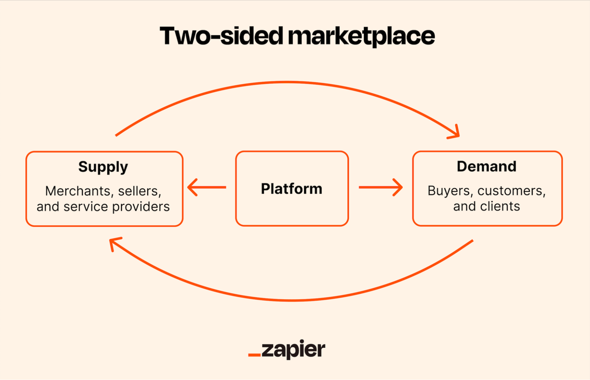

## Table of Contents

## What is a two-sided market?

A two-sided market is a type of market where there are two distinct groups of users who depend on each other to create value. For example, in a ride-sharing app like Uber, there are drivers and passengers. The app can only work if both groups are using it. The more drivers there are, the easier it is for passengers to get a ride, and the more passengers there are, the more likely drivers are to use the app.

Companies that operate in two-sided markets often have to balance the needs of both groups to keep them happy. They might offer different prices or incentives to each group. For example, a credit card company might charge merchants a fee but offer rewards to cardholders. The goal is to keep both sides engaged and using the platform, which can lead to more business and growth for the company.

## Can you provide examples of two-sided markets?

A two-sided market is like a place where two different groups need each other to make things work. Think about a video game console like the PlayStation. On one side, you have the gamers who want to play games. On the other side, you have the game developers who make the games. The more gamers there are, the more game developers want to make games for the PlayStation. And the more games there are, the more gamers want to buy a PlayStation. Both groups help each other grow.

Another example is a dating app like Tinder. There are people looking for dates and there are other people who also want to find dates. The app works best when there are lots of people using it. If more men join the app, it becomes more interesting for women to join too, and vice versa. The more people on the app, the better the chances of finding a good match. So, both groups need each other to make the app successful.

One more example is a newspaper. On one side, you have the readers who want to read the news. On the other side, you have the advertisers who want to reach those readers. The more readers a newspaper has, the more attractive it is for advertisers to place their ads. And the more ads there are, the more money the newspaper can make, which can lead to better content for readers. Both readers and advertisers need each other for the newspaper to thrive.

## How does a two-sided market differ from a traditional market?

A two-sided market is different from a traditional market because it has two groups that need each other to work well. In a traditional market, you usually have buyers and sellers, but they don't depend on each other as much. For example, in a grocery store, people come to buy food and the store sells it. The store doesn't need a certain number of buyers to keep selling, and buyers don't need a certain number of other buyers to shop there.

In a two-sided market, the two groups are connected in a special way. For example, in a ride-sharing app like Uber, drivers and passengers need each other. If there aren't enough drivers, passengers can't get rides easily, and if there aren't enough passengers, drivers won't want to drive. The company has to make sure both groups are happy and using the app to keep it working well. This is different from a traditional market where the focus is just on the transaction between the buyer and the seller.

## What are the key components of a two-sided market?

In a two-sided market, there are two main groups that need each other to make things work. One group is usually the users or customers, and the other group is the providers or suppliers. For example, in a ride-sharing app like Uber, the users are the passengers who want rides, and the providers are the drivers who give the rides. Both groups have to be part of the market for it to be successful. If there are not enough drivers, passengers can't get rides easily, and if there are not enough passengers, drivers won't want to drive.

The platform or company that runs the two-sided market has to balance the needs of both groups. This means they might offer different prices or incentives to each group to keep them happy and using the platform. For example, a credit card company might charge merchants a fee but give rewards to cardholders. The goal is to make sure both groups are happy and using the platform, which can lead to more business and growth for the company. This balancing act is a key part of making a two-sided market work well.

## How do platforms in a two-sided market generate revenue?

Platforms in a two-sided market make money by charging one or both groups of users. For example, a ride-sharing app like Uber might charge passengers a fee for each ride, while also taking a cut from the drivers' earnings. This way, the platform earns money from both sides. Sometimes, the platform might offer one side a free or discounted service to attract more users, while charging the other side more to make up for it. A good example is a newspaper that gives readers free access to its content but charges advertisers for placing ads.

Another way platforms generate revenue is by offering different levels of service or features for a fee. For instance, a dating app like Tinder might offer a basic service for free but charge for premium features like seeing who likes your profile or getting more visibility. This encourages users to pay for a better experience. By carefully balancing what each side pays and what they get in return, the platform can keep both groups happy and keep the money coming in.

## What are the challenges in balancing a two-sided market?

Balancing a two-sided market can be tricky because the platform has to make sure both groups are happy. If one group feels like they're not getting a good deal, they might stop using the platform. For example, if a ride-sharing app charges drivers too much, they might decide to drive for another company. But if the app doesn't charge passengers enough, it won't make enough money to keep running. The platform has to find the right balance so that both drivers and passengers want to keep using it.

Another challenge is making sure there are enough users on both sides. If there aren't enough drivers, passengers will have a hard time getting rides, and they might switch to another app. But if there aren't enough passengers, drivers won't make enough money and might quit. The platform has to work hard to attract and keep users on both sides. This might mean offering special deals or promotions to one group to keep them engaged, while still making sure the other group feels valued. It's a delicate balance that requires constant attention and adjustments.

## How can network effects impact a two-sided market?

Network effects can have a big impact on a two-sided market. They happen when the value of a platform grows as more people use it. For example, in a ride-sharing app like Uber, the more drivers there are, the easier it is for passengers to get a ride. And the more passengers there are, the more drivers want to use the app because they can make more money. This can lead to a positive cycle where the platform grows quickly because both groups see more value in using it.

But network effects can also create challenges. If one platform gets a lot bigger than others, it can be hard for new platforms to compete. For example, if most people use Uber, a new ride-sharing app might have a hard time getting enough drivers and passengers to start. This can lead to a situation where the biggest platform keeps getting bigger, while smaller ones struggle to grow. So, while network effects can help a two-sided market grow, they can also make it harder for new platforms to enter the market.

## What strategies can be used to attract both sides of a two-sided market?

To attract both sides of a two-sided market, a platform can start by offering one side a good deal or even free services. For example, a new ride-sharing app might let drivers keep all their earnings at first to get more of them to join. Once there are enough drivers, the app can then focus on attracting passengers by offering them discounts or promotions. This way, the platform builds up one side of the market before working on the other side.

Another strategy is to make the platform easy and fun to use for both groups. For instance, a dating app can have cool features like swiping or matching games that make it fun for users to find dates. At the same time, the app can offer tools for advertisers to reach those users in a way that feels natural and not too pushy. By making the experience good for both sides, the platform can keep them coming back and using it more.

Lastly, the platform can use word-of-mouth and social media to grow. If users on both sides are happy, they will tell their friends about it. A video game console like the PlayStation can encourage gamers to share their high scores or invite friends to play. This can attract more gamers, which in turn attracts more game developers. By getting people to talk about the platform, it can grow quickly and keep both sides engaged.

## How do pricing strategies differ in two-sided markets compared to one-sided markets?

In a two-sided market, the platform has to think about how much to charge both groups of users. Unlike a one-sided market where the focus is just on setting a price that works for buyers and sellers, a two-sided market needs to balance the needs of two different groups. For example, a ride-sharing app like Uber might charge passengers a fee for each ride and take a cut from the drivers' earnings. The app has to make sure that both passengers and drivers feel like they're getting a fair deal. Sometimes, the platform might even offer one side a free or discounted service to attract more users, while charging the other side more to make up for it. This is different from a one-sided market where the pricing strategy is simpler and focuses on one transaction.

Another way pricing strategies differ is that two-sided markets often use different pricing models to keep both sides happy. For example, a dating app like Tinder might offer a basic service for free to attract lots of users, but then charge for premium features like seeing who likes your profile. This way, the app can make money from users who want a better experience while still keeping the basic service free for everyone else. In a one-sided market, the pricing might be more straightforward, like setting a fixed price for a product. But in a two-sided market, the platform has to be creative with pricing to make sure both groups see value in using the platform.

## What are the common pitfalls in managing a two-sided market?

One common pitfall in managing a two-sided market is not keeping both groups happy. If one group feels like they're not getting a good deal, they might stop using the platform. For example, if a ride-sharing app charges drivers too much, they might quit and drive for another company. But if the app doesn't charge passengers enough, it won't make enough money to keep running. It's a delicate balance, and if the platform doesn't get it right, it can lose users on both sides.

Another pitfall is not having enough users on both sides. If there aren't enough drivers, passengers will have a hard time getting rides, and they might switch to another app. But if there aren't enough passengers, drivers won't make enough money and might quit. The platform has to work hard to attract and keep users on both sides. This might mean offering special deals or promotions to one group to keep them engaged, while still making sure the other group feels valued. It's a constant challenge that requires ongoing attention and adjustments.

## How can data analytics be used to optimize a two-sided market?

Data analytics can help a two-sided market work better by showing the platform what both groups of users are doing. For example, a ride-sharing app like Uber can use data to see where and when people need rides the most. This helps the app tell drivers where to go to pick up passengers, making it easier for everyone to get rides. The app can also see how happy drivers and passengers are by looking at things like how often they use the app and what they say in reviews. If drivers are not happy, the app might need to change how much it charges them or offer them better deals.

By using data, the platform can also find the best prices for both groups. For example, a dating app like Tinder can see which features people are willing to pay for, like seeing who likes their profile. The app can then charge more for those features while keeping the basic service free to attract more users. This helps the app make money while keeping both groups happy. Data analytics helps the platform make smart choices about how to grow and keep both sides of the market engaged.

## What are the future trends and innovations expected in two-sided markets?

In the future, two-sided markets are likely to see more use of technology like artificial intelligence (AI) and machine learning. These technologies can help platforms understand what users want better. For example, a ride-sharing app could use AI to predict where people will need rides and tell drivers to go there. This makes the service better for both drivers and passengers. Also, AI can help platforms find the best prices for both groups, making sure everyone feels like they're getting a good deal. This could lead to more people using the platform and make it grow faster.

Another trend we might see is more focus on making the user experience better. Platforms will try to make their apps easier to use and more fun. For example, a dating app might add new features like video chats or games to help people connect better. This can keep users coming back and using the app more. Also, platforms might work together with other companies to offer more services. For example, a ride-sharing app might partner with a food delivery service, so drivers can do both jobs. This can make the platform more useful for both drivers and passengers, helping it grow and stay successful.

## What is the understanding of Two-Sided Markets?

Two-sided markets, often referred to as multi-sided platforms, are systems that enable interaction and transaction between two distinct user groups. These markets are fundamental to connecting separate entities that benefit from mutual exchanges, such as buyers and sellers, producers and consumers, or service providers and clients.

A key characteristic of two-sided markets is the presence of cross-side network effects. This phenomenon occurs when an increase in the number of users on one side of the market leads to increased value for users on the opposite side. For instance, on a platform like Amazon, an increase in the number of sellers provides more choices for buyers, enhancing their shopping experience. Conversely, a larger pool of buyers attracts more sellers, seeking larger markets for their products. Such dynamics are essential for reinforcing the platform's growth and sustainability.

Platforms operating within two-sided markets function as intermediaries that facilitate seamless connections between users. They optimize user interactions and transactions, often employing advanced technological solutions to ensure efficiency. These platforms need to ensure balanced participation from both user groups to thrive. E-commerce platforms such as Amazon and eBay exemplify this market structure, serving as hubs where buyers can find diverse products and sellers can reach broad audiences.

In mathematical terms, the utility $U_i$ for user $i$ on side $A$ of the platform can be expressed as a function of the number of users $n_B$ on side $B$:

$$
U_i = f(n_B)
$$

where the function $f$ reflects the network benefits that accrue to user $i$ due to the presence of users on the other side. A typical outcome is an increase in user satisfaction and engagement as users from both sides actively participate in the platform ecosystem.

Overall, understanding these dynamics of two-sided markets is crucial for businesses seeking to capitalize on this model's potential. By effectively managing cross-side network effects and providing a compelling value proposition for both user groups, platforms can position themselves for long-term success in the competitive digital marketplace.

## References & Further Reading

[1]: Rochet, J.-C., & Tirole, J. (2003). ["Platform Competition in Two-Sided Markets."](https://academic.oup.com/jeea/article/1/4/990/2280902) Journal of the European Economic Association, 1(4), 990-1029.

[2]: Evans, D. S., & Schmalensee, R. (2016). ["Matchmakers: The New Economics of Multisided Platforms."](https://hbsp.harvard.edu/product/10028-PDF-ENG) Harvard Business Review Press.

[3]: Parker, G., Van Alstyne, M. W., & Choudary, S. P. (2016). ["Platform Revolution: How Networked Markets are Transforming the Economy and How to Make Them Work for You."](https://ide.mit.edu/sites/default/files/publications/Pipelines,%20Platforms,%20and%20the%20New%20Rules%20of%20Strategy.pdf.pdf) W. W. Norton & Company.

[4]: Armstrong, M. (2006). ["Competition in Two-Sided Markets."](https://onlinelibrary.wiley.com/doi/abs/10.1111/j.1756-2171.2006.tb00037.x) The RAND Journal of Economics, 37(3), 668-691.

[5]: Lopez de Prado, M. (2018). ["Advances in Financial Machine Learning."](https://www.amazon.com/Advances-Financial-Machine-Learning-Marcos/dp/1119482089) Wiley.

[6]: Jansen, S. (2020). ["Machine Learning for Algorithmic Trading."](https://github.com/stefan-jansen/machine-learning-for-trading) Packt Publishing.

[7]: Biais, B., Foucault, T., & Moinas, S. (2015). ["Equilibrium Fast Trading."](https://www.sciencedirect.com/science/article/pii/S0304405X15000288) The Review of Financial Studies, 28(7), 1870-1908.