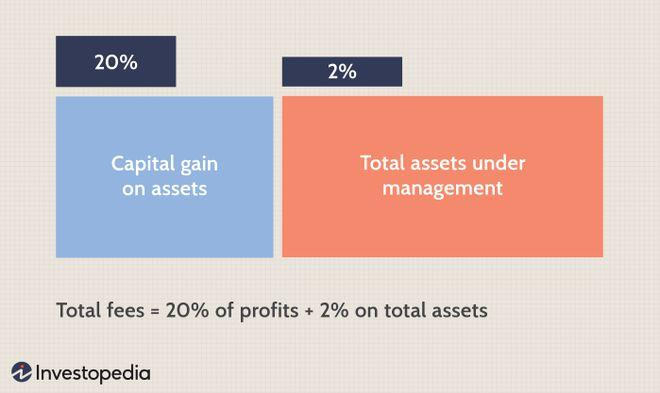

Two Sigma Investments is renowned as a leading hedge fund specializing in algorithmic trading. Since its inception, the firm has harnessed the power of technology, artificial intelligence (AI), and machine learning (ML) to revolutionize trading strategies, setting itself apart in the competitive financial sector. Algorithmic trading, which relies on computer algorithms to execute trades at speeds and efficiencies far beyond human capacity, forms the backbone of Two Sigma's operations. This technological approach allows the firm to process and analyze vast data sets, identify patterns, and make informed trading decisions with precision and speed.

The importance of technology, AI, and ML in modern trading cannot be overstated. In an industry where milliseconds can determine significant financial gains or losses, the use of these advanced technologies is crucial. AI and ML enable Two Sigma to continuously refine its trading models, adapting to market changes and enhancing predictive accuracy. For instance, machine learning algorithms can detect subtle patterns in market behavior that may elude traditional analytical methods, providing a competitive edge.

The purpose of this article is to explore Two Sigma's approach to algorithmic trading. By examining the strategies, technologies, and innovations employed by Two Sigma, we aim to understand how the firm maintains its leadership position in the hedge fund industry. This exploration highlights the central role of technological innovation in shaping the future of trading and underscores the dynamic interplay between finance and computer science, which continues to drive progress and competitive advantage in the market.

## Table of Contents

## Background of Two Sigma

Two Sigma Investments, founded in 2001 by John Overdeck, David Siegel, and Mark Pickard, has emerged as a major player in the field of algorithmic trading. The founding trio brought together a unique blend of expertise in computer science, mathematics, and financial markets, which significantly influenced the direction and operational framework of the firm. 

John Overdeck and David Siegel's deep understanding of computer science and mathematics was instrumental in building the data-driven, technology-focused culture that Two Sigma is renowned for today. Overdeck, a graduate of Stanford University, earned a degree in Mathematics and a master's degree in Statistics, equipping him with the analytical skills crucial for developing sophisticated trading algorithms. Siegel, who holds a computer science degree from Princeton University and a Ph.D. from MIT, contributed a profound knowledge of distributed computing and [artificial intelligence](/wiki/ai-artificial-intelligence), foundational elements for the firm’s technological infrastructure.

The name "Two Sigma" itself carries mathematical significance. In statistical terms, sigma (σ) represents the standard deviation, a measure of [volatility](/wiki/volatility-trading-strategies) or risk in a set of data points. The phrase "two sigma" typically refers to a range that encompasses approximately 95% of a normal distribution, a concept often used in risk management to signify the comfort zone within which most random variations fall. This reflects the firm's approach to systematically analyze risk and optimize returns within defined probabilistic boundaries.

By integrating technology with quantitative analysis, Two Sigma has been able to leverage vast datasets to make informed trading decisions, setting itself apart in the financial industry. This seamless blend of technology and quantitative finance embodies the vision of its founders and continues to guide the firm's strategic direction.

## Technology and Trading Strategies

Two Sigma Investments has carved a niche for itself in the [algorithmic trading](/wiki/algorithmic-trading) industry through its robust implementation of advanced technology, particularly artificial intelligence (AI) and machine learning. These technologies form the backbone of the firm's investment strategies, enabling it to analyze immense data sets rapidly and optimize trading decisions with precision.

The use of AI and [machine learning](/wiki/machine-learning) allows Two Sigma to discern patterns and correlations within market data that would otherwise be imperceptible. By leveraging these technologies, the firm can make informed predictions about market movements, leading to improved decision-making and ultimately, better investment returns. Machine learning models, which learn and adapt based on new data, enhance the firm’s capability to respond swiftly to changing market conditions.

Distributed computing also plays a crucial role in maximizing the efficiency of Two Sigma's trading strategies. This approach allows the firm to process vast amounts of data in parallel across multiple computing resources, significantly reducing computation times and enabling real-time data analysis. The scalability of distributed systems ensures that the firm can handle increasing data loads without compromising performance.

An example of Two Sigma's innovative approach to harnessing technology is the Halite AI programming competition. Halite is a game-based competition that encourages coders to develop AI strategies within a defined set of rules. By sponsoring such initiatives, Two Sigma not only fosters a culture of innovation but also taps into a diverse pool of talent and ideas that can be applied to its trading strategies. These competitions serve as both a testing ground and a recruitment tool, allowing the firm to stay at the cutting edge of technological advancements.

Two Sigma's focus on technology and innovation has been integral to its success in the competitive world of [hedge fund](/wiki/hedge-fund-trading-strategies)s. By continuously pushing the boundaries with AI, machine learning, and distributed computing, the firm maintains a significant competitive edge, adapting swiftly to new challenges and opportunities in the financial markets.

## Growth and Achievements

Two Sigma Investments has experienced notable growth and success since its founding in 2001. Starting with a small capital base, Two Sigma has expanded its assets under management (AUM) substantially over the years. As of the latest reports, the firm's AUM exceeds $60 billion, placing it among the largest quantitative hedge funds globally. This growth is a testament to the firm's successful application of data-driven strategies and technological innovation.

In terms of industry rankings, Two Sigma has built a robust reputation for delivering high returns. The firm's algorithmic trading strategies, underpinned by advanced machine learning and artificial intelligence techniques, have consistently outperformed many traditional hedge funds. According to Preqin, a data provider for the alternative assets industry, Two Sigma frequently appears at the top of hedge fund performance rankings, which further cements its status as a leading entity in the financial sector.

Two Sigma has also been proactive in forming strategic investments and partnerships to enhance its growth potential. One notable example is the formation of Wings Capital Partners, a partnership aimed at investing in aviation finance. This diversification into aviation exemplifies Two Sigma’s strategy of applying its algorithmic and data expertise to new asset classes, thereby broadening its investment portfolio and revenue streams. Through such initiatives, Two Sigma continues to strengthen its position and influence within the financial markets. 

Overall, Two Sigma's dedication to innovation and strategic growth has not only propelled its success but has also positioned it as a formidable player in the hedge fund industry. Its achievements highlight the potential of leveraging technology to drive financial performance and growth.

## Challenges and Controversies

Two Sigma Investments, a leader in the algorithmic trading industry, has not been without its share of challenges and controversies. Internal conflicts among its co-founders, John Overdeck and David Siegel, have occasionally disrupted operations. Although both founders come from a background steeped in computer science and mathematics, their differing views on strategic direction and company management have at times led to tension within the firm. These internal struggles could potentially influence decision-making processes, affecting overall operations and possibly impacting the firm's market performance.

Adding to these challenges are recent issues involving unauthorized modifications to trading models. In the highly sensitive environment of hedge funds—where models and algorithms drive significant financial decisions—such changes can lead to considerable financial scrutiny. Unauthorized alterations not only risk deviations from tested trading strategies but also expose the firm to substantial financial risk, undermining investor confidence. Although specifics on these incidents are generally handled discretely, such occurrences highlight the need for stringent internal controls and governance frameworks to safeguard proprietary algorithms and trading models.

Legal issues have also posed significant hurdles for Two Sigma. As a firm deeply invested in intellectual assets and proprietary technology, Two Sigma has faced several intellectual property disputes. These legal battles often revolve around former employees attempting to leverage confidential information or trade secrets. Legal proceedings can drain both time and resources and may also result in reputational damage. The firm has had to take vigorous legal action to protect its intellectual property, ensuring its innovative edge in a highly competitive industry.

In conclusion, while Two Sigma remains a dominant force in the algorithmic trading landscape, it navigates a complex web of internal and external challenges. Managing co-founder dynamics, safeguarding proprietary technologies, and adhering to stringent compliance and governance standards are critical for its continued success. These challenges underscore the high-stakes environment within which algorithmic trading firms operate, highlighting the importance of robust management strategies to maintain competitive advantage.

## Conclusion

Two Sigma Investments has firmly positioned itself as a transformative force in the hedge fund industry by effectively leveraging algorithmic trading. By integrating advanced technologies such as artificial intelligence and machine learning, the firm has revolutionized traditional trading methodologies, making significant impacts on how trading is conducted globally. The firm's data-driven approach and technology-first ethos have not only enhanced the predictive accuracy of its trading models but also its ability to manage massive datasets effectively, thereby optimizing investment decisions.

Looking ahead, Two Sigma faces both opportunities and challenges amidst leadership changes and evolving technological landscapes. The incorporation of cutting-edge technology and a shift towards further automation underscore the firm’s commitment to maintaining its competitive edge. As leadership transitions occur, the challenge will be to preserve the innovative culture that has been the bedrock of its success while navigating potential shifts in strategic vision.

Innovation remains key to sustaining a competitive advantage. Two Sigma's proactive approach in nurturing a culture of experimentation and technological ingenuity will likely continue to drive its success. As the hedge fund industry becomes increasingly competitive, the firm's emphasis on growth through innovation positions it well for future challenges and opportunities. In the ever-evolving algorithmic trading landscape, the ability to adapt and innovate will be crucial, ensuring that Two Sigma remains at the forefront of financial innovation.

## References & Further Reading

[1]: Bergstra, J., Bardenet, R., Bengio, Y., & Kégl, B. (2011). ["Algorithms for Hyper-Parameter Optimization."](https://papers.nips.cc/paper/4443-algorithms-for-hyper-parameter-optimization) Advances in Neural Information Processing Systems 24.

[2]: ["Advances in Financial Machine Learning"](https://www.amazon.com/Advances-Financial-Machine-Learning-Marcos/dp/1119482089) by Marcos Lopez de Prado

[3]: ["Evidence-Based Technical Analysis: Applying the Scientific Method and Statistical Inference to Trading Signals"](https://www.amazon.com/Evidence-Based-Technical-Analysis-Scientific-Statistical/dp/0470008741) by David Aronson

[4]: ["Machine Learning for Algorithmic Trading"](https://github.com/stefan-jansen/machine-learning-for-trading) by Stefan Jansen

[5]: ["Quantitative Trading: How to Build Your Own Algorithmic Trading Business"](https://books.google.com/books/about/Quantitative_Trading.html?id=j70yEAAAQBAJ) by Ernest P. Chan