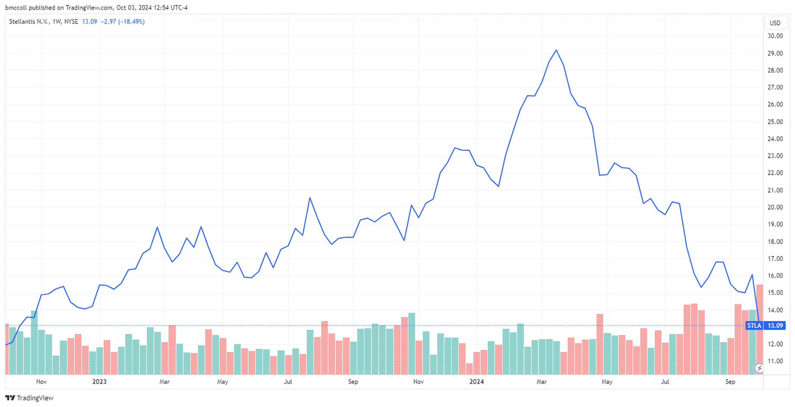

Algorithmic trading, commonly known as algo trading, utilizes computer programs to execute trades based on a defined set of rules and instructions. This technological advancement has significantly transformed the trading landscape by enhancing speed, efficiency, and precision. Algo trading eliminates the emotional and cognitive biases often associated with manual trading, allowing for a more systematic approach.

For newcomers to the world of trading, grasping the fundamentals of algo trading and implementing effective strategies can substantially amplify trading potential. This article introduces two straightforward yet impactful tips to assist beginners in embarking on their algorithmic trading journey.

We will explore the critical importance of utilizing reliable data sources and the role of backtesting in shaping a trader’s success in the dynamic trading environment. These foundational steps are crucial as they guide you toward establishing more systematic and profitable trading practices. Whether you are new to trading or transitioning from manual to automated systems, prioritizing these elements will equip you with the knowledge and tools needed for effective algorithmic trading.

## Table of Contents

## Tip 1: Utilize Reliable Data Sources

A crucial element in [algorithmic trading](/wiki/algorithmic-trading) is the utilization of reliable and accurate data. Without credible data, the algorithms designed to make trading decisions may falter, leading to ineffective trades. High-quality data ensures that your algorithms perform as expected, with precision and reliability, and are essential for making informed trading decisions.

Services like Databento offer a comprehensive solution by providing normalized real-time, intraday, and historical market data through streaming APIs. This ensures your algorithms are powered by accurate and up-to-date information. For example, having access to timely data can help you execute trades at the most advantageous moments, capitalizing on market opportunities as they arise. 

Moreover, having access to various asset classes, including options, futures, and equities, allows for more diversified trading strategies. This diversification can mitigate risk and open up opportunities across different markets. With access to a wide range of data, traders can design algorithms that respond to a multitude of market events and conditions, enhancing their ability to capture profitable trades.

Taking advantage of dedicated connectivity options could further reduce latency and improve execution speed. Low-latency data feeds and robust infrastructure can provide a competitive edge, as they enable your algorithms to react swiftly to market changes. Fast data processing and minimal delay in execution are critical in high-frequency trading environments, where the smallest time advantage can translate into significant profits.

Therefore, investing in a high-quality data provider is indispensable for anyone looking to succeed in algo trading. This investment not only ensures the dependability and accuracy of your trading processes but also provides the flexibility needed to adapt to diverse market conditions. Carefully selecting a data provider that meets these needs is a step towards establishing a strong foundation in algorithmic trading.

## Tip 2: Leverage Backtesting

Backtesting is an indispensable component in the development and refinement of trading strategies. It allows traders to simulate the performance of their algorithms using historical market data, providing insights into their effectiveness before any real capital is put at risk. This practice is crucial for identifying potential strengths and pitfalls in a trading strategy, ensuring that it is well-suited for current market conditions.

To conduct a meaningful backtest, traders can utilize a variety of tools. Many platforms offer powerful [backtesting](/wiki/backtesting) systems that allow for the implementation and evaluation of strategies across different asset classes and market conditions. This analysis can help determine whether a strategy that appears promising in theory would have generated profitable outcomes in the past. For instance, the assessment of a strategy's historical performance can highlight strengths such as consistent returns or weaknesses like vulnerability to specific market anomalies.

The robustness of a backtest is significantly influenced by the quality and breadth of data used. A comprehensive backtesting dataset should encompass diverse market conditions, including various timeframes and phases of [volatility](/wiki/volatility-trading-strategies). For example, a strategy's viability during periods of high volatility can be tested using such data, thereby providing clearer insights into its potential performance across different market dynamics. This extensive approach serves to increase traders’ confidence in the strategy's viability and decrease the likelihood of unforeseen losses when implemented live.

In practical terms, leveraging backtesting can be exemplified with Python, a versatile programming language extensively used in quantitative finance. Consider using the `pandas` library to manage and analyze historical data, and `numpy` for numerical operations. Additionally, visualization tools such as `matplotlib` can be employed to graphically represent the strategy's performance over time, aiding in the evaluation process.

By engaging in thorough backtesting, traders can optimize their algorithms to adapt better to real-world trading environments. This process not only enhances the strategy itself but also reduces the risk of financial losses due to inefficient trading decisions. Therefore, backtesting emerges as a pivotal practice for traders aiming to execute successful and reliable algorithmic trades.

## Conclusion

Incorporating reliable data sources and leveraging backtesting are two pivotal components in establishing a solid foundation in algorithmic trading. These steps ensure that your trading strategies are both data-driven and thoroughly validated, increasing your chances of executing successful trades.

As a beginner entering algorithmic trading, focusing on these two areas will provide you with a better understanding and control over your trading outcomes. By utilizing reliable data, traders are equipped to make informed decisions, reducing the risk of relying on flawed or outdated information. Reliable data sources minimize the uncertainty and enhance the precision of algorithms, leading to better-performing trades.

Backtesting further complements the process by providing a framework to test the viability of trading strategies before they hit the live market. By simulating algorithms against historical data, traders can identify potential weaknesses in their strategies and make necessary adjustments. This proactive approach aids in optimizing strategies and elevates the chance of success when executing real trades.

Alongside these foundational steps, continuous learning and adaptation to new tools and strategies are crucial to stay competitive in the ever-evolving market landscape. As algorithmic trading progresses, emerging technologies and methodologies offer new opportunities and challenges. Staying informed and adaptable ensures long-term success and innovation in trading practices, keeping traders at the forefront of the market's dynamic nature.

## References & Further Reading

[1]: Bergstra, J., Bardenet, R., Bengio, Y., & Kégl, B. (2011). ["Algorithms for Hyper-Parameter Optimization."](https://papers.nips.cc/paper/4443-algorithms-for-hyper-parameter-optimization) Advances in Neural Information Processing Systems 24.

[2]: ["Advances in Financial Machine Learning"](https://www.amazon.com/Advances-Financial-Machine-Learning-Marcos/dp/1119482089) by Marcos Lopez de Prado

[3]: ["Evidence-Based Technical Analysis: Applying the Scientific Method and Statistical Inference to Trading Signals"](https://www.amazon.com/Evidence-Based-Technical-Analysis-Scientific-Statistical/dp/0470008741) by David Aronson

[4]: ["Machine Learning for Algorithmic Trading"](https://github.com/stefan-jansen/machine-learning-for-trading) by Stefan Jansen

[5]: ["Quantitative Trading: How to Build Your Own Algorithmic Trading Business"](https://books.google.com/books/about/Quantitative_Trading.html?id=j70yEAAAQBAJ) by Ernest P. Chan