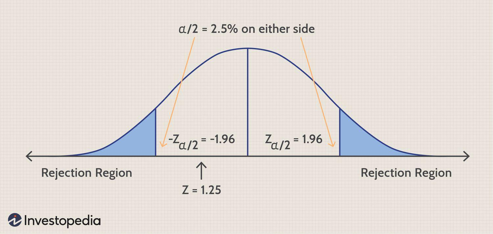

In statistics, hypothesis testing serves as a critical tool for drawing inferences or making decisions based on sampled data. This process becomes particularly crucial within the domain of trading, where strategic decisions hinge heavily on data-driven analyses. Algorithmic trading, which relies on advanced mathematical models and statistical algorithms, utilizes hypothesis testing to assess the validity and performance of trading strategies. The two-tailed test, a popular form of hypothesis testing, evaluates whether the sample data significantly deviates in either direction from a hypothesized benchmark. Understanding this test is essential to enhance the robustness of algorithmic trading strategies and to enable more informed decision-making within financial markets. By applying these statistical methods, traders can optimize their strategies, mitigate risks, and improve overall outcomes in their trading endeavors.

## Table of Contents



## What is Hypothesis Testing?

Hypothesis testing is a statistical method utilized to ascertain the plausibility of a proposed hypothesis based on sample data analysis. It serves as a core tool for statisticians and researchers aiming to draw inferences or make decisions rooted in empirical evidence. The process of hypothesis testing revolves around two fundamental concepts: the null hypothesis ($H_0$) and the alternative hypothesis ($H_1$).

The null hypothesis posits that there is no observable effect or difference in the population, serving as a statement of neutrality or status quo. In contrast, the alternative hypothesis suggests that there is a significant effect or difference present. For instance, if one is testing a new trading strategy, the null hypothesis might assert that this strategy does not provide better returns than an existing benchmark, while the alternative hypothesis would propose that the new strategy yields different returns.

In the context of trading, hypothesis testing becomes an indispensable tool for validating trading strategies and models. Traders use it to systematically quantify risks, ensuring that their strategies perform not just by coincidence but have statistical support. This quantification helps in reducing Type I errors (false positives) and Type II errors (false negatives), thus enhancing the robustness and reliability of algorithmic trading systems.

In practice, a trader might employ hypothesis testing to evaluate if a new algorithm offers returns that are significantly different from zero. This involves specifying a significance level, often set at 5%, representing the probability of rejecting the null hypothesis when it is indeed true. The choice of the significance level influences the critical region of the test.

The test statistic, calculated using sample data, is then measured against critical values derived from statistical distributions. For instance, the z-test or t-test may be applied, depending on whether the population variance is known and the sample size. The formula for the test statistic in a z-test is given by:

$$
z = \frac{\bar{x} - \mu}{\sigma / \sqrt{n}}
$$

where $\bar{x}$ is the sample mean, $\mu$ is the population mean under the null hypothesis, $\sigma$ is the population standard deviation, and $n$ is the sample size.

Should the test statistic fall within the critical region, the null hypothesis is rejected in favor of the alternative hypothesis, suggesting a significant effect or difference. In [algorithmic trading](/wiki/algorithmic-trading), this step is critical to confirm whether the performance of a trading model can be trusted, thus facilitating better decision-making and long-term strategy success.

## Understanding Two-Tailed Tests

A two-tailed test is a type of hypothesis test used to determine if there is a statistically significant difference between the mean of a sample and a known or hypothesized population mean. This method assesses whether the sample mean is significantly higher or lower than the population mean, thus serving a critical role in various statistical analyses, including trading and financial studies. The core of a two-tailed test is its ability to test for deviations in both directions from the hypothesized value, providing a robust framework for evaluating whether observed data diverge significantly from expectations.

In practice, the two-tailed test involves setting a null hypothesis ($H_0$) that posits no effect or difference, such as $H_0: \mu = \mu_0$, where $\mu_0$ is a hypothesized population mean. The alternative hypothesis ($H_a$) can be formulated as $H_a: \mu \neq \mu_0$, indicating that the sample mean $\mu$ is not equal to $\mu_0$.

Mathematically, a two-tailed test can be understood by considering the standard normal distribution, Z, where the test statistic is calculated as:

$$
Z = \frac{\bar{X} - \mu_0}{\sigma/\sqrt{n}}
$$

Here, $\bar{X}$ represents the sample mean, $\sigma$ is the population standard deviation, and $n$ is the sample size. The calculated Z-value is then compared against critical values that correspond to the significance level, often $\alpha = 0.05$, which is divided equally between the two tails (0.025 in each tail).

The use of a 5% significance level implies that there is a 5% chance of rejecting the null hypothesis when it is actually true, serving as a threshold to determine statistical significance. If the calculated test statistic falls within the critical region in either tail, the null hypothesis is rejected in favor of the alternative hypothesis. For instance, using the standard normal distribution, if the Z-value falls below -1.96 or above 1.96, the null hypothesis is rejected at 5% significance.

This approach is particularly useful in trading strategies and algorithms where the potential for gains or losses could occur in any direction. By employing a two-tailed test, traders can evaluate the reliability of their models across both possible outcomes, ensuring that strategies react robustly to market conditions that could diverge positively or negatively from expectations.

## Two-Tailed Tests in Algorithmic Trading

Algorithmic trading significantly relies on statistical validation to ensure the soundness of strategies. Two-tailed tests are particularly useful in this context, as they allow traders to determine if a trading algorithm's performance deviates considerably from what is expected. This statistical method provides a framework for assessing both positive and negative deviations in performance metrics, thus offering a comprehensive view of trading strategy effectiveness.

When implementing a new trading algorithm, traders often need to assess whether the average return is significantly different from a benchmark, commonly zero. A two-tailed hypothesis test can be structured as follows:

1. **Null Hypothesis ($H_0$)**: The average return of the algorithm is zero ($\mu = 0$).
2. **Alternative Hypothesis ($H_a$)**: The average return of the algorithm is not zero ($\mu \neq 0$).

A statistical significance level, often set at 5%, is chosen to evaluate the likelihood of observing the given data if the null hypothesis is true. The test statistic is typically calculated using a formula such as:

$$
t = \frac{\bar{x} - \mu}{s / \sqrt{n}}
$$

where $\bar{x}$ is the sample mean, $\mu$ is the population mean under the null hypothesis, $s$ is the sample standard deviation, and $n$ is the sample size. This statistic is then compared with critical values from the t-distribution to decide whether to reject the null hypothesis.

In algorithmic trading, these tests are crucial for not only determining profitability but also for testing theories related to market efficiency. Efficient market theories, such as the Efficient Market Hypothesis (EMH), imply that any deviations from expected returns are due to random noise rather than systematic inefficiencies. By applying two-tailed tests, traders can objectively validate financial models and trading algorithms, ensuring that any perceived advantage is statistically significant and not due to random chance.

Furthermore, within fintech solutions, these tests aid in validating complex financial models. For example, when implementing a predictive model for price changes, a two-tailed test could determine if the model's predictions significantly diverge from observed market behavior. This validation is crucial for adjusting parameters and improving model accuracy over time.

In summary, two-tailed tests are a critical component of algorithmic trading, facilitating robust validation of trading strategies and financial models in a statistically sound manner. They serve as a tool for distinguishing legitimate trading signals from random fluctuations, thereby enhancing the reliability and efficiency of trading systems.

## Formulating and Testing Hypotheses

Formulating the correct hypotheses is the foundational step in hypothesis testing and is crucial for its accurate application in trading. The process begins with defining two hypotheses: the null hypothesis ($H_0$) and the alternative hypothesis ($H_a$). In trading scenarios, the null hypothesis typically posits no effect or change, such as stating that the mean return of an algorithm is zero. Conversely, the alternative hypothesis suggests that there is a non-zero effect, indicating a meaningful change or impact, such as a positive or negative average return.

To facilitate hypothesis testing, traders must choose an appropriate significance level ($\alpha$), commonly set at 5%. This level represents the probability of committing a Type I error, where the null hypothesis is incorrectly rejected. The significance level determines the critical values against which the test statistic is compared, providing a threshold for deciding whether to reject $H_0$.

Once the hypotheses are defined, the next step involves calculating the test statistic. This is typically done using sample data derived from the trading algorithm or strategy. The test statistic measures how far the sample data deviates from what is expected under the null hypothesis. For normally distributed data, a common choice for the test statistic is the z-score, represented mathematically as:

$$

z = \frac{\bar{x} - \mu_0}{\sigma/\sqrt{n}}
$$

where $\bar{x}$ is the sample mean, $\mu_0$ is the population mean under the null hypothesis, $\sigma$ is the population standard deviation, and $n$ is the sample size. 

Finally, the calculated test statistic is compared to critical values corresponding to the chosen significance level. These critical values define the rejection regions on either side of the distribution curve in a two-tailed test. If the test statistic falls within these regions, the null hypothesis is rejected in favor of the alternative hypothesis. For instance, in a two-tailed test at a 5% significance level, the rejection regions are typically the top 2.5% and the bottom 2.5% of the distribution.

Utilizing these steps ensures that trading strategies are statistically validated, providing traders with a robust mechanism to assess the efficacy and risk associated with their trading models.

## Example of a Two-Tailed Test in Trading

In trading, determining whether a new algorithm offers a significant improvement over an existing strategy requires rigorous statistical validation. A common approach is to use a two-tailed hypothesis test to evaluate the average returns generated by the new algorithm compared to zero or another benchmark.

In this context, the null hypothesis ($H_0$) states that the mean return, $\mu$, of the new trading algorithm is zero ($\mu = 0$). This implies that the algorithm does not offer performance improvements compared to no return. On the other hand, the alternative hypothesis ($H_a$) posits that the mean return is not zero ($\mu \neq 0$), suggesting that the algorithm may generate either positive or negative returns.

To conduct a two-tailed test, traders first need to collect a sample of returns generated by the algorithm. The key steps involve:

1. **Calculating the Test Statistic**: The test statistic is typically calculated using the sample mean ($\bar{x}$), the standard deviation ($\sigma$), and the size of the sample ($n$). The formula for the test statistic (often a t-statistic in trading scenarios) is given by:
$$
   t = \frac{\bar{x} - \mu_0}{s/\sqrt{n}}

$$

   where $s$ is the sample standard deviation, and $\mu_0$ is the mean under the null hypothesis (here, zero).

2. **Determining Critical Values**: Given a significance level, commonly set at 5% ($\alpha = 0.05$), critical t-values are determined from the t-distribution table. The test is two-tailed, so the critical region is split between both tails of the distribution (i.e., $\alpha/2$ in each tail).

3. **Decision Rule**: The null hypothesis is rejected if the absolute value of the calculated t-statistic is greater than the critical t-values. Otherwise, there is insufficient evidence to suggest that the mean return of the algorithm differs from zero.

**Example in Python**:

Here's a simple Python code snippet utilizing the SciPy library to perform a two-tailed t-test on sample returns of a trading algorithm:

```python
import numpy as np
from scipy import stats

# Sample data: returns of the new trading algorithm
sample_returns = np.array([0.015, 0.007, 0.012, -0.005, 0.014, 0.006, 0.008])

# Mean under the null hypothesis
mu_0 = 0

# Calculate the t-statistic and p-value
t_statistic, p_value = stats.ttest_1samp(sample_returns, mu_0)

# Determine if we reject the null hypothesis at the 5% significance level
alpha = 0.05
if p_value < alpha:
    print("Reject the null hypothesis: The mean return is significantly different from zero.")
else:
    print("Fail to reject the null hypothesis: Not enough evidence to suggest the mean return is different from zero.")
```

In this script, `stats.ttest_1samp` is used to compute the t-statistic and p-value. The decision to accept or reject the null hypothesis is based on the comparison of the p-value with the significance level. This two-tailed approach is crucial for assessing whether the trading algorithm exhibits significant performance deviations, either positive or negative, aiding in strategy validation and risk management decisions.

## Conclusion

Two-tailed tests in hypothesis testing serve as a critical tool for statistical validation in trading, offering a rigorous framework for evaluating and validating trading strategies. These tests are indispensable for developing robust and reliable trading systems, which are essential for achieving long-term success in algorithmic trading and financial modeling. By analyzing both directions of deviation from a hypothesized value, two-tailed tests provide a comprehensive assessment of whether an observed effect is statistically significant, thus ensuring that strategies are not only theoretically sound but also practically viable.

The application of two-tailed tests enhances the robustness of trading algorithms by validating their performance against expected outcomes. For instance, if a trader hypothesizes that a new trading strategy generates a non-zero average return, a two-tailed test can determine if observed results significantly differ from zero, thereby indicating potential profitability or loss. This rigorous approach aids in confirming that trading algorithms are not exploiting random patterns but are genuinely capturing systematic market inefficiencies.

Understanding and effectively implementing two-tailed tests allow practitioners to mitigate risks associated with false positives or negatives in trading decisions. By adopting a statistical significance level, typically set at 5%, traders can limit the probability of Type I errors—erroneously rejecting a true null hypothesis. This careful risk management is crucial in the highly volatile world of trading, where erroneous decisions can lead to substantial financial losses.

Moreover, the integration of two-tailed tests into algorithmic trading systems supports dynamic decision-making processes, enhancing the trader's ability to adapt strategies in response to evolving market conditions. By providing a solid foundation for assessing trading hypotheses, these tests empower traders to make informed, data-driven decisions, thereby optimizing their trading strategies and contributing to a more efficient and resilient financial market environment.

## References & Further Reading

[1]: Bergstra, J., Bardenet, R., Bengio, Y., & Kégl, B. (2011). ["Algorithms for Hyper-Parameter Optimization."](https://dl.acm.org/doi/10.5555/2986459.2986743) Advances in Neural Information Processing Systems 24.

[2]: ["Advances in Financial Machine Learning"](https://www.amazon.com/Advances-Financial-Machine-Learning-Marcos/dp/1119482089) by Marcos Lopez de Prado

[3]: ["Evidence-Based Technical Analysis: Applying the Scientific Method and Statistical Inference to Trading Signals"](https://www.amazon.com/Evidence-Based-Technical-Analysis-Scientific-Statistical/dp/0470008741) by David Aronson

[4]: ["Machine Learning for Algorithmic Trading"](https://github.com/stefan-jansen/machine-learning-for-trading) by Stefan Jansen

[5]: ["Quantitative Trading: How to Build Your Own Algorithmic Trading Business"](https://www.amazon.com/Quantitative-Trading-Build-Algorithmic-Business/dp/1119800064) by Ernest P. Chan