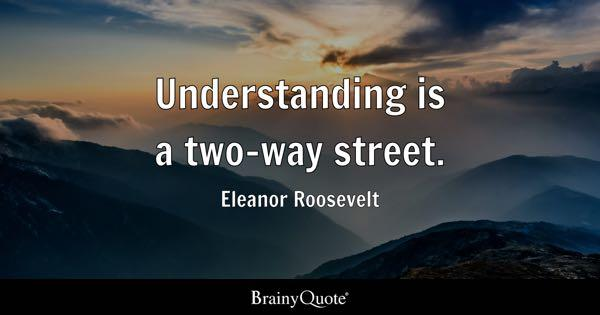

## Table of Contents

## What is a two-way quote?

A two-way quote is a price quote given by a market maker or a dealer for both buying and selling a security. It shows two prices: the bid price, which is the price at which the dealer is willing to buy the security, and the ask price, which is the price at which the dealer is willing to sell the security. The difference between these two prices is called the bid-ask spread.

This type of quote is important because it helps traders and investors know the current market conditions for a security. By looking at the two-way quote, they can decide if they want to buy or sell the security at the given prices. It also helps them understand how liquid the market is for that security, as a smaller bid-ask spread usually means the security is more liquid.

## Why are two-way quotes important in trading?

Two-way quotes are important in trading because they show the prices at which a dealer is willing to buy and sell a security. This gives traders and investors clear information about the current market conditions. They can see the bid price, which is what the dealer will pay to buy the security, and the ask price, which is what the dealer wants to sell it for. This helps traders decide if they want to make a trade at those prices.

The difference between the bid and ask prices is called the bid-ask spread. A smaller spread usually means the security is easier to buy and sell, which is good for traders. By looking at the two-way quote, traders can understand how easy or hard it might be to trade that security. This information helps them make better decisions about when and how to trade.

## How does a two-way quote function in financial markets?

A two-way quote in financial markets is like a price tag that shows two numbers: the bid price and the ask price. The bid price is what a dealer or market maker is willing to pay to buy a security from you. The ask price is what they want to sell the same security for. When you see a two-way quote, you know right away what the current prices are for buying and selling that security.

This quote helps traders and investors a lot. By looking at the bid and ask prices, they can decide if they want to buy or sell the security at those prices. The difference between the bid and ask prices, called the bid-ask spread, also tells them how easy or hard it might be to trade that security. A smaller spread usually means it's easier to buy and sell, which is good for traders. So, a two-way quote gives important information that helps people make better trading decisions.

## What are the key components of a two-way quote?

A two-way quote has two main parts: the bid price and the ask price. The bid price is what a dealer or market maker is ready to pay to buy a security from you. It's like the price they put on the table to take the security off your hands. On the other hand, the ask price is what the dealer wants to sell the same security for. It's their selling price, and if you want to buy the security from them, this is what you'll have to pay.

The difference between these two prices is called the bid-ask spread. This spread is important because it tells you how easy or hard it might be to trade the security. If the spread is small, it means the security is easy to buy and sell, which is good for traders. By looking at a two-way quote, traders can quickly see the current prices for buying and selling and make better decisions about their trades.

## Can you explain the difference between a bid and an ask in a two-way quote?

In a two-way quote, the bid is the price that a dealer or market maker is willing to pay to buy a security from you. It's like someone saying, "I'll give you this much money if you sell me your security." For example, if the bid price for a stock is $50, that means the dealer is ready to buy that stock from you for $50.

The ask, on the other hand, is the price at which the dealer is willing to sell the same security to you. It's like them saying, "If you want to buy this security from me, you have to pay this amount." So, if the ask price for the same stock is $52, the dealer is willing to sell it to you for $52. The difference between the bid and the ask is called the bid-ask spread, which shows how easy or hard it might be to trade that security.

## What are the common types of two-way quotes used in different markets?

In different markets, two-way quotes can look a bit different, but they all have the same basic idea: they show the prices for buying and selling a security. In the stock market, you might see a two-way quote for a stock that shows the bid price, like $50, and the ask price, like $52. This means a dealer is ready to buy the stock from you for $50 and sell it to you for $52. In the foreign exchange market, two-way quotes are used for currency pairs. For example, if you see a quote for EUR/USD with a bid of 1.1000 and an ask of 1.1005, it means you can sell euros for 1.1000 dollars each, but you'll have to pay 1.1005 dollars to buy one euro.

In the bond market, two-way quotes work the same way but are often given in terms of yield rather than price. A quote might show a bid yield of 2.5% and an ask yield of 2.6%. This means the dealer will buy your bond at a price that gives a 2.5% yield and sell you a bond at a price that gives a 2.6% yield. In the options market, two-way quotes show the bid and ask prices for buying and selling options contracts. For example, an option might have a bid of $1.50 and an ask of $1.60, meaning you can sell the option for $1.50 and buy it for $1.60. Each market uses two-way quotes to help traders understand the current buying and selling prices for different types of securities.

## How do two-way quotes affect market liquidity?

Two-way quotes play a big role in how easy it is to buy and sell things in the market. They show the prices that dealers are willing to buy and sell a security, called the bid and ask prices. The difference between these two prices is the bid-ask spread. When this spread is small, it means it's easier for people to trade because they can buy and sell at prices that are close together. A small spread shows that there are lots of buyers and sellers, which makes the market more liquid.

On the other hand, if the bid-ask spread is big, it can make trading harder. A bigger spread means that there might not be as many people wanting to buy or sell that security, so it's less liquid. Traders might think twice before trading because the cost of buying and then selling (or selling and then buying) is higher. So, two-way quotes help everyone see how liquid the market is and make better choices about trading.

## What strategies can traders use based on two-way quotes?

Traders can use two-way quotes to make smart choices about when to buy or sell. If they see a small difference between the bid and ask prices, it means the market is liquid and it's easier to trade. Traders might decide to buy a security when they think the price is going to go up, and they can do this quickly because the small spread makes it easier. They might also sell a security when they think the price is going to go down, and again, the small spread helps them do this without losing much money on the difference between buying and selling prices.

On the other hand, if the difference between the bid and ask prices is big, traders need to be more careful. A big spread means the market might not be as liquid, and it could be harder to trade without losing money. Traders might wait for the spread to get smaller before they make a move, or they might use this information to guess that not many people want to buy or sell that security right now. By understanding the two-way quote, traders can decide if it's a good time to trade or if they should wait for better conditions.

## How do electronic trading platforms handle two-way quotes?

Electronic trading platforms make it easy for traders to see two-way quotes. They show the bid and ask prices right on the screen, so traders can quickly see what dealers are willing to buy and sell a security for. These platforms often update the quotes in real time, so the information is always fresh. This helps traders make fast decisions because they can see if the market is moving and if the prices are changing.

The platforms also help keep the market liquid by showing lots of different quotes from different dealers. This means traders can choose the best price to buy or sell. If a trader sees a small difference between the bid and ask prices, they know it's a good time to trade because the market is liquid. But if the difference is big, they might wait for a better chance to trade. So, electronic trading platforms use two-way quotes to help traders make smart choices about when and how to trade.

## What are the regulatory considerations for two-way quotes?

Regulators want to make sure that two-way quotes are fair and clear for everyone. They set rules that dealers and market makers have to follow when they show bid and ask prices. These rules help keep the market honest and stop people from trying to trick others with fake prices. Regulators also check that the quotes are easy to understand so that all traders, no matter how much they know, can make good choices.

Another big thing regulators look at is how dealers handle their quotes. They want to make sure that dealers are not changing their prices too much or too quickly, which could confuse people. They also want to be sure that dealers are ready to buy and sell at the prices they show. This helps keep the market working well and makes sure that traders can trust the prices they see.

## How do two-way quotes vary across different asset classes like stocks, forex, and commodities?

Two-way quotes work a bit differently depending on whether you're trading stocks, [forex](/wiki/forex-system), or commodities. In the stock market, a two-way quote shows the price a dealer will buy a stock from you (the bid price) and the price they will sell it to you for (the ask price). For example, if a stock has a bid of $50 and an ask of $52, the dealer is ready to buy it from you for $50 and sell it to you for $52. This helps traders see how much they might have to pay to buy or sell a stock and how easy it is to trade it.

In the forex market, two-way quotes are used for currency pairs. If you see a quote for EUR/USD with a bid of 1.1000 and an ask of 1.1005, it means you can sell one euro for 1.1000 dollars and buy one euro for 1.1005 dollars. The small difference between these prices shows that the forex market is often very liquid, making it easier to trade currencies. For commodities like gold or oil, two-way quotes also show the bid and ask prices, but these can change a lot based on things like supply and demand. A two-way quote for gold might show a bid of $1,800 per ounce and an ask of $1,805 per ounce, helping traders decide when to buy or sell based on the current market conditions.

## What advanced techniques can be used to analyze the patterns in two-way quotes for predictive trading?

Traders can use advanced techniques like technical analysis to look at patterns in two-way quotes and predict what might happen next. They might use charts to see how the bid and ask prices have moved over time. If they see that the bid-ask spread gets smaller when the market is about to go up, they might decide to buy a security. They can also use tools like moving averages to smooth out the price data and see if there are any trends. By looking at these patterns, traders can guess if the price will go up or down and make their trades at the right time.

Another technique is using algorithms to analyze two-way quotes. These computer programs can look at a lot of data very quickly and find patterns that might be hard for people to see. For example, an algorithm might notice that when the bid price goes up fast, the ask price often follows soon after. Traders can use this information to buy or sell before the price changes. These algorithms can also help traders see if the market is getting more or less liquid, which can tell them if it's a good time to trade. By using these advanced techniques, traders can make better guesses about what the market will do next and trade more successfully.

## What is the key to understanding financial quotes?

Financial quotes serve as vital snapshots of a security's market value, providing traders with essential information necessary for making informed trading decisions. At its core, a financial quote comprises several key components, including the last trade price, bid price, and ask price.

The **last trade price** is the most recent price at which a transaction for the security has been completed. This price provides an immediate reference point for the current market value of the security, though it might not necessarily reflect the price at which future transactions can occur.

The **bid price** represents the maximum price a buyer is willing to pay for a security at a given time. Buyers submit bids expressing their interest and the price they are willing to offer. Conversely, the **ask price** is the minimum price a seller is willing to accept to sell a security. Sellers present ask prices to indicate the price at which they are prepared to transact.

The difference between the bid and ask prices is referred to as the **bid-ask spread**. Mathematically, it is defined as:

$$
\text{Bid-Ask Spread} = \text{Ask Price} - \text{Bid Price}
$$

This spread is a critical measure of market [liquidity](/wiki/liquidity-risk-premium). A narrow bid-ask spread often signifies a liquid market, where securities can be bought and sold with minimal price movement. Conversely, a wide spread may indicate an illiquid market, where security trading may significantly affect the price and entail higher transaction costs.

Understanding the dynamics of these financial quotes is crucial, as they offer a concise representation of a security's supply and demand. The bid-ask spread not only reflects the liquidity but also highlights the transaction costs traders may incur. Traders, therefore, rely on financial quotes to gauge market conditions, anticipate price movements, and execute timely trades, especially in fast-paced markets where prices can fluctuate rapidly.

## What is the impact of depth and liquidity on quotes?

Market depth refers to the market's ability to absorb large buy and sell orders without causing significant price changes. It is a crucial indicator of market stability and robustness. A market with substantial depth can handle substantial transactions, maintaining price stability, which directly impacts the bid-ask spread. For traders, understanding market depth is key to making informed decisions, as deeper markets generally offer more favorable trading conditions with narrower spreads.

Liquidity, on the other hand, describes how quickly a security can be bought or sold in the market without affecting its price. High liquidity implies that there are many buyers and sellers available, which leads to tighter bid-ask spreads and generally more accurate quotes. When liquidity is high, traders can execute large trades with minimal impact on the market price, reducing the transaction costs associated with trading.

The interaction between market depth and liquidity plays a vital role in determining the efficiency and accuracy of financial quotes. The bid-ask spread is a direct reflection of these elements. Mathematically, the spread $S$ can be expressed as:

$$
S = A - B
$$

where $A$ is the ask price and $B$ is the bid price. A small spread indicates high liquidity and sufficient market depth, whereas a larger spread might suggest low liquidity or insufficient market depth.

### Liquidity's Role in Quote Accuracy and Trading Performance

High liquidity is synonymous with quote accuracy. When a market is liquid, the abundance of transaction opportunities ensures that the quotes remain a true reflection of the market's consensus valuation of a security. In such environments, the risk of encountering significant price slippage—the difference between the expected price of a trade and the price at which the trade is executed—is minimized.

Liquidity directly impacts trading performance by ensuring that traders can execute orders quickly and at predictable prices. This is particularly important for [algorithmic trading](/wiki/algorithmic-trading) strategies, which rely on precise entry and [exit](/wiki/exit-strategy) points to execute numerous trades in a short time. In liquid markets, algorithms can operate more efficiently, scanning available two-way quotes and executing trades with optimal timing and pricing.

### Understanding Market Depth Dynamics

Market depth provides insights into the [volume](/wiki/volume-trading-strategy) of bids and offers required to move the security's price by a specified amount. It is often visualized through a depth chart, which plots the cumulative volume of buy and sell orders at different price levels. A market with significant depth will feature substantial volumes close to the current market price, signifying a strong cushion against price [volatility](/wiki/volatility-trading-strategies).

The capacity of a market to withstand large trades without significant price impact hinges on its depth. When depth is shallow, even moderately sized orders can create significant price fluctuations, widening the bid-ask spread and reducing quote reliability. Traders can assess depth through [order book](/wiki/order-book-trading-strategies) analysis, which reveals the range and scale of bid and ask orders.

### Conclusion

Understanding the impact of market depth and liquidity on financial quotes is indispensable for traders aiming to optimize their strategies. High liquidity ensures tighter spreads and more precise quotes, enhancing trading performance by minimizing transaction costs and reducing price slippage. Meanwhile, a profound comprehension of market depth helps traders assess the potential market impact of significant trades. By thoroughly evaluating these dynamics, traders can make more informed decisions, ultimately improving their market participation outcomes.

## References & Further Reading

[1]: Stoll, H. R. (2006). ["Electronic Trading in Stock Markets."](https://www.jstor.org/stable/pdf/30033638.pdf) The Journal of Economic Perspectives, 20(1), 153-174.

[2]: Hasbrouck, J. (2007). ["Empirical Market Microstructure: The Institutions, Economics, and Econometrics of Securities Trading."](https://academic.oup.com/book/52241) Oxford University Press.

[3]: "Algorithmic Trading and DMA: An Introduction to Direct Access Trading Strategies" by Barry Johnson.

[4]: Harris, L. (2003). ["Trading and Exchanges: Market Microstructure for Practitioners."](https://www.amazon.com/Trading-Exchanges-Market-Microstructure-Practitioners/dp/0195144708) Oxford University Press.

[5]: O'Hara, M. (1995). ["Market Microstructure Theory."](https://www.wiley.com/en-us/Market+Microstructure+Theory-p-9780631207610) Blackwell Publishing.

[6]: Kissell, R. (2013). ["The Science of Algorithmic Trading and Portfolio Management."](https://www.sciencedirect.com/book/9780124016897/the-science-of-algorithmic-trading-and-portfolio-management) Academic Press.