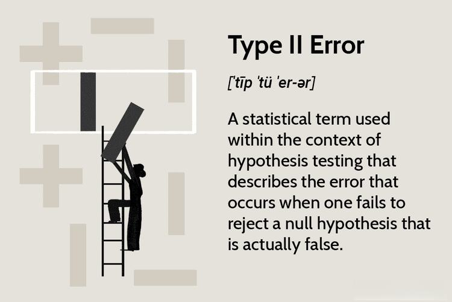

In statistical analysis and algorithmic trading, accurate decision-making is vital for successful outcomes. Central to this pursuit is the understanding and management of errors in statistical testing, specifically Type I and Type II errors. These errors can profoundly impact algorithmic trading strategies by influencing the accuracy of trade signals, leading to either missed opportunities or unprofitable trades.

Type I errors occur when a true null hypothesis is incorrectly rejected. In trading, this translates to false positive signals—triggers to buy or sell when there is no genuine opportunity, potentially resulting in unnecessary transaction costs and financial losses. Conversely, Type II errors arise when a false null hypothesis is not rejected, leading to missed profitable opportunities due to undetected signals. Both types of errors alter the performance and outcome of trading algorithms, thus requiring effective management.



The aim of this article is to explore the nature of these statistical errors, assess their implications for trading algorithms, and discuss strategies for error mitigation. By understanding how these errors affect trading outcomes and implementing best practices to manage them, traders and data scientists can enhance the effectiveness of their trading algorithms. As the market environment continually evolves, minimizing these errors is crucial for optimizing trading performance and maintaining a competitive edge.

## Table of Contents

## Understanding Statistical Errors

Statistical errors are crucial components of hypothesis testing in statistics, directly impacting decision-making processes. In this context, they are particularly relevant in fields such as algorithmic trading, where decisions based upon statistical tests can significantly influence profitability and risk management.

Type I errors, also known as false positives, occur when a true null hypothesis is incorrectly rejected. This error signifies that the test suggests the presence of an effect or relationship when, in fact, none exists. The probability of committing a Type I error is denoted by the Greek letter alpha (α), often referred to as the significance level of the test. A common choice for α is 0.05, but this can be adjusted based on the acceptable risk level for false positives in a given analysis.

Conversely, Type II errors, or false negatives, happen when a false null hypothesis is not rejected. This type of error indicates a failure to recognize an effect or relationship that is actually present. The probability of a Type II error is represented by the Greek letter beta (β). The power of a test, calculated as 1 - β, reflects the test's ability to correctly detect a true effect or relationship. In statistical testing, increasing the sample size or the effect size can often enhance the power and reduce the likelihood of Type II errors.

Understanding these errors is essential for implementing effective trading strategies. Type I errors can lead traders to enter unprofitable trades based on incorrect signals, while Type II errors can cause missed opportunities when profitable trades are not identified. The balance between these errors hinges on setting appropriate significance levels and choosing sample sizes that enhance test reliability without increasing the likelihood of making incorrect decisions.

In [algorithmic trading](/wiki/algorithmic-trading), managing the tradeoff between sensitivity and specificity is key to minimizing both Type I and Type II errors. As these errors can substantially alter the outcomes of trading algorithms, optimizing this balance remains a critical consideration for traders and data scientists seeking to enhance their algorithmic models.

## Type I Error in Algorithmic Trading

In algorithmic trading, Type I errors arise from mistakenly identifying a false positive signal. This error type can manifest in scenarios where a trading strategy erroneously interprets random data variations as meaningful patterns, triggering a Buy signal without an actual price increase. This misinterpretation leads to entering unprofitable trades, subsequently incurring unnecessary transaction costs and potential financial losses.

To mitigate Type I errors, traders can employ several strategies centered on setting accurate statistical significance levels and refining algorithmic parameters. A common approach involves selecting an appropriate significance level, denoted by alpha (α), typically set at 0.05 or 0.01. This threshold defines the probability of rejecting a true null hypothesis, influencing the algorithm's sensitivity to noise in the data.

Robust back-testing and cross-validation methods are essential in minimizing Type I errors in algorithmic trading. Back-testing involves simulating the trading strategy on historical data to evaluate its performance and sensitivity to different market conditions. This process helps identify patterns that may lead to false positive signals.

Cross-validation further enhances robustness by partitioning data into subsets, training the algorithm on some and validating it on others to ensure generalizability. This technique aids in fine-tuning model parameters, reducing the likelihood of overfitting, and ensuring that the strategy performs well on unseen data.

In Python, traders can implement these strategies using libraries like NumPy, pandas, and scikit-learn for data manipulation and model validation. Below is a simple Python code snippet illustrating the use of cross-validation in a trading algorithm:

```python
from sklearn.model_selection import cross_val_score
from sklearn.ensemble import RandomForestClassifier
import numpy as np

# Example features and labels
X = np.random.rand(100, 5)  # Features: 100 samples, 5 features each
y = np.random.randint(0, 2, 100)  # Binary labels: 100 samples

# Random forest classifier for trading signals
model = RandomForestClassifier(n_estimators=100, random_state=42)

# Use cross-validation to evaluate the model
scores = cross_val_score(model, X, y, cv=5)

print(f"Cross-validated scores: {scores}")
print(f"Average accuracy: {np.mean(scores):.2f}")
```

This script leverages a Random Forest model to predict trading signals while applying cross-validation to assess its accuracy across multiple data folds. By routinely conducting such analyses, traders can significantly reduce Type I errors, optimizing their algorithm's performance and enhancing overall trading success.

## Type II Error in Algorithmic Trading

Type II errors in algorithmic trading occur when a trading algorithm fails to identify a profitable opportunity, resulting in missed trades. This type of error reflects a false negative, where the algorithm incorrectly dismisses a valid trading signal. As a result, traders may miss out on potential profits that could have been captured if the signal were recognized appropriately.

One primary reason for Type II errors in trading systems is the tendency to design algorithms that lean towards conservatism to avoid Type I errors—false positives where trades are initiated based on misleading signals. While reducing Type I errors is crucial to prevent unnecessary transaction costs, over-cautiousness can inadvertently heighten the risk of Type II errors, leading to a trade-off scenario.

To mitigate the impact of Type II errors, enhancing the sensitivity of trading algorithms is crucial. This can be balanced by employing techniques that do not drastically increase the risk of Type I errors. Adaptive algorithms, for example, can adjust their parameters dynamically in response to changing market conditions. These adaptive mechanisms allow algorithms to recalibrate their sensitivity levels based on real-time data, effectively managing the trade-off between Type I and Type II errors.

Frequent reevaluation of models is another strategy that helps in curbing Type II errors. Given the volatile nature of financial markets, models that might perform well in one set of market conditions could falter in another. Continuous monitoring and updating of the models ensure that they remain agile and responsive to emerging market trends, thus minimizing the likelihood of missing profitable signals. Machine learning techniques, such as online learning algorithms, can be employed to continuously refine model predictions as new data becomes available. 

In practical terms, the implementation could involve:

```python
from sklearn.model_selection import cross_val_score
from sklearn.tree import DecisionTreeClassifier
from sklearn.datasets import load_iris

# Load a sample dataset
X, y = load_iris(return_X_y=True)

# Initialize a Decision Tree classifier with increased sensitivity to signals
classifier = DecisionTreeClassifier(max_depth=3, min_samples_split=5, class_weight='balanced')

# Perform cross-validation to evaluate the model's ability to detect signals accurately
scores = cross_val_score(classifier, X, y, cv=5, scoring='recall_macro')

print(f"Cross-validated recall scores (signal detection sensitivity): {scores}")
print(f"Mean recall: {scores.mean()}")
```

In this code, the `class_weight='balanced'` option within the `DecisionTreeClassifier` is employed to adjust the sensitivity of the model for signal detection. Cross-validation is used to assess the model's performance in identifying legitimate signals, helping to calibrate the trade-off between sensitivity and specificity effectively.

Ultimately, successful mitigation of Type II errors in algorithmic trading requires a careful balance between avoiding false positives and ensuring sensitivity to valid trading signals. By integrating adaptive algorithms and regularly updating trading models, traders can enhance their strategies to capture more profitable opportunities while minimizing erroneous decisions.

## Balancing Type I and Type II Errors

Balancing Type I and Type II errors is essential for refining algorithmic trading strategies, as both errors can significantly impact profitability. The challenge lies in optimizing the balance between sensitivity (true positive rate) and specificity (true negative rate), a concept known as the power tradeoff. This tradeoff is critical in determining how often a trading algorithm triggers buy or sell signals.

Threshold settings are pivotal in achieving this balance, as they define the criteria for decision-making. In practice, traders must carefully calibrate these thresholds, considering prevailing market conditions. For instance, a volatile market might necessitate more conservative threshold settings to avoid false positives (Type I errors), while a stable market could allow looser thresholds, reducing false negatives (Type II errors).

Adaptive algorithms play a crucial role in dynamically maintaining this balance. By leveraging statistical analysis and [machine learning](/wiki/machine-learning) techniques, these algorithms can adjust their parameters in real-time, responding to shifts in market dynamics. This adaptability helps in fine-tuning the sensitivity and specificity of the trading signals, ensuring optimal performance.

Additionally, the regular updating and back-testing of algorithms are fundamental practices for ensuring relevance in current market conditions. Back-testing involves simulating the trading strategy on historical data to evaluate its accuracy and make adjustments as necessary. This process not only helps in refining the thresholds but also aids in recognizing patterns that might lead to errors.

Through consistent evaluation and adjustment of algorithms, traders can effectively minimize both Type I and II errors. This ongoing process is crucial for maintaining the robustness and efficacy of trading strategies amid ever-changing market conditions.

## Case Studies

Examining case studies involving Type I and Type II errors in algorithmic trading provides critical insights into their practical implications and management. These errors, if not appropriately addressed, can adversely impact trading performance. 

### Case Study 1: Minimizing Type I Errors

A notable case involves a prominent [hedge fund](/wiki/hedge-fund-trading-strategies) that successfully minimized Type I errors—false positives—in its trading strategies, thereby enhancing profit margins. The fund, which heavily relied on statistical [arbitrage](/wiki/arbitrage), faced challenges with frequent Buy signals generated by noise rather than genuine market opportunities. Such Type I errors led to unnecessary trading actions, incurring avoidable transaction costs and potential losses.

To mitigate these issues, the fund adopted a multi-faceted approach. It began by lowering the significance level in their hypothesis tests, reducing the likelihood of accepting spurious signals. Moreover, the fund intensified its use of robust back-testing framework to validate its models under a wide array of market scenarios. By employing cross-validation techniques, the fund ensured that its models maintained generalization capability, hence preventing overfitting to specific datasets. 

Additionally, the adoption of machine learning algorithms to refine trading signals proved instrumental. These algorithms were trained to identify patterns with higher accuracy, reducing susceptibility to random market fluctuations. As a result, the hedge fund witnessed a reduction in Type I errors, which, in turn, led to improved profit margins while maintaining a consistent trading strategy.

### Case Study 2: Managing Type II Errors in High-Frequency Trading

In another instance, a high-frequency trading ([HFT](/wiki/high-frequency-trading-strategies)) firm grappled with the challenge of managing Type II errors, or false negatives, resulting in missed trading opportunities. The firm's conservative filtering of trading signals to avoid false positives led to an inadvertent increase in missed profitable trades.

To address this imbalance, the firm employed adaptive algorithms that adjusted sensitivity thresholds dynamically based on market conditions. By doing so, they could fine-tune their level of signal acceptance in real-time, thus optimizing the trade-off between Type I and Type II errors. Furthermore, the firm integrated advanced statistical models capable of learning from past missed opportunities, allowing the algorithm to better anticipate similar opportunities in the future.

The HFT firm also implemented frequent reevaluation of their models, adapting them to the latest market trends and [volatility](/wiki/volatility-trading-strategies) benchmarks. Python-driven simulations were employed to back-test strategy modifications extensively and ascertain their efficacy over both historical and synthetic datasets. 

Through these strategies, the firm effectively reduced Type II errors, successfully capturing previously missed opportunities, significantly enhancing the profitability of its trading strategies.

### Insights from the Case Studies

These case studies underscore the importance of finely-tuned statistical error management in trading strategies. They highlight the need for continuous model assessment, dynamic market condition adaptation, and advanced machine learning methodologies for achieving optimal trading performance. Lessons from these cases are invaluable for traders and developers seeking to refine algorithmic trading frameworks, ensuring they are both responsive and resilient in unpredictable financial markets.

## Conclusion

Type I and Type II errors significantly impact the efficacy of algorithmic trading strategies. Effective management of these errors is critical for optimizing trading algorithms. Understanding the nature and consequences of Type I (false positive) and Type II (false negative) errors helps traders fine-tune their algorithms for accurate signal prediction and trade execution. 

Through comprehensive analysis and strategic adjustments, such as refining significance levels or employing advanced validation techniques, traders can effectively minimize these errors. For instance, robust back-testing or dynamic threshold adjustment in trading algorithms can help traders navigate the trade-off between sensitivity and specificity, reducing unnecessary trades and missed opportunities. 

Machine learning and AI developments offer promising avenues for further error reduction. By leveraging these technologies, traders can build adaptive models that continuously learn from new data and changing market conditions, enhancing prediction accuracy. Such advancements can introduce sophisticated algorithms capable of balancing false positives and negatives more efficiently.

Continuous learning and adaptation remain essential in the rapidly evolving trading landscape. Traders and data scientists must stay informed and agile, continually updating models in response to market changes to maintain competitive and effective trading strategies.

## References & Further Reading

[1]: Bergstra, J., Bardenet, R., Bengio, Y., & Kégl, B. (2011). ["Algorithms for Hyper-Parameter Optimization."](https://papers.nips.cc/paper/4443-algorithms-for-hyper-parameter-optimization) Advances in Neural Information Processing Systems 24.

[2]: ["Advances in Financial Machine Learning"](https://www.amazon.com/Advances-Financial-Machine-Learning-Marcos/dp/1119482089) by Marcos Lopez de Prado

[3]: ["Evidence-Based Technical Analysis: Applying the Scientific Method and Statistical Inference to Trading Signals"](https://www.amazon.com/Evidence-Based-Technical-Analysis-Scientific-Statistical/dp/0470008741) by David Aronson

[4]: ["Machine Learning for Algorithmic Trading"](https://github.com/stefan-jansen/machine-learning-for-trading) by Stefan Jansen

[5]: ["Quantitative Trading: How to Build Your Own Algorithmic Trading Business"](https://www.amazon.com/Quantitative-Trading-Build-Algorithmic-Business/dp/1119800064) by Ernest P. Chan