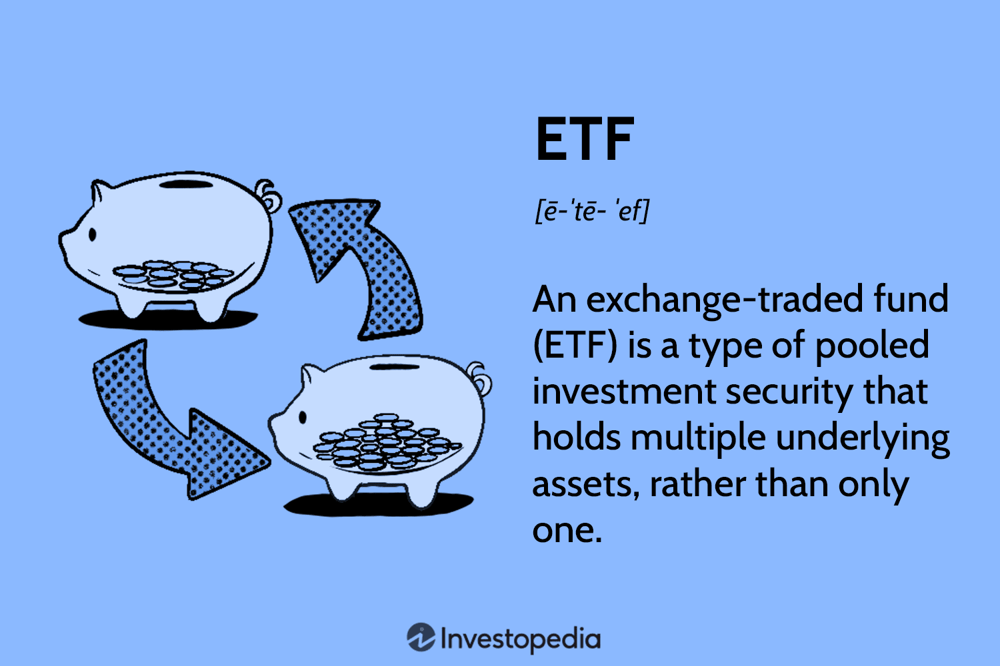

## Table of Contents

## What is an Exchange-Traded Fund (ETF)?

An Exchange-Traded Fund (ETF) is a type of investment that works a lot like a mutual fund but trades on a stock exchange, just like a stock. It's a basket of securities, like stocks, bonds, or commodities, that you can buy or sell throughout the trading day at market prices. This is different from mutual funds, which you can only buy or sell at the end of the trading day at a price set once a day.

ETFs are popular because they offer a way to diversify your investments easily. Instead of buying many different stocks or bonds one by one, you can buy shares in an ETF that already holds a mix of them. This can help spread out your risk. Plus, ETFs often have lower fees than mutual funds, making them a cost-effective choice for many investors.

## How do ETFs differ from mutual funds?

ETFs and mutual funds are both ways to invest in a bunch of different things at once, but they work a bit differently. ETFs trade on a stock exchange, just like stocks. This means you can buy or sell them anytime during the trading day at the current market price. On the other hand, mutual funds are bought or sold at the end of the trading day at a price that's calculated once a day. So, if you want to be able to trade throughout the day, ETFs might be better for you.

Another big difference is how they're managed and what they cost. ETFs usually track an index, like the S&P 500, and they often have lower fees because they're not trying to beat the market, just match it. Mutual funds, on the other hand, can be actively managed, meaning someone is [picking](/wiki/asset-class-picking) and choosing investments to try to do better than the market. This active management can lead to higher fees. So, if you're looking for a cheaper way to invest, ETFs might be the way to go.

## What are the different types of ETFs available to investors?

There are many different types of ETFs, and they can be grouped based on what they invest in. Some ETFs focus on stocks, and these can be further divided into ones that track broad market indexes like the S&P 500, or ones that focus on specific sectors like technology or healthcare. There are also ETFs that invest in bonds, which can include government bonds, corporate bonds, or even high-yield bonds. Commodity ETFs are another type, and they invest in things like gold, oil, or agricultural products. Finally, there are ETFs that use strategies like leverage or inverse performance, which can be more complex and riskier.

Another way to look at ETFs is by their investment strategy. Some ETFs are passively managed, meaning they just try to match the performance of an index without making active decisions. These are often cheaper because they don't need a lot of management. On the other hand, actively managed ETFs have someone making decisions about what to buy and sell, trying to beat the market. This can lead to higher fees but also the potential for better returns. There are also smart beta ETFs, which use a mix of active and passive strategies to try to get better returns than a regular index fund.

## What are equity ETFs and how do they work?

Equity ETFs are a type of exchange-traded fund that mainly invest in stocks. They work by pooling money from many investors to buy a bunch of different stocks all at once. This makes it easier for you to own a piece of many companies without having to buy each stock one by one. Equity ETFs can focus on different things, like a specific country, industry, or even the whole market. For example, an [ETF](/wiki/etf-trading-strategies) might track the S&P 500, which means it tries to match the performance of the 500 biggest companies in the U.S.

When you buy shares of an equity ETF, you're buying a small piece of all the stocks it holds. The price of the ETF goes up and down based on how well the stocks inside it are doing. If the stocks go up, the ETF's price usually goes up too. If the stocks go down, the ETF's price will likely go down as well. This makes equity ETFs a good way to spread out your risk because you're not betting on just one company. Plus, they're often cheaper to own than buying a bunch of individual stocks because the fees are usually lower.

## Can you explain fixed-income ETFs and their benefits?

Fixed-income ETFs are a type of exchange-traded fund that mainly invest in bonds. Bonds are like loans you give to a company or government, and they pay you back with interest over time. Fixed-income ETFs make it easy for you to own a bunch of different bonds all at once, without having to buy each one separately. They can focus on different kinds of bonds, like government bonds, corporate bonds, or even bonds from other countries. When you buy shares of a fixed-income ETF, you're getting a piece of all the bonds it holds.

The main benefit of fixed-income ETFs is that they can help you earn a steady income. Since bonds pay interest, the ETF can pass that interest on to you, usually every month or quarter. This can be a good way to get regular money coming in, especially if you're retired or just want some extra cash. Another benefit is that fixed-income ETFs can help spread out your risk. Instead of betting on just one bond, you're owning a little bit of many bonds. This can make your investment safer because if one bond doesn't do well, the others might make up for it. Plus, fixed-income ETFs often have lower fees than buying individual bonds, which can save you money over time.

## What are commodity ETFs and what are their advantages?

Commodity ETFs are a type of exchange-traded fund that invest in things like gold, oil, or even farm products. Instead of buying these things directly, you can buy shares in a commodity ETF, which makes it easier to own a piece of these goods without having to store them yourself. Commodity ETFs can focus on just one type of commodity, like silver, or they can hold a mix of different ones. When you buy shares in a commodity ETF, you're getting a small piece of all the commodities it owns.

One big advantage of commodity ETFs is that they can help you spread out your risk. Instead of betting on just one commodity, you're owning a little bit of many, which can make your investment safer. Another advantage is that commodity ETFs can be a good way to protect your money from inflation. When prices go up, commodities often go up too, so owning them can help keep your money's value from going down. Plus, commodity ETFs are easy to buy and sell on the stock market, just like stocks, which makes them more convenient than buying commodities directly.

## How do sector and industry ETFs function, and what are their uses?

Sector and industry ETFs are types of exchange-traded funds that focus on specific parts of the economy. A sector ETF might invest in companies from a big area like technology or healthcare, while an industry ETF might zoom in even more, like focusing just on software companies within the tech sector. When you buy shares in one of these ETFs, you're getting a piece of all the companies it holds. This means you can easily invest in a whole sector or industry without having to pick out individual companies yourself.

These ETFs can be really useful for investors who want to bet on certain parts of the economy doing well. For example, if you think technology is going to grow a lot, you could buy a tech sector ETF to spread your money across many tech companies. This can help you spread out your risk because you're not betting on just one company. Plus, sector and industry ETFs can help you focus your investments in areas you know a lot about or believe will do well in the future.

## What are the tax implications of investing in ETFs?

When you invest in ETFs, you need to think about taxes. ETFs are usually pretty tax-friendly because of how they're set up. When you buy or sell an ETF, you might have to pay capital gains tax. This tax depends on how long you held the ETF. If you held it for less than a year, it's a short-term capital gain, and you'll pay your regular income tax rate on it. If you held it for more than a year, it's a long-term capital gain, and the tax rate is usually lower.

Another thing to know is that ETFs can also give you dividends. These are payments from the companies the ETF owns, and they can be taxed too. If the ETF holds stocks that pay dividends, you'll get those dividends, and you'll have to pay taxes on them. The tax rate on dividends can be different depending on whether they're qualified or not. Qualified dividends are taxed at the lower long-term capital gains rate, while non-qualified dividends are taxed at your regular income tax rate. So, it's good to keep an eye on the tax rules and maybe talk to a tax advisor to make sure you're doing everything right.

## How can ETFs be used for diversification in an investment portfolio?

ETFs are a great way to spread out your investments, which is called diversification. When you buy an ETF, you're not just buying one stock or bond, but a whole bunch of them all at once. This means if one company or bond doesn't do well, it won't hurt your whole investment as much because you have many others to balance it out. For example, if you buy an ETF that tracks the S&P 500, you're getting a piece of 500 big companies in the U.S., so your money is spread across a lot of different places.

Using ETFs for diversification can also help you invest in different parts of the world or different types of investments without having to pick each one yourself. You can buy ETFs that focus on different countries, industries, or even things like gold or real estate. This way, you're not putting all your eggs in one basket. By mixing different kinds of ETFs in your portfolio, you can make it stronger and less likely to be hurt by problems in just one area.

## What are the costs associated with buying and selling ETFs?

When you buy or sell ETFs, you have to think about a few costs. One cost is the expense ratio, which is like a yearly fee for owning the ETF. This fee is a small percentage of the money you have in the ETF, and it's taken out automatically. ETFs usually have lower expense ratios than mutual funds, which is good for you. Another cost is the trading commission, which is what you pay to buy or sell the ETF. Some brokers don't charge a commission, but others do, so it's good to check before you start trading.

There's also something called the bid-ask spread, which is the difference between the price someone is willing to pay for the ETF (the bid) and the price someone is willing to sell it for (the ask). This spread can be small or big, and it's another cost you have to think about because you'll usually buy at the higher ask price and sell at the lower bid price. All these costs can add up, so it's smart to look at them carefully when you're choosing which ETFs to buy.

## How do smart beta ETFs work and what advantages do they offer?

Smart beta ETFs are a type of exchange-traded fund that tries to do better than regular index funds. They do this by using special rules to pick and weigh the stocks they hold. Instead of just copying an index like the S&P 500, smart beta ETFs might focus on things like how much a company pays in dividends, how big it is, or how much its stock price goes up and down. This means they're not just following the market, but trying to beat it in a smart way.

The main advantage of smart beta ETFs is that they can give you better returns than regular index funds. Because they use these special rules, they can sometimes find stocks that are undervalued or have good growth potential. Another advantage is that they still offer diversification, just like other ETFs. This means you're spreading your money across many different stocks, which can make your investment safer. Plus, smart beta ETFs often have lower fees than actively managed funds, so you get to keep more of your money.

## What are the risks involved in investing in ETFs, and how can they be mitigated?

Investing in ETFs comes with some risks that you should know about. One big risk is market risk, which means the whole market can go down and take your ETF with it. If you own a stock ETF and the stock market drops, your ETF will likely drop too. Another risk is that some ETFs focus on specific sectors or industries, so if that sector does badly, your ETF will do badly too. There's also something called tracking error, where the ETF doesn't match the performance of the index it's supposed to follow. This can happen because of fees or how the ETF is managed. Lastly, ETFs that use leverage or inverse strategies can be even riskier because they try to do better than the market by using borrowed money or betting against it, which can lead to bigger losses.

You can take some steps to lower these risks. One way is to diversify your investments by owning different types of ETFs, like ones that focus on different countries, industries, or even things like bonds or commodities. This way, if one part of your portfolio goes down, the others might help balance it out. Another way to reduce risk is to stick with ETFs that have low fees and track broad market indexes, like the S&P 500, because they're usually less risky than ETFs that focus on one sector or use complex strategies. It's also a good idea to keep an eye on your investments and maybe talk to a financial advisor to make sure you're making smart choices.

## References & Further Reading

[1]: ["Exchange-Traded Funds: Structure, Regulation and Application of a New Fund Form"](https://link.springer.com/book/10.1007/3-540-27637-8) by Waldron, A. D., & Jordan, J. V.

[2]: ["The ETF Handbook: How to Value and Trade Exchange Traded Funds"](https://www.wiley.com/en-us/The+ETF+Handbook%3A+How+to+Value+and+Trade+Exchange+Traded+Funds%2C+2nd+Edition-p-9781119193906) by David J. Abner

[3]: ["Algorithmic Trading and DMA: An introduction to direct access trading strategies"](https://www.amazon.com/Algorithmic-Trading-DMA-introduction-strategies/dp/0956399207) by Barry Johnson

[4]: ["ETFs for the Long Run: What They Are, How They Work, and Simple Strategies for Successful Long-Term Investing"](https://www.wiley.com/en-us/ETFs+for+the+Long+Run%3A+What+They+Are%2C+How+They+Work%2C+and+Simple+Strategies+for+Successful+Long+Term+Investing+-p-9780470138946) by Lawrence Carrel

[5]: ["The Little Book that Still Beats the Market"](https://www.amazon.com/Little-Book-Still-Beats-Market/dp/0470624159) by Joel Greenblatt