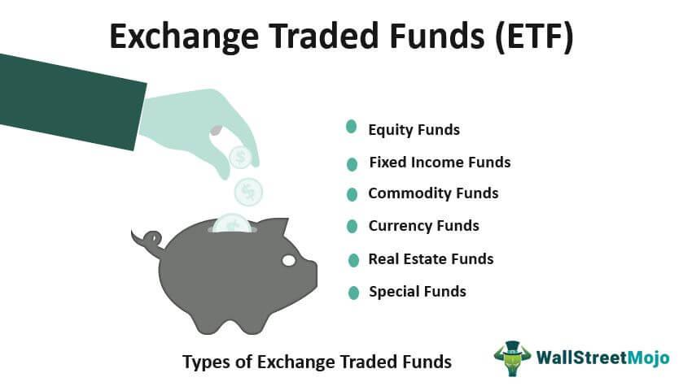

Exchange-Traded Funds (ETFs) are financial instruments that have gained substantial traction among investors due to their versatility and cost-effectiveness. Essentially, an ETF is a type of investment fund that is traded on stock exchanges, much like individual stocks. They aim to track the performance of a specific index, commodity, or asset class, providing investors with the opportunity to diversify their holdings without the need to purchase each underlying asset individually. This diversification can help mitigate risk while still capturing market trends.

The market offers a plethora of ETF categories catering to varied investment goals and preferences. Broadly, these include equity ETFs, which monitor stock indices like the S&P 500; bond ETFs, which focus on debt instruments and provide a fixed-income option; commodity ETFs, which invest in materials such as gold or oil; and sector or industry ETFs, which allow investors to target specific economic segments. Additionally, international and regional ETFs enable geographic diversification by providing exposure to global markets.

Investing in ETFs has several advantages. One of the key benefits is diversification, as ETFs often contain a broad mix of asset types or sectors, reducing exposure to any single stock's volatility. ETFs are also generally more liquid than mutual funds as they are traded on exchanges throughout the trading day, allowing investors to react swiftly to market events. Cost-effectiveness is another advantage; ETFs tend to have lower expense ratios compared to mutual funds, translating to savings for investors. Moreover, ETFs can offer tax efficiencies, particularly due to their structure which often results in lower capital gains distributions.

Algo trading, or algorithmic trading, introduces a new layer of sophistication to ETF investment strategies. It involves using automated systems to execute trades based on predetermined criteria or algorithms. This trading style is central to modern financial markets owing to its ability to enhance trade execution speed and accuracy. The synergy between algo trading and ETFs can offer substantial benefits; algorithms can be employed to optimize ETF trade executions, manage risks, and exploit market inefficiencies more effectively.

This introduction sets the stage for a comprehensive exploration of ETF types, their inherent benefits, and the integration of algorithmic trading. Understanding these elements allows investors to make informed decisions and fully harness the investment potential of ETFs and modern trading strategies.

## Table of Contents

## Types of Exchange-Traded Funds (ETFs)

Exchange-Traded Funds (ETFs) have become a staple in diversified investment portfolios due to their versatility and broad market access. This section outlines the various types of ETFs, highlighting their purposes and markets.

### Equity ETFs

Equity ETFs are designed to replicate the performance of a specific stock index, such as the S&P 500, the Dow Jones Industrial Average, or the NASDAQ-100. By holding a basket of stocks in the same proportion as the index they track, equity ETFs provide investors with a way to gain exposure to a broad section of the equity market. These ETFs are popular for their potential to yield capital appreciation and dividends while offering diversified exposure to market movements. An example is the SPDR S&P 500 [ETF](/wiki/etf-trading-strategies) (ticker: SPY), one of the most widely traded ETFs globally.

### Bond ETFs

Bond ETFs function to provide exposure to fixed-income markets, allowing investors to access different bonds, including government, municipal, corporate, and emerging market bonds. These ETFs distribute regular interest income to investors, mirroring the interest payments from the underlying bonds they hold. The convenience of trading bond ETFs on exchanges, like stocks, offers investors a liquid instrument to gain fixed-income exposure. For instance, the iShares iBoxx $ Investment Grade Corporate Bond ETF (ticker: LQD) tracks an index of U.S. dollar-denominated, investment-grade corporate bonds.

### Commodity ETFs

Commodity ETFs invest in physical commodities such as precious metals, agricultural products, or energy resources. They offer investors a way to participate in commodity price movements without directly purchasing the commodities. For example, the SPDR Gold Shares (ticker: GLD) ETF gives investors access to the price of gold without the need for storage or security concerns associated with holding physical gold. These funds can track commodity spot prices, futures indices, or directly hold commodities.

### Sector and Industry ETFs

Sector and industry ETFs focus on specific segments of the economy, such as technology, healthcare, or finance. These ETFs enable investors to target particular economic sectors or industries according to their investment preferences or economic outlook. By investing in sector ETFs, investors can overweight or underweight certain sectors in their portfolios to exploit market trends or hedge against economic cycles. A notable example is the Technology Select Sector SPDR Fund (ticker: XLK), which targets the technology sector.

### International and Regional ETFs

International and regional ETFs offer geographic diversification by enabling investors to gain exposure to markets outside their home countries. These ETFs invest in a range of markets, from developed regions like Europe and Japan to emerging markets such as China and Brazil. International ETFs help investors diversify risks associated with domestic economic or political uncertainties while potentially capitalizing on growth opportunities in foreign markets. A popular choice is the Vanguard FTSE Developed Markets ETF (ticker: VEA), which includes stocks from developed markets outside the United States.

Each type of ETF provides investors with unique benefits and exposure strategies, enabling them to achieve diversification, [liquidity](/wiki/liquidity-risk-premium), and targeted investment objectives across a wide array of asset classes and geographies.

## Benefits of Investing in ETFs

Exchange-Traded Funds (ETFs) have become a vital tool for investors seeking diversification, liquidity, cost-effectiveness, tax efficiency, and trading flexibility. These attributes contribute to their growing popularity among both retail and institutional investors.

ETFs provide substantial diversification benefits, allowing investors to gain exposure to a broad range of assets within a single investment vehicle. This is achieved by tracking indices that often include hundreds or thousands of securities, spreading risk across different asset classes, geographic regions, or industry sectors. Diversification reduces the unsystematic risk, which is the risk unique to individual investments, thus generally leading to a more stable portfolio performance over time.

Liquidity is another significant advantage of ETFs. As they are traded on major exchanges similar to stocks, ETFs offer higher liquidity compared to mutual funds. Investors can buy or sell ETF shares at any time during regular trading hours, providing ease of entry and [exit](/wiki/exit-strategy) from positions. This intraday trading capability means that prices are updated in real-time, reflecting current market conditions, which is not the case for mutual funds whose transactions occur at the end of the trading day after the net asset value (NAV) is calculated.

Cost-effectiveness is a key [factor](/wiki/factor-investing) in the attractiveness of ETFs. They typically have lower expense ratios than actively managed mutual funds because they generally follow a passive investment strategy. By mirroring an index, they incur fewer operational costs, leading to lower management fees for investors. For those looking to minimize investment costs, ETFs represent a sensible option.

Tax efficiency is another benefit associated with ETFs. The unique creation and redemption process of ETFs, which involves large blocks of shares known as "creation units," can help mitigate capital gains distributions. This process allows in-kind transfers, where securities are exchanged directly, minimizing the need for an ETF manager to sell securities and incur taxable gains. Consequently, investors often experience fewer tax events compared to mutual funds, enhancing tax efficiency.

Trading flexibility is a hallmark of ETFs since they are traded throughout the day like stocks. Investors have the ability to execute various types of orders, including market, limit, and stop orders. Additionally, more sophisticated techniques such as options trading and short selling are accessible, offering diverse strategies for portfolio adjustments and risk management. This flexibility can be leveraged to quickly respond to market opportunities or mitigate potential risks, making ETFs a versatile investment instrument.

In summary, the benefits of investing in ETFs—diversification, liquidity, cost-effectiveness, tax efficiency, and trading flexibility—make them an appealing choice for a wide array of investors. As the investment landscape continues to evolve, these characteristics are likely to maintain the appeal and utility of ETFs in diversified investment portfolios.

## Understanding Algo Trading

Algorithmic trading, commonly known as algo trading, refers to the use of computer algorithms to automate the process of trading financial instruments. These algorithms can analyze market data, utilize predefined rules for executing orders, and manage trading activities within seconds, minimizing human intervention. Algo trading is categorized by its ability to process large quantities of data and execute trades at speeds and frequencies impossible for human traders.

In modern financial markets, algo trading plays a pivotal role due to its efficiency and the precision it offers. It helps in reducing the transactional costs and enhancing liquidity by increasing the number of market participants. Major stock exchanges, including the New York Stock Exchange (NYSE) and NASDAQ, report substantial volumes of trading being driven by algorithms. A report by Mordor Intelligence estimated that by 2026, the [algorithmic trading](/wiki/algorithmic-trading) market will witness a growth of about 10.5% annually, showcasing its significance and expanding application in finance.

ETFs (Exchange-Traded Funds) can greatly benefit from algo trading due to their diversified nature and high liquidity. The synergy between ETFs and algorithmic trading is evident in the way algorithms can efficiently manage the trading of ETF shares to achieve optimal returns. For instance, algorithms are utilized to exploit [arbitrage](/wiki/arbitrage) opportunities that arise due to the price discrepancies between an ETF and its underlying assets. Such price inconsistencies are corrected quickly, keeping the market efficient. 

The potential benefits of using algo trading strategies with ETFs include enhanced efficiency in order execution, improved accuracy in tracking the underlying indices, and the ability to capitalize on immediate market opportunities. Algo trading assists in risk management by enabling timely responses to market [volatility](/wiki/volatility-trading-strategies), thereby preserving the value of investments. Additionally, it supports portfolio rebalancing and hedging strategies, ensuring that ETF holdings align with investment goals and market conditions.

Several common algo trading strategies are employed with ETFs. One popular method is the mean reversion strategy, where algorithms identify deviations from historical price patterns and execute trades to capture profits when prices return to their mean values. Momentum trading, another strategy, involves buying ETFs experiencing upward trends and selling those in downtrends. Algorithms also facilitate pairs trading strategies, where they identify correlations between ETFs and capitalize on differences to generate returns.

In conclusion, the integration of algo trading with ETFs provides significant advantages in terms of speed, accuracy, and cost savings. The continuous evolution of technology in financial markets promises further enhancements in algo trading systems, potentially leading to even more sophisticated strategies for managing ETF investments.

## The Synergy Between ETFs and Algo Trading

Algorithmic trading, often referred to as algo trading, is transforming the landscape of Exchange-Traded Funds (ETFs) by introducing improved speed, efficiency, and risk management. ETFs, with their diversification and liquidity perks, prove to be an ideal instrument for algorithmic strategies due to their broad market reach and trading flexibility.

Algo trading leverages sophisticated mathematical models and high-speed computational power to execute trades far quicker than any human trader. This enhanced speed is crucial for ETF transactions as it allows traders to capitalize on fleeting market opportunities, ensuring optimal trade execution. Algorithms can process market conditions and execute buy or sell orders within milliseconds, significantly reducing the risk of market price changes adversely affecting the trade outcome.

Risk management is another significant advantage provided by algo trading in the context of ETFs. Algorithms can be programmed to include stop-loss limits, ensuring that trades are automatically closed if the ETF's price moves unfavorably. Additionally, they can execute complex strategies that hedge against market volatility by using a combination of different ETF trades. For instance, quantitative strategies might involve [statistical arbitrage](/wiki/statistical-arbitrage) or [pair trading](/wiki/pair-trading), where the algorithm identifies correlations between different ETFs and exploits deviations to achieve risk-adjusted returns.

Historical case studies highlight the successful interplay between ETFs and algo trading. For example, during periods of heightened market volatility, algorithmic strategies have effectively managed ETF trades to stabilize portfolios, showcasing the robustness of algos in handling complex market scenarios. These strategies include market-making, where algorithms continuously provide liquidity by quoting buy and sell prices, thereby narrowing the bid-ask spread and enhancing market efficiency.

However, the integration of algo trading with ETF investments also poses several challenges. One significant consideration is the risk of over-optimization, where algorithms that perform well in back-tested scenarios might fail in live trading due to unforeseen market conditions or data overfitting. Additionally, market microstructure effects, such as slippage and latency, can affect the performance of algorithmic trades in ETFs. Developers and traders must ensure that the infrastructure and algorithms are resilient to these factors to prevent execution inefficiencies.

Moreover, regulatory aspects must be considered given the increasing scrutiny on the role of high-frequency trading and algorithmic practices in financial markets. Compliance with relevant regulations and ensuring transparency in algorithmic operations are critical factors for investors seeking to integrate these technologies with ETFs.

In summary, the synergy between ETFs and algo trading presents significant opportunities for enhanced trading efficiency and risk management while also necessitating careful consideration of challenges related to execution, optimization, and regulation. As technology continues to evolve, it is expected that this amalgamation will play a pivotal role in the future landscape of investment strategies.

## Conclusion

Exchange-Traded Funds (ETFs) and algorithmic trading (algo trading) have emerged as pivotal elements within modern financial markets, offering a dynamic interplay that enhances both investment strategies and trading efficiencies. Throughout this article, we have explored the multifaceted nature of ETFs, identifying the various types available—ranging from equity and bond ETFs to commodity and sector-specific ones—and valuing their inherent benefits, such as diversification, cost-effectiveness, liquidity, and tax efficiency. Simultaneously, we examined how algo trading optimizes trading operations through speed and precision, presenting new opportunities for investors in ETF markets.

The integration of algo trading with ETFs showcases a growing trend fueled by advancements in technology and data analytics, facilitating automated and faster trading operations. This synergy holds promise for enhanced execution strategies and superior portfolio management, making it an attractive proposition for both institutional and retail investors. However, familiarizing oneself with potential risks, such as algorithmic errors or market volatility, remains paramount.

Looking ahead, the evolution of ETFs and algo trading has the potential to reshape investment landscapes further. As technological innovations continue to emerge, and as financial markets gain complexity, the adoption and sophistication of algo trading with ETFs are expected to increase. This evolution may lead to the development of more complex and tailored trading strategies, offering personalized solutions for diverse investment needs.

For those intrigued by this burgeoning synergy, continuous learning and exploration are essential. Engaging with educational resources, workshops, and financial literature will equip aspiring investors and traders with the necessary skills and knowledge to leverage ETFs and algo trading effectively. By understanding both their potential and limitations, investors can make informed decisions, capitalizing on these tools to optimize their portfolios and achieve their financial objectives.

## References & Further Reading

[1]: ["Exchange-Traded Funds: Structure, Regulation and Application of a New Fund Form"](https://link.springer.com/book/10.1007/3-540-27637-8) by Waldron, A. D., & Jordan, J. V.

[2]: ["The ETF Handbook: How to Value and Trade Exchange Traded Funds"](https://www.wiley.com/en-us/The+ETF+Handbook%3A+How+to+Value+and+Trade+Exchange+Traded+Funds%2C+2nd+Edition-p-9781119193906) by David J. Abner

[3]: ["Algorithmic Trading and DMA: An introduction to direct access trading strategies"](https://www.amazon.com/Algorithmic-Trading-DMA-introduction-strategies/dp/0956399207) by Barry Johnson

[4]: ["ETFs for the Long Run: What They Are, How They Work, and Simple Strategies for Successful Long-Term Investing"](https://www.wiley.com/en-us/ETFs+for+the+Long+Run%3A+What+They+Are%2C+How+They+Work%2C+and+Simple+Strategies+for+Successful+Long+Term+Investing+-p-9780470138946) by Lawrence Carrel

[5]: ["The Little Book that Still Beats the Market"](https://www.amazon.com/Little-Book-Still-Beats-Market/dp/0470624159) by Joel Greenblatt