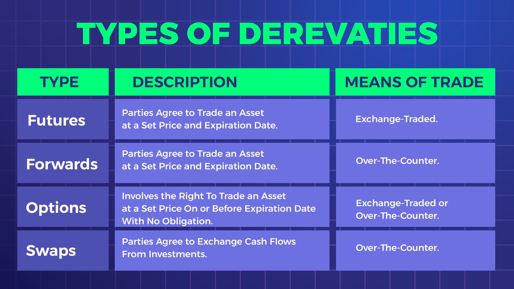

## Table of Contents

## What are derivatives and why are they used in finance?

Derivatives are financial instruments whose value is based on the value of an underlying asset, like stocks, bonds, commodities, or currencies. They are called derivatives because their value is derived from something else. Common types of derivatives include options, futures, and swaps. In simple terms, derivatives are like contracts between two parties that can be used to manage risk or to speculate on the future price movements of the underlying asset.

In finance, derivatives are used for several reasons. One main reason is to hedge against risk. For example, a farmer might use futures contracts to lock in a price for their crops, protecting against price drops. This way, they can ensure a stable income even if market prices fall. Another reason is speculation. Traders might buy derivatives to bet on the future price of an asset, hoping to make a profit if their predictions are correct. Derivatives can also be used to gain access to assets or markets that might be difficult to enter directly, providing more flexibility in investment strategies.

## What are the main types of derivatives?

The main types of derivatives are options, futures, and swaps. Options give the buyer the right, but not the obligation, to buy or sell an asset at a set price before a certain date. Think of it like a coupon that lets you buy something at a discount if you want to, but you don't have to use it. Futures are agreements to buy or sell an asset at a set price on a future date. They are like a promise between two people to trade something later at a price they agree on now.

Swaps are another type of derivative where two parties agree to exchange cash flows or other financial instruments. For example, one party might agree to pay a fixed [interest rate](/wiki/interest-rate-trading-strategies) while the other pays a variable rate. It's like swapping one type of payment for another. These three types of derivatives help people manage risk, speculate on price changes, and gain access to different markets.

## How do futures contracts work?

Futures contracts are agreements to buy or sell something at a set price on a future date. Imagine you want to buy wheat, but you're worried the price might go up in six months. You can enter into a futures contract with a seller, agreeing to buy the wheat at today's price in six months. This way, you know exactly how much you'll pay, no matter what happens to the market price.

On the other side, the seller agrees to sell you the wheat at that price in six months. If the market price goes up, the seller loses out because they have to sell it to you for less than they could get elsewhere. But if the price goes down, the seller wins because they get more money from you than they would on the open market. Futures contracts are used by farmers, businesses, and investors to manage risk and plan for the future.

## What are options and how do they differ from futures?

Options are like special tickets that give you the right, but not the obligation, to buy or sell something at a set price before a certain date. Imagine you have a coupon that lets you buy a toy for $10, but you can choose to use it or not. If the toy's price goes up to $15, you can use your coupon and save money. But if the price stays at $10 or goes down, you can just ignore the coupon. There are two types of options: call options, which let you buy something, and put options, which let you sell something.

Futures are different because they are promises to buy or sell something at a set price on a future date. It's like agreeing to buy a toy for $10 in six months, no matter what the price is then. You have to follow through with the deal, unlike options where you can choose not to. Futures are often used by people who want to lock in prices and avoid surprises, while options are used by people who want flexibility and the chance to make a profit if prices move in their favor.

## Can you explain swaps and their common uses?

Swaps are like agreements between two people to exchange something over time. Imagine you and your friend both have to make payments, but you want to switch. You might agree to pay your friend's car loan, and in return, your friend pays your rent. This is what a swap does in finance. It's a contract where two parties agree to exchange cash flows or other financial instruments. The most common type is an interest rate swap, where one party pays a fixed interest rate and the other pays a variable rate.

Swaps are used for many reasons. One big reason is to manage risk. For example, a company might have a loan with a variable interest rate, which can change and make budgeting hard. By entering into an interest rate swap, the company can switch to paying a fixed rate, making their payments more predictable. Another use is to take advantage of different market conditions. If one party thinks interest rates will go down, they might want to pay a variable rate instead of a fixed one. Swaps help businesses and investors manage their finances better and plan for the future.

## What are the key considerations when investing in derivatives?

When you think about investing in derivatives, it's important to understand the risks involved. Derivatives can be very complicated, and their value can change a lot based on what happens with the thing they're based on, like stocks or commodities. This means you could lose money if things don't go the way you expect. It's also important to know how much you're willing to lose. Derivatives often use leverage, which means you can control a big amount of money with a small investment. This can make your gains bigger, but it can also make your losses bigger.

Another thing to consider is your goals. Are you trying to protect yourself from risk, or are you trying to make a profit by betting on price changes? If you're trying to protect yourself, you might use derivatives like futures to lock in prices. If you're trying to make a profit, you might use options to bet on whether prices will go up or down. It's also a good idea to learn as much as you can about derivatives before you start investing. They can be tricky, and understanding them well can help you make better decisions.

## How does leverage affect the risk and reward in derivatives trading?

Leverage in derivatives trading is like using a small amount of money to control a much bigger amount. Imagine you want to buy a house that costs $100,000, but you only have $10,000. With leverage, you can use that $10,000 to control the whole house. In derivatives, this means you can make bigger profits if things go your way. For example, if you use leverage to buy futures and the price goes up, you can make a lot more money than if you had just bought the asset directly.

But leverage also makes things riskier. If the price of the house goes down, you still owe money on the whole house, not just the $10,000 you put in. In derivatives, if the price moves against you, you can lose more than your initial investment. This is why leverage can lead to big losses if you're not careful. It's like riding a bike with no brakes – it can be exciting, but it's also dangerous if you don't know how to handle it.

## What are the regulatory requirements for trading derivatives?

Trading derivatives comes with a lot of rules to make sure everything is fair and safe. Different countries have their own rules, but they usually want to make sure that people trading derivatives know what they're doing and can handle the risks. For example, in the United States, the Commodity Futures Trading Commission (CFTC) and the Securities and Exchange Commission (SEC) are in charge of making sure that people follow the rules. They require that people trading derivatives have enough money to cover their trades and that they report their trades so everyone can see what's happening in the market.

Another important rule is that many derivatives have to be traded on special places called exchanges or through clearinghouses. This helps make sure that if one person can't pay, the other person still gets their money. Also, some people who trade derivatives, like big banks and investment firms, have to follow extra rules to make sure they're not taking too many risks. These rules are there to protect everyone involved and to keep the financial system stable.

## What are the pros of using derivatives for hedging?

Using derivatives for hedging is like having an insurance policy for your investments. Imagine you own a farm and you're worried that the price of your crops might drop before you sell them. By using a futures contract, you can lock in today's price for your crops, even if you'll sell them months later. This way, if the market price goes down, you're protected because you'll still get the price you agreed on. Hedging with derivatives helps you avoid big losses and makes your income more predictable, which is really helpful for planning and budgeting.

Another good thing about using derivatives for hedging is that it can help you manage different kinds of risks. For example, if you have a loan with a variable interest rate, you might worry about the rate going up and making your payments bigger. By using an interest rate swap, you can switch to paying a fixed rate, which makes your payments more stable. This way, you can focus on running your business or managing your investments without worrying too much about sudden changes in the market. Hedging with derivatives gives you peace of mind and helps you sleep better at night knowing you're protected.

## What are the cons of derivatives, particularly in terms of risk?

Derivatives can be really risky because they're complicated and their value can change a lot. Imagine you're betting on a game, but the rules keep changing and you're not sure what will happen. If you guess wrong, you could lose a lot of money, especially if you're using leverage. Leverage is like borrowing money to make a bigger bet, which can make your losses even bigger if things don't go your way. This is why many people lose money when they trade derivatives without understanding them well.

Another problem with derivatives is that they can make the whole financial system less stable. If a lot of people are using derivatives and something goes wrong, it can cause a big mess. For example, if a big bank that's involved in a lot of derivatives deals gets into trouble, it can affect other banks and even the whole economy. This is why there are strict rules about trading derivatives, but even with rules, there's always a chance that things can go wrong and cause big problems.

## How do advanced traders use derivatives for speculation?

Advanced traders use derivatives to make big bets on what they think will happen in the future. They might buy a futures contract if they think the price of something, like oil or stocks, will go up. If they're right, they can sell the futures contract later for a higher price and make a profit. They can also use options to bet on whether prices will go up or down. For example, they might buy a call option if they think the price will go up, or a put option if they think it will go down. This way, they can make money from small changes in prices without having to buy the actual asset.

But using derivatives for speculation is risky. The prices of derivatives can change a lot, and if traders guess wrong, they can lose a lot of money. They often use leverage, which means they borrow money to make bigger bets. This can make their profits bigger, but it can also make their losses bigger. That's why advanced traders need to understand derivatives really well and be ready for big ups and downs. Even though it's risky, some traders like the excitement and the chance to make big profits if they're right.

## What are some real-world examples of derivatives gone wrong and what can we learn from them?

One famous example of derivatives going wrong is the case of Long-Term Capital Management (LTCM) in the late 1990s. LTCM was a [hedge fund](/wiki/hedge-fund-trading-strategies) run by some really smart people, including a few who had won the Nobel Prize. They used derivatives to make big bets on the market, thinking they could predict what would happen. But when things didn't go as planned, LTCM lost a lot of money very quickly. They had used a lot of leverage, which made their losses even bigger. The situation got so bad that other banks and investors got worried, and the government had to step in to help fix things. This showed that even the smartest people can get into trouble with derivatives if they're not careful.

Another example is the 2008 financial crisis, which was partly caused by derivatives called mortgage-backed securities. Banks were using these derivatives to bet on whether people would pay back their home loans. When a lot of people started defaulting on their loans, the value of these derivatives crashed, causing huge losses for banks and other investors. This led to a big mess in the financial system, with many banks failing and the economy going into a deep recession. The lesson from this is that derivatives can spread risk around the financial system, and if something goes wrong, it can affect everyone. It's important for everyone involved to understand the risks and for there to be good rules to keep things under control.

## References & Further Reading

[1]: Hull, J. C. (2017). ["Options, Futures, and Other Derivatives."](https://www.semanticscholar.org/paper/Options%2C-Futures%2C-and-Other-Derivatives-Hull/89bdee500c8623864fc9eb7a471546aa713acc44) Pearson.

[2]: Aldridge, I. (2013). ["High-Frequency Trading: A Practical Guide to Algorithmic Strategies and Trading Systems."](https://www.wiley.com/en-us/High+Frequency+Trading%3A+A+Practical+Guide+to+Algorithmic+Strategies+and+Trading+Systems%2C+2nd+Edition-p-9781118343500) Wiley.

[3]: Lopez de Prado, M. (2018). ["Advances in Financial Machine Learning."](https://www.amazon.com/Advances-Financial-Machine-Learning-Marcos/dp/1119482089) Wiley.

[4]: Hull, J. C. (2012). ["Risk Management and Financial Institutions."](https://books.google.com/books/about/Risk_Management_and_Financial_Institutio.html?id=1J1QDwAAQBAJ) Wiley.

[5]: CFTC and SEC (2010). ["Findings regarding the market events of May 6, 2010."](https://www.sec.gov/news/studies/2010/marketevents-report.pdf) U.S. Commodity Futures Trading Commission & U.S. Securities and Exchange Commission.

[6]: Fabozzi, F. J., Focardi, S. M., & Jonas, C. (2010). ["Quantitative Equity Investing: Techniques and Strategies."](https://www.semanticscholar.org/paper/Quantitative-Equity-Investing%3A-Techniques-and-Fabozzi-Focardi/1c49a2a53919f7e65cb96f16691b8ff726fd3cd7) Wiley.

[7]: Merton, R. C. (1973). ["Theory of Rational Option Pricing."](https://www.jstor.org/stable/3003143) The Bell Journal of Economics and Management Science, 4(1), 141-183.

[8]: Chan, E. (2009). ["Quantitative Trading: How to Build Your Own Algorithmic Trading Business."](https://github.com/ftvision/quant_trading_echan_book) Wiley.