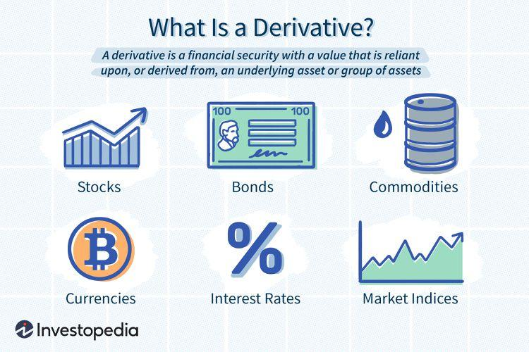

Financial instruments are essential components in the functioning of global financial markets. They serve as vehicles for raising capital, enabling trade, and facilitating risk management among market participants. Common financial instruments include equities, such as stocks; fixed-income securities, like bonds; and more complex instruments, such as derivatives and commodities. The intricate landscape of these instruments necessitates robust risk management strategies to mitigate potential financial losses and ensure market stability.

Derivatives play a pivotal role as a key tool in managing financial risks. These are financial contracts whose value is derived from the performance of underlying assets, such as stocks, bonds, currencies, interest rates, or market indexes. By providing instruments for risk transfer, derivatives help market participants hedge against adverse price movements, ensuring more predictable financial outcomes. For instance, a company expecting foreign revenue can use currency futures to lock in exchange rates, thus mitigating the risk of currency fluctuations.



Algorithmic trading represents a significant evolution in financial markets, utilizing computer algorithms to automate the trading process. This method leverages pre-programmed instructions that consider variables like timing, price, and volume to execute trades, allowing for rapid and efficient transaction execution that would be unattainable through manual trading. Algorithmic trading contributes to increased market efficiency by narrowing bid-ask spreads and enhancing liquidity. However, it also introduces complexities and potential risks, such as flash crashes, which require careful oversight and management.

The interconnectedness of financial instruments, derivatives, and algorithmic trading is increasingly evident within the broader context of finance. These elements collectively enhance the ability of market participants to manage risk and maximize returns, yet they also pose challenges in ensuring market stability and integrity. The interplay of technological advancements and financial innovation necessitates ongoing adaptation and development of risk management practices to accommodate the dynamic nature of global financial markets. This introduction lays the groundwork for exploring these themes in greater depth throughout the article.

## Table of Contents

## Understanding Financial Instruments

Financial instruments are essential components of the global financial system, serving as pivotal tools for investment and trading. A financial instrument represents a contractual monetary asset that can be traded. These instruments allow for efficient allocation of capital, liquidity provision, and facilitate risk transfer among market participants. They are instrumental in implementing a wide array of financial strategies aimed at achieving specific investment objectives.

Financial instruments are broadly categorized into several types:

1. **Stocks**: Also known as equities, stocks represent ownership in a corporation. Investors in stocks can earn returns through dividends and capital gains, which arise from increasing stock prices.

2. **Bonds**: Bonds are debt securities whereby the bond issuer owes the bondholder a debt and is obliged to pay interest (coupon) and return the principal at a later date (maturity). They are used by corporations, municipalities, and governments to raise capital.

3. **Derivatives**: These are financial contracts whose value is derived from the performance of underlying assets, indices, or interest rates. Common derivatives include futures, options, swaps, and forwards. Their primary usage lies in hedging risks and speculative activities.

4. **Commodities**: Commodities are basic goods used in commerce that are interchangeable with other goods of the same type. Examples include oil, gold, and agricultural products. Commodity trading can be done directly or via derivatives.

5. **Others**: This category includes various hybrid instruments such as exchange-traded funds (ETFs), real estate investment trusts (REITs), and cryptocurrencies, each offering unique investment opportunities and risks.

Risk management is a critical aspect of dealing with financial instruments. Each type of instrument carries inherent risks, including market risk, credit risk, [liquidity](/wiki/liquidity-risk-premium) risk, and operational risk. Effective risk management strategies are essential to mitigate these risks and safeguard investments.

Mathematically, risk management involves the quantification and analysis of potential losses using models such as Value at Risk (VaR), which estimates the maximum potential loss over a specific time frame at a given confidence level. For example, a firm might use the following Python code to simulate and calculate the VaR of a stock portfolio:

```python
import numpy as np

def calculate_var(portfolio_returns, confidence_level=0.95):
    """
    Calculate the Value at Risk (VaR) for a portfolio.

    :param portfolio_returns: Array-like, historical returns of the portfolio.
    :param confidence_level: The confidence level for VaR calculation.
    :return: The VaR value.
    """
    portfolio_returns = np.sort(portfolio_returns)
    index = int((1 - confidence_level) * len(portfolio_returns))
    return np.percentile(portfolio_returns, index)

# Example usage
historical_returns = np.random.normal(0.001, 0.02, 1000)  # Simulating returns
var_value = calculate_var(historical_returns)
print(f"The portfolio VaR at 95% confidence level is: {var_value:.2f}")
```

The integration of financial instruments into a diversified portfolio requires balancing risk and return to achieve desired investment goals. Sound risk management practices ensure stability and confidence in financial markets by anticipating and preparing for potential adverse events. As financial markets and instruments continue to evolve, so too do the strategies for managing the risks associated with them, underscoring the importance of continuous learning and adaptability in the field of finance.

## Role of Derivatives in Risk Management

Derivatives are financial contracts whose value is derived from the performance of underlying assets such as stocks, bonds, commodities, interest rates, or currencies. They serve a critical role in modern financial systems, primarily in the management of risk. There are four main types of derivatives: futures, options, swaps, and forwards.

Futures are standardized contracts obligating the buyer to purchase, or the seller to sell, an asset at a predetermined future date and price. They are commonly traded on exchanges. Options give the holder the right, but not the obligation, to buy or sell an asset at a specified price before a certain date. Swaps involve the exchange of cash flows or liabilities between two parties, often used for [interest rate](/wiki/interest-rate-trading-strategies) swaps or currency swaps. Forwards are similar to futures but are typically traded over-the-counter and are customizable to the needs of the contracting parties.

Derivatives serve two primary purposes in financial markets: hedging risks and speculative opportunities. Hedging involves using derivatives to offset potential losses in the value of an asset. For instance, a company expecting to receive a payment in a foreign currency might use currency futures to lock in an exchange rate, reducing the risk of currency fluctuations. Conversely, speculation entails using derivatives to profit from expected changes in the price of the underlying asset. While speculation can lead to high returns, it also involves significant risk.

The use of derivatives in risk management presents several advantages. They offer a mechanism to hedge against various financial risks, including market risk, credit risk, and liquidity risk. They also provide flexibility and can be customized to suit specific risk profiles and investment strategies. Additionally, derivatives can enhance market efficiency and liquidity by enabling price discovery and distributing risk among market participants.

However, the use of derivatives also comes with challenges. The complexity and leverage associated with derivatives can lead to significant financial losses if not managed properly. The highly interconnected nature of derivatives markets means that issues in one area can quickly propagate, potentially destabilizing financial systems. Furthermore, the lack of transparency in over-the-counter derivatives markets poses additional risks.

Effective risk management with derivatives requires a comprehensive understanding of their characteristics, potential impacts, and the development of robust risk management frameworks. This includes stress testing, scenario analysis, and the implementation of risk limits to prevent excessive exposure. As financial markets continue to evolve, derivatives will remain an essential tool for managing financial risk, but they necessitate careful oversight and prudential regulation to mitigate potential downsides.

## Algorithmic Trading and Its Implications

Algorithmic trading refers to the use of computer programs and algorithms to execute trades in financial markets at speeds and frequencies that are impossible for human traders. This technology relies on mathematical models and pre-defined rules to make decisions and place orders without manual intervention.

In contrast to traditional trading methods, which often involve human analysis and decision-making, [algorithmic trading](/wiki/algorithmic-trading) automatically adjusts to market conditions. This automation enables it to execute complex trading strategies based on quantitative analysis, statistical [arbitrage](/wiki/arbitrage), and trend-following strategies. While traditional traders rely on gut feelings and market intuition, algorithms use historical data and real-time analytics to make trading decisions.

Algorithmic trading significantly affects market efficiency and liquidity. By executing trades rapidly and accurately, it reduces the bid-ask spreads, facilitating efficient price discovery in the markets. The constant presence of algorithms ensures that markets are more liquid, reducing the cost of transactions for all participants. However, this shift towards algorithmic trading also introduces several risks. One major concern is the occurrence of flash crashes. These are rapid, deep, and volatile drops in security prices, which occur in a matter of minutes and can result in market instability. Notable examples include the Flash Crash of May 6, 2010, where the U.S. stock market plummeted and quickly recovered, causing widespread panic.

Potential risks of algorithmic trading include not only flash crashes but also market manipulation by rogue algorithms or errors in coding that might lead to unintended trades. The systemic reliance on algorithms raises concerns about market resilience and the ability to recover from shocks induced by automated trading errors.

Algorithmic trading, while a transformative force in modern financial markets, brings both enhancements and challenges. Its application increases market efficiency and liquidity but requires vigilant regulatory oversight and robust risk management strategies to mitigate its associated risks, such as flash crashes. As financial markets evolve, the implications of algorithmic trading continue to be a critical area for research and development.

## Integration of Derivatives in Algorithmic Trading Strategies

Derivatives are financial instruments whose value is derived from underlying assets such as stocks, bonds, commodities, or interest rates. These instruments play a crucial role in algorithmic trading strategies by enabling traders to engage in complex and precise market operations.

Algorithmic trading (AT) involves using computer algorithms to automatically execute trading decisions based on pre-defined criteria. This technology has transformed financial markets by improving trading efficiency, liquidity, and speed. Derivatives are increasingly integrated into algorithmic strategies because of their flexibility and ability to hedge risks.

### Leveraging Derivatives in Algorithmic Trading

The use of derivatives in algorithmic trading allows for sophisticated strategies that can manage risk more effectively and exploit market inefficiencies. Some popular types of derivatives used in these strategies include futures, options, and swaps.

1. **Futures Contracts**: Futures are agreements to buy or sell an asset at a future date for a predetermined price. In algorithmic trading, futures can be leveraged to speculate on the direction of market movements or to hedge against potential losses from market volatility.

2. **Options**: Options grant the right, but not the obligation, to buy or sell an asset at a specified price within a set time frame. Algorithms can use options to craft strategies such as straddles or strangles, which can profit from volatility regardless of market direction. 

3. **Swaps**: These are contracts to exchange cash flows between two parties. In algorithmic environments, they can be used to manage interest rate risks or exchange currency exposures efficiently.

### Examples of Algorithms Utilizing Derivatives

Algorithmic trading that integrates derivatives often employs strategies like:

- **Delta Hedging**: This involves maintaining a delta-neutral position, where the sensitivity of the portfolio to small changes in the price of the underlying asset is minimized. The algorithm continuously adjusts the portfolio using options to maintain neutrality.

- **Arbitrage Strategies**: These exploit price differences between derivatives and their underlying assets or between similar derivatives across different markets. Algorithms conduct rapid trades to profit from these inconsistencies.

- **Volatility Trading**: Algorithms may use derivatives to speculate on future volatility of an asset rather than its price. For instance, an algorithm might utilize options to engage in volatility arbitrage, where it bets on discrepancies between implied and realized volatility.

### Risk Management in Derivative-Focused Algorithmic Trading

Incorporating derivatives into algorithmic trading necessitates robust risk management due to the leverage and complexity involved:

- **Risk Limits**: Programs are typically coded with specific risk limits to cap potential losses. For instance, an algorithm might be designed not to exceed a particular value-at-risk (VaR) threshold, calculated using historical data and simulations.

- **Real-Time Monitoring**: Trading systems often incorporate real-time monitoring and alerts to detect and respond to unusual market conditions or system anomalies immediately.

- **Backtesting and Stress Testing**: Before deploying algorithms, extensive backtesting is conducted using historical data to evaluate their performance. Stress testing further examines how algorithms react under extreme market conditions, ensuring robustness.

Here is a simple Python snippet demonstrating a basic delta-hedging strategy:

```python
def delta_hedge(portfolio_delta, option_delta, option_price, underlying_price):
    # Calculate the number of options required to hedge
    num_options = -portfolio_delta / option_delta
    # Calculate the cost of hedging
    hedging_cost = num_options * option_price
    # Change in portfolio value due to hedging
    portfolio_value_change = num_options * option_delta * underlying_price
    return num_options, hedging_cost, portfolio_value_change

# Example values
portfolio_delta = 1000
option_delta = 0.5
option_price = 10
underlying_price = 100

num_options, hedging_cost, portfolio_value_change = delta_hedge(portfolio_delta, option_delta, option_price, underlying_price)
print(f"Options to buy/sell: {num_options}, Hedging cost: {hedging_cost}, Portfolio value change: {portfolio_value_change}")
```

By embedding derivatives within algorithmic trading, market participants can harness these instruments' potential to optimize trading strategies and enhance risk control, thereby navigating complex financial landscapes more effectively.

## Challenges and Risks in Managing Derivatives and Algorithms

Managing derivatives and algorithms in the financial markets involves significant challenges and risks. These arise primarily from the operational complexity, systemic impact, and regulatory boundaries associated with these financial tools and technologies.

Operational risks are inherent in handling complex financial derivatives. These instruments, such as options, futures, and swaps, derive their value from underlying assets and require sophisticated valuation models for pricing and risk management. The complexity increases with non-standardized derivatives, which can lead to errors if not managed with precise models and robust technological infrastructure. For instance, errors in the Black-Scholes model for option pricing or in the parameters used in Monte Carlo simulations can result in significant mispricing, leading to potential financial losses. 

Python code for a basic Black-Scholes option pricing model may look like this:

```python
from math import exp, sqrt, log
from scipy.stats import norm

def black_scholes_call(S, K, T, r, sigma):
    d1 = (log(S / K) + (r + sigma ** 2 / 2) * T) / (sigma * sqrt(T))
    d2 = d1 - sigma * sqrt(T)
    call_price = S * norm.cdf(d1) - K * exp(-r * T) * norm.cdf(d2)
    return call_price

# Parameters: Spot price, Strike price, Time to maturity, Risk-free rate, Volatility
print(black_scholes_call(100, 100, 1, 0.05, 0.2))
```

In high-frequency algorithmic trading, systemic risks are notably amplified. These risks stem from the sheer speed and [volume](/wiki/volume-trading-strategy) of transactions, potentially leading to market disruptions. For example, the 2010 Flash Crash was exacerbated by high-frequency trading algorithms, which, in milliseconds, created a feedback loop causing rapid price declines. Furthermore, poorly calibrated algorithms can lead to undesirable market outcomes or exploit market inefficiencies in ways that could destabilize the financial system.

Regulatory challenges also play a critical role. The rapidly evolving derivatives markets and the innovative nature of algorithmic trading necessitate constant adaptation of regulatory frameworks. Regulations must balance promoting innovation and maintaining market integrity and stability. Robust risk controls are essential to mitigate these risks. Financial institutions are required to implement stringent capital requirements, conduct stress testing, and enforce real-time monitoring and control measures to meet regulatory standards and safeguard against operational and systemic threats.

The overarching need for effective risk management in derivatives and algorithmic trading underscores the vital role of regulatory efforts. Furthermore, financial institutions must continuously invest in technology and human capital to navigate these complexities, ensuring that they can operate within acceptable risk margins while adapting to new market conditions.

## Regulatory Framework and Best Practices

The regulatory framework governing derivatives and algorithmic trading is crucial for ensuring market stability and protecting investors. Various regulatory bodies across the globe have implemented rules and guidelines to oversee these complex financial activities. 

### Overview of Current Regulations

1. **Regulatory Bodies:** Major regulatory bodies like the U.S. Securities and Exchange Commission (SEC), Commodity Futures Trading Commission (CFTC), European Securities and Markets Authority (ESMA), and others have established frameworks to monitor derivatives trading. These bodies mandate transparency, proper reporting, and adherence to specific standards to mitigate systemic risks.

2. **Dodd-Frank Act:** In the United States, the Dodd-Frank Wall Street Reform and Consumer Protection Act of 2010 introduced significant reforms for derivatives trading. Key provisions include mandatory clearing of certain derivatives through central counterparties (CCPs) and higher capital reserves for non-centrally cleared derivatives to ensure financial stability.

3. **MiFID II:** In the European Union, the Markets in Financial Instruments Directive II (MiFID II) regulates derivatives trading, focusing on increased transparency and reducing the risks associated with over-the-counter (OTC) derivatives transactions. It imposes stringent reporting and record-keeping requirements to enhance the visibility of trading activities.

4. **Basel III:** Globally, the Basel III Accord influences derivatives markets by requiring banks to maintain higher capital standards, thus addressing credit risk associated with derivatives exposures.

### Best Practices for Managing Risks

Effective risk management in derivatives and algorithmic trading involves adopting best practices that enhance financial safety and compliance:

- **Risk Assessment:** Financial institutions should conduct comprehensive risk assessments to evaluate potential exposures associated with derivatives and algorithmic strategies. This involves stress testing and scenario analysis to anticipate extreme market conditions.

- **Collateral Management:** Maintaining adequate collateral for derivatives transactions is essential in mitigating counterparty risks. Institutions should implement robust systems for daily margin calculations and variations.

- **Algorithm Testing and Validation:** Before deployment, trading algorithms must undergo rigorous testing and validation to ensure they perform accurately under diverse market conditions. Implementing kill switches and other automated controls can prevent unintended trading behaviors.

- **Compliance and Training:** Continuous training for personnel involved in derivatives and algorithmic trading is vital to ensure they stay updated with regulatory changes and best practices. Establishing clear compliance protocols aids in adhering to regulatory standards.

### Collaborative Efforts

The complexity and interconnectedness of derivatives and algorithmic trading necessitate collaboration between regulatory bodies and financial institutions:

- **Information Sharing:** Regulators and institutions benefit from shared intelligence around market behaviors, emerging risks, and technological developments. Collaborative platforms can facilitate the exchange of insights and data.

- **Joint Risk Monitoring:** Regulatory bodies often work with financial firms to monitor systemic risks, using data analytics and surveillance tools to detect and respond to potential market disruptions promptly.

- **Regulatory Sandboxes:** Some jurisdictions offer regulatory sandboxes where fintech innovations can be tested under the supervision of regulators. This approach enables the safe experimentation of new derivatives and algorithmic trading technologies while ensuring regulatory compliance.

In summary, the regulatory framework and best practices for derivatives and algorithmic trading are essential in maintaining market integrity and protecting participants. Ongoing collaboration between regulators and institutions is pivotal in adapting to the evolving landscape of financial markets.

## The Future of Financial Instruments, Derivatives, and Algorithmic Trading

The landscape of financial markets is continuously evolving, driven by technological advancements and changing economic dynamics. In the derivatives markets, several trends are increasingly shaping their future, including the innovative use of data analytics, advances in [artificial intelligence](/wiki/ai-artificial-intelligence) (AI), and the integration of blockchain technology. These innovations are gradually transforming traditional financial practices, resulting in more efficient and transparent markets.

Emerging technologies in algorithmic trading, particularly AI and [machine learning](/wiki/machine-learning), are offering significant opportunities for enhancing the speed and accuracy of trading strategies. These technologies allow for the analysis of vast amounts of data in real-time, identifying patterns and forecasting market trends with higher precision. Python, a widely used programming language in financial technology (FinTech), is often employed to implement such algorithms. The following Python example demonstrates a basic algorithm utilizing historical data to predict future price movements:

```python
import pandas as pd
from sklearn.model_selection import train_test_split
from sklearn.linear_model import LinearRegression

# Load historical price data
data = pd.read_csv('historical_prices.csv')
X = data[['feature1', 'feature2']]  # Features
y = data['price']  # Target variable

# Split data into training and testing sets
X_train, X_test, y_train, y_test = train_test_split(X, y, test_size=0.2, random_state=42)

# Train a linear regression model
model = LinearRegression()
model.fit(X_train, y_train)

# Predict future prices
predictions = model.predict(X_test)
```

Blockchain technology also holds potential for derivatives trading by enabling the creation of smart contracts. These self-executing contracts increase efficiency and reduce risk by eliminating intermediaries, ensuring transparency and security within transactions.

In terms of risk management, innovation plays a crucial role. The utilization of big data analytics enhances risk assessment processes by providing deeper insights into market [volatility](/wiki/volatility-trading-strategies) and counterparty risk. Meanwhile, real-time risk monitoring systems are becoming integral, providing stakeholders with up-to-date information, thereby enabling swift decision-making in volatile markets.

The continuous development and integration of these technologies present both opportunities and challenges. On one hand, they facilitate market expansion and operational efficiency; on the other hand, they necessitate advanced risk management frameworks to address the complexities and potential systemic risks they introduce.

Moreover, regulatory landscapes are adapting to these technological changes, aiming to strike a balance between fostering innovation and ensuring market stability. Collaborative efforts among regulatory bodies, financial institutions, and technology providers are essential for developing frameworks that support innovation while protecting market integrity.

Ultimately, innovation in derivatives and algorithmic trading promises a future where financial markets are more dynamic, transparent, and accessible, with enhanced risk management practices safeguarding against unforeseen challenges. As these technologies continue to evolve, they will likely redefine the boundaries of what is possible in financial markets, demanding ongoing research and adaptation to harness their full potential effectively.

## Conclusion

Derivatives and algorithmic trading represent crucial elements in the modern financial landscape, offering sophisticated tools for managing financial risks and enhancing market efficiencies. Derivatives, by their nature, allow investors to hedge against potential losses by providing instruments that derive their value from underlying assets, such as stocks, bonds, or commodities. This ability to transfer or mitigate risk is essential in a volatile market, enabling businesses and individuals to protect their positions against unfavorable price movements. Algorithmic trading, which utilizes computer programs to execute trading strategies at high speeds and frequencies, complements these benefits by boosting market liquidity and efficiency through rapid execution and price discovery.

However, the complex nature of derivatives and the high-speed environment of algorithmic trading come with significant risks. The financial industry must navigate challenges such as operational and systemic risks, which are amplified in high-frequency trading scenarios. The 2010 Flash Crash and other similar events have highlighted the potential for severe market disruptions. Such incidents underline the necessity for a balanced approach that weighs the benefits of these advanced trading strategies against their inherent risks and seeks to mitigate potential downsides.

Ongoing research and development in risk management practices remain vital to sustaining the benefits while controlling the risks associated with derivatives and algorithmic trading. By advancing analytical tools, refining trading algorithms, and enhancing regulatory frameworks, the financial industry can better manage the complexities of these powerful financial instruments. Collaborative efforts between regulatory bodies and financial institutions are crucial to ensuring that the technological advancements in trading strategies align with robust risk control measures. This continuous evolution of risk management strategies will be fundamental to maintaining the stability and integrity of financial markets in the face of rapid technological innovation.

## References & Further Reading

[1]: Hull, J. C. (2017). ["Options, Futures, and Other Derivatives."](https://www.semanticscholar.org/paper/Options%2C-Futures%2C-and-Other-Derivatives-Hull/89bdee500c8623864fc9eb7a471546aa713acc44) Pearson.

[2]: Aldridge, I. (2013). ["High-Frequency Trading: A Practical Guide to Algorithmic Strategies and Trading Systems."](https://www.wiley.com/en-us/High+Frequency+Trading%3A+A+Practical+Guide+to+Algorithmic+Strategies+and+Trading+Systems%2C+2nd+Edition-p-9781118343500) Wiley.

[3]: Lopez de Prado, M. (2018). ["Advances in Financial Machine Learning."](https://www.amazon.com/Advances-Financial-Machine-Learning-Marcos/dp/1119482089) Wiley.

[4]: Hull, J. C. (2012). ["Risk Management and Financial Institutions."](https://books.google.com/books/about/Risk_Management_and_Financial_Institutio.html?id=1J1QDwAAQBAJ) Wiley.

[5]: CFTC and SEC (2010). ["Findings regarding the market events of May 6, 2010."](https://www.sec.gov/news/studies/2010/marketevents-report.pdf) U.S. Commodity Futures Trading Commission & U.S. Securities and Exchange Commission.

[6]: Fabozzi, F. J., Focardi, S. M., & Jonas, C. (2010). ["Quantitative Equity Investing: Techniques and Strategies."](https://www.semanticscholar.org/paper/Quantitative-Equity-Investing%3A-Techniques-and-Fabozzi-Focardi/1c49a2a53919f7e65cb96f16691b8ff726fd3cd7) Wiley.

[7]: Merton, R. C. (1973). ["Theory of Rational Option Pricing."](https://www.jstor.org/stable/3003143) The Bell Journal of Economics and Management Science, 4(1), 141-183.

[8]: Chan, E. (2009). ["Quantitative Trading: How to Build Your Own Algorithmic Trading Business."](https://github.com/ftvision/quant_trading_echan_book) Wiley.