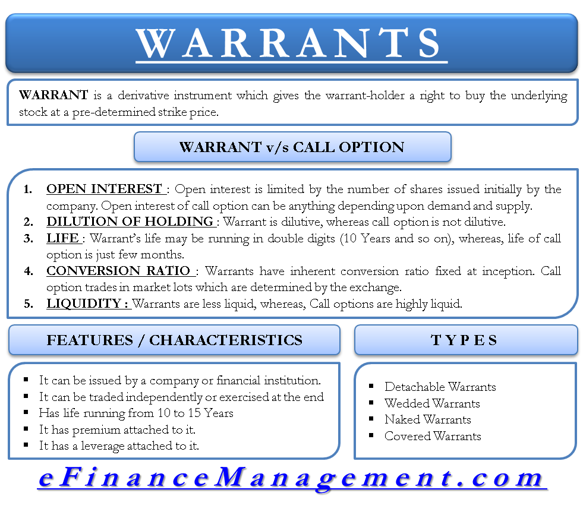

## Table of Contents

## What is a derivative warrant?

A derivative warrant is a type of financial product that gives the holder the right, but not the obligation, to buy or sell an underlying asset at a specific price before a certain date. This underlying asset can be a stock, an index, or a commodity. Derivative warrants are often used by investors to speculate on the price movements of the asset without having to own it directly. They can also be used to hedge against potential losses in other investments.

These warrants are similar to options but are issued by financial institutions rather than the company that issued the underlying asset. They can be traded on an exchange, just like stocks. The price of a derivative warrant is influenced by several factors, including the price of the underlying asset, the time until expiration, and the volatility of the asset's price. Because they can offer high leverage, derivative warrants can be risky, and investors should be careful and understand the risks before trading them.

## How do derivative warrants differ from options?

Derivative warrants and options are similar because they both give you the right to buy or sell something at a certain price before a certain date. But, they come from different places. Options are made by the company that owns the thing you want to buy or sell, like a stock. Derivative warrants, on the other hand, are made by big banks or financial companies, not the company that owns the stock or commodity.

Another difference is where you can trade them. Options are usually traded on big stock exchanges, like the ones you see on the news. Derivative warrants might be traded on smaller exchanges or over-the-counter, which means they are traded directly between two people or companies without a big exchange in the middle. This can make derivative warrants a bit trickier to buy and sell because they might not be as easy to find or trade as options.

## What are the main types of derivative warrants?

There are two main types of derivative warrants: call warrants and put warrants. Call warrants give you the right to buy the underlying asset at a set price before the warrant expires. If you think the price of the asset, like a stock, will go up, you might buy a call warrant. This way, you can buy the stock at a lower price than it might be worth later.

Put warrants are the opposite. They give you the right to sell the underlying asset at a set price before the warrant expires. If you think the price of the asset will go down, you might buy a put warrant. This can be a way to make money if the price drops, or it can be used to protect other investments you have in case the price falls.

## Can you explain call warrants and put warrants?

Call warrants are like a special ticket that lets you buy something, like a stock, at a fixed price before a certain date. Imagine you think the price of a stock will go up. You can buy a call warrant, which gives you the right to buy that stock at today's price even if it goes up later. If the stock price does go up, you can buy it at the lower price you set with the warrant and then sell it at the higher price, making a profit. But if the stock price stays the same or goes down, you don't have to buy it, and you only lose what you paid for the warrant.

Put warrants work the other way around. They give you the right to sell something at a fixed price before a certain date. If you think a stock's price will go down, you can buy a put warrant. This lets you sell the stock at a higher price than it might be worth later. If the stock price does drop, you can buy the stock at the lower market price and then use your put warrant to sell it at the higher price you set, making a profit. If the stock price stays the same or goes up, you don't have to sell it, and you only lose what you paid for the warrant.

## What are equity-linked warrants and how do they work?

Equity-linked warrants are a type of derivative warrant that are tied to the performance of a company's stock. They give you the right to buy the company's stock at a set price before a certain date. If you think the stock price will go up, you might buy an equity-linked warrant. This way, you can buy the stock at a lower price than it might be worth later, and if the stock price does go up, you can make a profit.

These warrants are often used by companies to raise money. Instead of just selling more stock, they issue these warrants. People buy the warrants hoping the stock price will go up, and the company gets the money from selling the warrants right away. If the stock price doesn't go up, the people who bought the warrants might lose what they paid for them, but the company still keeps the money. So, it's a way for companies to get cash now and for investors to bet on the future price of the stock.

## How do currency-linked warrants function?

Currency-linked warrants are a type of financial product that let you bet on how one country's money, like the US dollar, will do compared to another country's money, like the Euro. If you think the US dollar will get stronger compared to the Euro, you can buy a call warrant. This gives you the right to buy US dollars at a set price before the warrant expires. If the US dollar does get stronger, you can make money by buying dollars at the lower price you set and then selling them at the higher market price.

If you think the US dollar will get weaker compared to the Euro, you can buy a put warrant. This gives you the right to sell US dollars at a set price before the warrant expires. If the US dollar does get weaker, you can buy dollars at the lower market price and then use your put warrant to sell them at the higher price you set, making a profit. These warrants are used by people who want to make money from changes in currency values without actually having to buy and sell the currencies themselves.

## What are the key features of commodity-linked warrants?

Commodity-linked warrants let you bet on the price of things like oil, gold, or wheat without actually buying those things. If you think the price of gold will go up, you can buy a call warrant. This gives you the right to buy gold at a set price before the warrant expires. If the price of gold does go up, you can make money by buying gold at the lower price you set and then selling it at the higher market price.

If you think the price of oil will go down, you can buy a put warrant. This gives you the right to sell oil at a set price before the warrant expires. If the price of oil does go down, you can buy oil at the lower market price and then use your put warrant to sell it at the higher price you set, making a profit. These warrants are a way for people to make money from changes in commodity prices without having to deal with storing or transporting the actual commodity.

## What are the risks associated with investing in derivative warrants?

Investing in derivative warrants can be risky because they can lose value quickly. If the price of the stock, currency, or commodity that the warrant is based on doesn't move the way you thought it would, you could lose all the money you spent on the warrant. They are also very sensitive to time. As the expiration date of the warrant gets closer, its value can drop fast, especially if the price of the underlying asset isn't moving in the right direction. This is called time decay, and it can eat away at the value of your warrant even if the asset's price stays the same.

Another risk is that derivative warrants can be hard to understand and trade. They are often issued by financial institutions and might not be as easy to buy and sell as stocks or options. This can make it harder to get out of a bad investment quickly. Also, because they offer a lot of leverage, small changes in the price of the underlying asset can lead to big changes in the value of the warrant. This means you could make a lot of money, but you could also lose a lot if things don't go your way. It's important to really understand these risks before you start investing in derivative warrants.

## How can one evaluate the pricing of derivative warrants?

Evaluating the pricing of derivative warrants involves looking at several key factors. The first thing to consider is the price of the underlying asset, like a stock or a commodity. If the price of the asset is higher than the price set in the warrant, a call warrant will be worth more because it lets you buy the asset at a lower price. On the other hand, if the price of the asset is lower than the price set in the warrant, a put warrant will be worth more because it lets you sell the asset at a higher price. The time until the warrant expires is also important. The longer you have until the warrant expires, the more time the price of the asset has to move in your favor, which makes the warrant more valuable.

Another factor to consider is how much the price of the underlying asset tends to move around, which is called volatility. If the price of the asset moves a lot, the warrant is more likely to end up in the money, which means it's more valuable. The interest rate can also affect the price of a warrant. Higher interest rates can make call warrants more expensive and put warrants less expensive. Finally, you need to think about any dividends the underlying asset might pay. If the asset pays dividends, it can affect the price of the warrant because it changes how much the asset is worth over time. By understanding all these factors, you can get a better idea of whether a derivative warrant is priced fairly.

## What strategies can be used when trading derivative warrants?

One common strategy when trading derivative warrants is to use them to bet on the price of the underlying asset going up or down. If you think the price of a stock will go up, you can buy a call warrant. This gives you the right to buy the stock at a lower price later, which can make you money if the stock price does go up. If you think the price of a stock will go down, you can buy a put warrant. This lets you sell the stock at a higher price later, which can make you money if the stock price does go down. This strategy is called speculation, and it can be risky because you could lose all the money you spent on the warrant if the price doesn't move the way you thought it would.

Another strategy is to use derivative warrants to protect other investments, which is called hedging. If you own a stock and you're worried its price might go down, you can buy a put warrant on that stock. This way, if the stock price does go down, you can sell it at a higher price using the put warrant, which can help you lose less money. Hedging can help you manage risk, but it also means you might miss out on some gains if the stock price goes up instead. Both speculation and hedging need careful planning and understanding of the market to work well.

## How do regulatory environments affect derivative warrant markets?

The rules set by governments and financial watchdogs can have a big impact on how derivative warrant markets work. These rules can decide who can buy and sell these warrants, how they are traded, and what information needs to be shared with everyone. If the rules are strict, it might be harder for people to trade derivative warrants, which can make the market smaller and less active. But, strict rules can also make the market safer by making sure everyone plays fair and knows what they're doing.

On the other hand, if the rules are more relaxed, more people might want to trade derivative warrants because it's easier to get involved. This can make the market bigger and more exciting, but it can also be riskier because there might be more people who don't fully understand what they're doing. No matter what, the rules set by regulators are important because they help shape how the derivative warrant market grows and how safe it is for everyone involved.

## What are some advanced techniques for hedging with derivative warrants?

One advanced way to hedge with derivative warrants is to use a strategy called a collar. Imagine you own a stock and you're worried its price might go down, but you also don't want to miss out if it goes up. You can buy a put warrant to protect against the price dropping, and at the same time, sell a call warrant to someone else. The call warrant you sell gives them the right to buy your stock at a higher price if it goes up a lot. This way, you're protected if the stock price falls, but you also get some money from selling the call warrant, which can help pay for the put warrant. It's like putting a safety net under your stock while still leaving room for it to grow.

Another advanced technique is called delta hedging. This is a bit more complicated, but it's about balancing your exposure to the price changes of the underlying asset. If you own a stock and you buy a put warrant to hedge it, the value of the put warrant will change as the stock price changes. Delta hedging involves adjusting the number of put warrants you own to keep your overall risk level steady. If the stock price goes up and the put warrant becomes less valuable, you might need to buy more put warrants to keep your hedge strong. It's like constantly tweaking your safety gear to make sure it's working just right, no matter how the market moves.

## What are Derivative Warrants and How Can They Be Understood?

Derivative warrants are a type of financial derivative that grants the holder the right, but not the obligation, to buy or sell an underlying asset at a predetermined price, often referred to as the exercise or strike price, before the expiration date. These financial instruments are similar to options but are distinct in several aspects, notably in their issuance and trading mechanisms.

Unlike options, which are typically standardized contracts traded on exchanges, derivative warrants are generally issued by corporations. This issuance characteristic means that warrants, similar to bonds or stocks, are often structured to attract capital or to make company transactions more appealing. As a result, they are predominantly traded in over-the-counter (OTC) markets, which confers certain advantages and drawbacks. The OTC nature of warrants means they can offer tailored solutions that meet specific investor needs, but this can come at the expense of reduced liquidity compared to exchange-traded options.

One of the most compelling features of derivative warrants is the leverage they provide. Initially, with a relatively small investment, holders can control a more significant position in the underlying asset. This levered exposure can magnify potential returns if the price of the underlying asset moves favorably. However, it's crucial to note the risk associated with leverage, as it equally magnifies potential losses if the underlying asset's price moves unfavorably.

The relationship between the warrant price, the strike price, and time until expiration determines the intrinsic value and the potential profitability of warrants. The intrinsic value can be expressed mathematically as:

$$
\text{Intrinsic Value} = (\text{Current Price of Underlying Asset} - \text{Strike Price}) \times \text{Leverage Ratio}
$$

Where the leverage ratio is a [factor](/wiki/factor-investing) determining the multiplication of the underlying asset's price movement on the warrant's value. Despite their similarities to options, the pricing model for warrants can vary and might include elements specific to the individual issuing entity, often reflecting the issuer's credit risk and other factors.

In summary, while derivative warrants offer advantages like high leverage and customization, they come with inherent risks, such as [liquidity](/wiki/liquidity-risk-premium) concerns and the impact of issuer creditworthiness. Understanding the nuances of derivative warrants—particularly their differences from options—is crucial for market participants who seek to incorporate these instruments into their trading and investment strategies effectively.

## What are Financial Derivatives and Investment Types?

Financial derivatives are financial contracts whose value is derived from underlying assets such as stocks, bonds, commodities, currencies, interest rates, or market indexes. These instruments offer versatility in financial markets, allowing various investment strategies to be employed for hedging, [arbitrage](/wiki/arbitrage), and speculation purposes. This section explores some primary types of financial derivatives: options, futures, and swaps, each providing unique opportunities and functionalities within the investment landscape.

**Options** offer the holder the right, but not the obligation, to buy or sell an underlying asset at a predetermined price before or at a specified date. They are categorized into call options, which enable purchase, and put options, which allow for selling. Options are extensively used for risk management through hedging strategies, where investors protect against potential downside risk in their portfolios. They are also employed in speculative strategies, allowing investors to leverage positions with minimal capital investment.

**Futures contracts** are standardized agreements to buy or sell an asset at a predetermined price at a specified future date. Unlike options, futures contracts obligate both parties to fulfill the contract terms. They are commonly used for hedging and managing price risk in commodities, interest rates, foreign exchange, and indexes. For instance, agricultural producers may use futures to lock in prices for their crops, thereby mitigating the risk of price fluctuations.

**Swaps** involve an exchange of cash flows or financial instruments between two parties. The most common type is an interest rate swap, where parties exchange fixed and floating interest rate payments. Swaps are essential tools for managing financial risks associated with interest rate fluctuations and currency exchange. They provide opportunities for companies to optimize their debt profiles and manage interest rate exposure.

Mathematically, the value of derivatives like options can be determined using models such as the Black-Scholes model:

$$
C = S_0 N(d_1) - Xe^{-rt} N(d_2)
$$

where:
- $C$ is the call option price,
- $S_0$ is the current price of the underlying asset,
- $X$ is the strike price,
- $r$ is the risk-free interest rate,
- $t$ is the time to maturity,
- $N$ is the cumulative distribution function of the standard normal distribution,
- $d_1$ and $d_2$ are calculated as:

$$
d_1 = \frac{\ln(S_0/X) + (r + \sigma^2/2)t}{\sigma\sqrt{t}}
$$

$$
d_2 = d_1 - \sigma\sqrt{t}
$$

where $\sigma$ is the volatility of the asset.

The derivatives market, through instruments such as options, futures, and swaps, provides investors with the ability to access a broad range of financial markets. These instruments enable risk management and the potential to enhance returns through strategic positioning. Understanding their mechanisms and applications is crucial for investors seeking to optimize their investment strategies and manage financial exposures effectively.

## References & Further Reading

[1]: Bergstra, J., Bardenet, R., Bengio, Y., & Kégl, B. (2011). ["Algorithms for Hyper-Parameter Optimization."](https://dl.acm.org/doi/10.5555/2986459.2986743) Advances in Neural Information Processing Systems 24.

[2]: ["Advances in Financial Machine Learning"](https://www.amazon.com/Advances-Financial-Machine-Learning-Marcos/dp/1119482089) by Marcos Lopez de Prado

[3]: ["Evidence-Based Technical Analysis: Applying the Scientific Method and Statistical Inference to Trading Signals"](https://www.amazon.com/Evidence-Based-Technical-Analysis-Scientific-Statistical/dp/0470008741) by David Aronson

[4]: ["Machine Learning for Algorithmic Trading"](https://github.com/stefan-jansen/machine-learning-for-trading) by Stefan Jansen

[5]: ["Quantitative Trading: How to Build Your Own Algorithmic Trading Business"](https://www.amazon.com/Quantitative-Trading-Build-Algorithmic-Business/dp/1119800064) by Ernest P. Chan