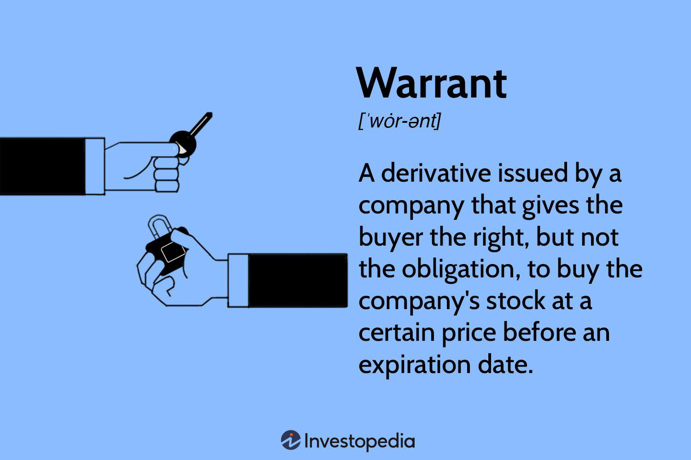

The world of financial derivatives presents a wealth of opportunities for traders and investors, offering various tools to manage risk and potentially increase returns. Derivative warrants and algorithmic trading stand out as two significant facets within this market. Derivative warrants are financial instruments that grant the holder the right, though not the obligation, to buy or sell an underlying asset at a predetermined price within a specified timeframe. They provide leverage, allowing investors to control a larger position with a relatively smaller initial investment, thereby amplifying potential gains and losses.

Concurrent to the allure of derivative warrants is the advent of algorithmic trading, which automates the trading process using sophisticated algorithms to make high-speed decisions based on extensive data analysis. This approach is becoming integral in modern financial markets, particularly in the derivatives sector, due to its ability to handle vast trade volumes and complex transactions with precision and efficiency. By understanding derivative warrants and the role of algorithmic trading, investors can make informed decisions and potentially enhance their trading strategies, navigating the complexities of the derivatives market with greater confidence. As the financial landscape continues to evolve, mastering these concepts becomes increasingly critical for those seeking to capitalize on the potential of derivative markets.



## Table of Contents

## Understanding Derivative Warrants

Derivative warrants are a type of financial derivative that grants the holder the right, but not the obligation, to buy or sell an underlying asset at a predetermined price, often referred to as the exercise or strike price, before the expiration date. These financial instruments are similar to options but are distinct in several aspects, notably in their issuance and trading mechanisms.

Unlike options, which are typically standardized contracts traded on exchanges, derivative warrants are generally issued by corporations. This issuance characteristic means that warrants, similar to bonds or stocks, are often structured to attract capital or to make company transactions more appealing. As a result, they are predominantly traded in over-the-counter (OTC) markets, which confers certain advantages and drawbacks. The OTC nature of warrants means they can offer tailored solutions that meet specific investor needs, but this can come at the expense of reduced liquidity compared to exchange-traded options.

One of the most compelling features of derivative warrants is the leverage they provide. Initially, with a relatively small investment, holders can control a more significant position in the underlying asset. This levered exposure can magnify potential returns if the price of the underlying asset moves favorably. However, it's crucial to note the risk associated with leverage, as it equally magnifies potential losses if the underlying asset's price moves unfavorably.

The relationship between the warrant price, the strike price, and time until expiration determines the intrinsic value and the potential profitability of warrants. The intrinsic value can be expressed mathematically as:

$$
\text{Intrinsic Value} = (\text{Current Price of Underlying Asset} - \text{Strike Price}) \times \text{Leverage Ratio}
$$

Where the leverage ratio is a [factor](/wiki/factor-investing) determining the multiplication of the underlying asset's price movement on the warrant's value. Despite their similarities to options, the pricing model for warrants can vary and might include elements specific to the individual issuing entity, often reflecting the issuer's credit risk and other factors.

In summary, while derivative warrants offer advantages like high leverage and customization, they come with inherent risks, such as [liquidity](/wiki/liquidity-risk-premium) concerns and the impact of issuer creditworthiness. Understanding the nuances of derivative warrants—particularly their differences from options—is crucial for market participants who seek to incorporate these instruments into their trading and investment strategies effectively.

## Types of Derivative Warrants

Derivative warrants are diverse financial instruments that serve various investment strategies. They primarily comprise call warrants and put warrants. 

Call warrants confer the holder the right to purchase an underlying asset at a specified price before the expiration date. This type of warrant is attractive to investors who anticipate a price increase in the underlying asset. The potential profitability hinges on the asset price surpassing the strike price, making it an option for those with a bullish outlook.

Conversely, put warrants provide the holder the right to sell the underlying asset at a predetermined price. Investors employ put warrants when they expect a decline in the asset's market price. These warrants act as a form of insurance, allowing investors to mitigate losses or profit from bearish market conditions.

Covered warrants are issued by financial institutions and are backed by the issuer's holdings in the underlying asset. They offer additional security to the investor, as the issuer maintains the necessary asset to cover the warrant. This structure often provides greater market liquidity and transparency, appealing to investors seeking stability within derivatives.

On the other hand, naked warrants are not linked to an underlying asset held by the issuer. These are highly speculative instruments, often leading to greater risks and rewards. The issuer typically does not maintain the asset, rendering the warrant's value solely dependent on market fluctuations. Investors who engage with naked warrants do so with the understanding of increased potential [volatility](/wiki/volatility-trading-strategies) and risk. 

Each type of derivative warrant offers distinctive features that align with different investor needs, whether for speculation, hedging, or leveraging market movements. Investors must consider their financial goals and risk tolerance when choosing between these instruments.

## Benefits and Risks of Investing in Warrants

Warrants are financial instruments that offer investors substantial leverage, meaning that a relatively small initial capital outlay controls a larger amount of the underlying asset. This leverage potential is one of the primary reasons investors might consider using warrants in their portfolios. For speculators, warrants are attractive as they can profit from price movements of the underlying asset without the need to invest substantial capital upfront. This makes warrants suitable for strategic positions where an investor anticipates significant asset price changes.

In hedging strategies, warrants serve as tools for mitigating risks associated with adverse price movements of the underlying assets. By securing a position in warrants, investors can effectively offset potential losses from other investments within their portfolios, thus managing their overall risk exposure.

Despite these benefits, investing in warrants also presents considerable risks. One of the main risks is liquidity risk, which refers to the difficulty of buying or selling a warrant without causing a significant impact on its price. In markets where warrants are not frequently traded, this can pose a significant hurdle, potentially leading to unfavorable trading conditions.

Another critical risk is time decay, which affects the value of a warrant as it approaches its expiration date. The closer the expiration, the less time the warrant has to become profitable, often causing its time value to diminish. This aspect is crucial for investors to understand and monitor, as it can erode potential profits if not managed proactively.

Additionally, warrants entail the risk of a total loss if they are not exercised before the expiration date and if the market conditions turn unfavorable. Investors must be vigilant about the expiration dates and the performance of the underlying assets to avoid an entire loss of their investment.

In summary, while warrants offer a means to leverage a small investment for potentially significant returns and are beneficial in both speculative and hedging strategies, they also involve significant risks that necessitate careful consideration and strategic management. Investors need to conduct thorough research and continuously monitor market conditions to mitigate these risks effectively.

## Financial Derivatives and Investment Types

Financial derivatives are financial contracts whose value is derived from underlying assets such as stocks, bonds, commodities, currencies, interest rates, or market indexes. These instruments offer versatility in financial markets, allowing various investment strategies to be employed for hedging, [arbitrage](/wiki/arbitrage), and speculation purposes. This section explores some primary types of financial derivatives: options, futures, and swaps, each providing unique opportunities and functionalities within the investment landscape.

**Options** offer the holder the right, but not the obligation, to buy or sell an underlying asset at a predetermined price before or at a specified date. They are categorized into call options, which enable purchase, and put options, which allow for selling. Options are extensively used for risk management through hedging strategies, where investors protect against potential downside risk in their portfolios. They are also employed in speculative strategies, allowing investors to leverage positions with minimal capital investment.

**Futures contracts** are standardized agreements to buy or sell an asset at a predetermined price at a specified future date. Unlike options, futures contracts obligate both parties to fulfill the contract terms. They are commonly used for hedging and managing price risk in commodities, interest rates, foreign exchange, and indexes. For instance, agricultural producers may use futures to lock in prices for their crops, thereby mitigating the risk of price fluctuations.

**Swaps** involve an exchange of cash flows or financial instruments between two parties. The most common type is an interest rate swap, where parties exchange fixed and floating interest rate payments. Swaps are essential tools for managing financial risks associated with interest rate fluctuations and currency exchange. They provide opportunities for companies to optimize their debt profiles and manage interest rate exposure.

Mathematically, the value of derivatives like options can be determined using models such as the Black-Scholes model:

$$
C = S_0 N(d_1) - Xe^{-rt} N(d_2)
$$

where:
- $C$ is the call option price,
- $S_0$ is the current price of the underlying asset,
- $X$ is the strike price,
- $r$ is the risk-free interest rate,
- $t$ is the time to maturity,
- $N$ is the cumulative distribution function of the standard normal distribution,
- $d_1$ and $d_2$ are calculated as:

$$
d_1 = \frac{\ln(S_0/X) + (r + \sigma^2/2)t}{\sigma\sqrt{t}}
$$

$$
d_2 = d_1 - \sigma\sqrt{t}
$$

where $\sigma$ is the volatility of the asset.

The derivatives market, through instruments such as options, futures, and swaps, provides investors with the ability to access a broad range of financial markets. These instruments enable risk management and the potential to enhance returns through strategic positioning. Understanding their mechanisms and applications is crucial for investors seeking to optimize their investment strategies and manage financial exposures effectively.

## Algorithmic Trading and Its Significance

Algorithmic trading is an innovative approach that employs computer algorithms to execute trades automatically across financial markets. These algorithms are built to make split-second decisions based on intricate data analysis, ensuring trades are executed at optimal prices and speeds. In recent years, [algorithmic trading](/wiki/algorithmic-trading) has become integral to the landscape of modern financial trading, particularly within the derivatives markets, due to its capability to handle large volumes of trades with complex parameters.

One of the significant advantages of algorithmic trading is its efficiency. Algorithms can process and analyze vast amounts of market data far quicker than a human could. This capability allows traders to exploit market conditions more effectively, ensuring that trades are executed at the most advantageous times and prices. Additionally, algorithmic trading enhances precision by minimizing human error, thus allowing traders to adhere strictly to predefined trading strategies.

Algorithmic trading also contributes significantly to market liquidity. By automatically executing high-frequency trades, often involving large quantities, algorithms help maintain a constant flow of buying and selling activity. This activity can narrow bid-ask spreads and improve the overall price discovery process, ultimately benefiting all market participants.

However, this advanced trading method is not without its challenges. One notable issue is the dependency on technology, where system failures or connectivity issues can lead to substantial financial losses. Furthermore, the algorithms themselves require continuous refinement to adapt to changing market conditions, which demands technical expertise and significant resources.

Regulatory scrutiny presents another challenge for algorithmic trading. Financial regulators worldwide have expressed concerns about the potential for algorithmic and high-frequency trading to contribute to market volatility and systemic risks. Consequently, many markets have imposed regulations, such as the requirement for circuit breakers and other safeguards, to mitigate these concerns.

Despite these challenges, the benefits of algorithmic trading in facilitating a more efficient and liquid market environment underscore its growing significance. As the financial markets continue to evolve, the role of algorithmic trading is expected to expand, offering new opportunities and complexities for investors and traders alike.

## Algorithmic Strategies for Derivatives

Algorithmic trading in the derivatives market leverages a variety of strategies to optimize gains and manage risks. Three prevalent strategies include [market making](/wiki/market-making), [statistical arbitrage](/wiki/statistical-arbitrage), and [momentum](/wiki/momentum) trading. These approaches utilize algorithms to enhance trading efficiency and exploit market conditions.

Market making involves continuously providing buy and sell quotes to capture the bid-ask spread. This strategy employs algorithms to adjust prices rapidly based on market demand, supply, and trading [volume](/wiki/volume-trading-strategy), contributing to market liquidity. Market makers profit from the spread between buying and selling prices, requiring sophisticated algorithms to execute trades at favorable times.

Statistical arbitrage relies on quantitative models to identify pricing inefficiencies between correlated assets. Algorithms analyze historical price data to detect temporary deviations from expected price relationships, enabling trades that capitalize on these discrepancies. For instance, pairs trading, a common form of statistical arbitrage, involves trading two correlated assets by longing the undervalued and shorting the overvalued asset until equilibrium is restored.

Momentum trading strategies capitalize on the continuation of existing market trends. Here, algorithms identify assets displaying strong price movements and make trades aligned with the current market direction. Momentum strategies often incorporate [machine learning](/wiki/machine-learning) techniques to enhance prediction accuracy, analyzing vast amounts of real-time data to detect subtle market signals.

Algorithms also play a crucial role in hedging, mitigating market risks by automatically executing trades that offset potential losses. Hedging strategies are designed to protect against adverse market movements by investing in derivatives that move inversely to the primary asset. This application of algorithmic trading enhances risk management without manual intervention, ensuring timely and efficient execution.

Python's versatility makes it a preferred language for implementing these strategies. For instance, the following Python snippet uses a simple moving average crossover strategy to identify momentum:

```python
import numpy as np
import pandas as pd

def moving_average_crossover(prices, short_window=40, long_window=100):
    signals = pd.DataFrame(index=prices.index)
    signals['signal'] = 0.0

    signals['short_mavg'] = prices.rolling(window=short_window, min_periods=1, center=False).mean()
    signals['long_mavg'] = prices.rolling(window=long_window, min_periods=1, center=False).mean()

    signals['signal'][short_window:] = np.where(
       signals['short_mavg'][short_window:] > signals['long_mavg'][short_window:], 1.0, 0.0)
    signals['positions'] = signals['signal'].diff()

    return signals

prices = pd.Series([some_price_data])  # Replace with actual price data
signals = moving_average_crossover(prices)
```

In this example, the algorithm generates trading signals based on the crossover of short-term and long-term moving averages—a common momentum trading approach.

Overall, algorithmic strategies in derivatives trading empower investors to efficiently exploit price discrepancies and market trends, with potential applications in warrants and broader derivative instruments. These automated strategies enhance profitability by ensuring precision and speed in execution across diverse market conditions.

## The Future of Derivatives and Algorithmic Trading

The growth trajectory of algorithmic trading shows no sign of slowing down, largely fueled by rapid technological advancements and sophisticated data analysis techniques. These developments enable traders to process vast amounts of market data in real-time, enhancing decision-making accuracy and speed. As computational power and machine learning algorithms continue to advance, the ability to forecast market movements and optimize trading strategies will further improve.

In tandem, derivatives markets are anticipated to evolve, introducing fresh investment prospects and accompanying challenges. The innovation in derivative products, such as exotic options and bespoke contracts, will cater to an ever-expanding range of financial needs and risk management strategies. These instruments allow for tailored solutions to specific market conditions, granting investors greater flexibility.

Investors must stay vigilant and adapt to these shifting landscapes to harness the full potential of emerging opportunities. A thorough comprehension of evolving market conditions and technological trends is essential for effective strategy refinement. Moreover, continuous education and adaptation to regulatory changes associated with algorithmic trading are crucial. Regulatory bodies are likely to impose stricter guidelines to ensure market integrity, thus requiring traders to remain responsive to compliance demands.

Machine learning applications, such as natural language processing and sentiment analysis, are poised to play more significant roles in algorithmic trading strategies. By interpreting unstructured data sources, like news articles and social media, traders can gain insights into market sentiment and potential price actions. Python, with its robust libraries like Scikit-learn and TensorFlow, remains a favored tool for implementing such strategies, allowing for rapid prototyping and deployment of machine learning models in trading systems.

The following Python code snippet demonstrates a basic implementation of sentiment analysis using the `TextBlob` library, which can be incorporated into algorithmic trading systems:

```python
from textblob import TextBlob

def analyze_sentiment(text):
    blob = TextBlob(text)
    return blob.sentiment.polarity

news_headline = "Tech stocks rally as new AI regulations loom"
sentiment_score = analyze_sentiment(news_headline)

if sentiment_score > 0:
    print("The market sentiment is positive.")
elif sentiment_score < 0:
    print("The market sentiment is negative.")
else:
    print("The market sentiment is neutral.")
```

In conclusion, as derivatives and algorithmic trading advance, informed and adaptable investors can capitalize on the promising yet complex landscape these financial instruments offer. Keeping abreast of technology trends and maintaining a responsive approach to market dynamics will be key to optimizing returns and managing risks effectively.

## Conclusion

Derivative warrants and algorithmic trading represent significant elements within the financial derivatives market, each offering distinctive advantages and accompanied by inherent risks. Derivative warrants provide investors with an opportunity for leverage, allowing control over significant positions with relatively modest initial capital. This leverage can amplify profits if the market moves favorably. However, it similarly amplifies losses, necessitating cautious investment and a thorough understanding of the underlying asset and market dynamics.

Algorithmic trading, enabled by advanced computational techniques, empowers traders with speed and efficiency unattainable via manual trading. Algorithms can execute high-frequency trades, analyze large datasets, and capitalize on fleeting market opportunities with precision. While this approach increases efficiency and liquidity in the market, it introduces challenges such as reliance on technology and exposure to regulatory concerns.

The complexity and volatility of derivative warrants, combined with the speed and intricacy of algorithmic trading, underscore the importance of robust risk management strategies. Investors need to be well-versed in these financial instruments and trading methodologies to utilize them effectively. This involves understanding market indicators, developing sound trading strategies, and employing risk mitigation techniques, such as stop-loss orders and diversification.

In summary, the landscape of derivative warrants and algorithmic trading provides vast potential for profit, yet demands a balanced approach to navigate potential pitfalls. Investors who seek to maximize returns in this arena must remain informed about market developments and adapt to evolving trading environments, thereby leveraging these complex tools to their advantage.

## References & Further Reading

[1]: Bergstra, J., Bardenet, R., Bengio, Y., & Kégl, B. (2011). ["Algorithms for Hyper-Parameter Optimization."](https://dl.acm.org/doi/10.5555/2986459.2986743) Advances in Neural Information Processing Systems 24.

[2]: ["Advances in Financial Machine Learning"](https://www.amazon.com/Advances-Financial-Machine-Learning-Marcos/dp/1119482089) by Marcos Lopez de Prado

[3]: ["Evidence-Based Technical Analysis: Applying the Scientific Method and Statistical Inference to Trading Signals"](https://www.amazon.com/Evidence-Based-Technical-Analysis-Scientific-Statistical/dp/0470008741) by David Aronson

[4]: ["Machine Learning for Algorithmic Trading"](https://github.com/stefan-jansen/machine-learning-for-trading) by Stefan Jansen

[5]: ["Quantitative Trading: How to Build Your Own Algorithmic Trading Business"](https://www.amazon.com/Quantitative-Trading-Build-Algorithmic-Business/dp/1119800064) by Ernest P. Chan