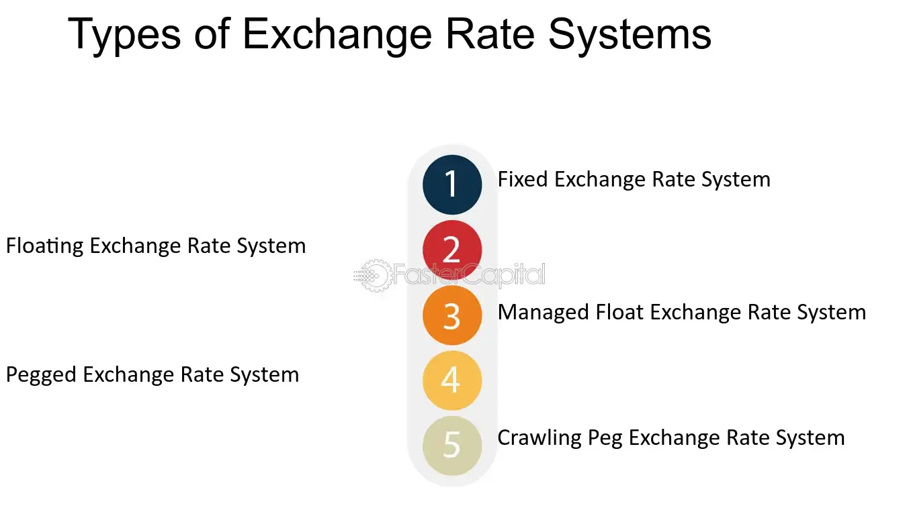

## Table of Contents

## What is an exchange in the context of trading?

An exchange is a place where people buy and sell things like stocks, bonds, or commodities. It's like a big marketplace where traders come together to trade these items. The exchange makes sure that the trading is fair and follows the rules. Some well-known exchanges are the New York Stock Exchange and the NASDAQ.

When someone wants to buy or sell something on an exchange, they usually do it through a broker. The broker helps them make the trade. The exchange matches buyers with sellers, and the price is decided by how much people are willing to pay or accept. This way, everyone can see the current prices and make their decisions based on that information.

## What are the main types of exchanges?

There are two main types of exchanges: physical exchanges and electronic exchanges. Physical exchanges are places where people actually go to trade. They have a trading floor where traders meet and make deals face-to-face. The New York Stock Exchange is a famous example of a physical exchange. These places can be exciting and busy, with lots of shouting and hand signals as traders buy and sell.

Electronic exchanges, on the other hand, are all done through computers. Traders don't need to be in the same place; they can trade from anywhere in the world using the internet. The NASDAQ is a well-known electronic exchange. This type of exchange is usually faster and can handle more trades because everything is done automatically by computers. It's also easier for more people to join in because they don't have to be at a specific location.

Both types of exchanges have their own advantages. Physical exchanges can feel more personal and direct, while electronic exchanges are more convenient and can reach more people. No matter which type, the main goal of an exchange is to help people trade fairly and efficiently.

## Can you explain the difference between a stock exchange and a commodity exchange?

A stock exchange is a place where people buy and sell shares of companies. These shares represent a piece of ownership in the company. When you buy a stock, you're hoping the company will do well and the value of your shares will go up. Stock exchanges help people trade these shares easily and fairly. Examples of stock exchanges include the New York Stock Exchange and the NASDAQ.

A commodity exchange, on the other hand, is where people trade things like oil, gold, or wheat. These are called commodities, and they are raw materials or agricultural products that can be bought and sold. People trade commodities to either use them in their businesses or to invest, hoping the price will go up. Commodity exchanges make sure these trades happen smoothly and fairly. The Chicago Mercantile Exchange is a famous example of a commodity exchange.

Both types of exchanges are important for the economy. They help people invest and trade, which can lead to more business and growth. But they focus on different things: stock exchanges deal with company shares, while commodity exchanges deal with raw materials and goods.

## What is a cryptocurrency exchange and how does it differ from traditional exchanges?

A [cryptocurrency](/wiki/cryptocurrency) exchange is a place where people can buy, sell, or trade digital currencies like Bitcoin, Ethereum, or Litecoin. It works a lot like a traditional exchange but focuses on cryptocurrencies instead of stocks or commodities. People use these exchanges to trade one cryptocurrency for another or to trade cryptocurrencies for regular money, like dollars or euros. Most cryptocurrency exchanges are online, so you can use them from anywhere in the world with an internet connection.

The main difference between a cryptocurrency exchange and a traditional exchange is what they trade. Traditional exchanges deal with things like stocks, bonds, and commodities, which are usually controlled by governments and financial rules. Cryptocurrency exchanges, on the other hand, deal with digital currencies that are not controlled by any one government. This can make them more risky because they are less regulated. Also, traditional exchanges often have physical locations where trading happens, while cryptocurrency exchanges are almost always online and can be used anytime, anywhere.

## How do decentralized exchanges work compared to centralized exchanges?

Decentralized exchanges, often called DEXs, let people trade cryptocurrencies directly with each other without a middleman. They use smart contracts, which are like automatic agreements on the blockchain, to handle trades. This means no one person or company is in charge of the exchange. Because of this, DEXs can be safer because there's no big target for hackers to attack. But they can also be harder to use and might not have as many types of cryptocurrencies to trade.

Centralized exchanges, or CEXs, are run by a company that controls the platform. When you use a CEX, you trust the company to keep your money safe and handle your trades. These exchanges often have more types of cryptocurrencies and are easier to use because they have customer support and better user interfaces. But because they control everything, they can be a bigger target for hackers. If something goes wrong, like a hack, you might lose your money because you don't control it yourself.

In short, DEXs are more private and secure because they don't have a central point of control, but they can be harder to use. CEXs are easier and have more options, but they come with more risk because you're trusting a company with your money. Both types of exchanges have their pros and cons, so it depends on what you're looking for when choosing which one to use.

## What are the key features to look for when choosing an exchange?

When choosing an exchange, it's important to think about how safe it is. Look for exchanges that use strong security measures like two-[factor](/wiki/factor-investing) authentication and keep most of their money in offline storage to protect against hacks. Also, check if the exchange is regulated by a government or financial authority. This can make it safer because there are rules they have to follow. Another thing to consider is the exchange's reputation. Read reviews and see if other people have had good experiences with it.

Another key feature is how easy the exchange is to use. A good exchange should have a clear and simple interface that makes it easy to buy and sell. It should also have good customer support in case you need help. Think about the fees too. Some exchanges charge more than others, so compare the costs to make sure you're getting a good deal. Finally, consider what you want to trade. Some exchanges offer more types of cryptocurrencies or stocks than others, so make sure the one you choose has what you need.

## Can you provide examples of major stock exchanges around the world?

Some of the biggest stock exchanges in the world are the New York Stock Exchange (NYSE) and the NASDAQ, both in the United States. The NYSE is the oldest and largest stock exchange in the world, where people trade stocks of big companies like Coca-Cola and Walmart. The NASDAQ is known for technology companies like Apple and Amazon. Both of these exchanges help people buy and sell shares of companies easily.

In Europe, the London Stock Exchange (LSE) is very important. It's where people trade stocks of companies like BP and HSBC. Another big exchange in Europe is the Euronext, which covers several countries including France, Belgium, and the Netherlands. In Asia, the Tokyo Stock Exchange (TSE) in Japan is one of the largest, where people trade stocks of companies like Toyota and Sony. The Shanghai Stock Exchange (SSE) in China is also very big and important for trading stocks of Chinese companies.

These exchanges are important because they help people invest in companies from all over the world. They make it easier for people to buy and sell shares, which can help the economy grow. Each exchange has its own rules and ways of working, but they all aim to make trading fair and efficient.

## What are some well-known commodity exchanges and what do they trade?

The Chicago Mercantile Exchange (CME) is a very famous commodity exchange. It's in the United States and people trade things like corn, wheat, and soybeans there. They also trade other things like oil, gold, and even things you can't touch, like interest rates. The CME helps farmers, businesses, and investors buy and sell these things easily and fairly. It's important because it helps people know what things are worth and plan for the future.

Another well-known commodity exchange is the London Metal Exchange (LME). It's in the United Kingdom and it's the biggest place in the world for trading metals like copper, aluminum, and zinc. People use the LME to buy and sell metals they need for their businesses, like making cars or building things. The LME helps make sure these trades happen smoothly and that everyone knows the prices of metals around the world. This can help keep the global economy running well.

## What are the top cryptocurrency exchanges and what unique services do they offer?

Some of the top cryptocurrency exchanges are Binance, Coinbase, and Kraken. Binance is one of the biggest exchanges and it has a lot of different cryptocurrencies you can trade. It also has low fees and a feature called Binance Earn, where you can earn interest on your cryptocurrencies. Coinbase is popular because it's easy to use and it's good for people new to trading. They have a service called Coinbase Pro for more advanced traders who want to pay less in fees. Kraken is known for being very secure and it lets you trade a lot of different cryptocurrencies. They also have a service called Kraken Pro for people who trade a lot.

Each of these exchanges has something special to offer. Binance is great if you want to trade many different cryptocurrencies and earn some interest. Coinbase is good if you're just starting out and want an easy way to buy and sell. Kraken is a good choice if you care a lot about security and want to trade a wide range of cryptocurrencies. No matter which one you choose, it's important to think about what you need and what each exchange offers.

## How do regulations affect the operation of different types of exchanges?

Regulations are rules made by governments or financial authorities that exchanges have to follow. These rules can affect how exchanges work in big ways. For stock and commodity exchanges, regulations make sure that trading is fair and safe. They set rules about how trades happen, how money is kept safe, and how information is shared. This helps protect people who are trading and keeps the market honest. For example, the U.S. Securities and Exchange Commission (SEC) makes rules for stock exchanges to follow, which helps keep the market stable and trustworthy.

Cryptocurrency exchanges face different kinds of regulations because they deal with digital money that isn't controlled by any one government. Some countries have strict rules about cryptocurrencies, while others don't have many rules at all. This can make it hard for cryptocurrency exchanges to know what they can and can't do. Regulations can affect how they handle money, what information they need to collect from users, and how they report trades. For example, some places require cryptocurrency exchanges to check who their users are to stop illegal activities, while other places might not have these rules. This can make it harder for cryptocurrency exchanges to work in some countries compared to others.

## What are the risks associated with using various types of exchanges?

Using different types of exchanges can come with risks. One big risk is security. Exchanges can be targets for hackers who want to steal money. If an exchange doesn't have good security, your money could be in danger. Another risk is that the exchange might not be honest. Some exchanges have been known to cheat their users or go out of business suddenly, which can mean you lose your money. It's important to choose an exchange that is trusted and has a good reputation to lower these risks.

Another risk is about the rules and regulations. Some exchanges, especially cryptocurrency exchanges, might not follow the rules in your country. This can lead to problems like your account being closed or your money being taken by the government. Also, if an exchange is not regulated, it might be riskier because there's no one making sure they are doing things the right way. It's a good idea to check if an exchange follows the rules in your area before you start using it.

## How have technological advancements influenced the development and efficiency of exchanges?

Technological advancements have made exchanges a lot better and easier to use. Before, people had to go to a physical place to trade, but now most trading happens online. This means you can trade from anywhere in the world using your computer or phone. Computers also make trading faster and can handle a lot more trades at once. This is really helpful during busy times when lots of people want to buy and sell. Also, new technology like blockchain has made it possible to have decentralized exchanges, where people can trade directly with each other without a middleman.

These changes have made exchanges more efficient and safer. For example, better security technology helps protect your money from hackers. Also, things like [artificial intelligence](/wiki/ai-artificial-intelligence) and big data help exchanges understand how people are trading and make better decisions. This can make the market more stable and fair. Overall, technology has made it easier for more people to trade and has helped make the whole process smoother and more reliable.

## References & Further Reading

[1]: Bergstra, J., Bardenet, R., Bengio, Y., & Kégl, B. (2011). ["Algorithms for Hyper-Parameter Optimization."](https://dl.acm.org/doi/10.5555/2986459.2986743) Advances in Neural Information Processing Systems 24.

[2]: ["Advances in Financial Machine Learning"](https://www.amazon.com/Advances-Financial-Machine-Learning-Marcos/dp/1119482089) by Marcos Lopez de Prado

[3]: ["Evidence-Based Technical Analysis: Applying the Scientific Method and Statistical Inference to Trading Signals"](https://www.amazon.com/Evidence-Based-Technical-Analysis-Scientific-Statistical/dp/0470008741) by David Aronson

[4]: ["Machine Learning for Algorithmic Trading"](https://github.com/stefan-jansen/machine-learning-for-trading) by Stefan Jansen

[5]: ["Quantitative Trading: How to Build Your Own Algorithmic Trading Business"](https://www.amazon.com/Quantitative-Trading-Build-Algorithmic-Business/dp/1119800064) by Ernest P. Chan