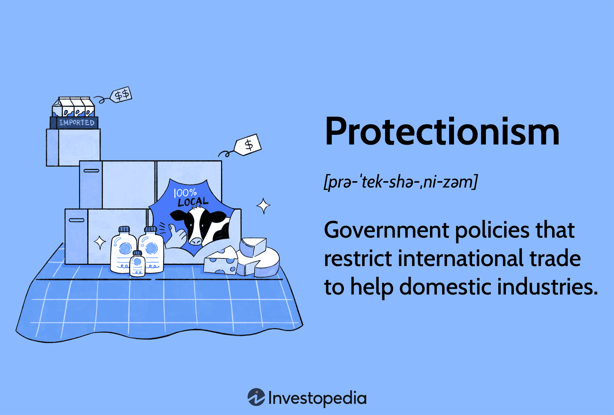

## Table of Contents

## What is trade protectionism?

Trade protectionism is when a country tries to help its own businesses by making it harder for other countries to sell their products there. This can be done by putting taxes on imports, called tariffs, or by setting rules that make it difficult for foreign companies to sell their goods. The idea is to make local products cheaper and more attractive to buyers compared to imported ones.

Countries might use protectionism to protect new industries that are just starting out and need time to grow, or to keep jobs at home by making sure local companies can compete. However, protectionism can also lead to higher prices for consumers because there are fewer choices, and it can cause other countries to do the same thing back, which might start trade wars. These trade wars can hurt the global economy because they make it harder for countries to trade with each other.

## What are the main goals of trade protectionism?

The main goals of trade protectionism are to help domestic industries and protect jobs at home. When a country puts tariffs or other restrictions on imports, it makes foreign products more expensive. This can make local products look cheaper and more appealing to buyers. By doing this, the country hopes to help its own businesses grow and become stronger. This is especially important for new industries that need time to get established without being overwhelmed by competition from abroad.

Another goal is to keep jobs in the country. When local companies do well because of protectionist measures, they can hire more people or keep the jobs they have. This can be really important in places where certain industries are a big part of the economy. However, protectionism can also lead to higher prices for consumers because there are fewer choices. It can also cause other countries to put up their own trade barriers, which might lead to trade wars that can hurt the global economy.

## What is a tariff and how does it relate to trade protectionism?

A tariff is a tax that a country puts on goods that come from other countries. When a country puts a tariff on something, it makes that thing more expensive for people to buy. For example, if a country puts a tariff on imported cars, the price of those cars goes up. This means people might decide to buy cars made in their own country instead because they are cheaper.

Tariffs are a big part of trade protectionism. Countries use tariffs to make it harder for foreign companies to sell their products there. This is done to help local businesses and keep jobs at home. By making imported goods more expensive, tariffs make local products look better to buyers. But, tariffs can also make things more expensive for people to buy and can lead to other countries doing the same thing back, which can start trade wars.

## Can you explain what a quota is and its role in trade protectionism?

A quota is a limit that a country puts on how much of a certain product can come in from other countries. Imagine if a country said only 100 cars from another country can be sold here each year. That's a quota. It's like saying, "We'll only let in this many," no matter what.

Quotas are used in trade protectionism to help local businesses. By limiting how much can come in from other places, it makes sure there's more room for products made at home. This can help keep jobs in the country and help new businesses grow. But, like tariffs, quotas can make things more expensive for people to buy because there are fewer choices. And if other countries get upset, they might put their own limits on what they buy from us, which can lead to trade fights.

## What are subsidies and how do they function as a form of trade protectionism?

Subsidies are when a government gives money or help to its own businesses to make them stronger. This can be things like giving them money directly, or helping them with lower taxes or cheaper loans. The idea is to make it easier for these businesses to make things and sell them at a lower price than businesses from other countries.

In trade protectionism, subsidies help local companies by making their products cheaper and more competitive. When a local company gets help from the government, it can sell its products for less money than companies from other countries that don't get that help. This can make it harder for foreign companies to sell their products in that country, helping to keep jobs and money at home. But, subsidies can also cause problems because other countries might not like it and could start their own trade barriers, which can lead to trade wars.

## How do import licensing requirements serve as a tool for trade protectionism?

Import licensing requirements are rules that say a business needs special permission to bring goods into a country. This permission, or license, can be hard to get because the government might set strict rules or take a long time to approve it. By making it tough to get a license, a country can limit how many foreign products come in. This helps local businesses because there's less competition from abroad.

When fewer foreign products are allowed in, local companies can sell more of their own products. This can help them grow and keep jobs in the country. But, import licensing can also make things more expensive for people because there are fewer choices. And if other countries get upset about these rules, they might put up their own barriers, which can lead to trade fights.

## What is the difference between voluntary export restraints and trade protectionism?

Voluntary export restraints (VERs) are when one country agrees to limit how much of a certain product it sends to another country. It's called "voluntary" because the country chooses to do it, even though it might be because the other country asked or pressured them. For example, if Country A agrees to send fewer cars to Country B, that's a VER. This is different from trade protectionism, which is when a country uses its own rules, like tariffs or quotas, to protect its own businesses from foreign competition.

Trade protectionism is about a country taking action to help its own companies by making it harder for foreign companies to sell their products there. This can be done with tariffs, which are taxes on imports, or quotas, which limit how much can be imported. The goal is to make local products cheaper and more attractive to buyers. VERs are a specific kind of trade barrier where the action is taken by the exporting country, while trade protectionism is broader and includes actions taken by the importing country. Both aim to protect local industries, but they work in different ways.

## How do local content requirements contribute to trade protectionism?

Local content requirements are rules that say a certain amount of a product has to be made or bought in the country where it's being sold. For example, if a car is sold in a country, the rule might say that at least 50% of the parts have to come from that country. This is a way to help local businesses because it means more of the money spent on the product stays in the country. It also helps keep jobs at home because companies need to use local workers and materials.

These requirements are a form of trade protectionism because they make it harder for foreign companies to sell their products in that country. If a foreign company wants to sell there, it has to change how it makes its product to follow the local rules. This can make it more expensive or difficult for them, which gives an advantage to local companies. But, like other forms of protectionism, local content requirements can lead to higher prices for consumers and might cause other countries to put up their own trade barriers, which can start trade wars.

## Can you describe the impact of currency manipulation on trade protectionism?

Currency manipulation is when a country changes the value of its money to make its products cheaper for other countries to buy. This can help the country sell more of its things abroad, but it can also be a way to protect its own businesses. If a country makes its money worth less, its products become cheaper compared to products from other countries. This can make it harder for foreign companies to sell their things in that country because they seem more expensive.

This kind of action is a form of trade protectionism because it helps local businesses by making their products more competitive. It can lead to more jobs and growth at home, but it can also cause problems. Other countries might get upset because their products are now more expensive in the country that changed its money's value. They might put up their own trade barriers or even start a trade war. This can make it harder for countries to trade with each other and can hurt the global economy.

## What are some historical examples of trade protectionism and their outcomes?

One famous example of trade protectionism was the Smoot-Hawley Tariff Act in the United States in 1930. This law put high taxes on over 20,000 types of goods coming into the country. The idea was to help American businesses and farmers by making foreign goods more expensive. But it didn't work out as planned. Other countries got angry and put their own high taxes on American goods. This made it harder for the U.S. to sell things abroad, and it hurt the economy. Many people think this made the Great Depression even worse because trade between countries slowed down a lot.

Another example is the trade war between the U.S. and China that started in 2018. The U.S. put tariffs on many Chinese products to try to get a better deal on trade. China responded by putting tariffs on American goods too. This back-and-forth made things more expensive for people in both countries. Farmers in the U.S. had a hard time because China bought less of their soybeans and other crops. In China, people had to pay more for things like cars and electronics. The trade war went on for a while and caused a lot of uncertainty in the global economy, but eventually, both countries agreed to a deal to ease some of the tariffs.

These examples show that trade protectionism can have big effects, not just on the countries that use it, but on the whole world. While the goal is often to help local businesses, the results can sometimes make things worse by starting trade wars and slowing down global trade.

## How do trade protectionist policies affect global trade dynamics and international relations?

Trade protectionist policies can change how countries trade with each other and affect their relationships. When a country puts up barriers like tariffs or quotas, it tries to help its own businesses by making foreign products more expensive or harder to sell. This can lead to other countries doing the same thing back, starting a cycle of trade wars. These trade wars can make it harder for countries to sell their products abroad, which can hurt their economies. For example, if Country A puts tariffs on goods from Country B, Country B might put tariffs on goods from Country A in return. This back-and-forth can lead to less trade overall and can make things more expensive for people in both countries.

These policies also affect how countries get along with each other. When one country uses trade protectionism, it can make other countries feel upset or angry. This can lead to tensions and disagreements between countries, which can harm their relationships. For instance, the trade war between the U.S. and China in recent years showed how trade policies can create friction. Both countries put tariffs on each other's goods, which led to a lot of talk and negotiation. While they eventually reached a deal, the process was tense and showed how trade protectionism can strain international relations. In the end, trade protectionism can make global trade more complicated and can lead to both economic and political challenges.

## What are the arguments for and against trade protectionism from an economic perspective?

Supporters of trade protectionism say it helps local businesses and keeps jobs at home. When a country puts tariffs or quotas on imports, it makes foreign products more expensive. This can make people buy more local products because they are cheaper. This helps new businesses grow because they have less competition from abroad. It also keeps money in the country, which can help the economy. For example, if a country starts making cars and puts tariffs on imported cars, the local car industry can grow and create jobs.

On the other hand, people against trade protectionism say it can make things more expensive for everyone. When there are fewer choices because of tariffs or quotas, prices go up. This can hurt people who have to pay more for things they need. It can also lead to trade wars, where other countries put up their own barriers. This can make it harder for countries to trade with each other, which can hurt the global economy. For example, if one country puts tariffs on another country's goods, the other country might do the same thing back, and then both countries end up selling less abroad.

## What are the types of trade protectionism?

Trade protectionism encompasses various measures implemented by governments to shield domestic industries from foreign competition. These methods can be categorized into several distinct types, each functioning uniquely to regulate international trade flows and safeguard local economies. 

### Tariffs

Tariffs are taxes imposed on imported goods, making them more expensive and less attractive to consumers compared to locally produced items. This form of protectionism aims to bolster domestic industries by reducing foreign competition. For example, the United States has implemented tariffs on steel and aluminum imports to support its manufacturing sector [1]. The formula for calculating the tariff on an imported good can be expressed as:

$$
\text{Tariff Price} = \text{Import Price} \times (1 + \text{Tariff Rate})
$$

### Non-Tariff Barriers

Non-tariff barriers (NTBs) are restrictive regulations and policies other than tariffs, such as quotas, embargoes, or product standards, designed to limit foreign competition. Quotas cap the amount of a particular good that can be imported, ensuring domestic producers are not overwhelmed by cheaper foreign products. For instance, the European Union imposes quotas on certain agricultural imports to protect its farmers [2]. NTBs often involve complex regulatory standards that foreign producers must meet to access the market, thus indirectly controlling the trade flow.

### Export Restrictions

Export restrictions limit the quantity of goods that a country can sell overseas. These are often applied to essential materials or strategic goods to ensure their availability domestically. Countries may implement export taxes, license requirements, or outright bans to maintain internal supply and price stability. For example, major rice-producing countries have occasionally restricted rice exports to secure local food supplies during global shortages [3]. 

### Regulatory Barriers

Regulatory barriers involve setting stringent standards and requirements that imported goods must satisfy before entering a market. These can include health and safety standards, environmental regulations, and technical requirements. While they are essential for consumer protection, they can also serve as a means to limit imports. For example, certain countries have strict safety standards for electronic products, which can limit access to those markets by foreign manufacturers unable to comply [4].

### Voluntary Export Restraints (VERs)

Voluntary export restraints are self-imposed limits on the [volume](/wiki/volume-trading-strategy) of goods a country exports to another, typically agreed upon after negotiations. VERs are deployed strategically to avoid more severe trade restrictions from being imposed by the importing country. A notable case was the 1980s agreement between Japan and the United States, where Japan limited its automobile exports to the U.S. to ease tensions and prevent tougher trade barriers [5].

### Import Licenses

Import licenses require importers to obtain permission from the government before bringing certain goods into the country. This control mechanism can regulate the volume and type of imports, providing an opportunity to vet foreign products and ensure they align with national interests. By issuing selective licenses, countries can manage their trade deficits and protect burgeoning industries from overwhelming foreign competition.

These different types of trade protectionism have a significant impact on international trade dynamics. They not only affect the volume of trade but also alter pricing structures and availability, influencing the global market landscape. Understanding these mechanisms is crucial for navigating and adapting strategies within the complex arena of global trade.

### References

1. Kang, C. & Merle, R. (2018). Trump imposes tariffs on steel and aluminum, mixing praise and protests. The Washington Post.
2. European Commission. (2021). EU import quotas.
3. Headey, D. & Fan, S. (2008). Anatomy of a crisis: the causes and consequences of surging food prices. Agricultural Economics.
4. Wilson, J.S. & Otsuki, T. (2003). Food safety regulations and trade: harmonization or conflict?. Journal of Food Control.
5. Kishimoto, S. (1988). The auto trade disputes between Japan and the United States. Japan and the World Economy.

## References & Further Reading

[1]: Irwin, Douglas A. (2011). ["Peddling Protectionism: Smoot-Hawley and the Great Depression."](https://repository.unescap.org/bitstream/handle/20.500.12870/4766/ESCAP-2011-PB-Peddling-Protectionism-Smoot-Hawley-Great-Depression.pdf?sequence=1) Princeton University Press.

[2]: U.S. Department of Commerce. (2018). ["The Effect of Imports of Steel on the National Security."](https://www.commerce.gov/files/effect-imports-steel-national-security-investigation-conducted-under-section-232-trade)

[3]: Matthews, Alan. (2013). ["The Common Agricultural Policy and Sustainable Development."](https://www.tcd.ie/Economics/staff/amtthews/) European Policy Research Institute.

[4]: Young, Oran. (2009). ["Boeing vs. Airbus: Trade Complaints, Settlements, and Continuing Debate in WTO."](https://www.pulj.org/the-roundtable/battle-for-the-skies-boeing-airbus-wto-trade-dispute)

[5]: European Commission. (2013). ["Measures We've Taken to Defend EU Trade."](https://trade.ec.europa.eu/access-to-markets/en/news/open-sustainable-and-assertive-trade-policy) 

[6]: Bergstra, J., Bardenet, R., Bengio, Y., & Kégl, B. (2011). ["Algorithms for Hyper-Parameter Optimization."](https://dl.acm.org/doi/10.5555/2986459.2986743) Advances in Neural Information Processing Systems 24.

[7]: Lopez de Prado, M. (2018). ["Advances in Financial Machine Learning."](https://www.amazon.com/Advances-Financial-Machine-Learning-Marcos/dp/1119482089) Wiley.

[8]: Aronson, D.R. (2007). ["Evidence-Based Technical Analysis: Applying the Scientific Method and Statistical Inference to Trading Signals."](https://onlinelibrary.wiley.com/doi/book/10.1002/9781118268315) Wiley.

[9]: Jansen, S. (2018). ["Machine Learning for Algorithmic Trading."](https://searchworks.stanford.edu/view/13246850) Packt Publishing.

[10]: Chan, E. (2008). ["Quantitative Trading: How to Build Your Own Algorithmic Trading Business."](https://github.com/ftvision/quant_trading_echan_book) Wiley.