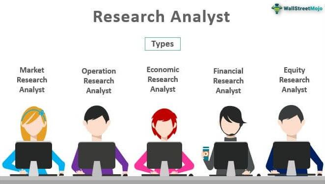

In the financial sector, analysts hold a pivotal position by offering insights that significantly influence investment strategies and decisions. Their analyses enable banks, brokerages, fund managers, and independent firms to evaluate market conditions and make informed choices. The expertise of analysts spans across different roles, each tailored to serve specific functions within these institutions. This article aims to identify various analyst roles and career paths available, further exploring the domain of algorithmic trading, a burgeoning area in finance.

The distinct roles of analysts in the financial ecosystem cater to diverse strategies, reflecting on how each position aligns with different industry needs. Understanding these roles is essential for individuals contemplating a career in analysis, as it helps in identifying paths that align with their skills and career aspirations. With rapid advancements and constant changes, such as the integration of technology in financial processes, professionals must strive to stay current. Engaging with the latest developments not only aids in career advancement but also contributes to more robust investment decisions. Therefore, staying informed and adaptable is key for professionals seeking to navigate their careers effectively within the ever-evolving landscape of financial analysis.



## Table of Contents

## Types of Analysts

Analysts are essential participants in the financial industry, offering critical insights that drive important investment decisions. They can be classified into three primary categories: sell-side analysts, buy-side analysts, and independent analysts. Each category serves distinct roles within the financial ecosystem, catering to different clientele and objectives.

Sell-side analysts are typically employed by brokerages and investment banks. Their primary responsibility is to produce comprehensive reports that aid sales strategies within these institutions. These reports can include earnings forecasts, buy or sell recommendations, and price targets for certain stocks. Sell-side analysts must possess strong analytical capabilities and detailed knowledge of the sectors they cover, as their reports influence the firm's trading and sales strategies as well as inform clients' investment decisions.

Buy-side analysts, on the other hand, work for entities like hedge funds and mutual funds. Their role is to provide insights and analyses that directly influence investment decisions within these organizations. Buy-side analysts assess potential investment opportunities and advise fund managers on asset allocation and investment strategies. This involves conducting deep analysis of financial statements, market trends, and economic factors to support long-term investment strategies. The insights provided by buy-side analysts are crucial for the success of the fund's investment portfolios.

Independent analysts operate outside traditional financial institutions, offering unbiased and objective research. These analysts often focus on less-covered stocks and provide unique insights that are not influenced by the potential conflicts of interest present in investment banking deals. Independent analysts publish their findings through financial publications, newsletters, or online platforms, offering investors alternative viewpoints and analyses.

Each type of analyst requires a distinct skill set, though fundamental capabilities such as strong analytical skills, an understanding of financial markets, and proficiency in financial modeling are critical across all roles. Sell-side and buy-side analysts benefit from strong communications skills to effectively convey their recommendations, while independent analysts must excel in providing in-depth and unbiased research. Understanding these roles helps individuals ascertain the best fit for their skills and career ambitions within the dynamic financial industry.

## Analyst Roles in Financial Institutions

Sell-side analysts are integral to brokerage firms and investment banks, crafting detailed reports and analyses that aid clients, such as institutional investors and financial advisors, in making informed investment decisions. These professionals engage in extensive research to cover publicly traded companies, analyzing financial statements, market trends, and other pertinent data to produce recommendations aimed at enhancing sales strategies. Clients often access these reports through subscription-based services, providing them with insights into potential investment opportunities and strategic moves.

Buy-side analysts, employed by entities such as mutual funds and hedge funds, tailor their analytical services to support the investment decisions within their institutions. These analysts focus on gathering and interpreting data that aligns with the fund’s objectives, working closely with portfolio managers to drive investment strategies. Their findings are exclusive to their organizations, enhancing the fund's competitive edge by identifying promising buying or selling opportunities that align with their specific investment goals.

Independent analysts provide a distinct perspective, often conducting research on under-covered stocks or niche markets not readily addressed by more extensive financial institutions. Their work is particularly valuable for investors seeking unbiased and comprehensive research that is free from potential conflicts of interest associated with financial deals within large corporations. Operating either as freelancers or as part of independent research firms, these analysts contribute to filling the gaps left by traditional financial institutions, delivering insights that might otherwise be overlooked.

Recognizing these roles is crucial for individuals aiming to find their place within the financial industry. Each position demands a unique set of skills and offers different paths for career development. While sell-side analysts work on generating widely available reports that cater to client demands, buy-side analysts focus on institution-specific analyses to guide internal investment decisions. Independent analysts, on the other hand, provide impartial and comprehensive perspectives that serve a diverse range of investment needs. Understanding these distinctions can assist career seekers in aligning their interests with the most suitable analyst role, potentially shaping their success within various financial sectors.

## Skills Required for a Career in Analysis

A successful career in financial analysis requires a robust set of skills pivotal to interpreting data and shaping investment decisions. At the core of this expertise are robust analytical skills necessary for all analyst roles. These skills enable professionals to dissect complex data, recognize patterns, and draw actionable insights that guide financial strategies.

Expertise in financial modeling and data interpretation is essential for conducting in-depth analyses. Financial modeling involves constructing mathematical representations of financial statements and projections, often utilizing Excel to create dynamic financial models. These models help in assessing investment viability, forecasting performance, and making informed decisions. For example, analysts may use Excel to build discounted cash flow (DCF) models, evaluating a company's value based on projected free cash flows discounted to their present value.

Additionally, a solid understanding of financial markets and instruments is crucial. Analysts must navigate an array of financial products, including stocks, bonds, derivatives, and currencies. Equipped with knowledge of these instruments, analysts can evaluate market trends, assess risk, and provide sound investment advice.

Proficiency in specialized tools and programming languages is increasingly important, particularly for those seeking an edge in data analysis. Tools like Excel, Python, and other financial software applications facilitate complex calculations and data processing. Python, in particular, has become a staple due to its versatility and the abundance of libraries like pandas and numpy, which aid in data manipulation and analysis. For example, a Python script for calculating moving average might look like this:

```python
import pandas as pd

# Sample data
data = {'Price': [110, 112, 113, 115, 117, 120]}
df = pd.DataFrame(data)

# Calculating the moving average
df['Moving_Average'] = df['Price'].rolling(window=3).mean()
print(df)
```

For independent analysts, the ability to conduct thorough and unbiased research is critical. This involves comprehensive data investigations to deliver objective insights without external influence, often focusing on under-covered stocks or niche market segments.

Beyond technical skills, networking and continuous learning are vital for keeping pace with the dynamic financial landscape. Engaging with industry peers, attending conferences, and pursuing further education through workshops and certifications help analysts stay informed about the latest market developments and emerging tools. Adapting to changes and expanding one’s knowledge base ensures that analysts remain effective and relevant in their roles.

In a fast-paced industry that constantly evolves, cultivating these skills forms the foundation for a successful career in financial analysis, empowering analysts to contribute significantly to their organizations' strategic goals.

## Career Pathways in Analysis

A career in financial analysis typically begins with entry-level positions such as research associate or junior analyst. These roles involve gathering data, assisting in the creation of financial models, and supporting more senior analysts. As individuals gain experience and expand their skillset, they can advance to senior analyst roles, where they take on more responsibility for conducting thorough analyses, generating reports, and making investment recommendations.

With additional experience, analysts may move into management positions, where they oversee a team of analysts or head specific research departments. These roles require not only strong analytical skills but also leadership abilities and an understanding of strategic objectives. Management positions often involve coordinating research efforts, ensuring the accuracy and quality of analyses, and aligning the team's work with the institution's goals.

Some analysts may choose to specialize in specific industries, such as healthcare, technology, or energy, becoming experts in these arenas. Alternatively, they may focus on specific investment styles, such as value or growth investing. Specializing allows analysts to develop deep expertise and become thought leaders in their chosen fields. This can lead to opportunities to work as industry consultants or expert commentators.

For those interested in technology and programming, transitioning to roles in [algorithmic trading](/wiki/algorithmic-trading) or high-frequency trading ([HFT](/wiki/high-frequency-trading-strategies)) represents a viable and exciting path. These roles require a combination of financial knowledge, programming skills, and quantitative analysis. Algorithmic trading involves designing and implementing algorithms that execute trades based on defined criteria, with an emphasis on speed and efficiency. Analysts in these roles may focus on developing complex trading strategies, optimizing execution, and managing technology infrastructures.

Overall, a career in financial analysis offers a dynamic and diverse range of pathways, catering to various interests and skill sets. Whether one chooses to climb the management ladder, become an industry specialist, or transition to algorithmic trading, continuous learning and adaptation are key to thriving in this ever-evolving field.

 to Algorithmic Trading

Algorithmic trading employs computer-based algorithms to execute trades with a high degree of speed and efficiency, adhering to predefined criteria. This trading method leverages the computational power of algorithms to capitalize on market opportunities while minimizing human intervention. 

At its core, algorithmic trading requires a diverse skill set that spans finance, programming, and quantitative analysis. Financial acumen is necessary to understand market dynamics and trading strategies, while programming skills enable the development and implementation of complex algorithms. Languages often used in this domain include Python, C++, and Java, due to their robust libraries and performance capabilities. Quantitative analysis skills are crucial for modeling and statistical evaluations that guide algorithmic strategies.

In large financial firms, the rapid execution capabilities of algorithmic trading can greatly influence profitability. High-frequency trading, a subset of algorithmic trading, is particularly evident in environments where transaction speed is pivotal. Algorithms can analyze multiple market variables simultaneously, execute orders in milliseconds, and adjust strategies in real-time based on market movements.

For analysts wishing to broaden their expertise, understanding algorithmic trading is highly beneficial. Not only does it enhance decision-making strategies, but it also provides a competitive edge in a field where technology-driven approaches are increasingly dominant. By gaining insights into how these algorithms operate, analysts can refine their analytical techniques and adapt to the evolving landscape of financial markets.

Algorithmic trading strategies can vary widely, from [trend following](/wiki/trend-following) and mean reversion to [arbitrage](/wiki/arbitrage) opportunities and market-making algorithms. For example, a simple moving average crossover strategy can be implemented in Python as follows:

```python
def moving_average_crossover(prices, short_window, long_window):
    short_mavg = prices.rolling(window=short_window, min_periods=1).mean()
    long_mavg = prices.rolling(window=long_window, min_periods=1).mean()
    signals = short_mavg > long_mavg
    return signals.astype(int)
```

Here, `prices` represents a time series of asset prices, while `short_window` and `long_window` are the periods for calculating the short-term and long-term moving averages, respectively. By generating signals based on these crossovers, the algorithm can make automated trade decisions.

In summary, algorithmic trading represents an innovation in financial markets, combining technology and finance to provide speed, efficiency, and new capabilities for investment strategies. As the industry evolves, professionals armed with skills in this domain are well-equipped to navigate and succeed in the fast-paced world of modern finance.

## Skills and Education for Algo Trading

In the rapidly evolving domain of algorithmic trading, certain skills and educational pursuits are essential for success. Primarily, individuals must exhibit programming proficiency, often demonstrated through expertise in languages such as Python, C++, or Java. These languages are frequently employed to create complex algorithms designed to execute trades based on predefined criteria. An example of a simple algorithmic trading strategy could involve using Python libraries, such as NumPy or pandas, to backtest a moving average crossover strategy. Here's a basic illustrative code snippet:

```python
import pandas as pd

# Example data frame 'df': contains a 'Price' column with stock prices
df['Short_MA'] = df['Price'].rolling(window=10).mean()
df['Long_MA'] = df['Price'].rolling(window=50).mean()

# Generate buy/sell signals
df['Signal'] = 0
df.loc[df['Short_MA'] > df['Long_MA'], 'Signal'] = 1
df.loc[df['Short_MA'] < df['Long_MA'], 'Signal'] = -1
```

This simple code calculates short and long moving averages and generates a buy or sell signal based on their crossover. Understanding such concepts is fundamental in developing more complex trading systems.

Moreover, a robust understanding of mathematics and [statistics](/wiki/bayesian-statistics) is crucial. Mathematical techniques and statistical methods are the backbone of algorithmic models, enabling the analysis of historical data, recognition of patterns, and assessment of risk versus reward scenarios. Key areas include probability theory, stochastic calculus, and time series analysis.

An in-depth comprehension of financial markets and trading instruments is another essential facet. Analysts should be well-versed in different asset classes, such as equities, fixed income, derivatives, and foreign exchange. This knowledge aids in designing strategies that exploit market inefficiencies and adapt to varying market conditions.

Continuous education through specialized courses in algorithmic trading, [machine learning](/wiki/machine-learning), and data science provides additional benefits. Many universities and online platforms offer such courses, equipping individuals with cutting-edge skills needed to stay competitive. Advanced courses may cover topics such as machine learning algorithms that enhance predictive modeling in trading systems or data science techniques that process large datasets for real-time analysis.

Real-world experience significantly enhances one's understanding of algorithmic trading's practical applications. Internships and on-the-job training at financial institutions or proprietary trading firms provide valuable insights into how trading strategies are developed, tested, and deployed. Engaging in a collaborative environment allows future traders to refine their skills through mentorship and exposure to industry practices.

By focusing on these educational strategies and skill acquisitions, individuals can effectively pursue a career in algorithmic trading, potentially contributing to the enhanced efficiency and profitability of financial operations.

## Conclusion

The financial analysis field presents a myriad of career opportunities, each tailored to different interests and skill sets. As an individual navigates this landscape, choosing the most suitable analyst role or transitioning towards algorithmic trading involves a nuanced evaluation of personal strengths, interests, and long-term career aspirations. This self-assessment is crucial as it aligns one's capabilities with the demands of specific roles, whether it be in traditional financial analysis or more technologically-driven positions like algo trading.

The ever-evolving nature of financial markets necessitates that analysts remain vigilant of market trends and consistently update their skillsets. This continuous learning process not only involves understanding new financial instruments and market dynamics but also mastering technological tools and methodologies that can enhance analytical capabilities. Knowledge in data analysis, programming, and financial modeling has become increasingly important as the industry leans more heavily on data-driven decision-making.

Analysts, whether they operate on the sell-side, buy-side, or independently, play an integral role in facilitating investment decisions and influencing financial strategies. Their insights drive the investment landscape, providing stakeholders with the necessary information to make informed choices. By synthesizing large volumes of data into actionable intelligence, analysts contribute significantly to the efficiency and effectiveness of financial markets.

In conclusion, pursuing a career in financial analysis requires dedication to learning and adaptability in an ever-changing industry. It offers the potential for significant impact, as analysts help steer financial decisions and strategies that shape economic outcomes. Whether one opts to specialize in a specific sector or expand into computational finance, the path chosen should reflect a thoughtful consideration of one’s professional goals and personal strengths.

## References & Further Reading

[1]: Lopez de Prado, M. (2018). ["Advances in Financial Machine Learning."](https://www.amazon.com/Advances-Financial-Machine-Learning-Marcos/dp/1119482089) Wiley.

[2]: Chan, E. P. (2009). ["Quantitative Trading: How to Build Your Own Algorithmic Trading Business."](https://github.com/ftvision/quant_trading_echan_book) Wiley.

[3]: Jansen, S. (2020). ["Machine Learning for Algorithmic Trading."](https://github.com/stefan-jansen/machine-learning-for-trading) Packt Publishing.

[4]: Aronson, D. R. (2006). ["Evidence-Based Technical Analysis: Applying the Scientific Method and Statistical Inference to Trading Signals."](https://www.amazon.com/Evidence-Based-Technical-Analysis-Scientific-Statistical/dp/0470008741) Wiley.

[5]: Bergstra, J., Bardenet, R., Bengio, Y., & Kégl, B. (2011). ["Algorithms for Hyper-Parameter Optimization."](https://dl.acm.org/doi/10.5555/2986459.2986743) Advances in Neural Information Processing Systems 24.