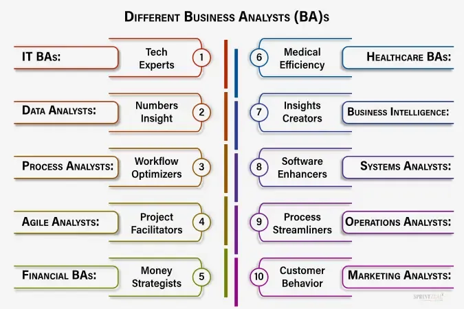

## Table of Contents

## What is an analyst and what do they do?

An analyst is a person who looks at information and data to help make decisions. They work in many different fields, like business, finance, and health care. Their main job is to collect data, study it, and then explain what it means. This helps companies and organizations understand problems and find solutions.

Analysts use special tools and methods to look at data. They might use computers and software to organize information and find patterns. After they study the data, they write reports or give presentations to share their findings. This helps leaders make smart choices based on facts and numbers.

In summary, analysts are important because they help turn raw data into useful information. They help businesses and other groups make better decisions by understanding and explaining data.

## What are the different types of analysts?

There are many types of analysts, each with a special focus. A business analyst helps companies improve how they work by looking at their processes and systems. They find ways to make things better and more efficient. A financial analyst looks at money and investments. They help people and companies decide where to put their money to make the most profit. A data analyst works with all kinds of data, using numbers to find patterns and trends. They help businesses understand what is happening and what might happen next.

Another type is a market analyst, who studies markets to see what people want to buy and how much they will pay. This helps companies decide what products to make and how to sell them. A healthcare analyst focuses on health data to improve patient care and make hospitals run better. There are also operations analysts who look at how a business runs day-to-day to find ways to save time and money. Each type of analyst uses data to help solve problems and make decisions in their specific area.

## What is a financial analyst and what are their main responsibilities?

A financial analyst is someone who helps people and companies make smart choices about money. They look at numbers and data to figure out if an investment is a good idea. They might work for a bank, an investment company, or a big business. Their job is to study the economy, the stock market, and specific companies to see where money can be put to work best.

The main responsibilities of a financial analyst include collecting and studying financial data. They use this data to make predictions about how well a company or investment might do in the future. They write reports and give advice to help their clients or bosses decide where to invest money. They also keep an eye on the markets and update their advice as things change. This helps everyone make the best financial decisions possible.

## How does a business analyst contribute to an organization?

A business analyst helps an organization by looking at how it works and finding ways to make it better. They talk to people in the company to understand what problems they face and what they need. Then, they study the company's processes and systems to see where things can be improved. By doing this, they help the company work more smoothly and save money.

After gathering information, a business analyst comes up with ideas to solve problems. They might suggest new ways to do things or new tools to use. They work with other teams to make sure these changes happen. This helps the company reach its goals faster and serve its customers better. In the end, a business analyst makes the organization stronger and more successful.

## What is the role of a data analyst in today's data-driven world?

In today's world, where everything runs on data, a data analyst is very important. They take a lot of information and turn it into something useful. They use special tools and computers to look at numbers and find patterns. This helps companies understand what is happening and why. For example, a data analyst might look at how many people visit a website and what they do there. This helps the company make the website better and sell more things.

Data analysts also help companies make smart choices. They make reports and charts that show what the data means. This helps bosses see what is working and what is not. For instance, a data analyst might find out that a certain product is not selling well. The company can then decide to change the product or stop selling it. By doing this, data analysts help businesses grow and do better in a world full of information.

## Can you explain the function of a market research analyst?

A market research analyst helps companies understand what people want to buy. They study the market to see what products are popular and how much people are willing to pay for them. They collect information by doing surveys, looking at sales data, and talking to customers. This helps companies decide what new products to make and how to sell them better.

After gathering all this information, market research analysts put it together in reports and presentations. They explain what they found in a way that is easy to understand. This helps the company's leaders make smart choices about their products and marketing plans. By knowing what customers want, companies can make things that people will buy, which helps them make more money.

## What skills are essential for someone aspiring to be an operations analyst?

An operations analyst needs to be good at looking at numbers and data. They should know how to use computers and special software to study information. This helps them find ways to make a business run better. They also need to be good at solving problems. When they see something that is not working well, they need to think of ways to fix it. Being able to talk to people and work in a team is important too. They often need to explain their ideas to others and work together to make changes happen.

Another important skill for an operations analyst is being organized. They have to keep track of a lot of information and make sure everything is in order. They also need to be good at planning. This means they can think about what needs to happen in the future and make sure the business is ready. Being able to pay attention to small details is key because little things can make a big difference in how well a business works.

## How does a systems analyst help in improving business processes?

A systems analyst helps businesses by looking at their computer systems and figuring out how to make them work better. They talk to people in the company to understand what they need and what problems they have. Then, they study the current systems to see where things can be improved. This might mean changing how the computers work or adding new software. By doing this, they help the business run more smoothly and save time and money.

After finding out what needs to be changed, a systems analyst comes up with a plan. They work with other teams to make sure the new ideas are put into action. This could mean training people on how to use new systems or making sure the new software works well with what the company already has. By making these changes, the systems analyst helps the business work better and reach its goals faster.

## What are the advanced tools and technologies used by quantitative analysts?

Quantitative analysts, often called "quants," use many advanced tools and technologies to do their work. They use programming languages like Python and R to write code that helps them study data. These languages are good for working with numbers and making charts. Quants also use special software like MATLAB and SAS, which are made for doing math and statistics. These tools help them look at big sets of data quickly and find patterns that are hard to see.

Another important tool for quants is high-performance computing. This means using very fast computers to do a lot of math in a short time. Quants need this because they often work with huge amounts of data, like stock prices or economic numbers. They also use machine learning and artificial intelligence to make their predictions better. These technologies can learn from data and find new ways to solve problems. By using all these tools, quants can make smart choices about investments and help companies make more money.

## How do investment analysts differ from financial analysts in their approach and focus?

Investment analysts and financial analysts both work with money and numbers, but they focus on different things. An investment analyst looks at different investments like stocks, bonds, and mutual funds. They study these investments to see which ones are good to buy. Their main job is to help people and companies decide where to put their money to make more money. They look at how well a company is doing, what is happening in the economy, and what might happen in the future to make their choices.

Financial analysts, on the other hand, have a broader focus. They look at a company's money in many ways, not just investments. They might help a company decide how to spend its money, how to manage its debts, and how to plan for the future. Financial analysts often make budgets and forecasts to help companies see what might happen with their money. While investment analysts focus on picking the best investments, financial analysts look at the overall financial health of a company and help with big money decisions.

## What are the emerging trends in the field of risk analysis and how do risk analysts adapt to them?

Risk analysis is changing a lot because of new technology and new ways of thinking. One big trend is using data and computers more to understand risks. Risk analysts now use tools like machine learning and artificial intelligence to look at big sets of data. These tools help them find patterns and predict what might happen in the future. Another trend is looking at risks from many different angles, not just money. This means thinking about things like the environment, society, and how people feel about risks. This helps companies make better choices that are good for everyone.

Risk analysts are adapting to these trends by learning new skills and using new tools. They are getting better at working with data and using computer programs to do their job. They also work more with other people in the company, like those who work on the environment or social issues. This helps them see the whole picture and make better plans. By staying up to date with these changes, risk analysts can help their companies handle risks in a smart way and be ready for the future.

## How can an expert analyst leverage big data and AI to enhance their analytical capabilities?

An expert analyst can use big data and AI to make their work better by looking at a lot of information quickly. Big data means having huge amounts of information from many places, like what people buy, what they say online, and how they use things. AI, or artificial intelligence, can help the analyst find patterns in this big data that they might not see on their own. For example, an analyst can use AI to look at customer data and see what products people like to buy together. This helps the analyst give better advice to the company about what to sell and how to sell it.

AI also helps analysts make predictions about the future. By using machine learning, a part of AI, the analyst can teach a computer to learn from past data and guess what might happen next. This is useful for things like figuring out how much a company might sell next month or how the stock market might change. With these tools, an expert analyst can give more accurate and helpful information to their company. This makes the company's decisions smarter and helps it do better in the long run.

## References & Further Reading

[1]: Lopez de Prado, M. (2018). ["Advances in Financial Machine Learning."](https://www.amazon.com/Advances-Financial-Machine-Learning-Marcos/dp/1119482089) Wiley.

[2]: Chan, E. P. (2009). ["Quantitative Trading: How to Build Your Own Algorithmic Trading Business."](https://github.com/ftvision/quant_trading_echan_book) Wiley.

[3]: Jansen, S. (2020). ["Machine Learning for Algorithmic Trading."](https://github.com/stefan-jansen/machine-learning-for-trading) Packt Publishing.

[4]: Aronson, D. R. (2006). ["Evidence-Based Technical Analysis: Applying the Scientific Method and Statistical Inference to Trading Signals."](https://www.amazon.com/Evidence-Based-Technical-Analysis-Scientific-Statistical/dp/0470008741) Wiley.

[5]: Bergstra, J., Bardenet, R., Bengio, Y., & Kégl, B. (2011). ["Algorithms for Hyper-Parameter Optimization."](https://dl.acm.org/doi/10.5555/2986459.2986743) Advances in Neural Information Processing Systems 24.