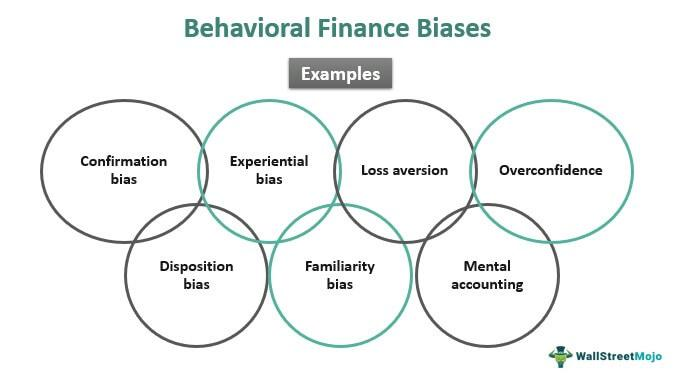

## Table of Contents

## What is bias in the context of investing?

Bias in investing refers to the ways in which our personal beliefs, emotions, or experiences can influence our decisions about buying or selling investments. These biases can lead us to make choices that are not based on facts or careful analysis. For example, if someone has a strong positive feeling about a certain company because they like its products, they might invest in that company without looking at its financial health or market position.

These biases can be harmful because they can cause us to ignore important information or make decisions that are not in our best financial interest. Common biases include overconfidence, where investors think they know more than they actually do, and loss aversion, where investors are so afraid of losing money that they miss out on good opportunities. Being aware of these biases can help investors make more rational and informed decisions, leading to better investment outcomes.

## How can confirmation bias affect investment decisions?

Confirmation bias can really mess up investment decisions. It happens when investors only look for information that supports what they already think. For example, if someone believes a certain stock will do well, they might only read articles or reports that say good things about that stock. They might ignore warnings or negative news, even if it's important.

This can lead to bad choices. If an investor only sees the good side of a stock, they might put too much money into it, thinking it's a sure thing. But if the stock doesn't do well, they could lose a lot of money. It's important for investors to look at all the information, not just the stuff that makes them feel good about their choices. By doing this, they can make smarter decisions and avoid big losses.

## What is loss aversion and how does it impact investors?

Loss aversion is when people feel the pain of losing money more than the joy of gaining it. For investors, this means they might be scared to take risks because they don't want to lose their money, even if there's a good chance to make more money. They might keep their money in safe places like savings accounts, but those places usually don't grow their money as much as other investments could.

This fear can make investors miss out on good opportunities. For example, they might sell their stocks too early if they start to drop a little, just to avoid bigger losses. But if they waited, those stocks might have gone back up and made them more money. So, loss aversion can stop investors from making the best choices for their money and can keep them from growing their wealth as much as they could.

## Can you explain the concept of overconfidence bias in investing?

Overconfidence bias in investing happens when people think they know more about the market than they really do. They might believe they can predict which stocks will go up or down better than anyone else. This can make them take bigger risks with their money because they feel too sure about their choices. They might buy and sell stocks a lot, thinking they can always make the right move at the right time.

This overconfidence can lead to big problems. If investors are too sure of themselves, they might not listen to good advice or look at all the facts. They could end up losing a lot of money because they didn't see the risks. It's important for investors to remember that no one can predict the market perfectly, and being humble about what they know can help them make smarter choices with their money.

## How does anchoring bias influence investment choices?

Anchoring bias happens when investors focus too much on the first piece of information they get about a stock or an investment. For example, if they hear that a stock was once worth $100, they might keep thinking about that price even if the stock's value changes a lot. This can make them make bad choices. They might think the stock is a good deal if it goes down to $80, but they don't look at other important things like the company's health or what's happening in the market.

This bias can stop investors from seeing the whole picture. They might hold onto a stock because they're stuck on the old price, hoping it will go back up to that level. Or, they might not buy a stock that's actually a good investment because it's not as cheap as they think it should be based on the first price they heard. By being aware of anchoring bias, investors can make better decisions by looking at all the information, not just the first number they see.

## What is the herd mentality and its effects on the stock market?

Herd mentality in the stock market is when a lot of people start doing the same thing because they see others doing it. They might buy or sell stocks just because everyone else is doing it, without really thinking about if it's a good idea. This can happen because people don't want to miss out on what looks like a good opportunity, or they're scared of losing money if they don't follow the crowd.

When a lot of people start buying a stock because others are doing it, the price of that stock can go up really fast. This is called a bubble. But if everyone suddenly starts selling because they see others selling, the price can drop just as fast. This can cause big ups and downs in the market, which can be risky for investors. It's important for people to think for themselves and not just follow what everyone else is doing, so they can make smart choices with their money.

## How can recency bias lead to poor investment performance?

Recency bias is when people pay too much attention to what just happened and think it will keep happening. In investing, this means someone might see a stock go up a lot recently and think it will keep going up. They might put a lot of money into that stock without looking at other important things, like if the company is doing well or if the market is changing.

This can lead to bad investment choices. If the stock doesn't keep going up like they thought, they could lose money. It's like betting on a sports team just because they won their last game, without looking at the whole season. By only focusing on what happened recently, investors might miss out on better opportunities or not see the risks that come with their choices.

## What is the disposition effect and why is it problematic for investors?

The disposition effect is when investors are quick to sell stocks that are doing well, but they hold onto stocks that are losing money. They do this because they want to feel good about making a profit, and they hope the losing stocks will come back up. But this can be a bad move. Selling winners too soon means missing out on more gains if those stocks keep going up. And holding onto losers can lead to even bigger losses if those stocks keep going down.

This behavior is problematic because it goes against what's usually best for making money in the long run. It's often smarter to hold onto stocks that are doing well for a longer time, and to sell stocks that are doing badly to stop the losses from getting worse. The disposition effect can make it hard for investors to make the best choices, leading to lower returns on their investments. By understanding this effect, investors can try to make decisions based on what's really best for their money, not just how they feel about their wins and losses.

## How does the endowment effect alter perceptions of asset value?

The endowment effect is when people think something they own is worth more than it really is, just because they own it. Imagine you get a mug as a gift. You might think it's worth more than if you saw the same mug in a store. This happens because owning something makes people feel attached to it, and they don't want to let it go for less than they think it's worth.

In investing, the endowment effect can make people hold onto stocks or other assets longer than they should. They might think the stock they own is worth more than it really is because they've owned it for a while. This can stop them from selling it at the right time, even if the stock's value is going down. It's important for investors to try to see their investments clearly, without letting their feelings about owning them get in the way.

## Can you describe the impact of availability bias on investment strategy?

Availability bias happens when people make decisions based on the information that's easiest to remember or find. In investing, this means someone might choose to buy or sell stocks based on the news they've seen recently or the stories they've heard from friends. For example, if someone keeps hearing about how great tech stocks are doing, they might decide to put all their money into tech stocks without looking at other kinds of investments that might be better.

This can lead to problems because it makes people focus too much on what's in front of them and not enough on all the information they need to make a good choice. If someone only thinks about the stocks that are in the news, they might miss out on other good opportunities or not see the risks of the stocks they're buying. It's important for investors to look at all the information they can, not just what's easy to remember or find, so they can make smarter choices with their money.

## What role does the framing effect play in investment decision-making?

The framing effect is when the way information is presented changes how people see it and make choices. In investing, this means that how a stock or investment is talked about can make someone think it's a good or bad idea. For example, if someone hears a stock described as having a "90% chance of success," they might be more likely to buy it than if they hear it has a "10% chance of failure," even though both statements mean the same thing.

This can lead investors to make choices based on how information is framed, not on the facts. If a financial advisor uses positive words to describe an investment, people might think it's less risky than it really is. This can cause them to put their money into something that might not be the best choice for them. Being aware of the framing effect can help investors look past the words and focus on the real numbers and facts, so they can make better decisions with their money.

## How can investors mitigate the effects of various biases in their strategies?

To reduce the impact of biases, investors need to be aware of them first. They should learn about common biases like confirmation bias, loss aversion, and overconfidence. By understanding these, investors can start to notice when their own feelings or habits might be leading them to make bad choices. Keeping a clear head and trying to see things from different angles can help. For example, if an investor feels really sure about a stock, they should ask themselves if they're just seeing what they want to see, or if there's real evidence to back up their belief.

Another good way to fight biases is to set up strict rules for making decisions. This can mean using a checklist before buying or selling a stock, or setting clear goals for what they want their investments to do. It's also helpful to talk to other people, like a financial advisor or a friend who knows about investing. They can offer a different view and help spot when biases are getting in the way. By taking these steps, investors can make choices that are based more on facts and less on feelings, which can lead to better results in the long run.

## How can one mitigate investment biases?

Mitigating investment biases involves adopting strategies designed to counteract emotional and cognitive distortions that hinder objective decision-making. A systematic investment plan is a foundational strategy that can effectively curb impulsive decisions. By establishing clear investment goals and adhering to a predetermined plan, investors can maintain focus and rationality, especially during periods of market [volatility](/wiki/volatility-trading-strategies). This systematic approach typically includes setting rules for asset allocation, entry and [exit](/wiki/exit-strategy) points, and risk management, thereby reducing the likelihood of impulsive reactions driven by short-term market movements.

Diversification is another key strategy for mitigating biases such as familiarity bias. This bias leads investors to favor familiar investments, limiting portfolio diversification. By spreading investments across various asset classes and geographies, investors can reduce the risk associated with over-concentration in specific markets or sectors. Mathematical models, such as the Modern Portfolio Theory (MPT), illustrate the benefit of diversification. According to MPT, the overall portfolio risk is minimized when investments exhibit low correlations. For instance, the formula for the portfolio variance, $\sigma_p^2$, when two assets are involved is:

$$
\sigma_p^2 = w_1^2 \sigma_1^2 + w_2^2 \sigma_2^2 + 2w_1w_2 \sigma_1 \sigma_2 \rho_{12}
$$

where $w_1$ and $w_2$ are the weights of the two assets in the portfolio, $\sigma_1$ and $\sigma_2$ are their respective standard deviations, and $\rho_{12}$ is the correlation between the asset returns. Aiming to optimize this equation can lead to a well-diversified portfolio.

Utilizing [algorithmic trading](/wiki/algorithmic-trading) strategies further enhances discipline in investment practices by removing human emotions from the equation. Algorithms operate based on predetermined criteria, such as technical indicators or market signals, executing trades objectively and efficiently. Python, for example, can be used to develop trading algorithms that automate trades based on such indicators:

```python
import pandas as pd
import numpy as np

# Example of a simple moving average crossover strategy
def moving_average_crossover(prices, short_window=40, long_window=100):
    signals = pd.DataFrame(index=prices.index)
    signals['price'] = prices
    signals['short_mavg'] = prices.rolling(window=short_window, min_periods=1).mean()
    signals['long_mavg'] = prices.rolling(window=long_window, min_periods=1).mean()
    signals['signal'] = 0.0
    signals['signal'][short_window:] = np.where(signals['short_mavg'][short_window:] > signals['long_mavg'][short_window:], 1.0, 0.0)
    signals['positions'] = signals['signal'].diff()
    return signals
```

Algorithmic trading reduces emotional trading and enhances the consistency of investment decisions. Finally, regularly reviewing and adjusting portfolios based on objective criteria further mitigates the impact of biases. This involves reassessing asset performance, revisiting investment goals, and rebalancing portfolios as necessary to ensure alignment with long-term objectives. By relying on data-driven insights rather than emotions, investors can make more informed decisions and achieve better investment outcomes.

## References & Further Reading

[1]: Barber, B. M., & Odean, T. (2001). ["Boys Will Be Boys: Gender, Overconfidence, and Common Stock Investment."](https://academic.oup.com/qje/article/116/1/261/1939000) The Quarterly Journal of Economics, 116(1), 261-292.

[2]: Kahneman, D., & Tversky, A. (1979). ["Prospect Theory: An Analysis of Decision under Risk."](https://www.jstor.org/stable/1914185) Econometrica, 47(2), 263-291.

[3]: Thaler, R. H. (2009). ["Nudge: Improving Decisions About Health, Wealth, and Happiness."](https://psycnet.apa.org/record/2008-03730-000) Penguin Books.

[4]: Barberis, N., & Thaler, R. (2003). ["A Survey of Behavioral Finance."](https://www.nber.org/papers/w9222) Handbook of the Economics of Finance, 1, 1053-1128.

[5]: Shleifer, A. (2000). ["Inefficient Markets: An Introduction to Behavioral Finance."](https://academic.oup.com/book/27761) Oxford University Press.