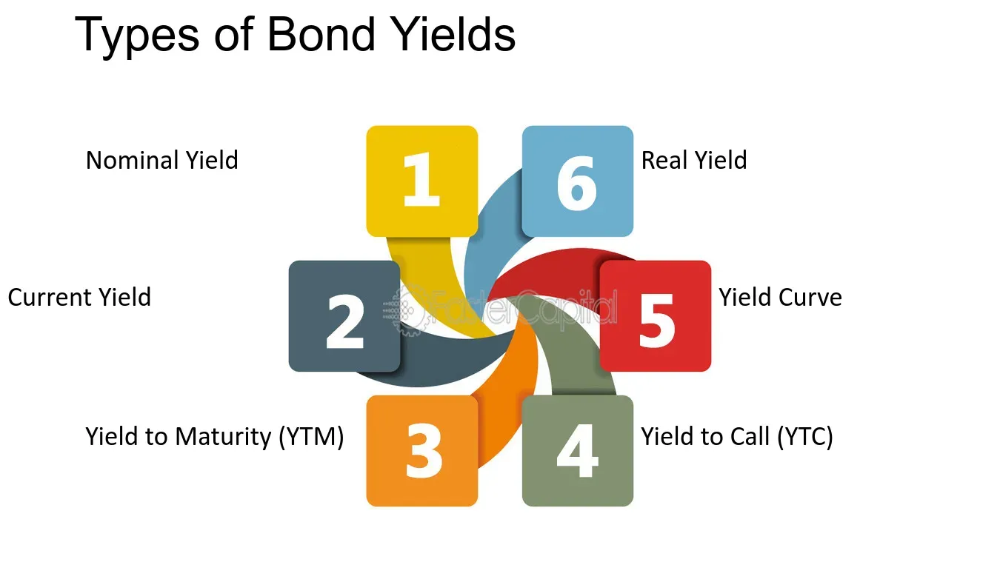

## Table of Contents

## What is a bond yield?

A bond yield is like the return you get from lending money to someone. When you buy a bond, you're basically lending money to the issuer, which could be a government or a company. The yield tells you how much money you'll earn from that bond, usually shown as a percentage. It's important because it helps you decide if the bond is a good investment compared to others.

There are different ways to calculate bond yield, but the most common one is the yield to maturity (YTM). This is the total return you can expect if you hold the bond until it matures. YTM takes into account the bond's current price, its face value, the interest payments you'll receive, and how long you'll have to wait until the bond matures. It's a bit like figuring out the total interest you'd earn on a savings account over time, but with a few more steps.

## How is the nominal yield of a bond calculated?

The nominal yield of a bond is pretty straightforward. It's also called the coupon rate, and it's the interest rate that the bond issuer promises to pay you each year. To find the nominal yield, you just take the annual interest payment and divide it by the bond's face value. The face value is the amount the issuer agrees to pay back when the bond matures. So, if a bond has a face value of $1,000 and pays $50 in interest each year, the nominal yield is 5% ($50 divided by $1,000).

It's important to know that the nominal yield doesn't change over the life of the bond. It stays the same no matter what happens to the bond's price in the market. This means that if you buy the bond at a price different from its face value, the actual return you get, or the yield to maturity, will be different from the nominal yield. But the nominal yield is still useful because it gives you a quick idea of the bond's interest rate and helps you compare it with other bonds.

## What is the difference between current yield and nominal yield?

The nominal yield, or coupon rate, of a bond is the interest rate that the bond issuer agrees to pay you each year. It's calculated by dividing the annual interest payment by the bond's face value. For example, if a bond has a face value of $1,000 and pays $50 in interest each year, the nominal yield is 5%. This rate stays the same throughout the life of the bond, no matter what happens to its market price.

The current yield, on the other hand, is a bit different. It shows the bond's annual return based on its current market price, not its face value. To find the current yield, you divide the annual interest payment by the bond's current market price. So, if that same $1,000 bond is now selling for $900, the current yield would be about 5.56% ($50 divided by $900). The current yield changes as the bond's market price changes, giving you a more up-to-date picture of the bond's return if you were to buy it now.

## Can you explain what yield to maturity (YTM) is and how it's used?

Yield to maturity (YTM) is like the total return you can expect from a bond if you hold onto it until it matures. It's a bit more complicated than just looking at the interest payments because it also considers the bond's current price, its face value, and how long you have to wait until it matures. Imagine you buy a bond for less than its face value; the YTM will be higher than the nominal yield because you're getting a bigger return when the bond pays back its full face value at the end.

People use YTM to compare different bonds and see which one might give them the best return over time. It's a handy tool because it gives you a complete picture of what you might earn, not just the yearly interest payments. For example, if you're choosing between two bonds with the same nominal yield but different prices and maturity dates, the YTM can help you figure out which one will actually give you more money in the end. It's like comparing the total interest you'd earn on different savings accounts, but with a few more steps.

## How does the yield to call (YTC) differ from yield to maturity?

Yield to call (YTC) and yield to maturity (YTM) are both ways to figure out how much money you might make from a bond, but they look at different scenarios. YTC is used for bonds that can be called back by the issuer before they mature. If a bond has a call feature, the issuer can decide to pay you back early, usually when interest rates drop. So, YTC calculates the return you'd get if the bond is called back at the earliest possible date, instead of waiting until it matures.

On the other hand, YTM assumes you'll hold the bond until it reaches its maturity date, which is the end of its life. It takes into account the bond's current price, its face value, the interest payments you'll get, and how long you'll have to wait. YTM is useful for figuring out the total return if you keep the bond until the very end. Both YTC and YTM help you compare different bonds, but YTC is more relevant if you think the bond might be called back early.

## What factors influence bond yields?

Bond yields can change because of many things. One big reason is interest rates set by the government or central bank. When these rates go up, new bonds usually have higher yields to stay competitive. This makes older bonds with lower yields less attractive, so their prices drop and their yields go up to match the market. Another [factor](/wiki/factor-investing) is how safe people think the bond is. If people think a bond is risky, they want a higher yield to take that risk. So, bonds from stable governments or big companies usually have lower yields than bonds from smaller or less stable issuers.

Inflation also plays a role. When prices are going up a lot, people want higher yields to make sure their money keeps its value. If inflation is low, yields might be lower too. The economy's health can affect bond yields as well. In good times, people might want to invest in stocks instead of bonds, so bond yields might need to go up to attract buyers. In bad times, people might want the safety of bonds, so yields could go down. All these things together make bond yields move around, and it's important to keep an eye on them if you're thinking about buying bonds.

## How do interest rate changes affect bond yields?

Interest rates set by the government or central bank can really change bond yields. When these rates go up, new bonds come out with higher yields to stay competitive. This makes older bonds with lower yields less attractive to buyers. So, the prices of these older bonds drop, and their yields go up to match the market. It's like when a store has to lower the price of old items to sell them when new, better items come out.

On the flip side, when interest rates go down, new bonds have lower yields. This makes older bonds with higher yields more attractive, so their prices go up and their yields go down. It's all about supply and demand. When interest rates change, it's like a game of tug-of-war between bond prices and yields, with interest rates pulling the strings.

## What is the relationship between bond prices and yields?

Bond prices and yields have an opposite relationship. When bond prices go up, yields go down. This happens because the yield is like the return you get from the bond. If you pay more for the bond, the return you get from the interest payments becomes smaller compared to what you paid. So, if you buy a bond for a higher price, the yield, or the percentage return, goes down.

On the other hand, when bond prices fall, yields go up. If you can buy a bond for less money, the interest payments you get will be a bigger part of what you paid. This means the yield, or the return you're getting, goes up. It's like buying something on sale; you're getting more value for your money. This seesaw effect between bond prices and yields is important to understand because it helps you know what you might earn from a bond depending on what you pay for it.

## Can you describe real yield and its significance in bond investing?

Real yield is like the true return you get from a bond after taking away the effect of inflation. Imagine you buy a bond that gives you a 5% return each year. If inflation is at 2%, the real yield would be about 3% because the value of your money is going down by 2% each year. Real yield helps you see how much your money is really growing over time, not just the number on the bond.

Knowing the real yield is important for bond investing because it shows you if the bond is a good deal in today's money. If the real yield is high, it means your money is growing faster than inflation, which is great. But if the real yield is low or even negative, your money might not be keeping up with rising prices. This can help you decide if a bond is worth buying or if you should look for other investments that might give you a better real return.

## What are the tax implications of different types of bond yields?

When you invest in bonds, the tax you have to pay can be different depending on the type of bond and the kind of yield you're looking at. For example, the interest you get from most bonds, which is part of the nominal yield, is usually taxed as regular income. This means you'll pay the same tax rate on this interest as you would on your salary or wages. But, if you buy municipal bonds, the interest you earn is often tax-free at the federal level, and sometimes at the state level too, which can make a big difference in how much money you keep.

Another type of yield, like the capital gain you might get from selling a bond before it matures, is taxed differently. If you sell a bond for more than you paid for it, that profit is considered a capital gain. The tax rate on capital gains can be lower than the rate on regular income, depending on how long you held the bond. If you held it for more than a year, you might pay a long-term capital gains tax, which is usually lower. Understanding these tax differences can help you figure out which bonds might be the best fit for your investment goals and tax situation.

## How do credit ratings impact the yield of a bond?

Credit ratings are like report cards for bonds. They tell you how likely it is that the person or company who issued the bond will pay you back. If a bond has a high credit rating, it means people think it's safe, and the issuer is likely to pay you back on time. Because it's seen as safe, these bonds usually have lower yields. People are happy to lend money at a lower return if they know they'll get their money back.

On the other hand, if a bond has a low credit rating, it means there's a bigger risk that the issuer might not pay you back. To make up for this risk, these bonds have to offer higher yields to attract buyers. It's like a company saying, "We know we're a bit risky, but we'll give you more money if you lend to us." So, the lower the credit rating, the higher the yield you can expect, because you're taking on more risk.

## What advanced strategies involve using bond yields for portfolio management?

One advanced strategy for using bond yields in portfolio management is called laddering. This means you buy bonds that mature at different times, like steps on a ladder. By doing this, you can spread out when you get your money back, which helps you manage risk and keep a steady income. For example, if interest rates go up, you can reinvest the money from the bonds that mature soon at the new, higher rates. If rates go down, you still have bonds that are paying the old, higher rates. This way, you're not putting all your eggs in one basket and can take advantage of different market conditions.

Another strategy is called barbell, where you focus on buying bonds with very short maturities and very long maturities, but not much in the middle. This can help you balance the risk and return in your portfolio. The short-term bonds give you flexibility and less risk because you get your money back sooner. The long-term bonds can offer higher yields but come with more risk because you have to wait longer to get paid back. By mixing these two, you can try to get the best of both worlds: safety from the short-term bonds and higher returns from the long-term bonds.

A third strategy involves using bond yields to predict interest rate changes. If you think interest rates will go up, you might want to invest in bonds with shorter maturities or floating-rate bonds, which can adjust their interest payments based on market rates. If you think rates will go down, you might go for longer-term bonds to lock in the current higher yields. By keeping an eye on bond yields and understanding what they might mean for future interest rates, you can adjust your portfolio to try to get the best returns while managing risk.

## What is the understanding of bond yields?

Bond yields are a measure of the return that an investor can expect to earn from a bond investment over time. They are a fundamental aspect of fixed-income securities, providing insight into the profitability and risk associated with bond investments. There are several key types of yields that investors commonly analyze, each offering a different perspective on bond performance: nominal yield, yield to maturity (YTM), and tax-equivalent yield (TEY).

The nominal yield, also known as the coupon yield, is the simplest measure of a bond's return. It is calculated by dividing the bond's annual coupon payment by its face value. The formula is:

$$
\text{Nominal Yield} = \frac{\text{Annual Coupon Payment}}{\text{Face Value}}
$$

While the nominal yield provides a straightforward measure of return, it does not account for changes in the bond's price or the time value of money.

Yield to maturity (YTM), on the other hand, offers a more comprehensive view. It represents the total return an investor can expect if the bond is held until maturity, assuming that all coupon payments are reinvested at the same rate. YTM takes into account the bond's current market price, its face value, coupon [interest rate](/wiki/interest-rate-trading-strategies), and the time remaining until maturity. The calculation of YTM is more complex and typically involves solving the following equation for the yield $r$:

$$
P = \sum_{t=1}^{T} \frac{C}{(1+r)^t} + \frac{F}{(1+r)^T}
$$

where $P$ is the current market price of the bond, $C$ is the annual coupon payment, $F$ is the bond's face value, $T$ is the time to maturity, and $r$ is the yield to maturity.

The tax-equivalent yield (TEY) is an adjustment made to a bond's yield to account for tax considerations. This is particularly relevant for municipal bonds, which are often exempt from federal income taxes. The TEY allows investors to compare the yield of tax-exempt bonds with taxable bonds. It is calculated as follows:

$$
\text{Tax-Equivalent Yield} = \frac{\text{Tax-Free Yield}}{1 - \text{Tax Rate}}
$$

By understanding these different yield measures, investors can better assess the potential returns and risks associated with various bonds. Nominal yield provides a snapshot of income from a bond's coupon, while yield to maturity accounts for the overall profitability of the bond considering its current market conditions. The tax-equivalent yield is essential for making informed comparisons between tax-exempt and taxable securities. These yield types are instrumental in shaping investment strategies and understanding bond market dynamics.

## What is the Role of Inflation and Interest Rates?

Inflation expectations and interest rates are pivotal to determining bond yields, as they directly affect investors' required return for holding fixed-income securities. Bond yields are inherently linked to the prevailing inflation rate and interest rate set by central banks, providing a measure of the earnings an investor can expect from purchasing bonds.

Inflation erodes the purchasing power of future cash flows, prompting investors to demand higher yields as compensation for this risk. When inflation expectations rise, so do nominal bond yields, since investors anticipate future interest rate hikes by central banks. Central banks, like the Federal Reserve, influence interest rates through monetary policy. By adjusting the federal funds rate, central banks impact the economy's borrowing costs, hence influencing long-term interest rates and bond yields.

The relationship between bond yields and interest rates can be mathematically expressed using the Fisher Equation:

$$

i = r + \pi^e 
$$

where $i$ is the nominal interest rate, $r$ is the real interest rate, and $\pi^e$ is the expected inflation rate. This equation highlights how changes in expected inflation ($\pi^e$) can directly alter the nominal interest rate ($i$) and consequently affect bond yields.

Historically, central banks have employed interest rate adjustments as a tool to control inflation and stabilize economic growth. For instance, during periods of high inflation, central banks may increase interest rates to temper economic activity, leading to higher bond yields. Conversely, in an attempt to stimulate growth during economic downturns, central banks may lower interest rates, reducing bond yields as a result.

Understanding the interaction between inflation, interest rates, and bond yields is crucial for investors seeking to navigate financial markets. Accurately predicting these variables allows for more informed investment decisions and potential optimization of bond portfolios. Investors may use various models and tools to analyze expected inflation and interest rate trends, integrating them into their broader investment strategies.

## References & Further Reading

1. **Fabozzi, Frank J. (Editor). "Handbook of Fixed Income Securities."** This comprehensive guide provides insights into the various types of bonds and yields, exploring fundamental concepts and advanced strategies in fixed income securities. It offers invaluable information on how bonds function, the factors influencing yields, and strategies for investment in bonds.

2. **Jones, Charles P., and Jensen, Gerald R. "Investments: Analysis and Management."** This text covers bond markets and yields in a broader context of investment finance, providing an enhanced understanding of market dynamics and the role of bonds within a diversified portfolio.

3. **Chincarini, Ludwig B. "Quantitative Equity Portfolio Management: Modern Techniques and Applications."** Though focused primarily on equities, Chincarini’s work provides valuable insights into algorithmic trading techniques that have parallels in the bond markets. It discusses quantitative strategies and the application of algorithmic methods in trading.

4. **Aitken, Michael, Comerton-Forde, Carole, and Frino, Alex. "The Microstructure of the Australian Securities Exchange." Finance Professor.** This paper provides insights into the microstructure of securities markets, highlighting how algorithmic trading affects trading behavior and liquidity—a crucial aspect when considering bond market dynamics.

5. **Treynor, Jack L. "Treynor on Institutional Investing."** This collection of essays covers a range of topics relevant to yield management and trading dynamics, offering insights into market behaviors and the strategic approach to fixed income securities.

6. **Duffie, Darrell. "Dynamic Asset Pricing Theory."** Duffie's book explores the mathematical foundation of asset pricing, which is essential for understanding the complex interactions within bond markets. The text investigates into the models and theories that determine pricing and yields.

7. **O’Hara, Maureen. "Market Microstructure Theory."** This foundational text explores the structure of financial markets, including bond markets, and examines the impact of technology and algorithms on trading environments.

8. **Algo Traders’ Quarterly Reports and Newsletters.** Regularly updated publications from leading financial institutions and algorithmic trading firms provide current data and insights into algorithmic trading trends and market impacts.

9. **Hebner, Mark. "Index Funds: The 12-Step Program for Active Investors."** While focusing primarily on equity index funds, Hebner’s work provides useful lessons on passive investing strategies and the role of index funds in fixed income investing.

For those interested in advancing their understanding of these complex subjects, these resources offer comprehensive knowledge and varied perspectives on the interactions between bond yields, [algorithmic trading](/wiki/algorithmic-trading), and market dynamics.

