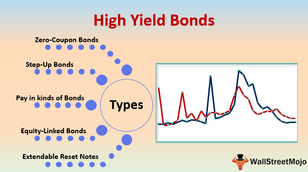

In this article, we explore the complex interactions among investment finance, bond yields, and algorithmic trading. Bond yields are essential for evaluating the potential return on fixed-income investments. They represent the interest or dividend received from holding bonds, serving as a key indicator of an investment’s profitability. With the advent of algorithmic trading in the bond market, both pricing mechanisms and trading dynamics have been significantly influenced. Algorithmic trading employs advanced algorithms to automate trading decisions, increasing the speed and efficiency of transactions. These algorithms analyze vast datasets to forecast price movements, thereby impacting market liquidity and price stability.

Understanding the interplay between these elements is crucial for investors and market participants. Bond yields provide insight into the overall health of the fixed-income market and are influenced by a variety of factors, including interest rates and inflation expectations. Meanwhile, algorithmic trading, with its capability to process large volumes of transactions in milliseconds, has transformed how bonds are traded.

As these two forces continue to evolve, their interaction is reshaping the financial landscape. By examining this interplay, the article aims to provide insights that are critical for navigating today's financial markets, offering a comprehensive overview of how bond yields and algorithmic trading influence investment decisions and market structures.

## Table of Contents

## Understanding Bond Yields

Bond yields are a measure of the return that an investor can expect to earn from a bond investment over time. They are a fundamental aspect of fixed-income securities, providing insight into the profitability and risk associated with bond investments. There are several key types of yields that investors commonly analyze, each offering a different perspective on bond performance: nominal yield, yield to maturity (YTM), and tax-equivalent yield (TEY).

The nominal yield, also known as the coupon yield, is the simplest measure of a bond's return. It is calculated by dividing the bond's annual coupon payment by its face value. The formula is:

$$
\text{Nominal Yield} = \frac{\text{Annual Coupon Payment}}{\text{Face Value}}
$$

While the nominal yield provides a straightforward measure of return, it does not account for changes in the bond's price or the time value of money.

Yield to maturity (YTM), on the other hand, offers a more comprehensive view. It represents the total return an investor can expect if the bond is held until maturity, assuming that all coupon payments are reinvested at the same rate. YTM takes into account the bond's current market price, its face value, coupon [interest rate](/wiki/interest-rate-trading-strategies), and the time remaining until maturity. The calculation of YTM is more complex and typically involves solving the following equation for the yield $r$:

$$
P = \sum_{t=1}^{T} \frac{C}{(1+r)^t} + \frac{F}{(1+r)^T}
$$

where $P$ is the current market price of the bond, $C$ is the annual coupon payment, $F$ is the bond's face value, $T$ is the time to maturity, and $r$ is the yield to maturity.

The tax-equivalent yield (TEY) is an adjustment made to a bond's yield to account for tax considerations. This is particularly relevant for municipal bonds, which are often exempt from federal income taxes. The TEY allows investors to compare the yield of tax-exempt bonds with taxable bonds. It is calculated as follows:

$$
\text{Tax-Equivalent Yield} = \frac{\text{Tax-Free Yield}}{1 - \text{Tax Rate}}
$$

By understanding these different yield measures, investors can better assess the potential returns and risks associated with various bonds. Nominal yield provides a snapshot of income from a bond's coupon, while yield to maturity accounts for the overall profitability of the bond considering its current market conditions. The tax-equivalent yield is essential for making informed comparisons between tax-exempt and taxable securities. These yield types are instrumental in shaping investment strategies and understanding bond market dynamics.

## The Role of Inflation and Interest Rates

Inflation expectations and interest rates are pivotal to determining bond yields, as they directly affect investors' required return for holding fixed-income securities. Bond yields are inherently linked to the prevailing inflation rate and interest rate set by central banks, providing a measure of the earnings an investor can expect from purchasing bonds.

Inflation erodes the purchasing power of future cash flows, prompting investors to demand higher yields as compensation for this risk. When inflation expectations rise, so do nominal bond yields, since investors anticipate future interest rate hikes by central banks. Central banks, like the Federal Reserve, influence interest rates through monetary policy. By adjusting the federal funds rate, central banks impact the economy's borrowing costs, hence influencing long-term interest rates and bond yields.

The relationship between bond yields and interest rates can be mathematically expressed using the Fisher Equation:

$$

i = r + \pi^e 
$$

where $i$ is the nominal interest rate, $r$ is the real interest rate, and $\pi^e$ is the expected inflation rate. This equation highlights how changes in expected inflation ($\pi^e$) can directly alter the nominal interest rate ($i$) and consequently affect bond yields.

Historically, central banks have employed interest rate adjustments as a tool to control inflation and stabilize economic growth. For instance, during periods of high inflation, central banks may increase interest rates to temper economic activity, leading to higher bond yields. Conversely, in an attempt to stimulate growth during economic downturns, central banks may lower interest rates, reducing bond yields as a result.

Understanding the interaction between inflation, interest rates, and bond yields is crucial for investors seeking to navigate financial markets. Accurately predicting these variables allows for more informed investment decisions and potential optimization of bond portfolios. Investors may use various models and tools to analyze expected inflation and interest rate trends, integrating them into their broader investment strategies.

## Algorithmic Trading in Bond Markets

Algorithmic trading has transformed bond markets by employing sophisticated algorithms to automate trading strategies, thereby enhancing efficiency and [liquidity](/wiki/liquidity-risk-premium). High-frequency trading ([HFT](/wiki/high-frequency-trading-strategies)) is a crucial component of this transformation, enabling the execution of vast numbers of transactions at rapid speeds. With these algorithms, traders can quickly identify and exploit pricing inefficiencies, which contributes to a more fluid market by narrowing bid-ask spreads and reducing transaction costs.

The utilization of [machine learning](/wiki/machine-learning) technologies further amplifies the capabilities of [algorithmic trading](/wiki/algorithmic-trading). Machine learning algorithms can process and analyze large datasets faster than traditional methods, identifying intricate patterns and correlations that might be missed by human traders. This ability allows for refined predictive analytics and more informed decision-making. Machine learning models, such as neural networks, can adapt to new information and continuously improve trading strategies, which can lead to an optimal allocation of assets and enhanced return on investments.

Despite these advancements, the proliferation of algorithmic trading has raised concerns about market [volatility](/wiki/volatility-trading-strategies) and systemic risk. Algorithmically driven trades can occur in milliseconds, sometimes leading to situations where automated responses fuel self-reinforcing cycles of buying and selling, thus exacerbating price fluctuations. Moreover, during periods of market stress, the simultaneous deployment of similar trading algorithms can intensify volatility and disrupt market stability. The "Flash Crash" of May 2010 in the U.S. equity markets is one notable instance where high-speed trading was implicated in the rapid, severe reduction in stock prices.

Further concerns center around the systemic risk posed by the concentration of algorithmic trading activities among a few large players. These entities possess significant market power, which might inadvertently trigger cascading effects in the event of sudden withdrawal or technical failures. As such, there is an ongoing debate about the need for regulatory measures to ensure that the benefits of algorithmic trading are realized without compromising market stability.

In conclusion, while algorithmic trading presents substantial benefits in terms of efficiency and liquidity in bond markets, stakeholders must remain vigilant about its potential drawbacks. Balancing innovation with effective risk management strategies and regulatory oversight is pivotal to the sustainable integration of these technologies in financial markets.

## Impact of Algo Trading on Bond Prices and Yields

Algorithmic trading, or algo trading, significantly influences bond markets, affecting liquidity, price formation, and yield structures. By employing automated, computer-driven strategies, these algorithms can process vast amounts of data and execute trades at speeds and frequencies beyond human capability. This enhances market dynamics by providing liquidity and tightening bid-ask spreads. As a result, it can lead to more efficient pricing mechanisms for bonds, as large volumes of trade can occur without significant price discrepancies.

While algo trading increases efficiency, it also contributes to market volatility, particularly during times of stress. When algorithms react to market movements, they can amplify volatility, leading to rapid and substantial price swings. An example is the 'spiral of liquidity' whereby rapid selling by algorithms leads to sharp price declines, triggering further automated selling. This behavior can disrupt stability, thereby affecting yield stability as well. During the October 2014 U.S. Treasury 'Flash Rally,' for example, an unexpected surge in Treasury prices occurred, partly attributed to algorithmic trading. In less than half an hour, yields plummeted and then rebounded dramatically, underscoring the potential for rapid, algo-driven shifts in market sentiment. 

The role of algo trading is also evident in corporate bonds, where electronic trading platforms have facilitated increased algorithmic participation. These advancements allow for more seamless trade executions and potentially better pricing for investors. However, they necessitate robust risk management frameworks to mitigate the risks associated with higher volatility levels. Effective regulation is essential to manage these risks and ensure that the benefits of algo trading, such as increased efficiency and liquidity, do not come at the cost of market stability.

By examining these aspects of algo trading, it becomes clear that while it offers substantial advantages in terms of market liquidity and efficiency, it also poses challenges that require careful management and oversight to maintain overall market health.

## Case Studies and Real-World Examples

The October 2014 U.S. Treasury 'Flash Rally' serves as a prominent example of algorithmic trading's impact on market stability. On October 15, 2014, the U.S. Treasury market experienced an unprecedented surge in price and a rapid decline in yields without any clear economic catalyst. The yield on the 10-year Treasury note fell by 34 basis points in a matter of minutes, only to partially recover within the hour. This episode highlighted the role of algorithmic trading, specifically high-frequency trading, in exacerbating market movements due to the complex interactions among automated trading strategies. The regulatory body, the U.S. Department of the Treasury, alongside other financial authorities, analyzed this event, attributing the volatility to a confluence of factors, including automatic trading and reduced market depth.

The shift towards algorithmic trading in corporate bonds has been accelerated by technological advancements, such as electronic trading platforms. The traditional over-the-counter method of trading bonds is gradually being supplemented, if not replaced, by platforms that facilitate faster and more efficient transactions. This trend is supported by the use of algorithms which can quickly digest and respond to large volumes of market information, leading to improved liquidity and tighter bid-ask spreads. However, this rapidity increases the risk of market disruptions, similar to the flash rally observed in the Treasury market.

These case studies underscore the necessity for effective risk management and regulatory oversight in modern financial markets. The potential for algorithmic trading to induce extreme volatility necessitates the implementation of robust risk controls, including circuit breakers and stringent compliance protocols. Furthermore, ongoing collaboration between regulatory bodies and industry participants is essential to enhancing the transparency and stability of trading practices. As algorithmic trading continues to expand within bond markets, ensuring its alignment with fair market principles will be critical in safeguarding market integrity.

## Conclusion and Future Trends

The interaction between bond yields and algorithmic trading remains a powerful force in shaping the modern financial landscape. As the financial markets continue to evolve, significant advancements in technology are paving the way for more sophisticated trading strategies. The integration of [artificial intelligence](/wiki/ai-artificial-intelligence) (AI) and machine learning in algorithmic trading is poised to revolutionize the ways traders analyze and respond to market dynamics. These technologies enable the development of models that can process vast amounts of data to identify patterns and predict market movements with greater accuracy.

AI and machine learning algorithms can enhance decision-making processes by learning from historical data and adapting to new information. This capability allows traders to implement strategies that are not only more efficient but also more responsive to changing market conditions. The automation of trading processes, combined with real-time analysis, reduces latency and improves price discovery in bond markets.

However, as algorithmic trading becomes more prevalent, proactive risk management is essential to maintain market stability. Automated systems, although efficient, can sometimes contribute to market volatility, especially in times of stress. Robust risk management frameworks must be in place to monitor and manage the potential risks associated with high-frequency trading and large-scale algorithmic transactions.

In addition to technical advancements, the future of algorithmic trading will also require a strong focus on ethical practices. Ensuring fairness and transparency in trading activities is critical to maintaining investor trust and preventing market manipulation or unfair advantages. Regulatory bodies are likely to play a crucial role in overseeing the responsible implementation of AI-driven trading strategies.

As technological innovation continues to transform financial markets, the synergy between bond yields and algorithmic trading will be pivotal. The future will likely see enhanced predictive capabilities and efficiency, but it will also demand careful management of associated risks and ethical considerations. Ultimately, the ongoing evolution of trading strategies will shape the trajectory of the global finance ecosystem, highlighting the importance of balancing technological progress with stability and fairness.

## References & Further Reading

1. **Fabozzi, Frank J. (Editor). "Handbook of Fixed Income Securities."** This comprehensive guide provides insights into the various types of bonds and yields, exploring fundamental concepts and advanced strategies in fixed income securities. It offers invaluable information on how bonds function, the factors influencing yields, and strategies for investment in bonds.

2. **Jones, Charles P., and Jensen, Gerald R. "Investments: Analysis and Management."** This text covers bond markets and yields in a broader context of investment finance, providing an enhanced understanding of market dynamics and the role of bonds within a diversified portfolio.

3. **Chincarini, Ludwig B. "Quantitative Equity Portfolio Management: Modern Techniques and Applications."** Though focused primarily on equities, Chincarini’s work provides valuable insights into algorithmic trading techniques that have parallels in the bond markets. It discusses quantitative strategies and the application of algorithmic methods in trading.

4. **Aitken, Michael, Comerton-Forde, Carole, and Frino, Alex. "The Microstructure of the Australian Securities Exchange." Finance Professor.** This paper provides insights into the microstructure of securities markets, highlighting how algorithmic trading affects trading behavior and liquidity—a crucial aspect when considering bond market dynamics.

5. **Treynor, Jack L. "Treynor on Institutional Investing."** This collection of essays covers a range of topics relevant to yield management and trading dynamics, offering insights into market behaviors and the strategic approach to fixed income securities.

6. **Duffie, Darrell. "Dynamic Asset Pricing Theory."** Duffie's book explores the mathematical foundation of asset pricing, which is essential for understanding the complex interactions within bond markets. The text investigates into the models and theories that determine pricing and yields.

7. **O’Hara, Maureen. "Market Microstructure Theory."** This foundational text explores the structure of financial markets, including bond markets, and examines the impact of technology and algorithms on trading environments.

8. **Algo Traders’ Quarterly Reports and Newsletters.** Regularly updated publications from leading financial institutions and algorithmic trading firms provide current data and insights into algorithmic trading trends and market impacts.

9. **Hebner, Mark. "Index Funds: The 12-Step Program for Active Investors."** While focusing primarily on equity index funds, Hebner’s work provides useful lessons on passive investing strategies and the role of index funds in fixed income investing.

For those interested in advancing their understanding of these complex subjects, these resources offer comprehensive knowledge and varied perspectives on the interactions between bond yields, algorithmic trading, and market dynamics.

