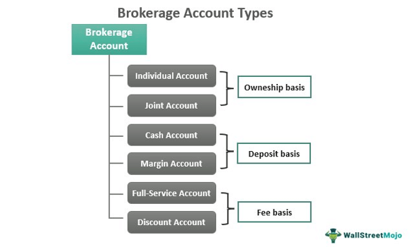

## Table of Contents

## What is a brokerage account?

A brokerage account is like a special kind of bank account where you can buy and sell things like stocks, bonds, and mutual funds. It's managed by a brokerage firm, which is a company that helps you make these trades. You put money into your brokerage account, and then you can use that money to invest in different financial products.

When you want to buy or sell something, you tell the brokerage firm what you want to do, and they do it for you. They might charge you a small fee for their services. This account is different from a regular bank account because it's meant for investing, not just saving money. It's a good way to grow your money over time by investing in the stock market or other investments.

## What are the different types of brokerage accounts available?

There are a few different types of brokerage accounts that you can choose from, depending on what you need. The first type is a cash account. This is the simplest kind of brokerage account. You put money into it, and you can only use that money to buy investments. You can't borrow money from the brokerage firm to buy more investments than you have cash for. It's like paying with cash when you go shopping.

Another type is a margin account. This kind of account lets you borrow money from the brokerage firm to buy more investments than you have cash for. It's like using a credit card when you shop. But remember, if you borrow money, you have to pay it back with interest. This can be riskier because if your investments go down in value, you might owe more money than you have.

Lastly, there are retirement accounts like an IRA (Individual Retirement Account) or a 401(k). These are special brokerage accounts meant for saving for retirement. They have tax benefits, which means you might pay less in taxes on the money you earn from your investments. But there are rules about when you can take the money out, usually not until you're older.

## What is a standard brokerage account and who is it suitable for?

A standard brokerage account is a basic type of investment account where you can buy and sell stocks, bonds, mutual funds, and other investments. It's called a "cash account" because you use the money you put into it to make your investments. You can't borrow money from the brokerage firm to buy more than you have. It's like using cash when you go shopping. You need to have enough money in the account to cover the cost of what you want to buy.

This type of account is suitable for anyone who wants to start investing but doesn't want to take on extra risk. It's great for beginners because it's simple and straightforward. You don't have to worry about borrowing money and paying it back with interest. It's also good for people who want to invest for goals like buying a house or saving for their kids' education, but not necessarily for retirement. If you're looking for a simple way to grow your money over time without the added complexity of borrowing, a standard brokerage account might be right for you.

## What are retirement accounts like IRAs and 401(k)s, and how do they differ from standard accounts?

Retirement accounts like IRAs (Individual Retirement Accounts) and 401(k)s are special types of investment accounts designed to help you save for retirement. They come with tax benefits, which means you might pay less in taxes on the money you earn from your investments. For example, with a traditional IRA or 401(k), you can deduct the money you put in from your taxable income, which means you pay less in taxes that year. But there are rules about when you can take the money out. Usually, you have to wait until you're 59½ years old, or you might have to pay a penalty.

These retirement accounts are different from standard brokerage accounts in a few ways. First, standard brokerage accounts don't have the same tax benefits. The money you put into a standard account is after you've paid taxes on it, and you'll pay taxes on any money you earn from your investments when you take it out. Second, standard accounts don't have the same rules about when you can take your money out. You can use the money whenever you want, without worrying about penalties. So, standard accounts are more flexible, but retirement accounts can help you save more for the long term because of the tax advantages.

## Can you explain what a margin account is and the risks associated with it?

A margin account is a type of brokerage account where you can borrow money from the brokerage firm to buy more investments than you have cash for. It's like using a credit card when you go shopping. You put some money into the account, and the brokerage firm lets you borrow more money to make bigger investments. You have to pay back the money you borrow, plus interest. This can be a good way to make bigger investments if you think they will go up in value.

But there are risks with a margin account. If the investments you buy with borrowed money go down in value, you might lose more money than you put in. You still have to pay back the money you borrowed, even if your investments are worth less now. If you can't pay it back, the brokerage firm can sell your investments to get their money back. This is called a margin call. It can be stressful and lead to big losses, so you need to be careful and understand the risks before using a margin account.

## What is a cash account and how does it differ from a margin account?

A cash account is a type of brokerage account where you can only buy investments with the money you have in the account. It's like using cash when you go shopping. You need to have enough money in the account to cover the cost of what you want to buy. This kind of account is simple and straightforward, making it a good choice for beginners or anyone who wants to invest without taking on extra risk. You don't have to worry about borrowing money and paying it back with interest.

A margin account is different because it lets you borrow money from the brokerage firm to buy more investments than you have cash for. It's like using a credit card when you go shopping. This can be a good way to make bigger investments if you think they will go up in value, but it comes with risks. If the investments you buy with borrowed money go down in value, you might lose more money than you put in. You still have to pay back the money you borrowed, plus interest. If you can't pay it back, the brokerage firm can sell your investments to get their money back, which can be stressful and lead to big losses.

## What are the benefits of using a robo-advisor account?

A robo-advisor account is a type of investment account where a computer program helps you invest your money. The big benefit of using a robo-advisor is that it's easy and cheap. You don't need to know a lot about investing because the robo-advisor does the work for you. It asks you some questions about your goals and how much risk you're okay with, and then it picks investments for you. This can save you time and money because robo-advisors usually charge lower fees than human financial advisors.

Another benefit is that robo-advisors automatically adjust your investments to keep them in line with your goals. This is called rebalancing. If the stock market goes up or down, the robo-advisor will sell some investments and buy others to make sure your portfolio stays balanced. This can help you stay on track without having to do anything yourself. Plus, robo-advisors often use something called tax-loss harvesting, which can help you save money on taxes by selling investments that have lost value and using those losses to offset gains.

## How do managed accounts work and what are the fees associated with them?

Managed accounts are investment accounts where a professional money manager helps you invest your money. You tell them what your goals are and how much risk you're okay with, and they pick investments for you. They keep an eye on your investments and make changes as needed to help you reach your goals. It's like having a personal shopper for your investments. Managed accounts can be good if you don't have the time or knowledge to manage your investments yourself, but you want someone to do it for you.

The fees for managed accounts can be higher than other types of accounts because you're paying for the expertise of a professional money manager. Usually, you'll pay a percentage of the money in your account each year. This is called an asset management fee, and it might be around 1% to 2% of your account's value. Some managed accounts might also charge other fees, like fees for buying and selling investments or fees for keeping your account open. It's important to understand all the fees before you start, so you know how much it will cost you to have someone manage your money.

## What should one consider when choosing between a discount and a full-service brokerage account?

When choosing between a discount and a full-service brokerage account, you need to think about what kind of help you want and how much you're willing to pay. A discount brokerage account is cheaper because it doesn't offer much help. You do the investing yourself, which means you pick your own investments and make your own decisions. This is good if you know about investing and want to save money on fees. But if you're new to investing or don't have the time to manage your investments, a discount account might not be the best choice.

A full-service brokerage account, on the other hand, gives you a lot more help. You get a personal financial advisor who picks investments for you and helps you make decisions. This can be really useful if you're not sure what to do or if you want someone to manage your money for you. But full-service accounts are more expensive because you're paying for the advisor's time and expertise. So, you need to decide if the extra help is worth the extra cost. It all depends on your comfort level with investing and how much you want to pay for help.

## How do tax-advantaged accounts like 529 plans work for educational savings?

A 529 plan is a special type of savings account designed to help you save for education. It's called tax-advantaged because it can help you save money on taxes. The money you put into a 529 plan grows without being taxed, and when you take the money out to pay for school, you usually don't have to pay taxes on it either. This makes it a good way to save for things like college, trade school, or even private elementary and high school.

There are two main types of 529 plans: prepaid tuition plans and education savings plans. A prepaid tuition plan lets you pay for future college tuition at today's prices, which can save you money if tuition goes up. An education savings plan is more flexible; you can use the money for tuition, fees, [books](/wiki/algo-trading-books), and even room and board. But there are rules about how you can use the money. If you use it for something other than education, you might have to pay taxes and a penalty on the earnings. So, it's important to make sure you're using the money for qualified education expenses.

## What are the specific features and benefits of custodial accounts for minors?

A custodial account is a special type of account that adults can set up for kids. It's like a savings or investment account, but the money belongs to the kid. An adult, called the custodian, manages the account until the kid is old enough to take over. There are two main types of custodial accounts: UGMA (Uniform Gifts to Minors Act) and UTMA (Uniform Transfers to Minors Act). UGMA accounts can hold things like cash, stocks, and bonds, while UTMA accounts can also hold things like real estate and art. When the kid turns 18 or 21, depending on the state, they get control of the account and can use the money however they want.

One big benefit of custodial accounts is that they can help kids learn about money and investing early. The money in the account can be invested in stocks, bonds, or mutual funds, which can grow over time. This can give kids a head start on saving for things like college or buying a car. Another benefit is that the money you put into a custodial account can lower your taxable income, which means you might pay less in taxes. But remember, once the kid gets control of the account, they can use the money for anything, not just education or other specific goals. So, it's a good idea to talk to them about how to use the money wisely.

## How can advanced traders utilize specialized accounts like futures or forex trading accounts?

Advanced traders can use futures trading accounts to buy and sell contracts for things like crops, oil, or stock indexes. These contracts say they will buy or sell the thing at a certain price on a certain date in the future. Futures trading can be risky because prices can change a lot, but it can also be a way to make money if you know what you're doing. Traders use futures accounts to guess how prices will change and make trades based on that. It's like betting on what the price of something will be in the future, and if you guess right, you can make a profit.

Forex trading accounts are used to trade currencies from different countries. Forex stands for foreign exchange, and it's all about buying one currency while selling another. For example, you might buy US dollars and sell Euros if you think the dollar will get stronger compared to the Euro. Forex trading can happen 24 hours a day because different countries' markets are open at different times. It can be risky because currency values can change quickly, but it can also be a way to make money if you understand the market well. Advanced traders use these accounts to try to make money from these changes in currency values.

## What are the key aspects of exploring investment accounts?

Investment accounts are critical instruments for building wealth and achieving long-term financial objectives. Their function extends beyond mere repositories for savings, as they serve as vehicles for growth through strategic asset management and tax optimization.

### Taxable and Tax-Advantaged Accounts

Investment accounts are primarily categorized into taxable accounts and tax-advantaged accounts. Taxable accounts, commonly referred to as brokerage accounts, allow investors to buy and sell securities freely but incur taxes on dividends, interest, and capital gains. Conversely, tax-advantaged accounts, such as Individual Retirement Accounts (IRAs) and 401(k) plans, offer benefits like deferred tax payments or tax-free growth on investments, thus incentivizing long-term savings [1].

**Tax-Advantaged Accounts:**

1. **IRAs and Roth IRAs**: Traditional IRAs provide a tax deferral on contributions until withdrawal during retirement, allowing the investment earnings to grow tax-deferred. Roth IRAs, funded with post-tax income, offer tax-free withdrawals of both principal and earnings, assuming certain conditions are met.

2. **401(k) Plans**: These employer-sponsored plans allow pre-tax income contributions, reducing the taxable income and fostering disciplined retirement savings. Employers often match contributions, enhancing the account value.

### Asset Allocation and Diversification

Managing these investment accounts effectively requires a comprehensive grasp of asset allocation and diversification principles. Asset allocation involves distributing investments across various asset classes—stocks, bonds, real estate, etc.—to align with the investor's risk tolerance and financial goals. Diversification, a subset of asset allocation, aims to minimize risk by spreading investments within asset classes [2].

Mathematically, diversification can be quantified using modern portfolio theory (MPT), which employs the formula for the expected return $E(R)$ of a portfolio:

$$
E(R) = \sum_{i=1}^{n} w_i \cdot E(R_i)
$$

where $w_i$ is the weight of asset $i$ in the portfolio and $E(R_i)$ is the expected return of asset $i$. By constructing a portfolio with uncorrelated or negatively correlated assets, the overall portfolio risk can be reduced compared to the risk of holding individual securities.

### Tax Advantages

The tax benefits inherent in tax-advantaged accounts significantly bolster long-term savings. By deferring taxes, the full potential of compounding can be realized, as reinvestment of would-be taxes accelerates account growth over time. For instance, the compound interest formula:

$$
A = P \times \left(1 + \frac{r}{n}\right)^{nt}
$$

where $A$ is the amount of money accumulated after $n$ years, including interest, $P$ is the principal amount, $r$ is the annual interest rate, and $t$ is the time the money is invested, exemplifies how tax deferral can increase the final account value.

By prudently leveraging these accounts, individuals not only plan for retirement but also optimize their asset growth and minimize tax liabilities, thus achieving a financially secure future.

### References

1. Bodie, Z., Kane, A., & Marcus, A. J. (2008). Investments. McGraw-Hill.
2. Markowitz, H. (1952). "Portfolio Selection." Journal of Finance.

## References & Further Reading

1. **Investments by Zvi Bodie, Alex Kane, and Alan J. Marcus**  
   This book offers a comprehensive guide to investment theory, covering essential concepts such as asset allocation, diversification, and capital market theories. The authors provide in-depth discussions on portfolio management techniques, risk assessment, and the impact of market conditions on investment decisions, making it an invaluable resource for understanding the principles behind successful investing.

2. **Advances in Financial Machine Learning by Marcos Lopez de Prado**  
   de Prado's work focuses on the application of machine learning algorithms in finance, addressing model overfitting, backtesting strategies, and the use of alternative data. It provides insights on how modern computational techniques can be applied to enhance trading strategies and improve financial forecasting, making it essential reading for those interested in the integration of machine learning in trading.

3. **Machine Learning for Algorithmic Trading by Stefan Jansen**  
   This guide provides practical insights into developing trading algorithms using [machine learning](/wiki/machine-learning) techniques. Jansen discusses various supervised and unsupervised learning approaches, feature selection, and model evaluation, alongside hands-on examples using Python. The book is suitable for those aiming to harness machine learning for better decision-making and automated trading practices.

4. **Quantitative Trading by Ernest P. Chan**  
   Ernest P. Chan offers insights into [quantitative trading](/wiki/quantitative-trading) strategies, sharing his hands-on experience in setting up trading systems. The book covers [statistical [arbitrage](/wiki/arbitrage)](/wiki/statistical-arbitrage), [backtesting](/wiki/backtesting) techniques, and risk management principles, providing a practical roadmap for traders looking to apply quantitative techniques in the market to achieve consistent returns.

5. **Algorithmic Trading and DMA by Weston J.**  
   This work covers the essential aspects of [algorithmic trading](/wiki/algorithmic-trading) and direct market access (DMA), detailing execution methods, algorithm designs, and market microstructure. Readers can explore strategies for trading automation and understand how advanced technologies can optimize trade executions and market analysis, making it a critical resource for grasping algorithmic trading fundamentals.

