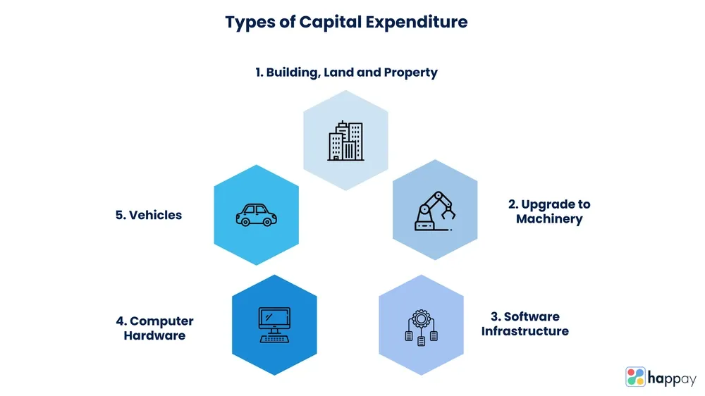

## Table of Contents

## What is a capital expenditure?

A capital expenditure, often called a capex, is money a business spends on big, long-lasting items that help it grow or keep running smoothly. These items are not used up quickly like office supplies, but instead, they last for years. Examples include buying new machinery, buildings, or vehicles. These purchases are important because they help a company increase its ability to make products or provide services.

When a company makes a capital expenditure, it records the cost as an asset on its balance sheet instead of immediately marking it as an expense. Over time, as the asset is used, its cost is spread out through a process called depreciation. This means that a little bit of the cost is recorded as an expense each year, reflecting the asset's wear and tear. This helps businesses match the cost of the asset with the income it helps generate, giving a clearer picture of the company's financial health.

## How do capital expenditures differ from operating expenses?

Capital expenditures and operating expenses are two different types of costs that businesses have. Capital expenditures, or capex, are for big, long-lasting items that a company buys to help it grow or keep running. These can be things like new machines, buildings, or vehicles. These items are not used up quickly; they last for many years. When a company buys these, it records the cost as an asset on its balance sheet. Over time, the cost of these assets is spread out through depreciation, which means a little bit of the cost is recorded as an expense each year.

Operating expenses, on the other hand, are the costs a business has to pay to keep running day to day. These are things like rent, utilities, salaries, and office supplies. These costs are used up quickly and are recorded as expenses right away on the income statement. They don't last long and don't help the company grow in the same way that capital expenditures do. So, while capital expenditures are about investing in the future, operating expenses are about keeping the business going right now.

## What are the common types of capital expenditures for a business?

Common types of capital expenditures for a business include buying new machinery or equipment. This could be anything from computers for the office to heavy machinery for a factory. These purchases help the business make more products or offer better services. Another common type is spending on buildings or land. A business might buy a new office, a store, or a warehouse to expand where it can work or store things.

Another type of capital expenditure is investing in vehicles. This could mean buying trucks for deliveries, cars for salespeople, or even planes for a company that needs to travel a lot. Upgrading technology is also a common capital expenditure. This could include new software systems that help the business run more smoothly or new tech that helps make products faster or better. All these types of spending are important because they help the business grow and work better in the long run.

## Can you explain the difference between maintenance and expansion capital expenditures?

Maintenance capital expenditures are the costs a business pays to keep its current operations going smoothly. This means fixing or replacing things that are worn out or broken, like old machines or a leaky roof. These expenses are important because they help the business keep doing what it's already doing without interruptions. Think of it like fixing a car so it can keep running, not buying a new one.

Expansion capital expenditures, on the other hand, are the costs a business pays to grow bigger or do new things. This could mean buying new equipment to make more products, building a new store to reach more customers, or even buying a whole new company. These expenses are about making the business larger or trying new ideas to make more money in the future. It's like buying a new car to have more space or better features, not just to keep driving the old one.

## How do companies finance their capital expenditures?

Companies can finance their capital expenditures in several ways. One common way is by using their own money, which is called internal financing. This means they use the profits they've made from their business to buy new things like machines or buildings. Another way is by borrowing money, which is called debt financing. They can get loans from banks or issue bonds to investors, promising to pay back the money with interest over time.

Another method is through equity financing, where companies sell part of their business to investors. This can be done by issuing new shares of stock. Investors buy these shares and become part owners of the company, and in return, they might get dividends or see the value of their shares grow. Sometimes, companies also use a mix of these methods, called hybrid financing, to spread out the risk and make sure they have enough money to cover their big purchases.

## What is the impact of capital expenditures on a company's financial statements?

When a company spends money on capital expenditures, it shows up on their financial statements in a big way. First, the money spent on things like new machines or buildings is recorded as an asset on the balance sheet. This means the company's total assets go up. But, because the company spent money, their cash goes down, so that part of the balance sheet shows less cash on hand. Over time, as the new asset is used, its cost is spread out through depreciation. Each year, a little bit of the asset's cost is recorded as an expense on the income statement, which makes the company's net income go down a bit each year.

Capital expenditures also affect the cash flow statement. When the company spends money on these big items, it shows up as a use of cash in the investing activities section. This means the company's cash flow from investing activities will be negative because money went out. But, if the new asset helps the company make more money in the future, it could lead to more cash coming in from operating activities down the road. So, while capital expenditures can make a company's cash position look weaker right away, they can also set the stage for stronger financial performance later on.

## How should a business evaluate the potential return on a capital expenditure?

A business should evaluate the potential return on a capital expenditure by looking at how much money the new purchase will make over time. They can use a method called the payback period, which tells them how many years it will take to earn back the money they spent. Another way is to calculate the net present value (NPV), which figures out the value of future earnings in today's money. If the NPV is positive, it means the investment will likely be good for the business. They can also use the internal rate of return (IRR), which shows the expected growth rate of the investment. If the IRR is higher than the cost of borrowing money, the investment might be worth it.

It's also important for a business to think about other things besides just the numbers. They should consider if the new purchase will help them stay ahead of competitors or if it will make their customers happier. They should also think about any risks, like if the new machine might break down a lot or if the new building might not be needed in the future. By looking at both the financial side and the bigger picture, a business can make a smarter decision about whether a capital expenditure will be a good investment.

## What are some examples of capital expenditures in different industries?

In the manufacturing industry, capital expenditures often include buying new machines that make products faster or better. For example, a car factory might spend a lot of money on a new robotic arm to help build cars more quickly. They might also spend on new buildings to have more space to make things. These big purchases help the factory make more cars and stay ahead of other factories.

In the tech industry, companies might spend a lot on new computers and servers to handle more data or run new software. For instance, a software company might buy new servers to make sure their apps run smoothly for more users. They might also spend on new office spaces to fit more workers as they grow. These investments help the tech company keep up with the fast pace of technology and serve more customers.

In the retail industry, capital expenditures can include opening new stores or renovating old ones to attract more shoppers. A big retail chain might buy a new location to open a store in a different city. They might also spend on new checkout systems to make shopping easier and faster. These big spends help the retail business reach more people and improve the shopping experience.

## How do tax regulations affect capital expenditure decisions?

Tax regulations can have a big impact on how businesses decide to spend money on capital expenditures. One way is through tax deductions. When a business buys a big item like a new machine or building, they can sometimes deduct the cost from their taxes right away, which is called immediate expensing or bonus depreciation. This can make the purchase less expensive because the business gets some money back from the government. So, if the tax rules are good, a business might decide to buy more things to take advantage of these tax breaks.

Another way tax rules affect capital expenditures is through depreciation. When a business can't deduct the full cost of a big purchase right away, they spread it out over several years. The rules for how fast they can do this can change, and if the government lets them depreciate things faster, it can make the purchase seem less expensive over time. Businesses might wait to buy things if they think the tax rules will get better, or they might buy more if the current rules are really good. So, tax regulations can really change how and when a business decides to spend money on big items.

## What role does depreciation play in managing capital expenditures?

Depreciation is really important when a business buys big things like machines or buildings. It helps spread out the cost of these items over the years they are used. Instead of paying the whole cost at once, the business can record a little bit of the cost as an expense each year. This makes the financial statements look better because the big expense is broken into smaller pieces. It also matches the cost of the item with the money it helps the business make over time.

This way of handling costs can affect how a business decides to spend money on big items. If the rules for depreciation are good, meaning the business can spread out the cost faster, it might decide to buy more things. This is because the big purchase seems less expensive over time. On the other hand, if the rules are not so good, the business might wait to buy things until the rules change. So, depreciation is a key part of planning and managing big purchases for a business.

## How can capital expenditure planning improve a company's long-term strategy?

Capital expenditure planning helps a company think about its future and make smart choices about what big things to buy. When a company plans its big purchases, it can decide what new machines, buildings, or technology will help it grow and make more money down the road. By looking at how much money these big buys will bring in over time, the company can pick the ones that will be the most helpful. This kind of planning makes sure the company spends its money in ways that will help it do better in the long run, not just right now.

Good capital expenditure planning also helps a company stay ready for changes in the market or new chances to grow. If a company knows what big things it wants to buy and when, it can be ready to act quickly when a good opportunity comes up. For example, if a new technology comes out that could make the company's products better, the company can already have the money set aside to buy it. This planning helps the company keep up with other businesses and be ready to take advantage of new ways to make money, making its long-term strategy stronger.

## What advanced techniques can be used to optimize capital expenditure decisions in large corporations?

Large corporations can use a technique called scenario analysis to make better choices about big purchases. This means they look at different possible futures and see how their big buys would work out in each one. For example, they might think about what would happen if the economy gets better or worse, or if new technology comes out. By planning for different situations, the company can pick the best time to buy things and make sure they are ready for whatever might happen. This helps them spend their money in a smart way and be ready for changes.

Another advanced technique is real options analysis. This is like looking at big purchases as choices that can be changed later. Instead of just thinking about the cost and the money the purchase will make, the company thinks about how they can adjust their plans if things change. For example, if they buy a new factory, they might have the option to expand it later if they need to. This way of thinking helps the company be more flexible and make better decisions because they know they can change their plans if needed.

## What is the Role of CapEx in Business Investments?

Capital expenditures (CapEx) play a vital role in determining a company's strategic trajectory and competitive advantage. These investments are pivotal in shaping the long-term vision and direction of a business, as they directly influence a company's core capabilities and market position. 

Strategic CapEx investments often focus on expanding production capacity, adopting advanced technologies, and enhancing market positioning. By increasing production capacity, companies can meet higher demand, reduce costs per unit, and achieve economies of scale. For instance, investing in a new manufacturing plant or upgrading existing facilities allows a business to produce more efficiently and at a larger [volume](/wiki/volume-trading-strategy), which can translate into increased market share and revenue.

Investments in improved technology are integral to maintaining and advancing a company's competitive edge. By adopting state-of-the-art technologies, businesses can streamline operations, increase productivity, and introduce innovative products or services. This technological advancement not only enhances efficiency but also positions the company as a leader in its industry, further strengthening its market presence.

Furthermore, proper planning and financing of CapEx are crucial for realizing high returns on investment and achieving favorable financial performance. Effective CapEx planning involves thorough evaluation of potential projects, accurate cost estimation, and alignment with the company's strategic goals. Companies must assess the potential return on investment (ROI) by comparing the expected benefits of the CapEx project to its costs, which can be calculated as:

$$
\text{ROI} = \frac{\text{Net Profit}}{\text{Cost of Investment}} \times 100
$$

Here, the accurate assessment and prioritization of CapEx projects enable businesses to allocate resources effectively and ensure long-term sustainability. Sound financing strategies, such as leveraging debt or retaining earnings, are essential for executing these investments without compromising the company’s financial stability. The judicious management of financial resources not only supports ongoing operations but also ensures the successful implementation and integration of CapEx projects into the business’s overall framework. 

In summary, the role of CapEx in business investments is multifaceted; it encompasses strategic planning, technological advancement, and effective financial management. Through careful decision-making and execution, companies can leverage CapEx to enhance their competitive advantage and secure a prosperous future.

## References & Further Reading

[1]: Bergstra, J., Bardenet, R., Bengio, Y., & Kégl, B. (2011). ["Algorithms for Hyper-Parameter Optimization."](https://papers.nips.cc/paper/4443-algorithms-for-hyper-parameter-optimization) Advances in Neural Information Processing Systems 24.

[2]: ["Advances in Financial Machine Learning"](https://www.amazon.com/Advances-Financial-Machine-Learning-Marcos/dp/1119482089) by Marcos Lopez de Prado

[3]: ["Evidence-Based Technical Analysis: Applying the Scientific Method and Statistical Inference to Trading Signals"](https://www.amazon.com/Evidence-Based-Technical-Analysis-Scientific-Statistical/dp/0470008741) by David Aronson

[4]: ["Machine Learning for Algorithmic Trading"](https://github.com/stefan-jansen/machine-learning-for-trading) by Stefan Jansen

[5]: ["Quantitative Trading: How to Build Your Own Algorithmic Trading Business"](https://books.google.com/books/about/Quantitative_Trading.html?id=j70yEAAAQBAJ) by Ernest P. Chan