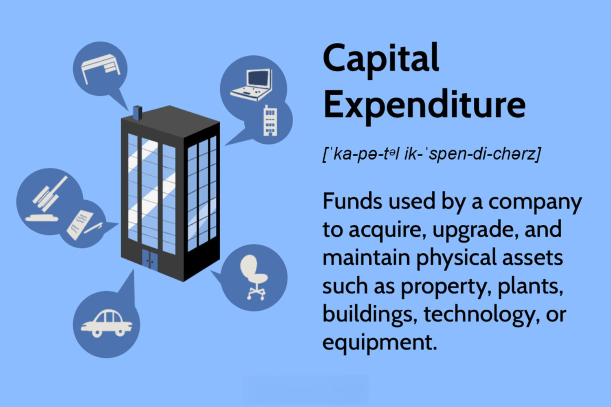

In business finance, understanding capital expenditures (CapEx) is vital for sound financial planning. CapEx involves long-term investments made by businesses to acquire or upgrade physical assets such as property, industrial buildings, or equipment. These investments are essential for fostering growth, enhancing operational efficiency, and maintaining financial health. Unlike operating expenses, which are short-term and recur, CapEx entails substantial upfront costs with a long-term horizon.

The role of CapEx in business investments is multifaceted. It influences a company's ability to expand, adapt to market changes, and improve its competitive positioning. Strategic CapEx decisions can lead to increased production capacity, the adoption of advanced technology, and stronger market presence.



In recent years, algorithmic trading (algo trading) has emerged as a significant factor in how businesses approach CapEx. Algo trading employs computer algorithms to trade financial securities at high speeds and volumes, providing real-time data analysis and optimizing investment strategies. The merging of algo trading with CapEx decisions offers businesses sophisticated tools for financial planning, impacting the timing, scale, and nature of investments.

This article explores the different types of capital expenditures, their impact on business investments, and the relationship with algo trading. By understanding these elements, businesses can enhance their investment outcomes and establish a competitive advantage in dynamic markets.

## Table of Contents

## Understanding Capital Expenditures (CapEx)

Capital expenditures, commonly abbreviated as CapEx, refer to the funds utilized by a company for the acquisition, enhancement, and maintenance of its physical assets. These assets can range from properties and industrial buildings to equipment. Unlike operational expenses, which are both short-term and recurrent, CapEx represents significant investments with a long-term focus. These investments are crucial for a company’s strategic growth and operational efficiency.

CapEx can be broken down into several categories based on the purpose of the investment. They often encompass three main areas: expansion, replacement, and improvements. Expansion CapEx is aimed at increasing a company's operational capacity or entering new markets, which is vital for scaling businesses. Replacement CapEx involves investing in new assets to replace old ones that have reached the end of their useful life, ensuring that operations continue smoothly without any disruptions. Improvement CapEx pertains to upgrading existing assets to improve efficiency or productivity, which can lead to cost savings and enhanced performance over time.

The nature of CapEx necessitates substantial upfront costs, which contrasts with operating expenses that are incurred regularly. However, the long-term horizon of capital expenditures means they are amortized over the useful life of the asset, allowing businesses to spread the cost over several years and align it with the revenue generated by the asset.

Effective capital expenditure is not only about managing the immediate implications of significant financial outlays but also considering the sustained impact on the company’s financial health and competitive positioning. Properly categorized and strategically implemented, CapEx allows businesses to adapt to technological advancements, meet regulatory requirements, and maintain a robust infrastructure that supports ongoing and future operations.

## Types of Capital Expenditures

Capital expenditures, or CapEx, are crucial investments that businesses make to sustain and grow their operations. They are often categorized into several distinct types based on their purpose and impact on the company.

**Growth CapEx** refers to expenditures aimed at expanding a company's operations or entering new markets. These investments enable companies to increase production capacity, diversify product offerings, or extend geographic reach. For instance, a company may invest in a new manufacturing facility or acquire another business entity. Growth CapEx is often strategic, aligning with long-term objectives to enhance market share and drive revenue growth.

**Maintenance CapEx** focuses on maintaining or upgrading existing assets to ensure operational continuity. These expenditures are necessary to preserve the value and functionality of a company's assets, such as machinery, vehicles, or real estate. Through regular maintenance and necessary upgrades, companies can avoid disruptions and extend the lifespan of their valuable resources. Unlike growth CapEx, which aims to drive expansion, maintenance CapEx helps sustain current operations and efficiency.

**Regulatory and Compliance CapEx** involves investments required to adhere to legal and regulatory standards. Such expenditures may be necessary to comply with environmental regulations, workplace safety laws, or industry-specific standards. For example, a factory may need to invest in emission control technologies to meet government-mandated environmental standards. Compliance CapEx ensures that companies fulfill their legal obligations, avoiding penalties and maintaining a good reputation.

**Replacement CapEx** is allocated for replacing existing assets that have reached the end of their useful life. These investments are critical to maintaining operational efficiency, as outdated or worn-out equipment can lead to increased downtime and reduced productivity. By allocating resources towards replacement CapEx, companies can ensure that their assets remain functional and competitive. Replacement CapEx, similar to maintenance CapEx, plays a key role in the continuous operation and sustainability of business assets.

Understanding the various types of capital expenditures allows companies to strategically manage their resource allocation, ensuring both day-to-day operational efficiency and long-term growth potential.

## The Role of CapEx in Business Investments

Capital expenditures (CapEx) play a vital role in determining a company's strategic trajectory and competitive advantage. These investments are pivotal in shaping the long-term vision and direction of a business, as they directly influence a company's core capabilities and market position. 

Strategic CapEx investments often focus on expanding production capacity, adopting advanced technologies, and enhancing market positioning. By increasing production capacity, companies can meet higher demand, reduce costs per unit, and achieve economies of scale. For instance, investing in a new manufacturing plant or upgrading existing facilities allows a business to produce more efficiently and at a larger [volume](/wiki/volume-trading-strategy), which can translate into increased market share and revenue.

Investments in improved technology are integral to maintaining and advancing a company's competitive edge. By adopting state-of-the-art technologies, businesses can streamline operations, increase productivity, and introduce innovative products or services. This technological advancement not only enhances efficiency but also positions the company as a leader in its industry, further strengthening its market presence.

Furthermore, proper planning and financing of CapEx are crucial for realizing high returns on investment and achieving favorable financial performance. Effective CapEx planning involves thorough evaluation of potential projects, accurate cost estimation, and alignment with the company's strategic goals. Companies must assess the potential return on investment (ROI) by comparing the expected benefits of the CapEx project to its costs, which can be calculated as:

$$
\text{ROI} = \frac{\text{Net Profit}}{\text{Cost of Investment}} \times 100
$$

Here, the accurate assessment and prioritization of CapEx projects enable businesses to allocate resources effectively and ensure long-term sustainability. Sound financing strategies, such as leveraging debt or retaining earnings, are essential for executing these investments without compromising the company’s financial stability. The judicious management of financial resources not only supports ongoing operations but also ensures the successful implementation and integration of CapEx projects into the business’s overall framework. 

In summary, the role of CapEx in business investments is multifaceted; it encompasses strategic planning, technological advancement, and effective financial management. Through careful decision-making and execution, companies can leverage CapEx to enhance their competitive advantage and secure a prosperous future.

## Algorithmic Trading and CapEx

Algorithmic trading, or algo trading, utilizes sophisticated computer algorithms to execute trades in financial markets with heightened speed and superior volume. This automated approach is designed to analyze market conditions, execute transactions, and manage trade orders without human intervention, often capitalizing on small price discrepancies across markets or leveraging predictive analytics for financial decision-making.

The integration of [algorithmic trading](/wiki/algorithmic-trading) into capital expenditure (CapEx) decisions enhances the investment strategies of a company by providing real-time data analysis. These algorithms process large amounts of financial data to identify trends and patterns that inform CapEx allocations. Consequently, companies can make more informed investment decisions, optimizing timing and scale, thereby unlocking opportunities for greater financial returns.

The impact of algo trading on CapEx decisions is multifaceted. By facilitating high-frequency data processing, firms are able to accurately assess the financial landscape, optimizing the timing of their investments. For instance, during periods of market [volatility](/wiki/volatility-trading-strategies), algo trading can identify opportune moments to implement or defer CapEx, adjusting the investment scale according to real-time assessments of risk and return. This precise control over the investment process enables firms to navigate complex financial environments more effectively.

Advancements in [artificial intelligence](/wiki/ai-artificial-intelligence) (AI) and [machine learning](/wiki/machine-learning) have further evolved algo trading, endowing companies with more sophisticated tools for financial decision-making. AI-driven algorithms can employ [deep learning](/wiki/deep-learning) techniques to scrutinize historical and current market data, identifying nuanced correlations that traditional models may overlook. An example of a Python-based framework that can facilitate these capabilities is TensorFlow, which allows for the development and training of machine learning models tailored to financial forecasting and investment strategy.

```python
import tensorflow as tf

# Define a simple deep learning model
model = tf.keras.Sequential([
    tf.keras.layers.Dense(64, activation='relu', input_shape=(input_shape,)),
    tf.keras.layers.Dense(64, activation='relu'),
    tf.keras.layers.Dense(1)  # Output layer
])

# Compile the model
model.compile(optimizer='adam', loss='mean_squared_error')

# Fit the model on financial data
model.fit(X_train, y_train, epochs=10, batch_size=32)
```
The use of such technologies enables algo trading systems to continuously learn and adapt to shifting market dynamics, thus providing businesses with a significant advantage in managing their capital investments. This integration allows firms to transform their CapEx management from a static, periodic activity into a dynamic, responsive process that aligns closely with the current market conditions and the firm's strategic objectives. Through this symbiosis of technology and finance, businesses can achieve more agile and efficient capital allocation, ultimately driving sustained financial growth.

## Advantages and Challenges of Integrating Algo Trading with CapEx

Integrating algorithmic trading with capital expenditures (CapEx) offers businesses several advantages, including enhanced data analytics, improved decision-making, and greater market responsiveness. Algorithmic trading leverages advanced data processing and computational capabilities to analyze vast sets of market data efficiently. This enhances a company's ability to understand market trends and potential investment opportunities promptly. Such data-driven insights enable businesses to make informed CapEx decisions, potentially leading to optimized investment strategies and improved financial performance.

The application of algo trading in CapEx decisions allows firms to quickly adapt to market changes. This responsiveness is particularly advantageous in volatile markets where rapid adjustments to CapEx strategies can result in substantial cost savings and returns on investment. Furthermore, the precision and speed of algo trading minimize human error and emotional biases in investment decisions, contributing to a more streamlined strategic planning process.

Despite these advantages, integrating algorithmic trading with CapEx involves several challenges. One significant challenge is the high initial setup cost. Implementing sophisticated algo trading systems requires substantial financial investment in technology infrastructure and software. Additionally, businesses must invest in acquiring or developing technical expertise to manage and operate these complex systems effectively. This need for specialized knowledge extends to understanding programming languages, statistical analysis, and financial modeling.

Cybersecurity threats pose another challenge when integrating algo trading with CapEx. As algo trading systems rely heavily on digital platforms, they become vulnerable to hacking and other forms of cyberattacks, potentially resulting in financial losses and compromised data integrity. Ensuring robust cybersecurity measures is crucial to protect sensitive investment data and maintain the reliability of algo trading systems.

Balancing traditional CapEx strategies with innovative algo trading approaches necessitates careful planning. Organizations must evaluate their current investment frameworks, assess the potential benefits of algorithmic integration, and align these with their long-term strategic goals. This requires a nuanced understanding of both traditional asset management principles and the disruptive potential of technology-driven trading strategies. By strategically blending these approaches, businesses can create a resilient investment strategy that capitalizes on the strengths of both methodologies.

## Conclusion

Capital expenditures are integral in defining the financial trajectory and growth potential of a company. By understanding and strategically implementing various types of CapEx, such as growth, maintenance, regulatory, and replacement, businesses can make informed investment decisions that bolster their operational capabilities and market position. Each type of CapEx serves a unique purpose, requiring careful planning to align with the company’s long-term objectives and competitive strategy.

The integration of algorithmic trading into CapEx decisions represents a modern, data-driven approach that maximizes investment outcomes. Through the use of advanced algorithms, businesses can analyze real-time data to optimize their financial strategies, thereby enhancing their market responsiveness and decision-making capabilities. Algorithmic trading allows for more precise timing and scaling of investments, potentially leading to superior financial performance and returns.

For businesses, the ability to leverage both CapEx and algorithmic trading provides a robust framework for achieving sustained success. By combining traditional capital investment strategies with the innovative capabilities of algo trading, companies can gain a competitive advantage in rapidly changing markets. The nuanced understanding and application of these financial tools can drive growth and ensure a resilient financial landscape, positioning businesses to thrive in dynamic economic environments.

## References & Further Reading

[1]: Bergstra, J., Bardenet, R., Bengio, Y., & Kégl, B. (2011). ["Algorithms for Hyper-Parameter Optimization."](https://papers.nips.cc/paper/4443-algorithms-for-hyper-parameter-optimization) Advances in Neural Information Processing Systems 24.

[2]: ["Advances in Financial Machine Learning"](https://www.amazon.com/Advances-Financial-Machine-Learning-Marcos/dp/1119482089) by Marcos Lopez de Prado

[3]: ["Evidence-Based Technical Analysis: Applying the Scientific Method and Statistical Inference to Trading Signals"](https://www.amazon.com/Evidence-Based-Technical-Analysis-Scientific-Statistical/dp/0470008741) by David Aronson

[4]: ["Machine Learning for Algorithmic Trading"](https://github.com/stefan-jansen/machine-learning-for-trading) by Stefan Jansen

[5]: ["Quantitative Trading: How to Build Your Own Algorithmic Trading Business"](https://books.google.com/books/about/Quantitative_Trading.html?id=j70yEAAAQBAJ) by Ernest P. Chan