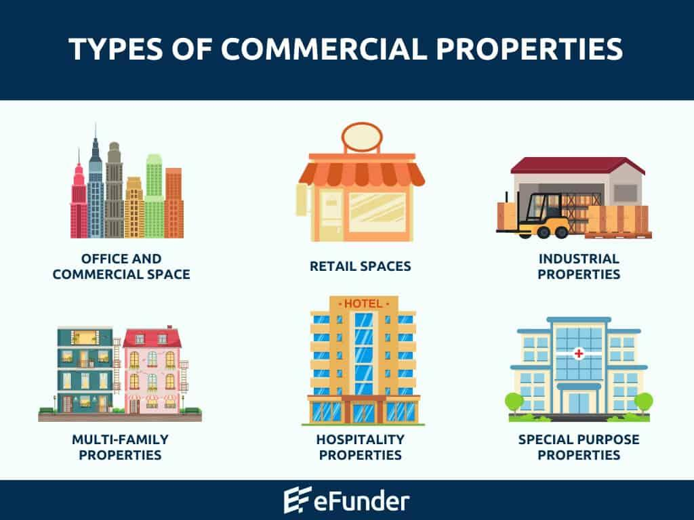

Real estate investment is a multifaceted industry where the classification of properties plays a crucial role in decision-making and management. Property categories, commonly divided into residential and commercial sectors, significantly influence investment strategies, risk assessment, and financial forecasting. This article concentrates on commercial real estate and its intersection with algorithmic trading, a cutting-edge approach in modern investment.

Commercial real estate (CRE) encompasses properties used primarily for business purposes, including office buildings, industrial spaces, retail centers, multifamily complexes, and specialized facilities such as healthcare and hospitality. The commercial sector is often favored by investors due to its potential for higher returns and stability over residential real estate. Understanding the nuances of these property categories is vital for investors to make informed decisions and maximize their returns.



Algorithmic trading, or algo trading, involves the use of computer algorithms to execute trades based on predefined criteria. This approach is prevalent in financial markets, offering advantages like enhanced decision-making speed, accuracy, and efficiency. The integration of algo trading into real estate markets represents an innovative development, offering new opportunities for investors to optimize their strategies using data-driven insights.

These topics intersect significantly as algorithmic trading can transform how real estate data is analyzed and leveraged. For investors and professionals, marrying commercial real estate expertise with algorithmic techniques could enhance predictive analytics, improve market forecasts, and streamline portfolio management. This combination provides a framework for creating robust investment strategies that are adaptable to market fluctuations and technological trends.

The article will proceed by examining key areas essential for understanding and maneuvering within these sectors. Readers can expect to gain insights into commercial real estate property categories, the main considerations for investments, revenue generation methods, and the role algo trading plays in contemporary real estate investments. By the conclusion, readers will have a comprehensive understanding of how these domains interconnect to shape emergent strategies in real estate investment.

## Table of Contents

## Understanding Real Estate Property Categories

Commercial real estate (CRE) is a type of property used exclusively for business-related purposes, intended to generate a profit, either from rental income or capital gains. Unlike residential real estate, which is designed for people to live in, CRE encompasses various property types where activities like commerce, production, and service provision occur. Residential real estate primarily includes single-family homes and apartment buildings, where the primary purpose is habitation.

Within commercial real estate, there are several primary categories, each serving different business needs:

1. **Office**: This category includes spaces ranging from single-tenant buildings to skyscrapers. Office properties are often classified by quality (Class A, B, or C), location, and flexibility of usage. The demand for office spaces can be influenced by employment rates and corporate activities.

2. **Industrial**: Includes warehouses, manufacturing plants, and distribution centers. Industrial properties are crucial in supply chain operations and are often located outside urban areas to accommodate larger facilities and logistical needs.

3. **Retail**: Comprised of shopping centers, strip malls, and standalone retail stores. Retail properties rely heavily on consumer spending patterns and are significantly impacted by the economic climate and e-commerce trends.

4. **Multifamily**: Involves apartment buildings and condominium complexes. These properties serve as residential units but operate as commercial businesses because they generate income from leasing multiple units.

5. **Hospitality**: Encompasses hotels, motels, and resorts. The hospitality sector is heavily dependent on tourism and business travel, influencing the demand for temporary accommodations.

6. **Healthcare**: Includes hospitals, clinics, and nursing facilities. The healthcare real estate category benefits from the stability and demand inherent to medical services but requires significant compliance with health regulations.

7. **Special Purpose**: Refers to properties with unique designs or uses, such as amusement parks, sports facilities, or theaters. These properties do not easily convert to other uses and often cater to niche markets.

8. **Land**: Includes undeveloped, raw land as well as parcels intended for future development. Land investment often requires long-term planning and is influenced significantly by zoning laws and regulatory changes.

Emerging trends in commercial real estate are shaping the industry's landscape. For instance, sustainable building practices are becoming increasingly important as businesses seek to reduce their environmental impact. Sustainable buildings utilize eco-friendly materials, energy-efficient systems, and other technologies to lessen carbon footprints and cut operational costs. Additionally, the rise of self-storage spaces reflects changing consumer needs and lifestyles, as individuals and businesses seek convenient and secure storage solutions.

Each category of commercial property presents unique benefits and challenges. For example, office properties, while offering significant income potential, may face high vacancy rates during economic downturns. Industrial spaces, benefiting from the rise of e-commerce, require substantial initial investments and suitable geographic positioning. Retail properties must adapt to changing consumer preferences and technological advancements, while the multifamily sector provides steady income but is subject to tenant management challenges. Hospitality requires responsiveness to market fluctuations and seasonality, yet can offer lucrative returns in prime locations. Healthcare properties provide stability but necessitate diligent adherence to regulations. Special purpose properties, while often resistant to competition, may pose risks associated with limited use cases. Land investments hold significant potential for appreciation, but come with regulatory hurdles and long-term holding periods.

Understanding these categories and their respective dynamics is essential for informed decision-making in commercial real estate investment and management.

## Key Considerations in Commercial Real Estate

Commercial real estate (CRE) investment decisions are influenced by a variety of critical factors. Location is paramount, as it determines property value, access to key infrastructure, and attractiveness to potential tenants. Proximity to transportation hubs, business districts, and growing population centers can enhance the investment appeal of commercial properties.

Market dynamics, including supply and demand, economic conditions, and competition, significantly impact CRE values and potential returns. A thorough analysis of these factors is essential for investors aiming to maximize their yield.

Tenant mix is another vital consideration. A diverse tenant portfolio can mitigate risks associated with economic downturns in specific industries. Investors often seek anchor tenants—major retail chains or corporations known for business stability—as their presence can attract smaller tenants and increase property value.

Zoning laws and regulatory requirements play a crucial role in shaping CRE investments. Zoning dictates the permissible use of land, influencing property development options and operational restrictions. Understanding local ordinances helps investors identify suitable properties and plan legal compliance throughout transactional and operational stages.

Various lease types influence the financial viability of CRE investments:

- **Single Net Lease (N):** Tenants pay base rent plus property tax. 
- **Double Net Lease (NN):** Tenants cover base rent, property tax, and insurance.
- **Triple Net Lease (NNN):** Tenants assume responsibility for base rent, property tax, insurance, and maintenance, minimizing landlord expenses.
- **Gross Lease:** Tenants pay a fixed rent, with landlords covering most property expenses.

The lease type affects revenue predictability and expense management, requiring investors to assess their preference for stability versus risk.

Tenant turnover and vacancies pose potential risks and opportunities. High turnover can lead to increased costs related to tenant improvements and marketing to new tenants. It may also reflect negative market sentiment or undesirable property features. Conversely, turnover provides opportunities to renegotiate leases at higher rates during favorable market conditions.

Overall, successful CRE investment strategies depend on a comprehensive understanding of these key considerations to effectively navigate the complexities of the commercial real estate landscape.

## How Investors Make Money in Commercial Real Estate

Investors generate income in commercial real estate primarily through rental income and property appreciation. Rental income is the regular payment made by tenants for using the property, providing a steady cash flow to the owner. Property appreciation occurs when the property increases in value over time due to factors such as location development, economic growth, or improvements made to the property.

There are two principal routes for investment in commercial real estate: direct and indirect investments. Direct investments involve purchasing physical properties, where the investor has control over every aspect of the property, including management decisions and lease agreements. This method allows investors to potentially earn substantial rental income and gain from property appreciation.

Indirect investment typically involves financial products such as Real Estate Investment Trusts (REITs) and real estate-themed Exchange-Traded Funds (ETFs). REITs are companies that own, operate, or finance income-producing real estate across a range of property sectors. Through REITs, investors can gain exposure to a diversified portfolio of properties without the need to directly manage them. Similarly, ETFs provide an additional avenue by offering shares that track a real estate index, including both residential and commercial properties.

These indirect investment vehicles offer [liquidity](/wiki/liquidity-risk-premium) and diversification advantages compared to direct investments. Investors in REITs are subject to certain obligations; for instance, they must distribute at least 90% of taxable income to shareholders, ensuring a relatively stable income. ETFs, on the other hand, can offer a broader market exposure and are traded on exchanges just like stocks, allowing investors to easily buy and sell shares.

The potential for long-term stability and income is a notable characteristic of commercial real estate investments. Despite market fluctuations, real estate tends to recover over time and often appreciates in value due to limited supply and increasing demand. This characteristic, combined with consistent rental income, makes commercial real estate an attractive option for investors seeking long-term wealth accumulation and a hedge against inflation.

## Algo Trading and Its Role in Real Estate Investment

Algorithmic trading, commonly known as algo trading, refers to the use of automated software to execute trading orders at high speeds based on predefined criteria. In modern finance, this approach is instrumental in handling large volumes of trades with enhanced precision and reduced latency, thus revolutionizing investment strategies across various sectors.

In the context of real estate markets, algo trading primarily operates through indirect investment channels such as Real Estate Investment Trusts (REITs) and real estate-focused Exchange Traded Funds (ETFs). These instruments provide liquidity and tradability, which algorithmic systems can leverage for rapid market reactions. By analyzing vast datasets, algo trading identifies trends and price movements, informing decisions on portfolio adjustments aimed at optimizing returns.

The integration of algo trading in real estate investment brings several advantages. Its ability to process data at high speeds significantly enhances decision-making accuracy. Algorithms can scrutinize historical patterns and current market conditions to predict property value changes, allowing investors to promptly act on emerging opportunities or risks. Additionally, algo trading minimizes human errors associated with emotional or impulsive decisions, ensuring that investments are guided by consistent, logic-based strategies.

However, implementing algo trading strategies in real estate presents unique challenges. Real estate markets are characterized by their relative illiquidity and the heterogeneity of assets, which can complicate the application of algorithmic models. The algorithms require continual updates to incorporate real-time changes in zoning laws, tenant dynamics, and other situational factors that influence property valuations. Furthermore, the reliance on large datasets necessitates sophisticated data management infrastructure, posing a barrier to entry for smaller firms with limited technological resources.

Despite these challenges, the potential payoff of integrating algo trading with real estate investments is significant. As markets evolve, the ability to swiftly interpret and act on complex data becomes increasingly valuable. Grounded in robust computational techniques, these systems provide investors with tools to enhance portfolio performance while navigating the intricacies of the real estate market. As technological advancements continue, the role of [algorithmic trading](/wiki/algorithmic-trading) in real estate investment is likely to expand, offering novel opportunities for gains and efficiencies.

## Integrating Commercial Real Estate Knowledge with Algo Trading

As commercial real estate (CRE) continues to adapt alongside technological advancements, integrating algorithmic trading (algo trading) methods with real estate expertise represents a dynamic synthesis poised to transform investment strategies and outcomes.

Synergies between CRE and algo trading are largely derived from the ability to harness large datasets and execute data-driven decisions rapidly. These synergies enhance investment strategies by addressing the complexities and variabilities inherent in real estate markets. Algorithms can process and analyze vast inputs such as market trends, property values, leasing rates, and more, providing insights that manual computations struggle to achieve. 

**Case Studies of Successful Integration**

A notable example of this integration in action is the use of [machine learning](/wiki/machine-learning) algorithms to forecast property prices and rental yields. Firms employing these technologies have recorded enhanced accuracy in predicting market shifts, resulting in more informed investment decisions. For instance, predictive analytics can aid in identifying undervalued properties by swiftly evaluating multiple variables, including economic indicators and local real estate trends. 

Another case involves institutional investors utilizing algo trading models to optimize their real estate portfolios. By continuously analyzing tenant occupancy rates, maintenance costs, and regional economic health, these investors can adjust their holdings more responsively, capitalizing on emerging opportunities while mitigating risks.

**Predictive Analytics and Data-Driven Decision Making**

Predictive analytics, an essential element of this integration, allows investors to assess potential market scenarios. Algorithms parse historical data and incorporate current market dynamics to generate reliable forecasts. This approach enables investors to develop proactive strategies rather than reactive ones. In the context of CRE, predictive models might analyze patterns in tenant demand or demographic shifts, informing investment in properties with the highest prospective yields.

A crucial mathematical representation in predictive analytics is linear regression, commonly used to forecast property prices based on various independent variables. In Python, linear regression can be implemented using the following code:

```python
from sklearn.linear_model import LinearRegression
import numpy as np

# Example dataset
X = np.array([[2000, 3], [1500, 2], [2500, 4]])  # Features: [square feet, number of bedrooms]
y = np.array([500000, 300000, 700000])  # Target: property prices

model = LinearRegression()
model.fit(X, y)

# Predict the price of a 2000 square feet house with 3 bedrooms
predicted_price = model.predict(np.array([[2000, 3]]))
```

**Developing a Cohesive Strategy**

To cohesively integrate these systems, investors should undertake several steps. Firstly, acquiring and managing quality data is paramount. Reliable datasets encompassing economic, social, and real estate-specific factors form the foundation of effective algorithmic models. Next, the development of robust algorithms tailored to specific investment goals is essential. This could involve the adaptation of existing financial trading algorithms to accommodate the intricacies of real estate dynamics.

Additionally, continual refinement and validation of these algorithms are critical, ensuring they adapt to the evolving market conditions and incorporate new data insights. As part of this process, collaboration between data scientists and real estate experts can enhance the relevance and accuracy of the models.

In conclusion, combining commercial real estate knowledge with algorithmic trading protocols presents a powerful paradigm for modern real estate investment. By leveraging technology to manage complexity and enhance predictive capabilities, investors can make more informed, agile, and ultimately profitable decisions.

## Conclusion

In the exploration of commercial real estate categories, we observed the substantial investment opportunities they present. Each category, from office spaces to industrial warehouses, offers distinct benefits and challenges that investors must navigate to optimize returns. The appeal of commercial real estate lies in its potential for stable income through rental yields and property appreciation over time. This sector remains robust despite fluctuations in the broader economy due to its intrinsic value and critical role in supporting business and consumer activities.

Algo trading has emerged as a transformative force in enhancing real estate investment strategies. By leveraging advanced algorithms, investors can make informed, timely decisions that were previously unattainable. This technological approach allows for a comprehensive analysis of market data, identifying trends and anomalies that may influence investment choices. The speed and precision afforded by algorithmic trading tools provide a competitive edge, enabling investors to capitalize on fleeting market opportunities swiftly.

The integration of technological advancements within real estate investing signifies a dynamic shift in how professionals approach the market. As digital tools further evolve, they will continue to impact strategic decisions, providing deeper insights and fostering more agile investment methodologies. It is therefore crucial for investors and real estate professionals to remain vigilant and informed about emerging technologies. By doing so, they can adapt to and anticipate shifts in the marketplace, ensuring sustained success in a rapidly changing landscape. The convergence of real estate knowledge and technological acumen will define future investment success, necessitating ongoing learning and flexibility in strategic planning.

## References & Further Reading

[1]: ["Commercial Real Estate Analysis and Investments"](https://www.amazon.com/Commercial-Real-Estate-Analysis-Investments/dp/1133108822) by David M. Geltner, Norman G. Miller, and Jim Clayton

[2]: McKinsey & Company. ["The Future of Real Estate Tech: Technology Trends in Commercial Real Estate"](https://www.mckinsey.com/mgi/our-research/the-next-big-arenas-of-competition)

[3]: ["Real Estate Investment Trusts: Structure, Performance, and Investment Opportunities"](https://www.researchgate.net/publication/227466824_Real_estate_investment_trusts_Structure_performance_and_investment_opportunities) by Su Han Chan, John Erickson, and Ko Wang

[4]: National Association of Real Estate Investment Trusts (NAREIT). ["REITs and Real Estate Investing: Real Estate Working for You"](https://www.reit.com/nareit)

[5]: ["Algorithmic Trading: Winning Strategies and Their Rationale"](https://www.wiley.com/en-us/Algorithmic+Trading%3A+Winning+Strategies+and+Their+Rationale-p-9781118746912) by Ernie Chan

[6]: J.P. Morgan Asset Management. ["Global Real Assets Investment Outlook"](https://am.jpmorgan.com/hk/en/asset-management/adv/insights/portfolio-insights/global-alternatives-outlook/real-estate/)

[7]: PwC and Urban Land Institute. ["Emerging Trends in Real Estate"](https://www.pwc.com/us/en/about-us/newsroom/press-releases/emerging-trends-in-real-estate-2024.html)